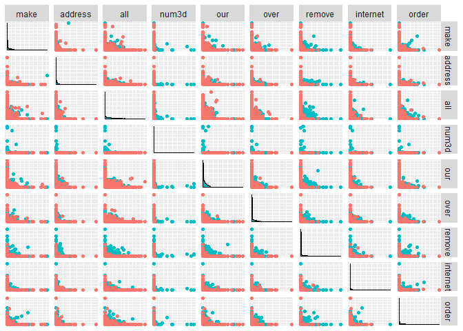
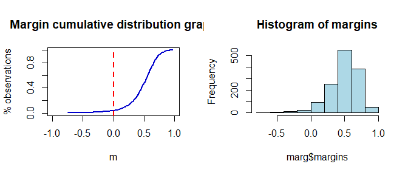
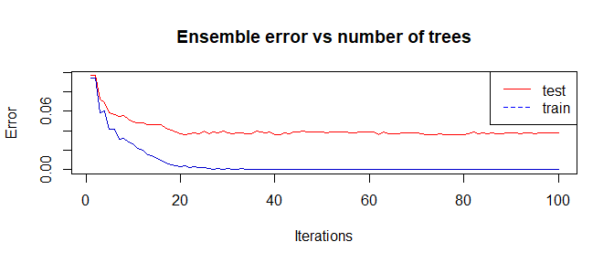
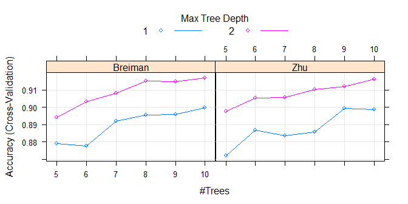
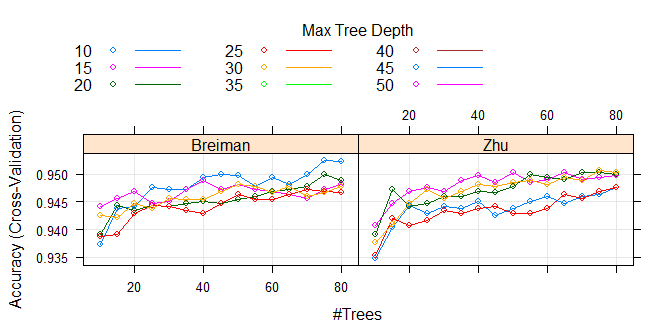

EJERCICIO 1:
============

### 1. A partir de la base de datos spam de la librería kernlab, construya una muestra de aprendizaje aleatoria formado por el 70% de las instancias, y una muestra de validación formada por el 30% restante.

### 2. Construya un modelo boosting a partir de la muestra de aprendizaje generada para pronosticar la variable type a partir de las restantes variables (utilice la librería adabag).

### 3. Realice predicciones para la muestra de validación y obtenga la matriz de confusión y el porcentaje de observaciones mal clasificadas. Obtenga el margen de las observaciones de la muestra de validación y determine los índices correspondientes a las que han sido mal clasificadas.

### 4. Utilizando validación cruzada con 10 pliegues, obtenga la matriz de confusión y el porcentaje de observaciones mal clasificadas.

### 5. Utilizando la función train de la librería caret, determine los parámetros óptimos dentro del siguiente conjunto:

### mfinal ∈ {5,6,7,8,9,10}, maxdepth ∈ {1,2}, coeflearn ∈ {Breiman,Zhu}.

### Como técnica de validación, utilizar validación cruzada con 3 pliegues.

Apartado 1.
-----------

### Lectura datos, librerias y preprocesado.

En esta sección se completará el primer punto del ejercicio, cargarémos
los datos (miraremos si es necesario imputar valores perdidos) y los
dividiremos en conjuntos de entrenamiento y validación.

### Librerias.

    library(kernlab)#datos
    library(caret)#diversas herramientas ML
    library(plyr)#lo usa caret
    library(adabag)#boosting adabag
    library(ggplot2)#graficas
    library(GGally)#graficas

### Datos.

    data(spam)
    datos=spam

### Valores perdidos.

    sum(apply(is.na(datos),2,sum))

    ## [1] 0

No tenemos valores perdidos.

### Partición entrenamiento validación.

Usaremos una función de caret para esta tarea.

    set.seed(1)
    train_index=createDataPartition(datos$type, p = .7,list=F)
    train=datos[train_index,]
    valid=datos[-train_index,]

### Nuve de puntos.

    ggpairs(datos, aes(color=type), columns=1:9,
            upper=list(continuous='points'),axisLabels='none')

Lo habitual seria hacer transformaciones a estas variables, pero, como
usaremos modelos construidos a partir de arboles de clasificación, no
será necesario.

Apartado 2.
-----------

### Construya un modelo boosting a partir de la muestra de aprendizaje generada para pronosticar la variable type a partir de las restantes variables (utilice la librería adabag).

En este apartado usaremos los parámetros del modelo por defecto, mas
adelante trataremos de buscar buenas combinaciones de estos para mejorar
los resultados.

    ada_1=boosting(type~., data=train)

Apartado 3.
-----------

### Realice predicciones para la muestra de validación y obtenga la matriz de confusión y el porcentaje de observaciones mal clasificadas. Obtenga el margen de las observaciones de la muestra de validación y determine los índices correspondientes a las que han sido mal clasificadas.

La función predict asociada a esta libreria, nos proporciona
directamente la matriz de confusión y el porcentaje de clasificaciones
incorrectas.

    pred=predict(ada_1,newdata=valid)
    pred$error

    ## [1] 0.03770848

    (mc=pred$confusion)

    ##                Observed Class
    ## Predicted Class nonspam spam
    ##         nonspam     810   26
    ##         spam         26  517

Vemos que el modelo es bastante preciso apesar de que no hemos
controlado ningún parametro. Calculemos el margen de las observaciones
del conjunto de validación.

    marg=margins(pred,valid)
    head(marg$margins)

    ## [1] 0.5432629 0.5432629 0.4060631 0.3930064 0.3052322 0.6744661

    par(mfrow=c(1,2))
    plot.margins(marg)
    hist(marg$margins,col='lightblue',main='Histogram of margins')

Tenemos unos margenes bastante altos, parece que la mayoria se situan
entorno a 0.5. Basandonos en estos margenes, podemos buscar las
clasificaciones incorrectas, ya que son aquellas con margen negativo.

    which(marg$margins<0)

    ##  [1]   11   12   40   57   90   98  107  123  130  132  134  191  214  238
    ## [15]  261  356  359  383  394  398  432  478  501  503  508  528  565  566
    ## [29]  578  601  635  641  652  737  750  763  789  828  904  908  929  954
    ## [43]  991  994 1019 1031 1237 1266 1282 1283 1286 1322

Por ultimo, al haber usado muchas iteraciones (100 por defecto), sería
interesante ver los errores cometidos en cada una de ellas y así
controlar un posible sobreajuste.

    plot.errorevol(errorevol(ada_1,valid),errorevol(ada_1,train))

 EL
modelo se ajusta completamente a los datos de entrenamiento, sería
conveniente reducir bastante el número de iteraciones (arboles que
componen el modelo).

Apartado 4.
-----------

### Utilizando validación cruzada con 10 pliegues, obtenga la matriz de confusión y el porcentaje de observaciones mal clasificadas.

En esta ocasión reduciremos a diez el numero de iteraciones, ya que
podría suponer mucho tiempo para calcular el total de los pliegues si
tomamos cien iteraciones (parametro por defecto).

    ada_2=boosting.cv(type~., data=train,mfinal=10,v=10)

    ada_2=boosting.cv(type~., data=train,mfinal=10,v=10)

    ## i:  1 Sat Jun 10 12:00:24 2017 
    ## i:  2 Sat Jun 10 12:00:29 2017 
    ## i:  3 Sat Jun 10 12:00:33 2017 
    ## i:  4 Sat Jun 10 12:00:37 2017 
    ## i:  5 Sat Jun 10 12:00:41 2017 
    ## i:  6 Sat Jun 10 12:00:46 2017 
    ## i:  7 Sat Jun 10 12:00:50 2017 
    ## i:  8 Sat Jun 10 12:00:54 2017 
    ## i:  9 Sat Jun 10 12:00:59 2017 
    ## i:  10 Sat Jun 10 12:01:03 2017

Veamos la matriz de confusión, y el error.

    (ada_2$confusion)

    ##                Observed Class
    ## Predicted Class nonspam spam
    ##         nonspam    1860  105
    ##         spam         92 1165

    (ada_2$error)

    ## [1] 0.06114215

Estimamos un error bajo, optimizemos los parametros para ver si somos
capaces de reducirlo.

Apartado 5.
-----------

### Utilizando la función train de la librería caret, determine los parámetros óptimos dentro del siguiente conjunto:

### mfinal ∈ {5,6,7,8,9,10}, maxdepth ∈ {1,2}, coeflearn ∈ {Breiman,Zhu}.

### Como técnica de validación, utilizar validación cruzada con 3 pliegues.

    grid = expand.grid(mfinal=5:10,maxdepth=c(1,2),coeflearn=c("Breiman","Zhu"))#parametros
    control = trainControl(method='cv',number=3,repeats=1)#validación para optimizacion de parametros
    ada_grid = train(type ~ .,data=train,
                    method='AdaBoost.M1',trControl=control,tuneGrid=grid)

Veamos mediante un grafico los resultados obtenidos.

    plot(ada_grid)

    ada_grid$bestTune

    ##    mfinal maxdepth coeflearn
    ## 12     10        2   Breiman

A la vista de los resultados obtenidos, parece interesante aumentar la
profindidad de los arboles, y el número de iteraciones. Aquí surge un
problema, pensemos que si queremos ajustar el numero de iteraciones,
realmente no deberia ser necesario construir un modelo para cada
posibilidad, pues deberia ser suficiente con tomar el mas alto deseado y
despues quedarnos con las iteraciones que nos interesen. Manualmente lo
podemos hacer accediendo a los arboles del modelo y los pesos de los
mismos. De momento no complicaremos mas las cosas y simplemente usaremos
una rejilla, pero hay otras librerias como xgboost que permiten lidiar
mejor con esto.

Hagamos una busqueda algo mas amplia que la anterior.

    grid = expand.grid(mfinal=seq(10,80,5),maxdepth=seq(10,50,5),
                       coeflearn=c("Breiman","Zhu"))#parametros
    control = trainControl(method='cv',number=3,repeats=1)#validación para optimizacion de parametros
    ada_grid_2 = train(type ~ .,data=train,
                    method='AdaBoost.M1',trControl=control,tuneGrid=grid)

Veamos mediante un grafico los resultados obtenidos.

    plot(ada_grid_2)

    ada_grid_2$bestTune

    ##    mfinal maxdepth coeflearn
    ## 14     75       10   Breiman

Veamos que error cometemos al evaluar el resto de los datos usando el
modelo construido con los mejores parámetros

    ada_3=ada_grid_2$finalModel
    pred=predict(ada_3,newdata=valid)
    (mc=table(pred$class,valid$type))

    ##          
    ##           nonspam spam
    ##   nonspam     804   24
    ##   spam         32  519

    precision=sum(diag(mc))/sum(mc)
    (1-precision)

    ## [1] 0.04060914

Vemos que no conseguímos aumentar la precisión respecto al primer
modelo.
