Ejercicio 1
-----------

1.  Con el fichero Auto de la librería ISLR:

<!-- -->

1.  Seleccionar los vehículos con mpg&gt;=13
2.  Proponer un modelo que identifique qué variables influyen en la
    nueva variable de conteo: m\_13=round(mpg-13).

Carguemos los datos y hagamos un pequeño analisis exploratorio.

    library(ISLR)
    data("Auto")
    head(Auto)

    ##   mpg cylinders displacement horsepower weight acceleration year origin
    ## 1  18         8          307        130   3504         12.0   70      1
    ## 2  15         8          350        165   3693         11.5   70      1
    ## 3  18         8          318        150   3436         11.0   70      1
    ## 4  16         8          304        150   3433         12.0   70      1
    ## 5  17         8          302        140   3449         10.5   70      1
    ## 6  15         8          429        198   4341         10.0   70      1
    ##                        name
    ## 1 chevrolet chevelle malibu
    ## 2         buick skylark 320
    ## 3        plymouth satellite
    ## 4             amc rebel sst
    ## 5               ford torino
    ## 6          ford galaxie 500

    dim(Auto)

    ## [1] 392   9

    summary(Auto)

    ##       mpg          cylinders      displacement     horsepower   
    ##  Min.   : 9.00   Min.   :3.000   Min.   : 68.0   Min.   : 46.0  
    ##  1st Qu.:17.00   1st Qu.:4.000   1st Qu.:105.0   1st Qu.: 75.0  
    ##  Median :22.75   Median :4.000   Median :151.0   Median : 93.5  
    ##  Mean   :23.45   Mean   :5.472   Mean   :194.4   Mean   :104.5  
    ##  3rd Qu.:29.00   3rd Qu.:8.000   3rd Qu.:275.8   3rd Qu.:126.0  
    ##  Max.   :46.60   Max.   :8.000   Max.   :455.0   Max.   :230.0  
    ##                                                                 
    ##      weight      acceleration        year           origin     
    ##  Min.   :1613   Min.   : 8.00   Min.   :70.00   Min.   :1.000  
    ##  1st Qu.:2225   1st Qu.:13.78   1st Qu.:73.00   1st Qu.:1.000  
    ##  Median :2804   Median :15.50   Median :76.00   Median :1.000  
    ##  Mean   :2978   Mean   :15.54   Mean   :75.98   Mean   :1.577  
    ##  3rd Qu.:3615   3rd Qu.:17.02   3rd Qu.:79.00   3rd Qu.:2.000  
    ##  Max.   :5140   Max.   :24.80   Max.   :82.00   Max.   :3.000  
    ##                                                                
    ##                  name    
    ##  amc matador       :  5  
    ##  ford pinto        :  5  
    ##  toyota corolla    :  5  
    ##  amc gremlin       :  4  
    ##  amc hornet        :  4  
    ##  chevrolet chevette:  4  
    ##  (Other)           :365

    plot(Auto$mpg)

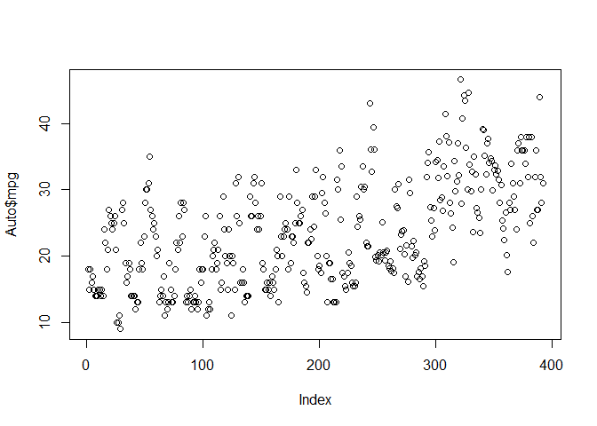

Ahora transformemolos tal como indica el ejercicio.

    datos=Auto[which(Auto$mpg>= 13),]#Quitamos los datos con mpg<13.
    datos=cbind(datos, m_13=round(datos$mpg-13))#Discretizamos mpg.
    datos=datos[,c(-9,-1)]#Borramos los nombres de los vehiculos y mpg.

Dado que m\_13 es una variable de conteo, tratemos de averiguar si es
mas conveniente usar un modelo de poisson o una binomial negativa (para
el modelo de poisson, las esperanzas condicionadas deben coincidir con
las varianzas condicionadas, el problema es que es dificil de verlo
graficamente). Para decidir, haremos el siguiente contraste (se basa en
que las devianzas siguen una chi cuadrado):

    require(MASS)

    ## Loading required package: MASS

    m1 <- glm(m_13 ~ ., family="poisson", data=datos)
    m1_bn <-  glm.nb(m_13 ~ ., data=datos)

    ## Warning in theta.ml(Y, mu, sum(w), w, limit = control$maxit, trace =
    ## control$trace > : iteration limit reached

    ## Warning in theta.ml(Y, mu, sum(w), w, limit = control$maxit, trace =
    ## control$trace > : iteration limit reached

    X2 <-   2 *(logLik(m1_bn) - logLik(m1))
    X2

    ## 'log Lik.' -0.008354779 (df=9)

    pchisq(X2, df = 1, lower.tail=FALSE)

    ## 'log Lik.' 1 (df=9)

Al construir el modelo de la binomial negativa, el propio programa nos
avisa que ha alcanzado el numero de iteraciones maximo estimando un
parametro que no tiene la poisson. El modelo de poisson se puede
interpretar como uno binomial negativo, con dicho parametro (theta)
igual a infinito, luego este warning da lugar a pensar que ambos modelos
son muy similares. De hecho, al restar las devianzas, se aproximan tanto
que obtenemos un valor negativo (por un error numerico). Deducimos que
la resta vale cero (de la devianza de el modelo de poisson menos el de
la binomial negativa), y evidentemente tenemos un contraste con un
p-valor mas o menos igual a uno. De modo que elegiremos el modelo de
poisson para nuestro ejercicio.

Veamos que variables son significativas en el modelo m1:

    summary(m1)

    ## 
    ## Call:
    ## glm(formula = m_13 ~ ., family = "poisson", data = datos)
    ## 
    ## Deviance Residuals: 
    ##     Min       1Q   Median       3Q      Max  
    ## -3.0372  -0.6455  -0.0767   0.4608   3.6404  
    ## 
    ## Coefficients:
    ##                Estimate Std. Error z value Pr(>|z|)    
    ## (Intercept)  -6.879e-01  4.485e-01  -1.534  0.12505    
    ## cylinders    -6.849e-03  3.879e-02  -0.177  0.85986    
    ## displacement -1.656e-03  9.793e-04  -1.691  0.09084 .  
    ## horsepower   -5.185e-03  1.804e-03  -2.874  0.00405 ** 
    ## weight       -4.911e-04  8.268e-05  -5.940 2.84e-09 ***
    ## acceleration  3.348e-03  9.407e-03   0.356  0.72194    
    ## year          6.592e-02  4.657e-03  14.156  < 2e-16 ***
    ## origin        1.264e-02  2.216e-02   0.570  0.56837    
    ## ---
    ## Signif. codes:  0 '***' 0.001 '**' 0.01 '*' 0.05 '.' 0.1 ' ' 1
    ## 
    ## (Dispersion parameter for poisson family taken to be 1)
    ## 
    ##     Null deviance: 2218.51  on 378  degrees of freedom
    ## Residual deviance:  339.45  on 371  degrees of freedom
    ## AIC: 1798.7
    ## 
    ## Number of Fisher Scoring iterations: 5

Aparentemente, las variables a tener en cuenta deben ser: year, weight,
horsepower y displacement. De todas formas, podemos ver una a una si
mejora el modelo cuando se incluyen las variables pues puede ser que,
aunque una variable no influya en el modelo, si que influya a nuestra
variable objetivo (el ejercicio indica que busquemos las variables
afectan significativamente a la variable objetivo, no al modelo). Por
ejemplo, puede ser que la aceleración no sea significativa (alto p-valor
de la hipotesis nula), pero que esto se deba a que la aceleración esta
explicada por el peso y la potencia. Definamos modelos con una única
variable predictora.

    summary(m_cylinders <- glm(m_13 ~  cylinders, family="poisson", data=datos))

    ## 
    ## Call:
    ## glm(formula = m_13 ~ cylinders, family = "poisson", data = datos)
    ## 
    ## Deviance Residuals: 
    ##     Min       1Q   Median       3Q      Max  
    ## -4.8101  -1.1363  -0.2836   0.7468   5.3962  
    ## 
    ## Coefficients:
    ##             Estimate Std. Error z value Pr(>|z|)    
    ## (Intercept)  4.49352    0.06322   71.08   <2e-16 ***
    ## cylinders   -0.43136    0.01360  -31.71   <2e-16 ***
    ## ---
    ## Signif. codes:  0 '***' 0.001 '**' 0.01 '*' 0.05 '.' 0.1 ' ' 1
    ## 
    ## (Dispersion parameter for poisson family taken to be 1)
    ## 
    ##     Null deviance: 2218.51  on 378  degrees of freedom
    ## Residual deviance:  846.74  on 377  degrees of freedom
    ## AIC: 2294
    ## 
    ## Number of Fisher Scoring iterations: 5

La variable cylinders es significativa.

    summary(m_displacement <- glm(m_13 ~  displacement, family="poisson", data=datos))

    ## 
    ## Call:
    ## glm(formula = m_13 ~ displacement, family = "poisson", data = datos)
    ## 
    ## Deviance Residuals: 
    ##     Min       1Q   Median       3Q      Max  
    ## -4.3118  -0.9889  -0.1097   0.7561   6.5609  
    ## 
    ## Coefficients:
    ##                Estimate Std. Error z value Pr(>|z|)    
    ## (Intercept)   3.6304413  0.0355492  102.12   <2e-16 ***
    ## displacement -0.0079574  0.0002404  -33.11   <2e-16 ***
    ## ---
    ## Signif. codes:  0 '***' 0.001 '**' 0.01 '*' 0.05 '.' 0.1 ' ' 1
    ## 
    ## (Dispersion parameter for poisson family taken to be 1)
    ## 
    ##     Null deviance: 2218.51  on 378  degrees of freedom
    ## Residual deviance:  666.92  on 377  degrees of freedom
    ## AIC: 2114.2
    ## 
    ## Number of Fisher Scoring iterations: 5

La variable displacement es significativa.

    summary(m_horsepower <- glm(m_13 ~  horsepower, family="poisson", data=datos))

    ## 
    ## Call:
    ## glm(formula = m_13 ~ horsepower, family = "poisson", data = datos)
    ## 
    ## Deviance Residuals: 
    ##     Min       1Q   Median       3Q      Max  
    ## -4.5458  -1.1470  -0.0163   0.7024   5.4818  
    ## 
    ## Coefficients:
    ##             Estimate Std. Error z value Pr(>|z|)    
    ## (Intercept)  4.42374    0.05760   76.80   <2e-16 ***
    ## horsepower  -0.02245    0.00067  -33.52   <2e-16 ***
    ## ---
    ## Signif. codes:  0 '***' 0.001 '**' 0.01 '*' 0.05 '.' 0.1 ' ' 1
    ## 
    ## (Dispersion parameter for poisson family taken to be 1)
    ## 
    ##     Null deviance: 2218.51  on 378  degrees of freedom
    ## Residual deviance:  727.28  on 377  degrees of freedom
    ## AIC: 2174.6
    ## 
    ## Number of Fisher Scoring iterations: 5

La variable horsepower es significativa.

    summary(m_weight <- glm(m_13 ~  weight, family="poisson", data=datos))

    ## 
    ## Call:
    ## glm(formula = m_13 ~ weight, family = "poisson", data = datos)
    ## 
    ## Deviance Residuals: 
    ##     Min       1Q   Median       3Q      Max  
    ## -3.7090  -1.0462  -0.2064   0.7167   4.8299  
    ## 
    ## Coefficients:
    ##               Estimate Std. Error z value Pr(>|z|)    
    ## (Intercept)  4.822e+00  6.594e-02   73.12   <2e-16 ***
    ## weight      -9.130e-04  2.601e-05  -35.10   <2e-16 ***
    ## ---
    ## Signif. codes:  0 '***' 0.001 '**' 0.01 '*' 0.05 '.' 0.1 ' ' 1
    ## 
    ## (Dispersion parameter for poisson family taken to be 1)
    ## 
    ##     Null deviance: 2218.51  on 378  degrees of freedom
    ## Residual deviance:  665.18  on 377  degrees of freedom
    ## AIC: 2112.5
    ## 
    ## Number of Fisher Scoring iterations: 5

La variable weight es significativa.

    summary(m_acceleration <- glm(m_13 ~  acceleration, family="poisson", data=datos))

    ## 
    ## Call:
    ## glm(formula = m_13 ~ acceleration, family = "poisson", data = datos)
    ## 
    ## Deviance Residuals: 
    ##     Min       1Q   Median       3Q      Max  
    ## -4.7762  -2.0161  -0.4865   1.4060   6.0530  
    ## 
    ## Coefficients:
    ##              Estimate Std. Error z value Pr(>|z|)    
    ## (Intercept)  0.801104   0.090799   8.823   <2e-16 ***
    ## acceleration 0.098892   0.005454  18.131   <2e-16 ***
    ## ---
    ## Signif. codes:  0 '***' 0.001 '**' 0.01 '*' 0.05 '.' 0.1 ' ' 1
    ## 
    ## (Dispersion parameter for poisson family taken to be 1)
    ## 
    ##     Null deviance: 2218.5  on 378  degrees of freedom
    ## Residual deviance: 1899.9  on 377  degrees of freedom
    ## AIC: 3347.1
    ## 
    ## Number of Fisher Scoring iterations: 5

La variable acceleration es significativa.

    summary(m_year <- glm(m_13 ~  year, family="poisson", data=datos))

    ## 
    ## Call:
    ## glm(formula = m_13 ~ year, family = "poisson", data = datos)
    ## 
    ## Deviance Residuals: 
    ##     Min       1Q   Median       3Q      Max  
    ## -4.4479  -2.0021  -0.1502   1.3306   5.1726  
    ## 
    ## Coefficients:
    ##              Estimate Std. Error z value Pr(>|z|)    
    ## (Intercept) -6.054791   0.348863  -17.36   <2e-16 ***
    ## year         0.109823   0.004495   24.43   <2e-16 ***
    ## ---
    ## Signif. codes:  0 '***' 0.001 '**' 0.01 '*' 0.05 '.' 0.1 ' ' 1
    ## 
    ## (Dispersion parameter for poisson family taken to be 1)
    ## 
    ##     Null deviance: 2218.5  on 378  degrees of freedom
    ## Residual deviance: 1592.0  on 377  degrees of freedom
    ## AIC: 3039.3
    ## 
    ## Number of Fisher Scoring iterations: 5

La variable year es significativa.

    summary(m_origin <- glm(m_13 ~  origin, family="poisson", data=datos))

    ## 
    ## Call:
    ## glm(formula = m_13 ~ origin, family = "poisson", data = datos)
    ## 
    ## Deviance Residuals: 
    ##     Min       1Q   Median       3Q      Max  
    ## -3.9723  -1.8845  -0.3146   1.0749   5.0786  
    ## 
    ## Coefficients:
    ##             Estimate Std. Error z value Pr(>|z|)    
    ## (Intercept)  1.63982    0.03692   44.41   <2e-16 ***
    ## origin       0.42573    0.01752   24.30   <2e-16 ***
    ## ---
    ## Signif. codes:  0 '***' 0.001 '**' 0.01 '*' 0.05 '.' 0.1 ' ' 1
    ## 
    ## (Dispersion parameter for poisson family taken to be 1)
    ## 
    ##     Null deviance: 2218.5  on 378  degrees of freedom
    ## Residual deviance: 1652.3  on 377  degrees of freedom
    ## AIC: 3099.6
    ## 
    ## Number of Fisher Scoring iterations: 5

La variable origin es significativa, luego todas las variables influyen
(a nivel de sifnificación del 0.95).

Ejercicio 2.
------------

Comenzamos cargando los datos y veamos la cabecera de estos.

    data("College")
    datos2=College
    head(datos2)

    ##                              Private Apps Accept Enroll Top10perc
    ## Abilene Christian University     Yes 1660   1232    721        23
    ## Adelphi University               Yes 2186   1924    512        16
    ## Adrian College                   Yes 1428   1097    336        22
    ## Agnes Scott College              Yes  417    349    137        60
    ## Alaska Pacific University        Yes  193    146     55        16
    ## Albertson College                Yes  587    479    158        38
    ##                              Top25perc F.Undergrad P.Undergrad Outstate
    ## Abilene Christian University        52        2885         537     7440
    ## Adelphi University                  29        2683        1227    12280
    ## Adrian College                      50        1036          99    11250
    ## Agnes Scott College                 89         510          63    12960
    ## Alaska Pacific University           44         249         869     7560
    ## Albertson College                   62         678          41    13500
    ##                              Room.Board Books Personal PhD Terminal
    ## Abilene Christian University       3300   450     2200  70       78
    ## Adelphi University                 6450   750     1500  29       30
    ## Adrian College                     3750   400     1165  53       66
    ## Agnes Scott College                5450   450      875  92       97
    ## Alaska Pacific University          4120   800     1500  76       72
    ## Albertson College                  3335   500      675  67       73
    ##                              S.F.Ratio perc.alumni Expend Grad.Rate
    ## Abilene Christian University      18.1          12   7041        60
    ## Adelphi University                12.2          16  10527        56
    ## Adrian College                    12.9          30   8735        54
    ## Agnes Scott College                7.7          37  19016        59
    ## Alaska Pacific University         11.9           2  10922        15
    ## Albertson College                  9.4          11   9727        55

    dim(datos2)

    ## [1] 777  18

    library (gam)

    ## Warning: package 'gam' was built under R version 3.3.3

    ## Loading required package: splines

    ## Loading required package: foreach

    ## Loaded gam 1.14-4

Podemos construir un modelo completo, añadiendo paso a paso la mejor
opccion (polinomio, spline,...) para cada variable.

### Variable Private.

    mod1=lm(Grad.Rate~ Private, data = datos2)
    summary(mod1)

    ## 
    ## Call:
    ## lm(formula = Grad.Rate ~ Private, data = datos2)
    ## 
    ## Residuals:
    ##     Min      1Q  Median      3Q     Max 
    ## -53.998 -10.042   0.002  11.002  49.002 
    ## 
    ## Coefficients:
    ##             Estimate Std. Error t value Pr(>|t|)    
    ## (Intercept)   56.042      1.112  50.406   <2e-16 ***
    ## PrivateYes    12.956      1.304   9.937   <2e-16 ***
    ## ---
    ## Signif. codes:  0 '***' 0.001 '**' 0.01 '*' 0.05 '.' 0.1 ' ' 1
    ## 
    ## Residual standard error: 16.19 on 775 degrees of freedom
    ## Multiple R-squared:  0.113,  Adjusted R-squared:  0.1119 
    ## F-statistic: 98.74 on 1 and 775 DF,  p-value: < 2.2e-16

    plot(cbind(datos2$Grad.Rate,datos2$Private))

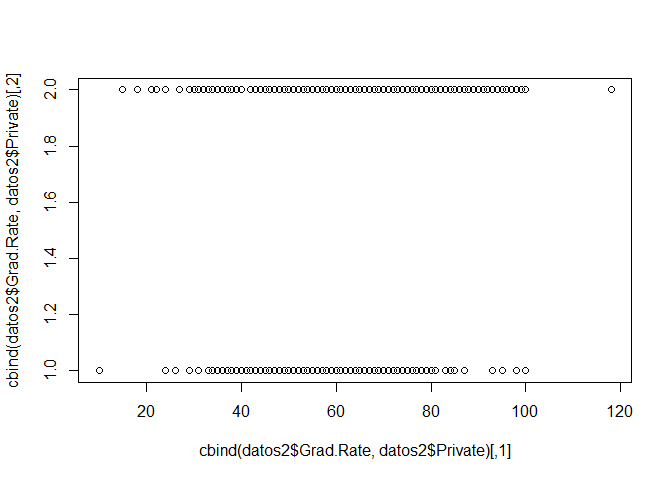 Codifica
privada y no privada con 2 y 1 respectivamente. Creemos a mano una
variable dummy.

    datos2=within(datos2, Private<-as.numeric(datos2$Private)-1)
    mod1=gam(Grad.Rate~ Private, data = datos2)
    plot(cbind(datos2$Private,datos2$Grad.Rate))
    lines(rbind(datos2[1,],datos2['Angelo State University',])$Private,predict(mod1, newdata=rbind(datos2[1,],datos2['Angelo State University',])), col='red')

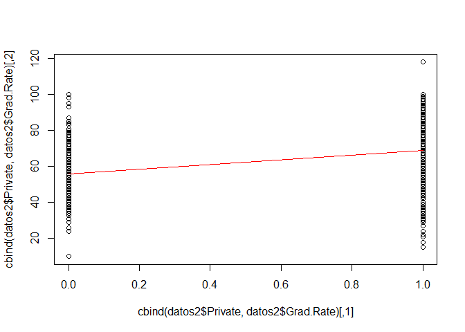

    datos2[datos2$Grad.Rate>100,]

    ##                   Private Apps Accept Enroll Top10perc Top25perc
    ## Cazenovia College       1 3847   3433    527         9        35
    ##                   F.Undergrad P.Undergrad Outstate Room.Board Books
    ## Cazenovia College        1010          12     9384       4840   600
    ##                   Personal PhD Terminal S.F.Ratio perc.alumni Expend
    ## Cazenovia College      500  22       47      14.3          20   7697
    ##                   Grad.Rate
    ## Cazenovia College       118

Tenemos un dato con un ratio de graduados demasiado grande. Unicamente
con esta variable, el modelo no se puede mejorar (solo da la media en
los dos casos posibles). Vamos a ir añadiendo las funciones regresoras
que consideremos para cada variable a un modelo completo gam.

    modc1=gam(Grad.Rate~ Private, data = datos2)
    summary(modc1)

    ## 
    ## Call: gam(formula = Grad.Rate ~ Private, data = datos2)
    ## Deviance Residuals:
    ##       Min        1Q    Median        3Q       Max 
    ## -53.99823 -10.04245   0.00177  11.00177  49.00177 
    ## 
    ## (Dispersion Parameter for gaussian family taken to be 262.0666)
    ## 
    ##     Null Deviance: 228977.2 on 776 degrees of freedom
    ## Residual Deviance: 203101.6 on 775 degrees of freedom
    ## AIC: 6535.829 
    ## 
    ## Number of Local Scoring Iterations: 2 
    ## 
    ## Anova for Parametric Effects
    ##            Df Sum Sq Mean Sq F value    Pr(>F)    
    ## Private     1  25876 25875.6  98.737 < 2.2e-16 ***
    ## Residuals 775 203102   262.1                      
    ## ---
    ## Signif. codes:  0 '***' 0.001 '**' 0.01 '*' 0.05 '.' 0.1 ' ' 1

Private es significativa.

### Variable Apps.

Vamos a usar la notacion modn.k para crear un modelo usando polinomios
de grado k, en la variable n-esima.

    mod2=lm(Grad.Rate~ Apps, data = datos2)
    mod2.2=lm(Grad.Rate~ poly(Apps,2), data = datos2)
    mod2.3=lm(Grad.Rate~ poly(Apps,3), data = datos2)
    mod2.4=lm(Grad.Rate~ poly(Apps,4), data = datos2)
    summary(mod2)

    ## 
    ## Call:
    ## lm(formula = Grad.Rate ~ Apps, data = datos2)
    ## 
    ## Residuals:
    ##     Min      1Q  Median      3Q     Max 
    ## -56.338 -11.916  -0.163  12.742  51.986 
    ## 
    ## Coefficients:
    ##              Estimate Std. Error t value Pr(>|t|)    
    ## (Intercept) 6.351e+01  7.721e-01   82.25  < 2e-16 ***
    ## Apps        6.514e-04  1.577e-04    4.13 4.02e-05 ***
    ## ---
    ## Signif. codes:  0 '***' 0.001 '**' 0.01 '*' 0.05 '.' 0.1 ' ' 1
    ## 
    ## Residual standard error: 17 on 775 degrees of freedom
    ## Multiple R-squared:  0.02154,    Adjusted R-squared:  0.02027 
    ## F-statistic: 17.06 on 1 and 775 DF,  p-value: 4.019e-05

    summary(mod2.2)

    ## 
    ## Call:
    ## lm(formula = Grad.Rate ~ poly(Apps, 2), data = datos2)
    ## 
    ## Residuals:
    ##    Min     1Q Median     3Q    Max 
    ## -56.89 -11.76  -0.23  12.98  51.54 
    ## 
    ## Coefficients:
    ##                Estimate Std. Error t value Pr(>|t|)    
    ## (Intercept)     65.4633     0.6094 107.429  < 2e-16 ***
    ## poly(Apps, 2)1  70.2244    16.9859   4.134 3.95e-05 ***
    ## poly(Apps, 2)2 -27.0502    16.9859  -1.593    0.112    
    ## ---
    ## Signif. codes:  0 '***' 0.001 '**' 0.01 '*' 0.05 '.' 0.1 ' ' 1
    ## 
    ## Residual standard error: 16.99 on 774 degrees of freedom
    ## Multiple R-squared:  0.02473,    Adjusted R-squared:  0.02221 
    ## F-statistic: 9.814 on 2 and 774 DF,  p-value: 6.179e-05

    summary(mod2.3)

    ## 
    ## Call:
    ## lm(formula = Grad.Rate ~ poly(Apps, 3), data = datos2)
    ## 
    ## Residuals:
    ##     Min      1Q  Median      3Q     Max 
    ## -57.784 -11.795  -0.329  12.821  50.730 
    ## 
    ## Coefficients:
    ##                Estimate Std. Error t value Pr(>|t|)    
    ## (Intercept)     65.4633     0.6091 107.475  < 2e-16 ***
    ## poly(Apps, 3)1  70.2244    16.9786   4.136 3.92e-05 ***
    ## poly(Apps, 3)2 -27.0502    16.9786  -1.593    0.112    
    ## poly(Apps, 3)3  21.9179    16.9786   1.291    0.197    
    ## ---
    ## Signif. codes:  0 '***' 0.001 '**' 0.01 '*' 0.05 '.' 0.1 ' ' 1
    ## 
    ## Residual standard error: 16.98 on 773 degrees of freedom
    ## Multiple R-squared:  0.02683,    Adjusted R-squared:  0.02305 
    ## F-statistic: 7.104 on 3 and 773 DF,  p-value: 0.0001034

    summary(mod2.4)

    ## 
    ## Call:
    ## lm(formula = Grad.Rate ~ poly(Apps, 4), data = datos2)
    ## 
    ## Residuals:
    ##     Min      1Q  Median      3Q     Max 
    ## -58.832 -11.939  -0.243  12.831  49.555 
    ## 
    ## Coefficients:
    ##                Estimate Std. Error t value Pr(>|t|)    
    ## (Intercept)     65.4633     0.6078 107.699  < 2e-16 ***
    ## poly(Apps, 4)1  70.2244    16.9433   4.145 3.78e-05 ***
    ## poly(Apps, 4)2 -27.0502    16.9433  -1.597   0.1108    
    ## poly(Apps, 4)3  21.9179    16.9433   1.294   0.1962    
    ## poly(Apps, 4)4 -34.7968    16.9433  -2.054   0.0403 *  
    ## ---
    ## Signif. codes:  0 '***' 0.001 '**' 0.01 '*' 0.05 '.' 0.1 ' ' 1
    ## 
    ## Residual standard error: 16.94 on 772 degrees of freedom
    ## Multiple R-squared:  0.03212,    Adjusted R-squared:  0.0271 
    ## F-statistic: 6.405 on 4 and 772 DF,  p-value: 4.512e-05

    anova(mod2,mod2.2,mod2.3,mod2.4)

    ## Analysis of Variance Table
    ## 
    ## Model 1: Grad.Rate ~ Apps
    ## Model 2: Grad.Rate ~ poly(Apps, 2)
    ## Model 3: Grad.Rate ~ poly(Apps, 3)
    ## Model 4: Grad.Rate ~ poly(Apps, 4)
    ##   Res.Df    RSS Df Sum of Sq      F  Pr(>F)  
    ## 1    775 224046                              
    ## 2    774 223314  1    731.72 2.5489 0.11078  
    ## 3    773 222834  1    480.39 1.6734 0.19619  
    ## 4    772 221623  1   1210.82 4.2178 0.04034 *
    ## ---
    ## Signif. codes:  0 '***' 0.001 '**' 0.01 '*' 0.05 '.' 0.1 ' ' 1

Parece que no se descarta que sean iguales los modelos excepto para
grado cuatro. Veamos graficamente como son estas funciones regresoras.

    plot(cbind(datos2$Apps,datos2$Grad.Rate))
    #podemos crear unos datos falsos para pintar nuestra regresion
    datos_falsos=data.frame(Apps=seq(0, 50000, 100))
    lines(cbind(datos_falsos$Apps,predict(mod2,newdata = datos_falsos)), col='red')
    lines(cbind(datos_falsos$Apps,predict(mod2.2,newdata = datos_falsos)), col='blue')
    lines(cbind(datos_falsos$Apps,predict(mod2.3,newdata = datos_falsos)), col='orange')
    lines(cbind(datos_falsos$Apps,predict(mod2.4,newdata = datos_falsos)), col='green')

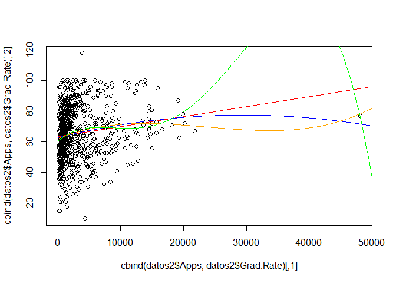

Naturalmente, descartamos el uso de polinomios de grado cuatro, ya que
se sale de los valores posibles de la variable, Por lo demas, son muy
parecidas el resto de funciones (con anova no descartabamos esto).
Tambien se ve que no tenemos varianzas constantes (lo cual daria lugar a
replantearnos este modelo lineal). De todas formas no parece necesario
tratar de mejorar esto.

    modc2=gam(Grad.Rate~ Private+Apps, data = datos2)
    anova(modc1,modc2)

    ## Analysis of Deviance Table
    ## 
    ## Model 1: Grad.Rate ~ Private
    ## Model 2: Grad.Rate ~ Private + Apps
    ##   Resid. Df Resid. Dev Df Deviance  Pr(>Chi)    
    ## 1       775     203102                          
    ## 2       774     179095  1    24007 < 2.2e-16 ***
    ## ---
    ## Signif. codes:  0 '***' 0.001 '**' 0.01 '*' 0.05 '.' 0.1 ' ' 1

    summary(modc1)

    ## 
    ## Call: gam(formula = Grad.Rate ~ Private, data = datos2)
    ## Deviance Residuals:
    ##       Min        1Q    Median        3Q       Max 
    ## -53.99823 -10.04245   0.00177  11.00177  49.00177 
    ## 
    ## (Dispersion Parameter for gaussian family taken to be 262.0666)
    ## 
    ##     Null Deviance: 228977.2 on 776 degrees of freedom
    ## Residual Deviance: 203101.6 on 775 degrees of freedom
    ## AIC: 6535.829 
    ## 
    ## Number of Local Scoring Iterations: 2 
    ## 
    ## Anova for Parametric Effects
    ##            Df Sum Sq Mean Sq F value    Pr(>F)    
    ## Private     1  25876 25875.6  98.737 < 2.2e-16 ***
    ## Residuals 775 203102   262.1                      
    ## ---
    ## Signif. codes:  0 '***' 0.001 '**' 0.01 '*' 0.05 '.' 0.1 ' ' 1

    summary(modc2)

    ## 
    ## Call: gam(formula = Grad.Rate ~ Private + Apps, data = datos2)
    ## Deviance Residuals:
    ##      Min       1Q   Median       3Q      Max 
    ## -51.2653  -9.1385  -0.2183  10.7833  50.5772 
    ## 
    ## (Dispersion Parameter for gaussian family taken to be 231.3885)
    ## 
    ##     Null Deviance: 228977.2 on 776 degrees of freedom
    ## Residual Deviance: 179094.7 on 774 degrees of freedom
    ## AIC: 6440.089 
    ## 
    ## Number of Local Scoring Iterations: 2 
    ## 
    ## Anova for Parametric Effects
    ##            Df Sum Sq Mean Sq F value    Pr(>F)    
    ## Private     1  25876 25875.6  111.83 < 2.2e-16 ***
    ## Apps        1  24007 24006.9  103.75 < 2.2e-16 ***
    ## Residuals 774 179095   231.4                      
    ## ---
    ## Signif. codes:  0 '***' 0.001 '**' 0.01 '*' 0.05 '.' 0.1 ' ' 1

Naturalmente tenemos una mejoria en el modelo completo.

### Variable Accept.

    mod3=lm(Grad.Rate~ Accept, data = datos2)
    mod3.2=lm(Grad.Rate~ poly( Accept,2), data = datos2)
    mod3.3=lm(Grad.Rate~ poly( Accept,3), data = datos2)
    mod3.4=lm(Grad.Rate~ poly( Accept,4), data = datos2)
    summary(mod3)

    ## 
    ## Call:
    ## lm(formula = Grad.Rate ~ Accept, data = datos2)
    ## 
    ## Residuals:
    ##     Min      1Q  Median      3Q     Max 
    ## -56.042 -12.553  -0.453  12.580  51.870 
    ## 
    ## Coefficients:
    ##              Estimate Std. Error t value Pr(>|t|)    
    ## (Intercept) 6.451e+01  7.973e-01  80.915   <2e-16 ***
    ## Accept      4.717e-04  2.512e-04   1.878   0.0607 .  
    ## ---
    ## Signif. codes:  0 '***' 0.001 '**' 0.01 '*' 0.05 '.' 0.1 ' ' 1
    ## 
    ## Residual standard error: 17.15 on 775 degrees of freedom
    ## Multiple R-squared:  0.004531,   Adjusted R-squared:  0.003247 
    ## F-statistic: 3.527 on 1 and 775 DF,  p-value: 0.06073

    summary(mod3.2)

    ## 
    ## Call:
    ## lm(formula = Grad.Rate ~ poly(Accept, 2), data = datos2)
    ## 
    ## Residuals:
    ##     Min      1Q  Median      3Q     Max 
    ## -56.510 -12.311  -0.429  12.555  51.367 
    ## 
    ## Coefficients:
    ##                  Estimate Std. Error t value Pr(>|t|)    
    ## (Intercept)       65.4633     0.6153 106.394   <2e-16 ***
    ## poly(Accept, 2)1  32.2101    17.1511   1.878   0.0608 .  
    ## poly(Accept, 2)2 -16.0843    17.1511  -0.938   0.3486    
    ## ---
    ## Signif. codes:  0 '***' 0.001 '**' 0.01 '*' 0.05 '.' 0.1 ' ' 1
    ## 
    ## Residual standard error: 17.15 on 774 degrees of freedom
    ## Multiple R-squared:  0.005661,   Adjusted R-squared:  0.003091 
    ## F-statistic: 2.203 on 2 and 774 DF,  p-value: 0.1111

    summary(mod3.3)

    ## 
    ## Call:
    ## lm(formula = Grad.Rate ~ poly(Accept, 3), data = datos2)
    ## 
    ## Residuals:
    ##     Min      1Q  Median      3Q     Max 
    ## -58.033 -12.110  -0.295  12.546  49.820 
    ## 
    ## Coefficients:
    ##                  Estimate Std. Error t value Pr(>|t|)    
    ## (Intercept)       65.4633     0.6135 106.705   <2e-16 ***
    ## poly(Accept, 3)1  32.2101    17.1011   1.884   0.0600 .  
    ## poly(Accept, 3)2 -16.0843    17.1011  -0.941   0.3472    
    ## poly(Accept, 3)3  40.2478    17.1011   2.354   0.0188 *  
    ## ---
    ## Signif. codes:  0 '***' 0.001 '**' 0.01 '*' 0.05 '.' 0.1 ' ' 1
    ## 
    ## Residual standard error: 17.1 on 773 degrees of freedom
    ## Multiple R-squared:  0.01274,    Adjusted R-squared:  0.008904 
    ## F-statistic: 3.324 on 3 and 773 DF,  p-value: 0.01931

    summary(mod3.4)

    ## 
    ## Call:
    ## lm(formula = Grad.Rate ~ poly(Accept, 4), data = datos2)
    ## 
    ## Residuals:
    ##     Min      1Q  Median      3Q     Max 
    ## -59.303 -11.250   0.491  12.710  48.737 
    ## 
    ## Coefficients:
    ##                  Estimate Std. Error t value Pr(>|t|)    
    ## (Intercept)       65.4633     0.6094 107.421  < 2e-16 ***
    ## poly(Accept, 4)1  32.2101    16.9871   1.896 0.058313 .  
    ## poly(Accept, 4)2 -16.0843    16.9871  -0.947 0.344010    
    ## poly(Accept, 4)3  40.2478    16.9871   2.369 0.018066 *  
    ## poly(Accept, 4)4 -57.3767    16.9871  -3.378 0.000768 ***
    ## ---
    ## Signif. codes:  0 '***' 0.001 '**' 0.01 '*' 0.05 '.' 0.1 ' ' 1
    ## 
    ## Residual standard error: 16.99 on 772 degrees of freedom
    ## Multiple R-squared:  0.02711,    Adjusted R-squared:  0.02207 
    ## F-statistic: 5.379 on 4 and 772 DF,  p-value: 0.0002828

    anova(mod3, mod3.2, mod3.3, mod3.4)

    ## Analysis of Variance Table
    ## 
    ## Model 1: Grad.Rate ~ Accept
    ## Model 2: Grad.Rate ~ poly(Accept, 2)
    ## Model 3: Grad.Rate ~ poly(Accept, 3)
    ## Model 4: Grad.Rate ~ poly(Accept, 4)
    ##   Res.Df    RSS Df Sum of Sq       F    Pr(>F)    
    ## 1    775 227940                                   
    ## 2    774 227681  1     258.7  0.8965 0.3440099    
    ## 3    773 226061  1    1619.9  5.6137 0.0180660 *  
    ## 4    772 222769  1    3292.1 11.4086 0.0007677 ***
    ## ---
    ## Signif. codes:  0 '***' 0.001 '**' 0.01 '*' 0.05 '.' 0.1 ' ' 1

Solo descarta la asumcion de que los modelos son iguales para grados 3 y
4

    plot(cbind(datos2$Accept,datos2$Grad.Rate))
    datos_falsos=data.frame(Accept=seq(0, 25000, 100))
    lines(cbind(datos_falsos$Accept,predict(mod3,newdata = datos_falsos)), col='red')
    lines(cbind(datos_falsos$Accept,predict(mod3.2,newdata = datos_falsos)), col='blue')
    lines(cbind(datos_falsos$Accept,predict(mod3.3,newdata = datos_falsos)), col='orange')
    lines(cbind(datos_falsos$Accept,predict(mod3.4,newdata = datos_falsos)), col='green')

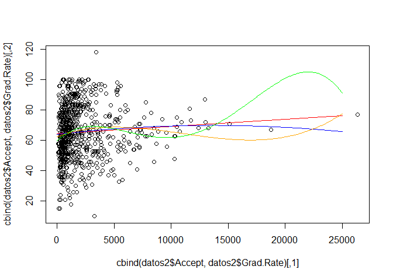 Parece que
para grados 3 y cuatro lo que tenemos es un sobreajuste, no es
conveniente usar dichos modelos. No hay ningun indicio que nos lleve a
pensar en splines, pero tal vez podriamos probar algunos. Usaremos
notacion similar a la usada hasta ahora, modn.sk (s indica splines
suavizados, bs splines cubicos, ns splines naturales).

    library (splines)
    mod3.s=smooth.spline(datos2$Grad.Rate, datos2$Accept)
    mod3.s$df #se calcula por medio de cv

    ## [1] 2.907697

Para seguir dibujando las graficas de los predicctores tal como lo
estabamos haciendo hasta ahora, construimos este ultimo modelo atraves
de un gam.

    mod3.s=gam(Grad.Rate~ s(Accept, mod3.s$df), data = datos2)
    mod3.s5=gam(Grad.Rate~ s(Accept, 5), data = datos2)
    plot(cbind(datos2$Accept,datos2$Grad.Rate))
    lines(cbind(datos_falsos$Accept,predict(mod3.s,newdata = datos_falsos)), col='purple')
    lines(cbind(datos_falsos$Accept,predict(mod3.s5,newdata = datos_falsos)), col='yellow')

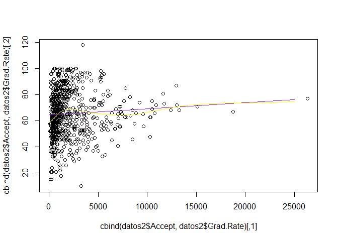

    summary(mod3.s)

    ## 
    ## Call: gam(formula = Grad.Rate ~ s(Accept, mod3.s$df), data = datos2)
    ## Deviance Residuals:
    ##      Min       1Q   Median       3Q      Max 
    ## -57.6111 -11.7163  -0.3132  12.4528  50.3869 
    ## 
    ## (Dispersion Parameter for gaussian family taken to be 289.5423)
    ## 
    ##     Null Deviance: 228977.2 on 776 degrees of freedom
    ## Residual Deviance: 223842.9 on 773.0925 degrees of freedom
    ## AIC: 6615.198 
    ## 
    ## Number of Local Scoring Iterations: 2 
    ## 
    ## Anova for Parametric Effects
    ##                          Df Sum Sq Mean Sq F value  Pr(>F)  
    ## s(Accept, mod3.s$df)   1.00   1037 1037.49  3.5832 0.05874 .
    ## Residuals            773.09 223843  289.54                  
    ## ---
    ## Signif. codes:  0 '***' 0.001 '**' 0.01 '*' 0.05 '.' 0.1 ' ' 1
    ## 
    ## Anova for Nonparametric Effects
    ##                      Npar Df Npar F     Pr(F)    
    ## (Intercept)                                      
    ## s(Accept, mod3.s$df)     1.9 7.4176 0.0007971 ***
    ## ---
    ## Signif. codes:  0 '***' 0.001 '**' 0.01 '*' 0.05 '.' 0.1 ' ' 1

    summary(mod3.s5)

    ## 
    ## Call: gam(formula = Grad.Rate ~ s(Accept, 5), data = datos2)
    ## Deviance Residuals:
    ##      Min       1Q   Median       3Q      Max 
    ## -57.6752 -11.1488  -0.1691  12.5498  50.6588 
    ## 
    ## (Dispersion Parameter for gaussian family taken to be 283.7088)
    ## 
    ##     Null Deviance: 228977.2 on 776 degrees of freedom
    ## Residual Deviance: 218739.5 on 770.9999 degrees of freedom
    ## AIC: 6601.463 
    ## 
    ## Number of Local Scoring Iterations: 2 
    ## 
    ## Anova for Parametric Effects
    ##               Df Sum Sq Mean Sq F value  Pr(>F)  
    ## s(Accept, 5)   1   1037 1037.49  3.6569 0.05621 .
    ## Residuals    771 218739  283.71                  
    ## ---
    ## Signif. codes:  0 '***' 0.001 '**' 0.01 '*' 0.05 '.' 0.1 ' ' 1
    ## 
    ## Anova for Nonparametric Effects
    ##              Npar Df Npar F     Pr(F)    
    ## (Intercept)                              
    ## s(Accept, 5)       4  8.107 2.096e-06 ***
    ## ---
    ## Signif. codes:  0 '***' 0.001 '**' 0.01 '*' 0.05 '.' 0.1 ' ' 1

Como es natural, los errores son menores a mayor grado de libertad
(sobre datos de entrenamiento). Pero haciendo validacion cruzada, da
mejor resultado un grado de libertad muy bajo para el spline suavizado.
Veamos el error cuadratico sin estandarizar del modelo lineal simple
para esta variable.

    summary(gam(Grad.Rate~ Accept, data = datos2))

    ## 
    ## Call: gam(formula = Grad.Rate ~ Accept, data = datos2)
    ## Deviance Residuals:
    ##     Min      1Q  Median      3Q     Max 
    ## -56.042 -12.553  -0.453  12.580  51.870 
    ## 
    ## (Dispersion Parameter for gaussian family taken to be 294.1158)
    ## 
    ##     Null Deviance: 228977.2 on 776 degrees of freedom
    ## Residual Deviance: 227939.7 on 775 degrees of freedom
    ## AIC: 6625.475 
    ## 
    ## Number of Local Scoring Iterations: 2 
    ## 
    ## Anova for Parametric Effects
    ##            Df Sum Sq Mean Sq F value  Pr(>F)  
    ## Accept      1   1037 1037.49  3.5275 0.06073 .
    ## Residuals 775 227940  294.12                  
    ## ---
    ## Signif. codes:  0 '***' 0.001 '**' 0.01 '*' 0.05 '.' 0.1 ' ' 1

No tenemos mucha diferencia con los splines suavizados, parece que no
merece la pena elegir algo distinto.

    modc3=gam(Grad.Rate~ Private+Apps+Accept, data = datos2)
    modc3.2=gam(Grad.Rate~ Private+Apps+poly( Accept,2), data = datos2)
    modc3.3=gam(Grad.Rate~ Private+Apps+poly( Accept,3), data = datos2)
    modc3.s=gam(Grad.Rate ~ Private +Apps+s(Accept), data = datos2)
    modc3.s5=gam(Grad.Rate ~ Private +Apps+s(Accept,5), data = datos2)
    anova(modc2,modc3,modc3.2,modc3.3)

    ## Analysis of Deviance Table
    ## 
    ## Model 1: Grad.Rate ~ Private + Apps
    ## Model 2: Grad.Rate ~ Private + Apps + Accept
    ## Model 3: Grad.Rate ~ Private + Apps + poly(Accept, 2)
    ## Model 4: Grad.Rate ~ Private + Apps + poly(Accept, 3)
    ##   Resid. Df Resid. Dev Df Deviance  Pr(>Chi)    
    ## 1       774     179095                          
    ## 2       773     175935  1   3159.8 0.0001511 ***
    ## 3       772     170692  1   5243.0 1.055e-06 ***
    ## 4       771     169672  1   1020.2 0.0313100 *  
    ## ---
    ## Signif. codes:  0 '***' 0.001 '**' 0.01 '*' 0.05 '.' 0.1 ' ' 1

    summary(modc3)

    ## 
    ## Call: gam(formula = Grad.Rate ~ Private + Apps + Accept, data = datos2)
    ## Deviance Residuals:
    ##      Min       1Q   Median       3Q      Max 
    ## -51.5126  -8.8557   0.2284  10.5160  50.0528 
    ## 
    ## (Dispersion Parameter for gaussian family taken to be 227.6002)
    ## 
    ##     Null Deviance: 228977.2 on 776 degrees of freedom
    ## Residual Deviance: 175935 on 773 degrees of freedom
    ## AIC: 6428.258 
    ## 
    ## Number of Local Scoring Iterations: 2 
    ## 
    ## Anova for Parametric Effects
    ##            Df Sum Sq Mean Sq F value    Pr(>F)    
    ## Private     1  25876 25875.6 113.689 < 2.2e-16 ***
    ## Apps        1  24007 24006.9 105.478 < 2.2e-16 ***
    ## Accept      1   3160  3159.8  13.883 0.0002087 ***
    ## Residuals 773 175935   227.6                      
    ## ---
    ## Signif. codes:  0 '***' 0.001 '**' 0.01 '*' 0.05 '.' 0.1 ' ' 1

    summary(modc3.2)

    ## 
    ## Call: gam(formula = Grad.Rate ~ Private + Apps + poly(Accept, 2), data = datos2)
    ## Deviance Residuals:
    ##      Min       1Q   Median       3Q      Max 
    ## -49.8911  -9.5073   0.1026  10.3589  51.4077 
    ## 
    ## (Dispersion Parameter for gaussian family taken to be 221.1036)
    ## 
    ##     Null Deviance: 228977.2 on 776 degrees of freedom
    ## Residual Deviance: 170692 on 772 degrees of freedom
    ## AIC: 6406.751 
    ## 
    ## Number of Local Scoring Iterations: 2 
    ## 
    ## Anova for Parametric Effects
    ##                  Df Sum Sq Mean Sq F value    Pr(>F)    
    ## Private           1  25876 25875.6 117.029 < 2.2e-16 ***
    ## Apps              1  24007 24006.9 108.578 < 2.2e-16 ***
    ## poly(Accept, 2)   2   8403  4201.4  19.002 8.796e-09 ***
    ## Residuals       772 170692   221.1                      
    ## ---
    ## Signif. codes:  0 '***' 0.001 '**' 0.01 '*' 0.05 '.' 0.1 ' ' 1

    summary_borrar=summary(modc3.3)
    summary(modc3.s)

    ## 
    ## Call: gam(formula = Grad.Rate ~ Private + Apps + s(Accept), data = datos2)
    ## Deviance Residuals:
    ##      Min       1Q   Median       3Q      Max 
    ## -51.0501  -9.2156   0.2228  10.1178  50.0044 
    ## 
    ## (Dispersion Parameter for gaussian family taken to be 212.0682)
    ## 
    ##     Null Deviance: 228977.2 on 776 degrees of freedom
    ## Residual Deviance: 163292.5 on 770 degrees of freedom
    ## AIC: 6376.316 
    ## 
    ## Number of Local Scoring Iterations: 2 
    ## 
    ## Anova for Parametric Effects
    ##            Df Sum Sq Mean Sq F value    Pr(>F)    
    ## Private     1  32036   32036 151.063 < 2.2e-16 ***
    ## Apps        1  26776   26776 126.260 < 2.2e-16 ***
    ## s(Accept)   1   2659    2659  12.538 0.0004228 ***
    ## Residuals 770 163292     212                      
    ## ---
    ## Signif. codes:  0 '***' 0.001 '**' 0.01 '*' 0.05 '.' 0.1 ' ' 1
    ## 
    ## Anova for Nonparametric Effects
    ##             Npar Df Npar F     Pr(F)    
    ## (Intercept)                             
    ## Private                                 
    ## Apps                                    
    ## s(Accept)         3 19.872 2.053e-12 ***
    ## ---
    ## Signif. codes:  0 '***' 0.001 '**' 0.01 '*' 0.05 '.' 0.1 ' ' 1

    summary(modc3.s5)

    ## 
    ## Call: gam(formula = Grad.Rate ~ Private + Apps + s(Accept, 5), data = datos2)
    ## Deviance Residuals:
    ##     Min      1Q  Median      3Q     Max 
    ## -51.797  -8.907   0.371   9.659  49.197 
    ## 
    ## (Dispersion Parameter for gaussian family taken to be 209.6385)
    ## 
    ##     Null Deviance: 228977.2 on 776 degrees of freedom
    ## Residual Deviance: 161212 on 768.9999 degrees of freedom
    ## AIC: 6368.353 
    ## 
    ## Number of Local Scoring Iterations: 2 
    ## 
    ## Anova for Parametric Effects
    ##               Df Sum Sq Mean Sq F value    Pr(>F)    
    ## Private        1  32190   32190 153.549 < 2.2e-16 ***
    ## Apps           1  27066   27066 129.110 < 2.2e-16 ***
    ## s(Accept, 5)   1   2828    2828  13.488 0.0002567 ***
    ## Residuals    769 161212     210                      
    ## ---
    ## Signif. codes:  0 '***' 0.001 '**' 0.01 '*' 0.05 '.' 0.1 ' ' 1
    ## 
    ## Anova for Nonparametric Effects
    ##              Npar Df Npar F    Pr(F)    
    ## (Intercept)                             
    ## Private                                 
    ## Apps                                    
    ## s(Accept, 5)       4 17.557 8.46e-14 ***
    ## ---
    ## Signif. codes:  0 '***' 0.001 '**' 0.01 '*' 0.05 '.' 0.1 ' ' 1

Podemos crear una lista con los modelos para construir una tabla con la
que comparar los errores, y definir funciones que trabajen sobre esa
lista.

    modelosc3=list(modc3=modc3,modc3.2=modc3.2,modc3.3=modc3.3,modc3.s=modc3.s,modc3.s5=modc3.s5)

    ecm=function(m){
      error=sum(m$residuals ^2)/length(m$residuals)
      return(error)
    }
    errores_tab=function(m_list){
      tab=data.frame()
      for (i in 1:length(m_list)){
        tab[1,i]=ecm(m_list[[i]])
        tab[2,i]=m_list[[i]]$deviance
        tab[3,i]=m_list[[i]]$aic
      }
      names(tab)=names(m_list)
      rownames(tab)=c("ecm","deviance","aic")
      return(tab)
    }
    errores_tab(modelosc3)

    ##                modc3     modc3.2     modc3.3     modc3.s   modc3.s5
    ## ecm         226.4285    219.6808    218.3678    210.1576    207.480
    ## deviance 175934.9568 170691.9758 169671.7704 163292.4791 161211.954
    ## aic        6428.2580   6406.7509   6404.0929   6376.3161   6368.353

Parece entonces que lo mejor es tomar splines suavizados.

    modc3=modc3.s

### Variable Enroll.

    mod4=gam(Grad.Rate~ Enroll, data = datos2)
    mod4.2=gam(Grad.Rate~ poly(Enroll,2), data = datos2)
    mod4.3=gam(Grad.Rate~ poly(Enroll,3), data = datos2)
    mod4.4=gam(Grad.Rate~ poly(Enroll,4), data = datos2)
    mod4.s=gam(Grad.Rate~ s(Enroll), data = datos2)
    mod4.s5=gam(Grad.Rate~ s(Enroll,5), data = datos2)

    summary(mod4)

    ## 
    ## Call: gam(formula = Grad.Rate ~ Enroll, data = datos2)
    ## Deviance Residuals:
    ##    Min     1Q Median     3Q    Max 
    ## -54.71 -12.10   0.30  12.33  52.43 
    ## 
    ## (Dispersion Parameter for gaussian family taken to be 295.307)
    ## 
    ##     Null Deviance: 228977.2 on 776 degrees of freedom
    ## Residual Deviance: 228862.9 on 775 degrees of freedom
    ## AIC: 6628.616 
    ## 
    ## Number of Local Scoring Iterations: 2 
    ## 
    ## Anova for Parametric Effects
    ##            Df Sum Sq Mean Sq F value Pr(>F)
    ## Enroll      1    114  114.29   0.387 0.5341
    ## Residuals 775 228863  295.31

    summary(mod4.2)

    ## 
    ## Call: gam(formula = Grad.Rate ~ poly(Enroll, 2), data = datos2)
    ## Deviance Residuals:
    ##     Min      1Q  Median      3Q     Max 
    ## -54.731 -12.124   0.309  12.334  52.431 
    ## 
    ## (Dispersion Parameter for gaussian family taken to be 295.6883)
    ## 
    ##     Null Deviance: 228977.2 on 776 degrees of freedom
    ## Residual Deviance: 228862.7 on 774 degrees of freedom
    ## AIC: 6630.615 
    ## 
    ## Number of Local Scoring Iterations: 2 
    ## 
    ## Anova for Parametric Effects
    ##                  Df Sum Sq Mean Sq F value Pr(>F)
    ## poly(Enroll, 2)   2    114  57.246  0.1936  0.824
    ## Residuals       774 228863 295.688

    summary(mod4.3)

    ## 
    ## Call: gam(formula = Grad.Rate ~ poly(Enroll, 3), data = datos2)
    ## Deviance Residuals:
    ##       Min        1Q    Median        3Q       Max 
    ## -51.74496 -11.68899  -0.05605  12.69515  51.21982 
    ## 
    ## (Dispersion Parameter for gaussian family taken to be 289.8282)
    ## 
    ##     Null Deviance: 228977.2 on 776 degrees of freedom
    ## Residual Deviance: 224037.2 on 773 degrees of freedom
    ## AIC: 6616.057 
    ## 
    ## Number of Local Scoring Iterations: 2 
    ## 
    ## Anova for Parametric Effects
    ##                  Df Sum Sq Mean Sq F value    Pr(>F)    
    ## poly(Enroll, 3)   3   4940 1646.66  5.6815 0.0007515 ***
    ## Residuals       773 224037  289.83                      
    ## ---
    ## Signif. codes:  0 '***' 0.001 '**' 0.01 '*' 0.05 '.' 0.1 ' ' 1

    summary(mod4.4)

    ## 
    ## Call: gam(formula = Grad.Rate ~ poly(Enroll, 4), data = datos2)
    ## Deviance Residuals:
    ##       Min        1Q    Median        3Q       Max 
    ## -50.89367 -11.21626   0.02904  12.32573  49.01848 
    ## 
    ## (Dispersion Parameter for gaussian family taken to be 280.4212)
    ## 
    ##     Null Deviance: 228977.2 on 776 degrees of freedom
    ## Residual Deviance: 216485.2 on 772 degrees of freedom
    ## AIC: 6591.414 
    ## 
    ## Number of Local Scoring Iterations: 2 
    ## 
    ## Anova for Parametric Effects
    ##                  Df Sum Sq Mean Sq F value    Pr(>F)    
    ## poly(Enroll, 4)   4  12492 3123.00  11.137 8.691e-09 ***
    ## Residuals       772 216485  280.42                      
    ## ---
    ## Signif. codes:  0 '***' 0.001 '**' 0.01 '*' 0.05 '.' 0.1 ' ' 1

    summary(mod4.s)

    ## 
    ## Call: gam(formula = Grad.Rate ~ s(Enroll), data = datos2)
    ## Deviance Residuals:
    ##       Min        1Q    Median        3Q       Max 
    ## -49.64098 -11.29523   0.03388  12.35940  49.59055 
    ## 
    ## (Dispersion Parameter for gaussian family taken to be 280.042)
    ## 
    ##     Null Deviance: 228977.2 on 776 degrees of freedom
    ## Residual Deviance: 216192.5 on 772.0002 degrees of freedom
    ## AIC: 6590.362 
    ## 
    ## Number of Local Scoring Iterations: 2 
    ## 
    ## Anova for Parametric Effects
    ##            Df Sum Sq Mean Sq F value Pr(>F)
    ## s(Enroll)   1    114  114.29  0.4081 0.5231
    ## Residuals 772 216192  280.04               
    ## 
    ## Anova for Nonparametric Effects
    ##             Npar Df Npar F     Pr(F)    
    ## (Intercept)                             
    ## s(Enroll)         3 15.082 1.511e-09 ***
    ## ---
    ## Signif. codes:  0 '***' 0.001 '**' 0.01 '*' 0.05 '.' 0.1 ' ' 1

    summary(mod4.s5)

    ## 
    ## Call: gam(formula = Grad.Rate ~ s(Enroll, 5), data = datos2)
    ## Deviance Residuals:
    ##      Min       1Q   Median       3Q      Max 
    ## -49.0882 -10.8638  -0.2824  12.3707  48.4876 
    ## 
    ## (Dispersion Parameter for gaussian family taken to be 277.375)
    ## 
    ##     Null Deviance: 228977.2 on 776 degrees of freedom
    ## Residual Deviance: 213856.1 on 770.9999 degrees of freedom
    ## AIC: 6583.92 
    ## 
    ## Number of Local Scoring Iterations: 2 
    ## 
    ## Anova for Parametric Effects
    ##               Df Sum Sq Mean Sq F value Pr(>F)
    ## s(Enroll, 5)   1    114  114.29   0.412 0.5211
    ## Residuals    771 213856  277.38               
    ## 
    ## Anova for Nonparametric Effects
    ##              Npar Df Npar F     Pr(F)    
    ## (Intercept)                              
    ## s(Enroll, 5)       4 13.525 1.162e-10 ***
    ## ---
    ## Signif. codes:  0 '***' 0.001 '**' 0.01 '*' 0.05 '.' 0.1 ' ' 1

    anova(mod4,mod4.2,mod4.3,mod4.3)

    ## Analysis of Deviance Table
    ## 
    ## Model 1: Grad.Rate ~ Enroll
    ## Model 2: Grad.Rate ~ poly(Enroll, 2)
    ## Model 3: Grad.Rate ~ poly(Enroll, 3)
    ## Model 4: Grad.Rate ~ poly(Enroll, 3)
    ##   Resid. Df Resid. Dev Df Deviance  Pr(>Chi)    
    ## 1       775     228863                          
    ## 2       774     228863  1      0.2    0.9788    
    ## 3       773     224037  1   4825.5 4.496e-05 ***
    ## 4       773     224037  0      0.0              
    ## ---
    ## Signif. codes:  0 '***' 0.001 '**' 0.01 '*' 0.05 '.' 0.1 ' ' 1

    anova(mod4,mod4.s)

    ## Analysis of Deviance Table
    ## 
    ## Model 1: Grad.Rate ~ Enroll
    ## Model 2: Grad.Rate ~ s(Enroll)
    ##   Resid. Df Resid. Dev     Df Deviance  Pr(>Chi)    
    ## 1       775     228863                              
    ## 2       772     216192 2.9998    12670 8.206e-10 ***
    ## ---
    ## Signif. codes:  0 '***' 0.001 '**' 0.01 '*' 0.05 '.' 0.1 ' ' 1

    anova(mod4,mod4.s5)

    ## Analysis of Deviance Table
    ## 
    ## Model 1: Grad.Rate ~ Enroll
    ## Model 2: Grad.Rate ~ s(Enroll, 5)
    ##   Resid. Df Resid. Dev     Df Deviance  Pr(>Chi)    
    ## 1       775     228863                              
    ## 2       771     213856 4.0001    15007 5.008e-11 ***
    ## ---
    ## Signif. codes:  0 '***' 0.001 '**' 0.01 '*' 0.05 '.' 0.1 ' ' 1

    plot(cbind(datos2$Enroll,datos2$Grad.Rate))
    datos_falsos=data.frame(Enroll=seq(0, 6000, 100))
    lines(cbind(datos_falsos$Enroll,predict(mod4,newdata = datos_falsos)), col='red')
    lines(cbind(datos_falsos$Enroll,predict(mod4.2,newdata = datos_falsos)), col='blue')
    lines(cbind(datos_falsos$Enroll,predict(mod4.3,newdata = datos_falsos)), col='green')
    lines(cbind(datos_falsos$Enroll,predict(mod4.4,newdata = datos_falsos)), col='orange')
    lines(cbind(datos_falsos$Enroll,predict(mod4.s,newdata = datos_falsos)), col='purple')
    lines(cbind(datos_falsos$Enroll,predict(mod4.s5,newdata = datos_falsos)), col='yellow')

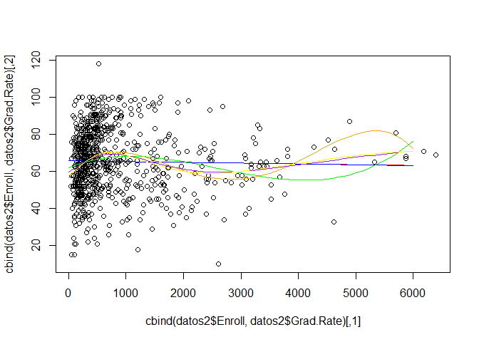

Parece que lo mejor es usar polinomios de grado 3 o splines.

    modc4=gam(Grad.Rate~ Private+Apps+s( Accept)+Enroll, data = datos2)
    modc4.2=gam(Grad.Rate~ Private+Apps+s( Accept)+poly(Enroll,2), data = datos2)
    modc4.3=gam(Grad.Rate~ Private+Apps+s( Accept)+poly(Enroll,3), data = datos2)
    modc4.4=gam(Grad.Rate~ Private+Apps+s( Accept)+poly(Enroll,4), data = datos2)
    modc4.s=gam(Grad.Rate~ Private+Apps+s( Accept)+s(Enroll), data = datos2)
    modc4.s5=gam(Grad.Rate~ Private+Apps+s( Accept)+s(Enroll,5), data = datos2)

    summary(modc3)

    ## 
    ## Call: gam(formula = Grad.Rate ~ Private + Apps + s(Accept), data = datos2)
    ## Deviance Residuals:
    ##      Min       1Q   Median       3Q      Max 
    ## -51.0501  -9.2156   0.2228  10.1178  50.0044 
    ## 
    ## (Dispersion Parameter for gaussian family taken to be 212.0682)
    ## 
    ##     Null Deviance: 228977.2 on 776 degrees of freedom
    ## Residual Deviance: 163292.5 on 770 degrees of freedom
    ## AIC: 6376.316 
    ## 
    ## Number of Local Scoring Iterations: 2 
    ## 
    ## Anova for Parametric Effects
    ##            Df Sum Sq Mean Sq F value    Pr(>F)    
    ## Private     1  32036   32036 151.063 < 2.2e-16 ***
    ## Apps        1  26776   26776 126.260 < 2.2e-16 ***
    ## s(Accept)   1   2659    2659  12.538 0.0004228 ***
    ## Residuals 770 163292     212                      
    ## ---
    ## Signif. codes:  0 '***' 0.001 '**' 0.01 '*' 0.05 '.' 0.1 ' ' 1
    ## 
    ## Anova for Nonparametric Effects
    ##             Npar Df Npar F     Pr(F)    
    ## (Intercept)                             
    ## Private                                 
    ## Apps                                    
    ## s(Accept)         3 19.872 2.053e-12 ***
    ## ---
    ## Signif. codes:  0 '***' 0.001 '**' 0.01 '*' 0.05 '.' 0.1 ' ' 1

    summary(modc4)

    ## 
    ## Call: gam(formula = Grad.Rate ~ Private + Apps + s(Accept) + Enroll, 
    ##     data = datos2)
    ## Deviance Residuals:
    ##     Min      1Q  Median      3Q     Max 
    ## -47.734  -9.358   0.506   9.934  50.649 
    ## 
    ## (Dispersion Parameter for gaussian family taken to be 210.3482)
    ## 
    ##     Null Deviance: 228977.2 on 776 degrees of freedom
    ## Residual Deviance: 161757.8 on 769 degrees of freedom
    ## AIC: 6370.979 
    ## 
    ## Number of Local Scoring Iterations: 2 
    ## 
    ## Anova for Parametric Effects
    ##            Df Sum Sq Mean Sq  F value    Pr(>F)    
    ## Private     1  32838   32838 156.1145 < 2.2e-16 ***
    ## Apps        1  27560   27560 131.0189 < 2.2e-16 ***
    ## s(Accept)   1   2950    2950  14.0225 0.0001941 ***
    ## Enroll      1   1748    1748   8.3077 0.0040578 ** 
    ## Residuals 769 161758     210                       
    ## ---
    ## Signif. codes:  0 '***' 0.001 '**' 0.01 '*' 0.05 '.' 0.1 ' ' 1
    ## 
    ## Anova for Nonparametric Effects
    ##             Npar Df Npar F     Pr(F)    
    ## (Intercept)                             
    ## Private                                 
    ## Apps                                    
    ## s(Accept)         3 22.075 1.015e-13 ***
    ## Enroll                                  
    ## ---
    ## Signif. codes:  0 '***' 0.001 '**' 0.01 '*' 0.05 '.' 0.1 ' ' 1

    summary(modc4.2)

    ## 
    ## Call: gam(formula = Grad.Rate ~ Private + Apps + s(Accept) + poly(Enroll, 
    ##     2), data = datos2)
    ## Deviance Residuals:
    ##      Min       1Q   Median       3Q      Max 
    ## -47.6083  -9.2544   0.4535   9.5575  52.1675 
    ## 
    ## (Dispersion Parameter for gaussian family taken to be 208.4261)
    ## 
    ##     Null Deviance: 228977.2 on 776 degrees of freedom
    ## Residual Deviance: 160071.2 on 768 degrees of freedom
    ## AIC: 6364.835 
    ## 
    ## Number of Local Scoring Iterations: 2 
    ## 
    ## Anova for Parametric Effects
    ##                  Df Sum Sq Mean Sq F value    Pr(>F)    
    ## Private           1  37100   37100 178.001 < 2.2e-16 ***
    ## Apps              1  28768   28768 138.024 < 2.2e-16 ***
    ## s(Accept)         1   2177    2177  10.445  0.001283 ** 
    ## poly(Enroll, 2)   2   6250    3125  14.993 4.097e-07 ***
    ## Residuals       768 160071     208                      
    ## ---
    ## Signif. codes:  0 '***' 0.001 '**' 0.01 '*' 0.05 '.' 0.1 ' ' 1
    ## 
    ## Anova for Nonparametric Effects
    ##                 Npar Df Npar F     Pr(F)    
    ## (Intercept)                                 
    ## Private                                     
    ## Apps                                        
    ## s(Accept)             3 23.421 1.632e-14 ***
    ## poly(Enroll, 2)                             
    ## ---
    ## Signif. codes:  0 '***' 0.001 '**' 0.01 '*' 0.05 '.' 0.1 ' ' 1

    summary(modc4.3)

    ## 
    ## Call: gam(formula = Grad.Rate ~ Private + Apps + s(Accept) + poly(Enroll, 
    ##     3), data = datos2)
    ## Deviance Residuals:
    ##      Min       1Q   Median       3Q      Max 
    ## -47.5158  -8.9965   0.1437   9.9090  49.8198 
    ## 
    ## (Dispersion Parameter for gaussian family taken to be 207.8635)
    ## 
    ##     Null Deviance: 228977.2 on 776 degrees of freedom
    ## Residual Deviance: 159431.3 on 767 degrees of freedom
    ## AIC: 6363.723 
    ## 
    ## Number of Local Scoring Iterations: 3 
    ## 
    ## Anova for Parametric Effects
    ##                  Df Sum Sq Mean Sq F value    Pr(>F)    
    ## Private           1  33748   33748 162.358 < 2.2e-16 ***
    ## Apps              1  27894   27894 134.194 < 2.2e-16 ***
    ## s(Accept)         1   2829    2829  13.609  0.000241 ***
    ## poly(Enroll, 3)   3   6637    2212  10.644 7.332e-07 ***
    ## Residuals       767 159431     208                      
    ## ---
    ## Signif. codes:  0 '***' 0.001 '**' 0.01 '*' 0.05 '.' 0.1 ' ' 1
    ## 
    ## Anova for Nonparametric Effects
    ##                 Npar Df Npar F     Pr(F)    
    ## (Intercept)                                 
    ## Private                                     
    ## Apps                                        
    ## s(Accept)             3 11.198 3.381e-07 ***
    ## poly(Enroll, 3)                             
    ## ---
    ## Signif. codes:  0 '***' 0.001 '**' 0.01 '*' 0.05 '.' 0.1 ' ' 1

    summary(modc4.4)

    ## 
    ## Call: gam(formula = Grad.Rate ~ Private + Apps + s(Accept) + poly(Enroll, 
    ##     4), data = datos2)
    ## Deviance Residuals:
    ##      Min       1Q   Median       3Q      Max 
    ## -48.5550  -9.1842   0.5418   9.5958  47.7492 
    ## 
    ## (Dispersion Parameter for gaussian family taken to be 204.9026)
    ## 
    ##     Null Deviance: 228977.2 on 776 degrees of freedom
    ## Residual Deviance: 156955.4 on 766 degrees of freedom
    ## AIC: 6353.561 
    ## 
    ## Number of Local Scoring Iterations: 3 
    ## 
    ## Anova for Parametric Effects
    ##                  Df Sum Sq Mean Sq F value    Pr(>F)    
    ## Private           1  33598   33598 163.969 < 2.2e-16 ***
    ## Apps              1  28088   28088 137.078 < 2.2e-16 ***
    ## s(Accept)         1   3053    3053  14.901 0.0001228 ***
    ## poly(Enroll, 4)   4  12898    3224  15.737 2.199e-12 ***
    ## Residuals       766 156955     205                      
    ## ---
    ## Signif. codes:  0 '***' 0.001 '**' 0.01 '*' 0.05 '.' 0.1 ' ' 1
    ## 
    ## Anova for Nonparametric Effects
    ##                 Npar Df Npar F     Pr(F)    
    ## (Intercept)                                 
    ## Private                                     
    ## Apps                                        
    ## s(Accept)             3 9.5443 3.412e-06 ***
    ## poly(Enroll, 4)                             
    ## ---
    ## Signif. codes:  0 '***' 0.001 '**' 0.01 '*' 0.05 '.' 0.1 ' ' 1

    summary(modc4.s)

    ## 
    ## Call: gam(formula = Grad.Rate ~ Private + Apps + s(Accept) + s(Enroll), 
    ##     data = datos2)
    ## Deviance Residuals:
    ##      Min       1Q   Median       3Q      Max 
    ## -46.7410  -9.2305   0.3761   9.4707  49.4585 
    ## 
    ## (Dispersion Parameter for gaussian family taken to be 204.1089)
    ## 
    ##     Null Deviance: 228977.2 on 776 degrees of freedom
    ## Residual Deviance: 156347.5 on 766.0002 degrees of freedom
    ## AIC: 6350.546 
    ## 
    ## Number of Local Scoring Iterations: 2 
    ## 
    ## Anova for Parametric Effects
    ##            Df Sum Sq Mean Sq F value    Pr(>F)    
    ## Private     1  30994 30993.8 151.850 < 2.2e-16 ***
    ## Apps        1  27486 27486.4 134.665 < 2.2e-16 ***
    ## s(Accept)   1   4040  4039.8  19.793 9.911e-06 ***
    ## s(Enroll)   1   2679  2679.5  13.128 0.0003102 ***
    ## Residuals 766 156347   204.1                      
    ## ---
    ## Signif. codes:  0 '***' 0.001 '**' 0.01 '*' 0.05 '.' 0.1 ' ' 1
    ## 
    ## Anova for Nonparametric Effects
    ##             Npar Df Npar F     Pr(F)    
    ## (Intercept)                             
    ## Private                                 
    ## Apps                                    
    ## s(Accept)         3 21.553 2.076e-13 ***
    ## s(Enroll)         3 13.998 6.842e-09 ***
    ## ---
    ## Signif. codes:  0 '***' 0.001 '**' 0.01 '*' 0.05 '.' 0.1 ' ' 1

    summary(modc4.s5)

    ## 
    ## Call: gam(formula = Grad.Rate ~ Private + Apps + s(Accept) + s(Enroll, 
    ##     5), data = datos2)
    ## Deviance Residuals:
    ##      Min       1Q   Median       3Q      Max 
    ## -47.3776  -9.3564   0.2099   9.3875  48.8962 
    ## 
    ## (Dispersion Parameter for gaussian family taken to be 202.7184)
    ## 
    ##     Null Deviance: 228977.2 on 776 degrees of freedom
    ## Residual Deviance: 155079.5 on 764.9999 degrees of freedom
    ## AIC: 6346.219 
    ## 
    ## Number of Local Scoring Iterations: 2 
    ## 
    ## Anova for Parametric Effects
    ##               Df Sum Sq Mean Sq F value    Pr(>F)    
    ## Private        1  30716 30716.5 151.523 < 2.2e-16 ***
    ## Apps           1  27273 27272.6 134.534 < 2.2e-16 ***
    ## s(Accept)      1   4231  4230.9  20.871 5.726e-06 ***
    ## s(Enroll, 5)   1   2482  2482.0  12.243 0.0004939 ***
    ## Residuals    765 155080   202.7                      
    ## ---
    ## Signif. codes:  0 '***' 0.001 '**' 0.01 '*' 0.05 '.' 0.1 ' ' 1
    ## 
    ## Anova for Nonparametric Effects
    ##              Npar Df Npar F     Pr(F)    
    ## (Intercept)                              
    ## Private                                  
    ## Apps                                     
    ## s(Accept)          3 18.215 2.006e-11 ***
    ## s(Enroll, 5)       4 13.378 1.524e-10 ***
    ## ---
    ## Signif. codes:  0 '***' 0.001 '**' 0.01 '*' 0.05 '.' 0.1 ' ' 1

    anova(modc3,modc4,modc4.2,modc4.3,modc4.4)

    ## Analysis of Deviance Table
    ## 
    ## Model 1: Grad.Rate ~ Private + Apps + s(Accept)
    ## Model 2: Grad.Rate ~ Private + Apps + s(Accept) + Enroll
    ## Model 3: Grad.Rate ~ Private + Apps + s(Accept) + poly(Enroll, 2)
    ## Model 4: Grad.Rate ~ Private + Apps + s(Accept) + poly(Enroll, 3)
    ## Model 5: Grad.Rate ~ Private + Apps + s(Accept) + poly(Enroll, 4)
    ##   Resid. Df Resid. Dev Df Deviance  Pr(>Chi)    
    ## 1       770     163292                          
    ## 2       769     161758  1  1534.72 0.0062043 ** 
    ## 3       768     160071  1  1686.55 0.0041182 ** 
    ## 4       767     159431  1   639.91 0.0771945 .  
    ## 5       766     156955  1  2475.94 0.0005087 ***
    ## ---
    ## Signif. codes:  0 '***' 0.001 '**' 0.01 '*' 0.05 '.' 0.1 ' ' 1

    errores_tab(list(modc3,modc4,modc4.2,modc4.3,modc4.4, modc4.s,modc4.s5))

    ##                                                                     
    ## ecm         210.1576    208.1825    206.0119    205.1883    202.0018
    ## deviance 163292.4791 161757.7640 160071.2172 159431.3063 156955.3681
    ## aic        6376.3161   6370.9789   6364.8351   6363.7227   6353.5613
    ##                                 
    ## ecm         201.2194    199.5876
    ## deviance 156347.4661 155079.5280
    ## aic        6350.5457   6346.2193

Parece razonable volver a tomar splines suavizados.

    modc4=modc4.s

### Variable Top10perc.

    mod5=gam(Grad.Rate~ Top10perc, data = datos2)
    mod5.2=gam(Grad.Rate~ poly(Top10perc,2), data = datos2)
    mod5.3=gam(Grad.Rate~ poly(Top10perc,3), data = datos2)
    mod5.4=gam(Grad.Rate~ poly(Top10perc,4), data = datos2)
    mod5.s=gam(Grad.Rate~ Top10perc+s(Top10perc), data = datos2)
    mod5.s5=gam(Grad.Rate~ Top10perc+s(Top10perc,5), data = datos2)
    mod5.s10=gam(Grad.Rate~ Top10perc+s(Top10perc,10), data = datos2)

    summary(mod5)

    ## 
    ## Call: gam(formula = Grad.Rate ~ Top10perc, data = datos2)
    ## Deviance Residuals:
    ##      Min       1Q   Median       3Q      Max 
    ## -49.4100  -9.8342   0.2879   9.0796  61.4820 
    ## 
    ## (Dispersion Parameter for gaussian family taken to be 223.0639)
    ## 
    ##     Null Deviance: 228977.2 on 776 degrees of freedom
    ## Residual Deviance: 172874.5 on 775 degrees of freedom
    ## AIC: 6410.623 
    ## 
    ## Number of Local Scoring Iterations: 2 
    ## 
    ## Anova for Parametric Effects
    ##            Df Sum Sq Mean Sq F value    Pr(>F)    
    ## Top10perc   1  56103   56103  251.51 < 2.2e-16 ***
    ## Residuals 775 172875     223                      
    ## ---
    ## Signif. codes:  0 '***' 0.001 '**' 0.01 '*' 0.05 '.' 0.1 ' ' 1

    summary(mod5.2)

    ## 
    ## Call: gam(formula = Grad.Rate ~ poly(Top10perc, 2), data = datos2)
    ## Deviance Residuals:
    ##      Min       1Q   Median       3Q      Max 
    ## -49.0518 -10.0234   0.3365   9.3560  62.5958 
    ## 
    ## (Dispersion Parameter for gaussian family taken to be 222.2742)
    ## 
    ##     Null Deviance: 228977.2 on 776 degrees of freedom
    ## Residual Deviance: 172040.2 on 774 degrees of freedom
    ## AIC: 6408.864 
    ## 
    ## Number of Local Scoring Iterations: 2 
    ## 
    ## Anova for Parametric Effects
    ##                     Df Sum Sq Mean Sq F value    Pr(>F)    
    ## poly(Top10perc, 2)   2  56937 28468.5  128.08 < 2.2e-16 ***
    ## Residuals          774 172040   222.3                      
    ## ---
    ## Signif. codes:  0 '***' 0.001 '**' 0.01 '*' 0.05 '.' 0.1 ' ' 1

    summary(mod5.3)

    ## 
    ## Call: gam(formula = Grad.Rate ~ poly(Top10perc, 3), data = datos2)
    ## Deviance Residuals:
    ##     Min      1Q  Median      3Q     Max 
    ## -49.199 -10.171   0.296   9.474  63.039 
    ## 
    ## (Dispersion Parameter for gaussian family taken to be 222.2203)
    ## 
    ##     Null Deviance: 228977.2 on 776 degrees of freedom
    ## Residual Deviance: 171776.3 on 773 degrees of freedom
    ## AIC: 6409.671 
    ## 
    ## Number of Local Scoring Iterations: 2 
    ## 
    ## Anova for Parametric Effects
    ##                     Df Sum Sq Mean Sq F value    Pr(>F)    
    ## poly(Top10perc, 3)   3  57201 19067.0  85.802 < 2.2e-16 ***
    ## Residuals          773 171776   222.2                      
    ## ---
    ## Signif. codes:  0 '***' 0.001 '**' 0.01 '*' 0.05 '.' 0.1 ' ' 1

    summary(mod5.4)

    ## 
    ## Call: gam(formula = Grad.Rate ~ poly(Top10perc, 4), data = datos2)
    ## Deviance Residuals:
    ##      Min       1Q   Median       3Q      Max 
    ## -49.4596 -10.0492   0.2705   9.4557  63.1040 
    ## 
    ## (Dispersion Parameter for gaussian family taken to be 222.3574)
    ## 
    ##     Null Deviance: 228977.2 on 776 degrees of freedom
    ## Residual Deviance: 171659.9 on 772 degrees of freedom
    ## AIC: 6411.144 
    ## 
    ## Number of Local Scoring Iterations: 2 
    ## 
    ## Anova for Parametric Effects
    ##                     Df Sum Sq Mean Sq F value    Pr(>F)    
    ## poly(Top10perc, 4)   4  57317 14329.3  64.443 < 2.2e-16 ***
    ## Residuals          772 171660   222.4                      
    ## ---
    ## Signif. codes:  0 '***' 0.001 '**' 0.01 '*' 0.05 '.' 0.1 ' ' 1

    summary(mod5.s)

    ## 
    ## Call: gam(formula = Grad.Rate ~ Top10perc + s(Top10perc), data = datos2)
    ## Deviance Residuals:
    ##      Min       1Q   Median       3Q      Max 
    ## -48.9470  -9.9149   0.1874   9.3584  63.0072 
    ## 
    ## (Dispersion Parameter for gaussian family taken to be 221.8826)
    ## 
    ##     Null Deviance: 228977.2 on 776 degrees of freedom
    ## Residual Deviance: 171293.4 on 772 degrees of freedom
    ## AIC: 6409.484 
    ## 
    ## Number of Local Scoring Iterations: 2 
    ## 
    ## Anova for Parametric Effects
    ##            Df Sum Sq Mean Sq F value    Pr(>F)    
    ## Top10perc   1  56103   56103  252.85 < 2.2e-16 ***
    ## Residuals 772 171293     222                      
    ## ---
    ## Signif. codes:  0 '***' 0.001 '**' 0.01 '*' 0.05 '.' 0.1 ' ' 1
    ## 
    ## Anova for Nonparametric Effects
    ##              Npar Df Npar F   Pr(F)  
    ## (Intercept)                          
    ## Top10perc                            
    ## s(Top10perc)       3 2.3754 0.06884 .
    ## ---
    ## Signif. codes:  0 '***' 0.001 '**' 0.01 '*' 0.05 '.' 0.1 ' ' 1

    summary(mod5.s5)

    ## 
    ## Call: gam(formula = Grad.Rate ~ Top10perc + s(Top10perc, 5), data = datos2)
    ## Deviance Residuals:
    ##      Min       1Q   Median       3Q      Max 
    ## -48.8512  -9.8512   0.1657   9.1870  63.0138 
    ## 
    ## (Dispersion Parameter for gaussian family taken to be 221.891)
    ## 
    ##     Null Deviance: 228977.2 on 776 degrees of freedom
    ## Residual Deviance: 171078 on 771 degrees of freedom
    ## AIC: 6410.506 
    ## 
    ## Number of Local Scoring Iterations: 2 
    ## 
    ## Anova for Parametric Effects
    ##            Df Sum Sq Mean Sq F value    Pr(>F)    
    ## Top10perc   1  56103   56103  252.84 < 2.2e-16 ***
    ## Residuals 771 171078     222                      
    ## ---
    ## Signif. codes:  0 '***' 0.001 '**' 0.01 '*' 0.05 '.' 0.1 ' ' 1
    ## 
    ## Anova for Nonparametric Effects
    ##                 Npar Df Npar F   Pr(F)  
    ## (Intercept)                             
    ## Top10perc                               
    ## s(Top10perc, 5)       4 2.0241 0.08923 .
    ## ---
    ## Signif. codes:  0 '***' 0.001 '**' 0.01 '*' 0.05 '.' 0.1 ' ' 1

    summary(mod5.s10)

    ## 
    ## Call: gam(formula = Grad.Rate ~ Top10perc + s(Top10perc, 10), data = datos2)
    ## Deviance Residuals:
    ##      Min       1Q   Median       3Q      Max 
    ## -48.5765 -10.0353   0.1118   9.2283  62.4696 
    ## 
    ## (Dispersion Parameter for gaussian family taken to be 222.397)
    ## 
    ##     Null Deviance: 228977.2 on 776 degrees of freedom
    ## Residual Deviance: 170356.1 on 766.0002 degrees of freedom
    ## AIC: 6417.22 
    ## 
    ## Number of Local Scoring Iterations: 2 
    ## 
    ## Anova for Parametric Effects
    ##            Df Sum Sq Mean Sq F value    Pr(>F)    
    ## Top10perc   1  56103   56103  252.26 < 2.2e-16 ***
    ## Residuals 766 170356     222                      
    ## ---
    ## Signif. codes:  0 '***' 0.001 '**' 0.01 '*' 0.05 '.' 0.1 ' ' 1
    ## 
    ## Anova for Nonparametric Effects
    ##                  Npar Df Npar F  Pr(F)
    ## (Intercept)                           
    ## Top10perc                             
    ## s(Top10perc, 10)       9 1.2582 0.2562

    anova(mod5,mod5.2,mod5.3,mod5.4)

    ## Analysis of Deviance Table
    ## 
    ## Model 1: Grad.Rate ~ Top10perc
    ## Model 2: Grad.Rate ~ poly(Top10perc, 2)
    ## Model 3: Grad.Rate ~ poly(Top10perc, 3)
    ## Model 4: Grad.Rate ~ poly(Top10perc, 4)
    ##   Resid. Df Resid. Dev Df Deviance Pr(>Chi)  
    ## 1       775     172875                       
    ## 2       774     172040  1   834.28  0.05274 .
    ## 3       773     171776  1   263.96  0.27591  
    ## 4       772     171660  1   116.38  0.46941  
    ## ---
    ## Signif. codes:  0 '***' 0.001 '**' 0.01 '*' 0.05 '.' 0.1 ' ' 1

    errores_tab(list(mod5,mod5.2,mod5.3,mod5.4,mod5.s,mod5.s5,mod5.s10))

    ##                                                                    
    ## ecm         222.4897    221.416    221.0763    220.9265    220.4548
    ## deviance 172874.5054 172040.222 171776.2575 171659.8824 171293.3501
    ## aic        6410.6229   6408.864   6409.6710   6411.1444   6409.4835
    ##                                 
    ## ecm         220.1775    219.2486
    ## deviance 171077.9550 170356.1438
    ## aic        6410.5059   6417.2203

    plot(cbind(datos2$Top10perc,datos2$Grad.Rate))
    datos_falsos=data.frame(Top10perc=seq(0, 100, 1))
    lines(cbind(datos_falsos$Top10perc,predict(mod5,newdata = datos_falsos)), col='red')
    lines(cbind(datos_falsos$Enroll,predict(mod5.2,newdata = datos_falsos)), col='blue')
    lines(cbind(datos_falsos$Top10perc,predict(mod5.3,newdata = datos_falsos)), col='green')
    lines(cbind(datos_falsos$Top10perc,predict(mod5.s,newdata = datos_falsos)), col='yellow')

    ## Warning in predict.lm(object, newdata, se.fit, scale = 1, type =
    ## ifelse(type == : prediction from a rank-deficient fit may be misleading

    lines(cbind(datos_falsos$Top10perc,predict(mod5.s5,newdata = datos_falsos)), col='orange')

    ## Warning in predict.lm(object, newdata, se.fit, scale = 1, type =
    ## ifelse(type == : prediction from a rank-deficient fit may be misleading

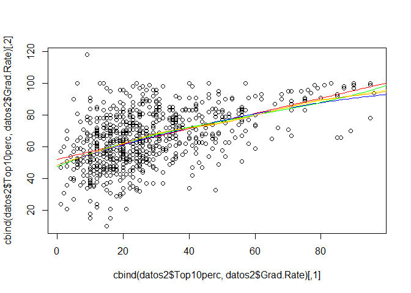

    modc5=gam(Grad.Rate~ Private+Apps+s(Accept)+s(Enroll)+Top10perc, data = datos2)
    modc5.2=gam(Grad.Rate~ Private+Apps+s(Accept)+s(Enroll)+poly(Top10perc,2), data = datos2)
    modc5.3=gam(Grad.Rate~ Private+Apps+s(Accept)+s(Enroll)+poly(Top10perc,3), data = datos2)
    modc5.4=gam(Grad.Rate~ Private+Apps+s(Accept)+s(Enroll)+poly(Top10perc,4), data = datos2)
    modc5.s=gam(Grad.Rate~ Private+Apps+s(Accept)+s(Enroll)+s(Top10perc), data = datos2)
    modc5.s5=gam(Grad.Rate~ Private+Apps+s(Accept)+s(Enroll)+s(Top10perc,5), data = datos2)
    modc5.s10=gam(Grad.Rate~ Private+Apps+s(Accept)+s(Enroll)+s(Top10perc,10), data = datos2)
    errores_tab(list(modc5,modc5.2,modc5.3,modc5.4,modc5.s,modc5.s5,modc5.s10))

    ##                                                                    
    ## ecm         181.4212    181.120    180.4671    180.1769    179.9426
    ## deviance 140964.2396 140730.206 140222.9361 139997.4500 139815.3659
    ## aic        6272.0682   6272.777   6271.9713   6272.7209   6271.7095
    ##                                 
    ## ecm         179.6747    178.6426
    ## deviance 139607.2143 138805.2661
    ## aic        6272.5520   6278.0755

Mirando el aic, una buena opcion parece que seria tomar splines
suavizados.

    modc5=modc5.s

### Variable Top25perc.

    mod6=gam(Grad.Rate~ Top25perc, data = datos2)
    mod6.2=gam(Grad.Rate~ poly(Top25perc,2), data = datos2)
    mod6.3=gam(Grad.Rate~ poly(Top25perc,3), data = datos2)
    mod6.4=gam(Grad.Rate~ poly(Top25perc,4), data = datos2)
    mod6.s=gam(Grad.Rate~ s(Top25perc), data = datos2)
    mod6.s5=gam(Grad.Rate~ s(Top25perc,5), data = datos2)
    mod6.s10=gam(Grad.Rate~ s(Top25perc,10), data = datos2)

    summary(mod6)

    ## 
    ## Call: gam(formula = Grad.Rate ~ Top25perc, data = datos2)
    ## Deviance Residuals:
    ##      Min       1Q   Median       3Q      Max 
    ## -67.5526 -10.9615   0.1782  10.1356  61.1459 
    ## 
    ## (Dispersion Parameter for gaussian family taken to be 228.1507)
    ## 
    ##     Null Deviance: 228977.2 on 776 degrees of freedom
    ## Residual Deviance: 176816.8 on 775 degrees of freedom
    ## AIC: 6428.143 
    ## 
    ## Number of Local Scoring Iterations: 2 
    ## 
    ## Anova for Parametric Effects
    ##            Df Sum Sq Mean Sq F value    Pr(>F)    
    ## Top25perc   1  52160   52160  228.62 < 2.2e-16 ***
    ## Residuals 775 176817     228                      
    ## ---
    ## Signif. codes:  0 '***' 0.001 '**' 0.01 '*' 0.05 '.' 0.1 ' ' 1

    summary(mod6.2)

    ## 
    ## Call: gam(formula = Grad.Rate ~ poly(Top25perc, 2), data = datos2)
    ## Deviance Residuals:
    ##      Min       1Q   Median       3Q      Max 
    ## -67.7861 -10.8780   0.3766   9.8371  61.0355 
    ## 
    ## (Dispersion Parameter for gaussian family taken to be 228.3274)
    ## 
    ##     Null Deviance: 228977.2 on 776 degrees of freedom
    ## Residual Deviance: 176725.4 on 774 degrees of freedom
    ## AIC: 6429.741 
    ## 
    ## Number of Local Scoring Iterations: 2 
    ## 
    ## Anova for Parametric Effects
    ##                     Df Sum Sq Mean Sq F value    Pr(>F)    
    ## poly(Top25perc, 2)   2  52252 26125.9  114.42 < 2.2e-16 ***
    ## Residuals          774 176725   228.3                      
    ## ---
    ## Signif. codes:  0 '***' 0.001 '**' 0.01 '*' 0.05 '.' 0.1 ' ' 1

    summary(mod6.3)

    ## 
    ## Call: gam(formula = Grad.Rate ~ poly(Top25perc, 3), data = datos2)
    ## Deviance Residuals:
    ##      Min       1Q   Median       3Q      Max 
    ## -67.2033 -10.8537   0.6252  10.2642  60.3855 
    ## 
    ## (Dispersion Parameter for gaussian family taken to be 227.8748)
    ## 
    ##     Null Deviance: 228977.2 on 776 degrees of freedom
    ## Residual Deviance: 176147.2 on 773 degrees of freedom
    ## AIC: 6429.195 
    ## 
    ## Number of Local Scoring Iterations: 2 
    ## 
    ## Anova for Parametric Effects
    ##                     Df Sum Sq Mean Sq F value    Pr(>F)    
    ## poly(Top25perc, 3)   3  52830 17610.0  77.279 < 2.2e-16 ***
    ## Residuals          773 176147   227.9                      
    ## ---
    ## Signif. codes:  0 '***' 0.001 '**' 0.01 '*' 0.05 '.' 0.1 ' ' 1

    summary(mod6.4)

    ## 
    ## Call: gam(formula = Grad.Rate ~ poly(Top25perc, 4), data = datos2)
    ## Deviance Residuals:
    ##      Min       1Q   Median       3Q      Max 
    ## -65.7807 -10.5661   0.4336   9.8010  61.2326 
    ## 
    ## (Dispersion Parameter for gaussian family taken to be 227.3024)
    ## 
    ##     Null Deviance: 228977.2 on 776 degrees of freedom
    ## Residual Deviance: 175477.4 on 772 degrees of freedom
    ## AIC: 6428.235 
    ## 
    ## Number of Local Scoring Iterations: 2 
    ## 
    ## Anova for Parametric Effects
    ##                     Df Sum Sq Mean Sq F value    Pr(>F)    
    ## poly(Top25perc, 4)   4  53500 13374.9  58.842 < 2.2e-16 ***
    ## Residuals          772 175477   227.3                      
    ## ---
    ## Signif. codes:  0 '***' 0.001 '**' 0.01 '*' 0.05 '.' 0.1 ' ' 1

    summary(mod6.s)

    ## 
    ## Call: gam(formula = Grad.Rate ~ s(Top25perc), data = datos2)
    ## Deviance Residuals:
    ##      Min       1Q   Median       3Q      Max 
    ## -66.3014 -10.6137   0.1788  10.1427  61.2583 
    ## 
    ## (Dispersion Parameter for gaussian family taken to be 226.5457)
    ## 
    ##     Null Deviance: 228977.2 on 776 degrees of freedom
    ## Residual Deviance: 174893.3 on 771.9998 degrees of freedom
    ## AIC: 6425.644 
    ## 
    ## Number of Local Scoring Iterations: 2 
    ## 
    ## Anova for Parametric Effects
    ##               Df Sum Sq Mean Sq F value    Pr(>F)    
    ## s(Top25perc)   1  52160   52160  230.24 < 2.2e-16 ***
    ## Residuals    772 174893     227                      
    ## ---
    ## Signif. codes:  0 '***' 0.001 '**' 0.01 '*' 0.05 '.' 0.1 ' ' 1
    ## 
    ## Anova for Nonparametric Effects
    ##              Npar Df Npar F   Pr(F)  
    ## (Intercept)                          
    ## s(Top25perc)       3 2.8301 0.03758 *
    ## ---
    ## Signif. codes:  0 '***' 0.001 '**' 0.01 '*' 0.05 '.' 0.1 ' ' 1

    summary(mod6.s5)

    ## 
    ## Call: gam(formula = Grad.Rate ~ s(Top25perc, 5), data = datos2)
    ## Deviance Residuals:
    ##      Min       1Q   Median       3Q      Max 
    ## -65.6572 -10.6572   0.4363   9.9691  61.3181 
    ## 
    ## (Dispersion Parameter for gaussian family taken to be 226.1828)
    ## 
    ##     Null Deviance: 228977.2 on 776 degrees of freedom
    ## Residual Deviance: 174386.9 on 770.9997 degrees of freedom
    ## AIC: 6425.391 
    ## 
    ## Number of Local Scoring Iterations: 2 
    ## 
    ## Anova for Parametric Effects
    ##                  Df Sum Sq Mean Sq F value    Pr(>F)    
    ## s(Top25perc, 5)   1  52160   52160  230.61 < 2.2e-16 ***
    ## Residuals       771 174387     226                      
    ## ---
    ## Signif. codes:  0 '***' 0.001 '**' 0.01 '*' 0.05 '.' 0.1 ' ' 1
    ## 
    ## Anova for Nonparametric Effects
    ##                 Npar Df Npar F   Pr(F)  
    ## (Intercept)                             
    ## s(Top25perc, 5)       4 2.6856 0.03038 *
    ## ---
    ## Signif. codes:  0 '***' 0.001 '**' 0.01 '*' 0.05 '.' 0.1 ' ' 1

    summary(mod6.s10)

    ## 
    ## Call: gam(formula = Grad.Rate ~ s(Top25perc, 10), data = datos2)
    ## Deviance Residuals:
    ##      Min       1Q   Median       3Q      Max 
    ## -64.2033 -10.4265   0.6054   9.7652  60.8789 
    ## 
    ## (Dispersion Parameter for gaussian family taken to be 225.796)
    ## 
    ##     Null Deviance: 228977.2 on 776 degrees of freedom
    ## Residual Deviance: 172959.8 on 766 degrees of freedom
    ## AIC: 6429.006 
    ## 
    ## Number of Local Scoring Iterations: 2 
    ## 
    ## Anova for Parametric Effects
    ##                   Df Sum Sq Mean Sq F value    Pr(>F)    
    ## s(Top25perc, 10)   1  52160   52160  231.01 < 2.2e-16 ***
    ## Residuals        766 172960     226                      
    ## ---
    ## Signif. codes:  0 '***' 0.001 '**' 0.01 '*' 0.05 '.' 0.1 ' ' 1
    ## 
    ## Anova for Nonparametric Effects
    ##                  Npar Df Npar F   Pr(F)  
    ## (Intercept)                              
    ## s(Top25perc, 10)       9  1.898 0.04917 *
    ## ---
    ## Signif. codes:  0 '***' 0.001 '**' 0.01 '*' 0.05 '.' 0.1 ' ' 1

    anova(mod6,mod6.2,mod6.3,mod6.4)

    ## Analysis of Deviance Table
    ## 
    ## Model 1: Grad.Rate ~ Top25perc
    ## Model 2: Grad.Rate ~ poly(Top25perc, 2)
    ## Model 3: Grad.Rate ~ poly(Top25perc, 3)
    ## Model 4: Grad.Rate ~ poly(Top25perc, 4)
    ##   Resid. Df Resid. Dev Df Deviance Pr(>Chi)  
    ## 1       775     176817                       
    ## 2       774     176725  1    91.42  0.52597  
    ## 3       773     176147  1   578.17  0.11074  
    ## 4       772     175477  1   669.79  0.08605 .
    ## ---
    ## Signif. codes:  0 '***' 0.001 '**' 0.01 '*' 0.05 '.' 0.1 ' ' 1

    errores_tab(list(mod6,mod6.2,mod6.3,mod6.4,mod6.s,mod6.s5,mod6.s10))

    ##                                                                     
    ## ecm         227.5635    227.4458    226.7017    225.8397    225.0878
    ## deviance 176816.8134 176725.3976 176147.2253 175477.4395 174893.2531
    ## aic        6428.1429   6429.7411   6429.1949   6428.2348   6425.6442
    ##                                 
    ## ecm         224.4361    222.5995
    ## deviance 174386.8832 172959.7733
    ## aic        6425.3915   6429.0061

    plot(cbind(datos2$Top25perc,datos2$Grad.Rate))
    datos_falsos=data.frame(Top25perc=seq(0, 100, 1))
    lines(cbind(datos_falsos$Top25perc,predict(mod6,newdata = datos_falsos)), col='red')
    lines(cbind(datos_falsos$Top25perc,predict(mod6.2,newdata = datos_falsos)), col='blue')
    lines(cbind(datos_falsos$Top25perc,predict(mod6.3,newdata = datos_falsos)), col='green')
    lines(cbind(datos_falsos$Top25perc,predict(mod6.4,newdata = datos_falsos)), col='yellow')
    lines(cbind(datos_falsos$Top25perc,predict(mod6.s,newdata = datos_falsos)), col='orange')
    lines(cbind(datos_falsos$Top25perc,predict(mod6.s5,newdata = datos_falsos)), col='purple')
    lines(cbind(datos_falsos$Top25perc,predict(mod6.s10,newdata = datos_falsos)), col='pink')

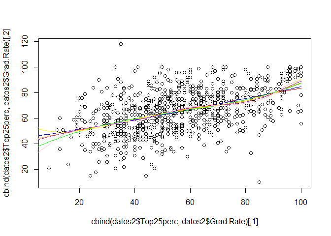

A la vista de los datos, tal vez tenga sentido usar un spline con un
nodo de manera que diferencie los datos con valores muy bajos de
Top25perc (esto tiene sentido, pues tendremos peores estudiantes en la
correspondiente universidad).

    mod6.bs=gam(Grad.Rate~ bs(Top25perc ,knots =c(30) ), data = datos2)
    summary(mod6.bs)

    ## 
    ## Call: gam(formula = Grad.Rate ~ bs(Top25perc, knots = c(30)), data = datos2)
    ## Deviance Residuals:
    ##      Min       1Q   Median       3Q      Max 
    ## -67.2540 -10.8829   0.5935  10.2498  60.3656 
    ## 
    ## (Dispersion Parameter for gaussian family taken to be 228.1617)
    ## 
    ##     Null Deviance: 228977.2 on 776 degrees of freedom
    ## Residual Deviance: 176140.9 on 772 degrees of freedom
    ## AIC: 6431.167 
    ## 
    ## Number of Local Scoring Iterations: 2 
    ## 
    ## Anova for Parametric Effects
    ##                               Df Sum Sq Mean Sq F value    Pr(>F)    
    ## bs(Top25perc, knots = c(30))   4  52836 13209.1  57.894 < 2.2e-16 ***
    ## Residuals                    772 176141   228.2                      
    ## ---
    ## Signif. codes:  0 '***' 0.001 '**' 0.01 '*' 0.05 '.' 0.1 ' ' 1

    errores_tab(list(mod6,mod6.2,mod6.3,mod6.4,mod6.s,mod6.s5,mod6.s10,mod6.bs))

    ##                                                                     
    ## ecm         227.5635    227.4458    226.7017    225.8397    225.0878
    ## deviance 176816.8134 176725.3976 176147.2253 175477.4395 174893.2531
    ## aic        6428.1429   6429.7411   6429.1949   6428.2348   6425.6442
    ##                                             
    ## ecm         224.4361    222.5995    226.6935
    ## deviance 174386.8832 172959.7733 176140.8623
    ## aic        6425.3915   6429.0061   6431.1669

    plot(cbind(datos2$Top25perc,datos2$Grad.Rate))
    lines(cbind(datos_falsos$Enroll,predict(mod6.bs,newdata = datos_falsos)), col='red')

    ## Warning in bs(Top25perc, degree = 3L, knots = 30, Boundary.knots = c(9, :
    ## some 'x' values beyond boundary knots may cause ill-conditioned bases

    lines(cbind(datos_falsos$Top25perc,predict(mod6.s,newdata = datos_falsos)), col='orange')

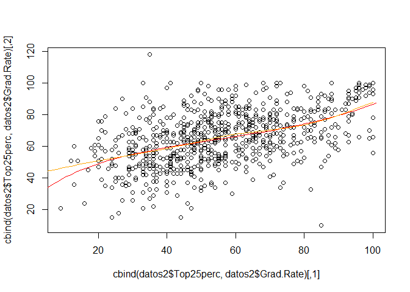

Todo indica que es mejor usar el spline suavizado, que el que acabamos
de construir. Ademas, tiene mejores propiedades (intervalos de
confianza), pero tiene sentido forzar en este caso el modelo.

    modc6=gam(Grad.Rate~ Private+Apps+s(Accept)+s(Enroll)+s(Top10perc) + Top25perc, data = datos2)
    modc6.2=gam(Grad.Rate~ Private+Apps+s(Accept)+s(Enroll)+s(Top10perc) + poly(Top25perc,2), data = datos2)
    modc6.3=gam(Grad.Rate~ Private+Apps+s(Accept)+s(Enroll)+s(Top10perc) + poly(Top25perc,3), data = datos2)
    modc6.4=gam(Grad.Rate~ Private+Apps+s(Accept)+s(Enroll)+s(Top10perc) + poly(Top25perc,4), data = datos2)
    modc6.s=gam(Grad.Rate~ Private+Apps+s(Accept)+s(Enroll)+s(Top10perc) + s(Top25perc), data = datos2)
    modc6.bs=gam(Grad.Rate~ Private+Apps+s(Accept)+s(Enroll)+s(Top10perc) + bs(Top25perc ,knots =c(30) ), data = datos2)
    errores_tab(list(modc6,modc6.2,modc6.3,modc6.4,modc6.s,modc6.bs))

    ##                                                                    
    ## ecm         178.4057    177.0094    176.9722    176.7322    176.338
    ## deviance 138621.2218 137536.3351 137507.4004 137320.9580 137014.648
    ## aic        6267.0448   6262.9399   6264.7764   6265.7222   6263.987
    ##                     
    ## ecm         176.9358
    ## deviance 137479.0822
    ## aic        6266.6164

Tomemos el modelo con el nudo fijado.

    modc6=modc6.bs

### Variable F.Undergrad.

    summary(datos2$F.Undergrad)

    ##    Min. 1st Qu.  Median    Mean 3rd Qu.    Max. 
    ##     139     992    1707    3700    4005   31640

    mod7=gam(Grad.Rate~ F.Undergrad, data = datos2)
    mod7.2=gam(Grad.Rate~ poly(F.Undergrad,2), data = datos2)
    mod7.3=gam(Grad.Rate~ poly(F.Undergrad,3), data = datos2)
    mod7.4=gam(Grad.Rate~ poly(F.Undergrad,4), data = datos2)
    mod7.s=gam(Grad.Rate~ s(F.Undergrad), data = datos2)
    mod7.s5=gam(Grad.Rate~ s(F.Undergrad,5), data = datos2)
    mod7.s10=gam(Grad.Rate~ s(F.Undergrad,10), data = datos2)

    summary(mod7)

    ## 
    ## Call: gam(formula = Grad.Rate ~ F.Undergrad, data = datos2)
    ## Deviance Residuals:
    ##       Min        1Q    Median        3Q       Max 
    ## -54.93771 -12.19604   0.04555  12.05687  51.78626 
    ## 
    ## (Dispersion Parameter for gaussian family taken to be 293.6211)
    ## 
    ##     Null Deviance: 228977.2 on 776 degrees of freedom
    ## Residual Deviance: 227556.4 on 775 degrees of freedom
    ## AIC: 6624.167 
    ## 
    ## Number of Local Scoring Iterations: 2 
    ## 
    ## Anova for Parametric Effects
    ##              Df Sum Sq Mean Sq F value  Pr(>F)  
    ## F.Undergrad   1   1421 1420.85  4.8391 0.02812 *
    ## Residuals   775 227556  293.62                  
    ## ---
    ## Signif. codes:  0 '***' 0.001 '**' 0.01 '*' 0.05 '.' 0.1 ' ' 1

    summary(mod7.2)

    ## 
    ## Call: gam(formula = Grad.Rate ~ poly(F.Undergrad, 2), data = datos2)
    ## Deviance Residuals:
    ##      Min       1Q   Median       3Q      Max 
    ## -54.5150 -11.9942   0.3143  12.0228  51.6151 
    ## 
    ## (Dispersion Parameter for gaussian family taken to be 293.8529)
    ## 
    ##     Null Deviance: 228977.2 on 776 degrees of freedom
    ## Residual Deviance: 227442.1 on 774 degrees of freedom
    ## AIC: 6625.777 
    ## 
    ## Number of Local Scoring Iterations: 2 
    ## 
    ## Anova for Parametric Effects
    ##                       Df Sum Sq Mean Sq F value  Pr(>F)  
    ## poly(F.Undergrad, 2)   2   1535  767.54   2.612 0.07404 .
    ## Residuals            774 227442  293.85                  
    ## ---
    ## Signif. codes:  0 '***' 0.001 '**' 0.01 '*' 0.05 '.' 0.1 ' ' 1

    summary(mod7.3)

    ## 
    ## Call: gam(formula = Grad.Rate ~ poly(F.Undergrad, 3), data = datos2)
    ## Deviance Residuals:
    ##      Min       1Q   Median       3Q      Max 
    ## -56.9726 -12.1542  -0.1161  12.4055  52.3195 
    ## 
    ## (Dispersion Parameter for gaussian family taken to be 290.4907)
    ## 
    ##     Null Deviance: 228977.2 on 776 degrees of freedom
    ## Residual Deviance: 224549.3 on 773 degrees of freedom
    ## AIC: 6617.831 
    ## 
    ## Number of Local Scoring Iterations: 2 
    ## 
    ## Anova for Parametric Effects
    ##                       Df Sum Sq Mean Sq F value  Pr(>F)   
    ## poly(F.Undergrad, 3)   3   4428 1475.96  5.0809 0.00173 **
    ## Residuals            773 224549  290.49                   
    ## ---
    ## Signif. codes:  0 '***' 0.001 '**' 0.01 '*' 0.05 '.' 0.1 ' ' 1

    summary(mod7.4)

    ## 
    ## Call: gam(formula = Grad.Rate ~ poly(F.Undergrad, 4), data = datos2)
    ## Deviance Residuals:
    ##      Min       1Q   Median       3Q      Max 
    ## -58.4523 -11.3817   0.3449  12.6448  52.9766 
    ## 
    ## (Dispersion Parameter for gaussian family taken to be 281.4465)
    ## 
    ##     Null Deviance: 228977.2 on 776 degrees of freedom
    ## Residual Deviance: 217276.7 on 772 degrees of freedom
    ## AIC: 6594.249 
    ## 
    ## Number of Local Scoring Iterations: 2 
    ## 
    ## Anova for Parametric Effects
    ##                       Df Sum Sq Mean Sq F value   Pr(>F)    
    ## poly(F.Undergrad, 4)   4  11701 2925.14  10.393 3.34e-08 ***
    ## Residuals            772 217277  281.45                     
    ## ---
    ## Signif. codes:  0 '***' 0.001 '**' 0.01 '*' 0.05 '.' 0.1 ' ' 1

    summary(mod7.s)

    ## 
    ## Call: gam(formula = Grad.Rate ~ s(F.Undergrad), data = datos2)
    ## Deviance Residuals:
    ##       Min        1Q    Median        3Q       Max 
    ## -56.56775 -11.72704  -0.06205  12.25375  52.67688 
    ## 
    ## (Dispersion Parameter for gaussian family taken to be 280.2843)
    ## 
    ##     Null Deviance: 228977.2 on 776 degrees of freedom
    ## Residual Deviance: 216379.5 on 772.0001 degrees of freedom
    ## AIC: 6591.034 
    ## 
    ## Number of Local Scoring Iterations: 2 
    ## 
    ## Anova for Parametric Effects
    ##                 Df Sum Sq Mean Sq F value  Pr(>F)  
    ## s(F.Undergrad)   1   1421 1420.85  5.0693 0.02463 *
    ## Residuals      772 216380  280.28                  
    ## ---
    ## Signif. codes:  0 '***' 0.001 '**' 0.01 '*' 0.05 '.' 0.1 ' ' 1
    ## 
    ## Anova for Nonparametric Effects
    ##                Npar Df Npar F     Pr(F)    
    ## (Intercept)                                
    ## s(F.Undergrad)       3 13.293 1.817e-08 ***
    ## ---
    ## Signif. codes:  0 '***' 0.001 '**' 0.01 '*' 0.05 '.' 0.1 ' ' 1

    summary(mod7.s5)

    ## 
    ## Call: gam(formula = Grad.Rate ~ s(F.Undergrad, 5), data = datos2)
    ## Deviance Residuals:
    ##      Min       1Q   Median       3Q      Max 
    ## -56.2771 -11.2683   0.1631  12.2810  52.9593 
    ## 
    ## (Dispersion Parameter for gaussian family taken to be 276.9336)
    ## 
    ##     Null Deviance: 228977.2 on 776 degrees of freedom
    ## Residual Deviance: 213515.7 on 770.9998 degrees of freedom
    ## AIC: 6582.683 
    ## 
    ## Number of Local Scoring Iterations: 2 
    ## 
    ## Anova for Parametric Effects
    ##                    Df Sum Sq Mean Sq F value  Pr(>F)  
    ## s(F.Undergrad, 5)   1   1421 1420.85  5.1307 0.02378 *
    ## Residuals         771 213516  276.93                  
    ## ---
    ## Signif. codes:  0 '***' 0.001 '**' 0.01 '*' 0.05 '.' 0.1 ' ' 1
    ## 
    ## Anova for Nonparametric Effects
    ##                   Npar Df Npar F     Pr(F)    
    ## (Intercept)                                   
    ## s(F.Undergrad, 5)       4 12.674 5.392e-10 ***
    ## ---
    ## Signif. codes:  0 '***' 0.001 '**' 0.01 '*' 0.05 '.' 0.1 ' ' 1

    summary(mod7.s10)

    ## 
    ## Call: gam(formula = Grad.Rate ~ s(F.Undergrad, 10), data = datos2)
    ## Deviance Residuals:
    ##      Min       1Q   Median       3Q      Max 
    ## -55.1005 -11.0424  -0.2089  11.4457  53.1374 
    ## 
    ## (Dispersion Parameter for gaussian family taken to be 272.552)
    ## 
    ##     Null Deviance: 228977.2 on 776 degrees of freedom
    ## Residual Deviance: 208774.8 on 766 degrees of freedom
    ## AIC: 6575.235 
    ## 
    ## Number of Local Scoring Iterations: 2 
    ## 
    ## Anova for Parametric Effects
    ##                     Df Sum Sq Mean Sq F value  Pr(>F)  
    ## s(F.Undergrad, 10)   1   1421 1420.85  5.2131 0.02269 *
    ## Residuals          766 208775  272.55                  
    ## ---
    ## Signif. codes:  0 '***' 0.001 '**' 0.01 '*' 0.05 '.' 0.1 ' ' 1
    ## 
    ## Anova for Nonparametric Effects
    ##                    Npar Df Npar F     Pr(F)    
    ## (Intercept)                                    
    ## s(F.Undergrad, 10)       9 7.6566 8.114e-11 ***
    ## ---
    ## Signif. codes:  0 '***' 0.001 '**' 0.01 '*' 0.05 '.' 0.1 ' ' 1

    anova(mod7,mod7.2,mod7.3,mod7.4)

    ## Analysis of Deviance Table
    ## 
    ## Model 1: Grad.Rate ~ F.Undergrad
    ## Model 2: Grad.Rate ~ poly(F.Undergrad, 2)
    ## Model 3: Grad.Rate ~ poly(F.Undergrad, 3)
    ## Model 4: Grad.Rate ~ poly(F.Undergrad, 4)
    ##   Resid. Df Resid. Dev Df Deviance  Pr(>Chi)    
    ## 1       775     227556                          
    ## 2       774     227442  1    114.2  0.524072    
    ## 3       773     224549  1   2892.8  0.001346 ** 
    ## 4       772     217277  1   7272.7 3.709e-07 ***
    ## ---
    ## Signif. codes:  0 '***' 0.001 '**' 0.01 '*' 0.05 '.' 0.1 ' ' 1

    errores_tab(list(mod7,mod7.2,mod7.3,mod7.4,mod7.s,mod7.s5,mod7.s10))

    ##                                                                     
    ## ecm         292.8653    292.7183    288.9953    279.6353    278.4807
    ## deviance 227556.3539 227442.1229 224549.3357 217276.6638 216379.5129
    ## aic        6624.1674   6625.7772   6617.8313   6594.2494   6591.0343
    ##                                
    ## ecm         274.795    268.6934
    ## deviance 213515.724 208774.7844
    ## aic        6582.683   6575.2352

    plot(cbind(datos2$F.Undergrad,datos2$Grad.Rate))
    datos_falsos=data.frame(F.Undergrad=seq(0, 32000, 100))
    lines(cbind(datos_falsos$F.Undergrad,predict(mod7,newdata = datos_falsos)), col='red')
    lines(cbind(datos_falsos$F.Undergrad,predict(mod7.2,newdata = datos_falsos)), col='blue')
    lines(cbind(datos_falsos$F.Undergrad,predict(mod7.3,newdata = datos_falsos)), col='green')
    lines(cbind(datos_falsos$F.Undergrad,predict(mod7.4,newdata = datos_falsos)), col='yellow')
    lines(cbind(datos_falsos$F.Undergrad,predict(mod7.s,newdata = datos_falsos)), col='orange')
    lines(cbind(datos_falsos$F.Undergrad,predict(mod7.s5,newdata = datos_falsos)), col='purple')
    lines(cbind(datos_falsos$F.Undergrad,predict(mod7.s10,newdata = datos_falsos)), col='pink')

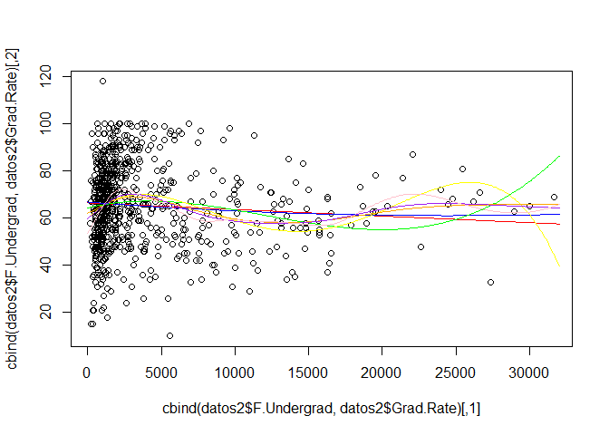

    modc7=gam(Grad.Rate~ Private+Apps+s(Accept)+s(Enroll)+s(Top10perc) + bs(Top25perc ,knots =c(30) )+F.Undergrad, data = datos2)
    modc7.2=gam(Grad.Rate~ Private+Apps+s(Accept)+s(Enroll)+s(Top10perc) + bs(Top25perc ,knots =c(30) )+ poly(F.Undergrad,2), data = datos2)
    modc7.3=gam(Grad.Rate~ Private+Apps+s(Accept)+s(Enroll)+s(Top10perc) + bs(Top25perc ,knots =c(30) )+poly(F.Undergrad,3), data = datos2)
    modc7.4=gam(Grad.Rate~ Private+Apps+s(Accept)+s(Enroll)+s(Top10perc) + bs(Top25perc ,knots =c(30) )+poly(F.Undergrad,4), data = datos2)
    modc7.s=gam(Grad.Rate~ Private+Apps+s(Accept)+s(Enroll)+s(Top10perc) + bs(Top25perc ,knots =c(30) )+s(F.Undergrad), data = datos2)
    modc7.s5=gam(Grad.Rate~ Private+Apps+s(Accept)+s(Enroll)+s(Top10perc) + bs(Top25perc ,knots =c(30) )+s(F.Undergrad,5), data = datos2)
    modc7.s10=gam(Grad.Rate~ Private+Apps+s(Accept)+s(Enroll)+s(Top10perc) + bs(Top25perc ,knots =c(30) )+s(F.Undergrad,10), data = datos2)

    errores_tab(list(modc7,modc7.2,modc7.3,modc7.4,modc7.s,modc7.s5, modc7.s10))

    ##                                                                     
    ## ecm         175.2262    175.2257    175.1841    175.2553    174.3115
    ## deviance 136150.7594 136150.3344 136118.0211 136173.3999 135440.0148
    ## aic        6261.0725   6263.0700   6264.8856   6267.2017   6263.0055
    ##                                 
    ## ecm         173.6324    171.6218
    ## deviance 134912.3551 133350.1164
    ## aic        6261.9731   6262.9229

Volvemos a encontrarnos con errores similares, pero volveremos a usar
splines suavizados.

    modc7=modc7.s

### Variable P.Undergrad.

    summary(datos2$P.Undergrad)

    ##    Min. 1st Qu.  Median    Mean 3rd Qu.    Max. 
    ##     1.0    95.0   353.0   855.3   967.0 21840.0

    mod8=gam(Grad.Rate~ P.Undergrad, data = datos2)
    mod8.2=gam(Grad.Rate~ poly(P.Undergrad,2), data = datos2)
    mod8.3=gam(Grad.Rate~ poly(P.Undergrad,3), data = datos2)
    mod8.4=gam(Grad.Rate~ poly(P.Undergrad,4), data = datos2)
    mod8.s=gam(Grad.Rate~ s(P.Undergrad), data = datos2)
    mod8.s5=gam(Grad.Rate~ s(P.Undergrad,5), data = datos2)
    mod8.s10=gam(Grad.Rate~ s(P.Undergrad,10), data = datos2)

    summary(mod8)

    ## 
    ## Call: gam(formula = Grad.Rate ~ P.Undergrad, data = datos2)
    ## Deviance Residuals:
    ##      Min       1Q   Median       3Q      Max 
    ## -52.8855 -11.1609  -0.2148  11.3879  50.0913 
    ## 
    ## (Dispersion Parameter for gaussian family taken to be 275.9398)
    ## 
    ##     Null Deviance: 228977.2 on 776 degrees of freedom
    ## Residual Deviance: 213853.4 on 775 degrees of freedom
    ## AIC: 6575.91 
    ## 
    ## Number of Local Scoring Iterations: 2 
    ## 
    ## Anova for Parametric Effects
    ##              Df Sum Sq Mean Sq F value    Pr(>F)    
    ## P.Undergrad   1  15124 15123.8  54.808 3.468e-13 ***
    ## Residuals   775 213853   275.9                      
    ## ---
    ## Signif. codes:  0 '***' 0.001 '**' 0.01 '*' 0.05 '.' 0.1 ' ' 1

    summary(mod8.2)

    ## 
    ## Call: gam(formula = Grad.Rate ~ poly(P.Undergrad, 2), data = datos2)
    ## Deviance Residuals:
    ##       Min        1Q    Median        3Q       Max 
    ## -53.86766 -11.02357  -0.08361  11.40911  49.09467 
    ## 
    ## (Dispersion Parameter for gaussian family taken to be 272.2642)
    ## 
    ##     Null Deviance: 228977.2 on 776 degrees of freedom
    ## Residual Deviance: 210732.5 on 774 degrees of freedom
    ## AIC: 6566.487 
    ## 
    ## Number of Local Scoring Iterations: 2 
    ## 
    ## Anova for Parametric Effects
    ##                       Df Sum Sq Mean Sq F value    Pr(>F)    
    ## poly(P.Undergrad, 2)   2  18245  9122.3  33.505 1.108e-14 ***
    ## Residuals            774 210733   272.3                      
    ## ---
    ## Signif. codes:  0 '***' 0.001 '**' 0.01 '*' 0.05 '.' 0.1 ' ' 1

    summary(mod8.3)

    ## 
    ## Call: gam(formula = Grad.Rate ~ poly(P.Undergrad, 3), data = datos2)
    ## Deviance Residuals:
    ##      Min       1Q   Median       3Q      Max 
    ## -54.1713 -11.1713  -0.1104  11.3344  48.7842 
    ## 
    ## (Dispersion Parameter for gaussian family taken to be 272.3619)
    ## 
    ##     Null Deviance: 228977.2 on 776 degrees of freedom
    ## Residual Deviance: 210535.7 on 773 degrees of freedom
    ## AIC: 6567.761 
    ## 
    ## Number of Local Scoring Iterations: 2 
    ## 
    ## Anova for Parametric Effects
    ##                       Df Sum Sq Mean Sq F value    Pr(>F)    
    ## poly(P.Undergrad, 3)   3  18441  6147.2   22.57 5.145e-14 ***
    ## Residuals            773 210536   272.4                      
    ## ---
    ## Signif. codes:  0 '***' 0.001 '**' 0.01 '*' 0.05 '.' 0.1 ' ' 1

    summary(mod8.4)

    ## 
    ## Call: gam(formula = Grad.Rate ~ poly(P.Undergrad, 4), data = datos2)
    ## Deviance Residuals:
    ##     Min      1Q  Median      3Q     Max 
    ## -54.213 -11.213  -0.179  11.337  48.741 
    ## 
    ## (Dispersion Parameter for gaussian family taken to be 272.7105)
    ## 
    ##     Null Deviance: 228977.2 on 776 degrees of freedom
    ## Residual Deviance: 210532.5 on 772 degrees of freedom
    ## AIC: 6569.75 
    ## 
    ## Number of Local Scoring Iterations: 2 
    ## 
    ## Anova for Parametric Effects
    ##                       Df Sum Sq Mean Sq F value    Pr(>F)    
    ## poly(P.Undergrad, 4)   4  18445  4611.2  16.909 2.678e-13 ***
    ## Residuals            772 210533   272.7                      
    ## ---
    ## Signif. codes:  0 '***' 0.001 '**' 0.01 '*' 0.05 '.' 0.1 ' ' 1

    summary(mod8.s)

    ## 
    ## Call: gam(formula = Grad.Rate ~ s(P.Undergrad), data = datos2)
    ## Deviance Residuals:
    ##      Min       1Q   Median       3Q      Max 
    ## -54.2305 -11.2305  -0.1586  11.4353  48.7200 
    ## 
    ## (Dispersion Parameter for gaussian family taken to be 272.4211)
    ## 
    ##     Null Deviance: 228977.2 on 776 degrees of freedom
    ## Residual Deviance: 210309.1 on 772 degrees of freedom
    ## AIC: 6568.925 
    ## 
    ## Number of Local Scoring Iterations: 2 
    ## 
    ## Anova for Parametric Effects
    ##                 Df Sum Sq Mean Sq F value    Pr(>F)    
    ## s(P.Undergrad)   1  15124 15123.8  55.516 2.487e-13 ***
    ## Residuals      772 210309   272.4                      
    ## ---
    ## Signif. codes:  0 '***' 0.001 '**' 0.01 '*' 0.05 '.' 0.1 ' ' 1
    ## 
    ## Anova for Nonparametric Effects
    ##                Npar Df Npar F    Pr(F)   
    ## (Intercept)                              
    ## s(P.Undergrad)       3 4.3367 0.004835 **
    ## ---
    ## Signif. codes:  0 '***' 0.001 '**' 0.01 '*' 0.05 '.' 0.1 ' ' 1

    summary(mod8.s5)

    ## 
    ## Call: gam(formula = Grad.Rate ~ s(P.Undergrad, 5), data = datos2)
    ## Deviance Residuals:
    ##      Min       1Q   Median       3Q      Max 
    ## -54.4796 -11.4796  -0.2597  11.5624  48.4576 
    ## 
    ## (Dispersion Parameter for gaussian family taken to be 272.2683)
    ## 
    ##     Null Deviance: 228977.2 on 776 degrees of freedom
    ## Residual Deviance: 209918.8 on 770.9997 degrees of freedom
    ## AIC: 6569.482 
    ## 
    ## Number of Local Scoring Iterations: 2 
    ## 
    ## Anova for Parametric Effects
    ##                    Df Sum Sq Mean Sq F value    Pr(>F)    
    ## s(P.Undergrad, 5)   1  15124 15123.8  55.547 2.454e-13 ***
    ## Residuals         771 209919   272.3                      
    ## ---
    ## Signif. codes:  0 '***' 0.001 '**' 0.01 '*' 0.05 '.' 0.1 ' ' 1
    ## 
    ## Anova for Nonparametric Effects
    ##                   Npar Df Npar F    Pr(F)   
    ## (Intercept)                                 
    ## s(P.Undergrad, 5)       4 3.6125 0.006298 **
    ## ---
    ## Signif. codes:  0 '***' 0.001 '**' 0.01 '*' 0.05 '.' 0.1 ' ' 1

    summary(mod8.s10)

    ## 
    ## Call: gam(formula = Grad.Rate ~ s(P.Undergrad, 10), data = datos2)
    ## Deviance Residuals:
    ##      Min       1Q   Median       3Q      Max 
    ## -55.8732 -11.3087  -0.1407  11.7043  46.9394 
    ## 
    ## (Dispersion Parameter for gaussian family taken to be 271.2536)
    ## 
    ##     Null Deviance: 228977.2 on 776 degrees of freedom
    ## Residual Deviance: 207780.1 on 765.9996 degrees of freedom
    ## AIC: 6571.525 
    ## 
    ## Number of Local Scoring Iterations: 2 
    ## 
    ## Anova for Parametric Effects
    ##                     Df Sum Sq Mean Sq F value    Pr(>F)    
    ## s(P.Undergrad, 10)   1  15124 15123.8  55.755 2.237e-13 ***
    ## Residuals          766 207780   271.3                      
    ## ---
    ## Signif. codes:  0 '***' 0.001 '**' 0.01 '*' 0.05 '.' 0.1 ' ' 1
    ## 
    ## Anova for Nonparametric Effects
    ##                    Npar Df Npar F   Pr(F)   
    ## (Intercept)                                 
    ## s(P.Undergrad, 10)       9 2.4876 0.00836 **
    ## ---
    ## Signif. codes:  0 '***' 0.001 '**' 0.01 '*' 0.05 '.' 0.1 ' ' 1

    anova(mod8,mod8.2,mod8.3,mod8.4)

    ## Analysis of Deviance Table
    ## 
    ## Model 1: Grad.Rate ~ P.Undergrad
    ## Model 2: Grad.Rate ~ poly(P.Undergrad, 2)
    ## Model 3: Grad.Rate ~ poly(P.Undergrad, 3)
    ## Model 4: Grad.Rate ~ poly(P.Undergrad, 4)
    ##   Resid. Df Resid. Dev Df Deviance  Pr(>Chi)    
    ## 1       775     213853                          
    ## 2       774     210733  1   3120.9 0.0007173 ***
    ## 3       773     210536  1    196.8 0.3956008    
    ## 4       772     210533  1      3.2 0.9138003    
    ## ---
    ## Signif. codes:  0 '***' 0.001 '**' 0.01 '*' 0.05 '.' 0.1 ' ' 1

    errores_tab(list(mod8,mod8.2,mod8.3,mod8.4,mod8.s,mod8.s5,mod8.s10))

    ##                                                                    
    ## ecm         275.2296    271.213    270.9597    270.9556    270.6681
    ## deviance 213853.3726 210732.516 210535.7124 210532.5170 210309.1275
    ## aic        6575.9100   6566.487   6567.7613   6569.7496   6568.9246
    ##                                 
    ## ecm         270.1657    267.4133
    ## deviance 209918.7774 207780.1359
    ## aic        6569.4817   6571.5254

Quizas escojamos la regresion por medio de polinomios de grado dos.

    plot(cbind(datos2$P.Undergrad,datos2$Grad.Rate))
    datos_falsos=data.frame(P.Undergrad=seq(0, 30000, 100))
    lines(cbind(datos_falsos$P.Undergrad,predict(mod8,newdata = datos_falsos)), col='red')
    lines(cbind(datos_falsos$P.Undergrad,predict(mod8.2,newdata = datos_falsos)), col='blue')
    lines(cbind(datos_falsos$P.Undergrad,predict(mod8.3,newdata = datos_falsos)), col='green')
    lines(cbind(datos_falsos$P.Undergrad,predict(mod8.4,newdata = datos_falsos)), col='yellow')
    lines(cbind(datos_falsos$P.Undergrad,predict(mod8.s,newdata = datos_falsos)), col='orange')
    lines(cbind(datos_falsos$P.Undergrad,predict(mod8.s5,newdata = datos_falsos)), col='purple')
    lines(cbind(datos_falsos$P.Undergrad,predict(mod8.s10,newdata = datos_falsos)), col='pink')

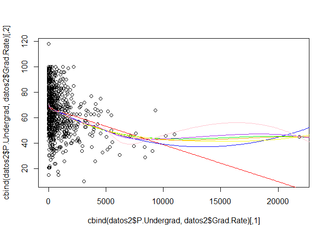

    modc8=gam(Grad.Rate~ Private+Apps+s(Accept)+s(Enroll)+s(Top10perc) + bs(Top25perc ,knots =c(30) )+s(F.Undergrad) +P.Undergrad, data = datos2)
    modc8.2=gam(Grad.Rate~ Private+Apps+s(Accept)+s(Enroll)+s(Top10perc) + bs(Top25perc ,knots =c(30) )+s(F.Undergrad) + poly(P.Undergrad,2), data = datos2)
    modc8.3=gam(Grad.Rate~ Private+Apps+s(Accept)+s(Enroll)+s(Top10perc) + bs(Top25perc ,knots =c(30) )+s(F.Undergrad) + poly(P.Undergrad,3), data = datos2)
    modc8.4=gam(Grad.Rate~ Private+Apps+s(Accept)+s(Enroll)+s(Top10perc) + bs(Top25perc ,knots =c(30) )+s(F.Undergrad) +poly(P.Undergrad,4), data = datos2)
    modc8.s=gam(Grad.Rate~ Private+Apps+s(Accept)+s(Enroll)+s(Top10perc) + bs(Top25perc ,knots =c(30) )+s(F.Undergrad) +s(P.Undergrad), data = datos2)
    modc8.s5=gam(Grad.Rate~ Private+Apps+s(Accept)+s(Enroll)+s(Top10perc) + bs(Top25perc ,knots =c(30) )+s(F.Undergrad) +s(P.Undergrad,5), data = datos2)
    modc8.s10=gam(Grad.Rate~ Private+Apps+s(Accept)+s(Enroll)+s(Top10perc) + bs(Top25perc ,knots =c(30) )+s(F.Undergrad) +s(P.Undergrad,10), data = datos2)
    errores_tab(list(modc8,modc8.2,modc8.3,modc8.4,modc8.s,modc8.s5,modc8.s10))

    ##                                                                     
    ## ecm         170.7586    170.3484    170.2815    169.9206    169.7281
    ## deviance 132679.4692 132360.6920 132308.7603 132028.3241 131878.7683
    ## aic        6249.0050   6249.1360   6250.8311   6251.1824   6250.3017
    ##                                 
    ## ecm         169.5166    168.5768
    ## deviance 131714.3882 130984.1957
    ## aic        6251.3332   6257.0140

Dada la escasa diferencia de error entre usar polinomios de grado dos o
splines podemos decantarnos por los polinomios por su baja complejidad.

    anova(modc7,modc8,modc8.2,modc8.3,modc8.4)

    ## Analysis of Deviance Table
    ## 
    ## Model 1: Grad.Rate ~ Private + Apps + s(Accept) + s(Enroll) + s(Top10perc) + 
    ##     bs(Top25perc, knots = c(30)) + s(F.Undergrad)
    ## Model 2: Grad.Rate ~ Private + Apps + s(Accept) + s(Enroll) + s(Top10perc) + 
    ##     bs(Top25perc, knots = c(30)) + s(F.Undergrad) + P.Undergrad
    ## Model 3: Grad.Rate ~ Private + Apps + s(Accept) + s(Enroll) + s(Top10perc) + 
    ##     bs(Top25perc, knots = c(30)) + s(F.Undergrad) + poly(P.Undergrad, 
    ##     2)
    ## Model 4: Grad.Rate ~ Private + Apps + s(Accept) + s(Enroll) + s(Top10perc) + 
    ##     bs(Top25perc, knots = c(30)) + s(F.Undergrad) + poly(P.Undergrad, 
    ##     3)
    ## Model 5: Grad.Rate ~ Private + Apps + s(Accept) + s(Enroll) + s(Top10perc) + 
    ##     bs(Top25perc, knots = c(30)) + s(F.Undergrad) + poly(P.Undergrad, 
    ##     4)
    ##   Resid. Df Resid. Dev Df Deviance  Pr(>Chi)    
    ## 1       754     135440                          
    ## 2       753     132679  1  2760.55 7.495e-05 ***
    ## 3       752     132361  1   318.78    0.1784    
    ## 4       751     132309  1    51.93    0.5870    
    ## 5       750     132028  1   280.44    0.2069    
    ## ---
    ## Signif. codes:  0 '***' 0.001 '**' 0.01 '*' 0.05 '.' 0.1 ' ' 1

Curiosamente, no se descarta que sean iguales los dos primeros modelos.
Aun asi, hay una gran escasez de datos entre 10000 y 20000, y usar un
regresor lineal simple puede dar valores extraños en ese intervalo.

    modc8=modc8.2

### Variable Outstate.

    summary(datos2$Outstate)

    ##    Min. 1st Qu.  Median    Mean 3rd Qu.    Max. 
    ##    2340    7320    9990   10440   12920   21700

    mod9=gam(Grad.Rate~ Outstate, data = datos2)
    mod9.2=gam(Grad.Rate~ poly(Outstate,2), data = datos2)
    mod9.3=gam(Grad.Rate~ poly(Outstate,3), data = datos2)
    mod9.4=gam(Grad.Rate~ poly(Outstate,4), data = datos2)
    mod9.s=gam(Grad.Rate~ s(Outstate), data = datos2)
    mod9.s5=gam(Grad.Rate~ s(Outstate,5), data = datos2)
    mod9.s10=gam(Grad.Rate~ s(Outstate,10), data = datos2)

    summary(mod9)

    ## 
    ## Call: gam(formula = Grad.Rate ~ Outstate, data = datos2)
    ## Deviance Residuals:
    ##        Min         1Q     Median         3Q        Max 
    ## -49.168224  -9.114063  -0.006112   8.576018  55.114241 
    ## 
    ## (Dispersion Parameter for gaussian family taken to be 199.0263)
    ## 
    ##     Null Deviance: 228977.2 on 776 degrees of freedom
    ## Residual Deviance: 154245.4 on 775 degrees of freedom
    ## AIC: 6322.029 
    ## 
    ## Number of Local Scoring Iterations: 2 
    ## 
    ## Anova for Parametric Effects
    ##            Df Sum Sq Mean Sq F value    Pr(>F)    
    ## Outstate    1  74732   74732  375.49 < 2.2e-16 ***
    ## Residuals 775 154245     199                      
    ## ---
    ## Signif. codes:  0 '***' 0.001 '**' 0.01 '*' 0.05 '.' 0.1 ' ' 1

    summary(mod9.2)

    ## 
    ## Call: gam(formula = Grad.Rate ~ poly(Outstate, 2), data = datos2)
    ## Deviance Residuals:
    ##        Min         1Q     Median         3Q        Max 
    ## -49.265168  -9.103696   0.007464   8.410590  54.818891 
    ## 
    ## (Dispersion Parameter for gaussian family taken to be 199.1013)
    ## 
    ##     Null Deviance: 228977.2 on 776 degrees of freedom
    ## Residual Deviance: 154104.4 on 774 degrees of freedom
    ## AIC: 6323.318 
    ## 
    ## Number of Local Scoring Iterations: 2 
    ## 
    ## Anova for Parametric Effects
    ##                    Df Sum Sq Mean Sq F value    Pr(>F)    
    ## poly(Outstate, 2)   2  74873   37436  188.03 < 2.2e-16 ***
    ## Residuals         774 154104     199                      
    ## ---
    ## Signif. codes:  0 '***' 0.001 '**' 0.01 '*' 0.05 '.' 0.1 ' ' 1

    summary(mod9.3)

    ## 
    ## Call: gam(formula = Grad.Rate ~ poly(Outstate, 3), data = datos2)
    ## Deviance Residuals:
    ##       Min        1Q    Median        3Q       Max 
    ## -48.85804  -9.06588  -0.05773   8.32945  55.12238 
    ## 
    ## (Dispersion Parameter for gaussian family taken to be 199.1481)
    ## 
    ##     Null Deviance: 228977.2 on 776 degrees of freedom
    ## Residual Deviance: 153941.5 on 773 degrees of freedom
    ## AIC: 6324.496 
    ## 
    ## Number of Local Scoring Iterations: 2 
    ## 
    ## Anova for Parametric Effects
    ##                    Df Sum Sq Mean Sq F value    Pr(>F)    
    ## poly(Outstate, 3)   3  75036 25011.9  125.59 < 2.2e-16 ***
    ## Residuals         773 153941   199.1                      
    ## ---
    ## Signif. codes:  0 '***' 0.001 '**' 0.01 '*' 0.05 '.' 0.1 ' ' 1

    summary(mod9.4)

    ## 
    ## Call: gam(formula = Grad.Rate ~ poly(Outstate, 4), data = datos2)
    ## Deviance Residuals:
    ##      Min       1Q   Median       3Q      Max 
    ## -48.5061  -8.4764   0.1218   8.2623  54.8759 
    ## 
    ## (Dispersion Parameter for gaussian family taken to be 198.8387)
    ## 
    ##     Null Deviance: 228977.2 on 776 degrees of freedom
    ## Residual Deviance: 153503.5 on 772 degrees of freedom
    ## AIC: 6324.282 
    ## 
    ## Number of Local Scoring Iterations: 2 
    ## 
    ## Anova for Parametric Effects
    ##                    Df Sum Sq Mean Sq F value    Pr(>F)    
    ## poly(Outstate, 4)   4  75474 18868.4  94.893 < 2.2e-16 ***
    ## Residuals         772 153504   198.8                      
    ## ---
    ## Signif. codes:  0 '***' 0.001 '**' 0.01 '*' 0.05 '.' 0.1 ' ' 1

    summary(mod9.s)

    ## 
    ## Call: gam(formula = Grad.Rate ~ s(Outstate), data = datos2)
    ## Deviance Residuals:
    ##      Min       1Q   Median       3Q      Max 
    ## -48.0533  -8.4862   0.1562   8.3143  55.0733 
    ## 
    ## (Dispersion Parameter for gaussian family taken to be 196.539)
    ## 
    ##     Null Deviance: 228977.2 on 776 degrees of freedom
    ## Residual Deviance: 151728.2 on 772.0001 degrees of freedom
    ## AIC: 6315.243 
    ## 
    ## Number of Local Scoring Iterations: 2 
    ## 
    ## Anova for Parametric Effects
    ##              Df Sum Sq Mean Sq F value    Pr(>F)    
    ## s(Outstate)   1  74732   74732  380.24 < 2.2e-16 ***
    ## Residuals   772 151728     197                      
    ## ---
    ## Signif. codes:  0 '***' 0.001 '**' 0.01 '*' 0.05 '.' 0.1 ' ' 1
    ## 
    ## Anova for Nonparametric Effects
    ##             Npar Df Npar F    Pr(F)   
    ## (Intercept)                           
    ## s(Outstate)       3 4.2694 0.005305 **
    ## ---
    ## Signif. codes:  0 '***' 0.001 '**' 0.01 '*' 0.05 '.' 0.1 ' ' 1

    summary(mod9.s5)

    ## 
    ## Call: gam(formula = Grad.Rate ~ s(Outstate, 5), data = datos2)
    ## Deviance Residuals:
    ##       Min        1Q    Median        3Q       Max 
    ## -47.65355  -8.25196  -0.03578   8.31836  55.22624 
    ## 
    ## (Dispersion Parameter for gaussian family taken to be 195.8144)
    ## 
    ##     Null Deviance: 228977.2 on 776 degrees of freedom
    ## Residual Deviance: 150972.9 on 770.9997 degrees of freedom
    ## AIC: 6313.367 
    ## 
    ## Number of Local Scoring Iterations: 2 
    ## 
    ## Anova for Parametric Effects
    ##                 Df Sum Sq Mean Sq F value    Pr(>F)    
    ## s(Outstate, 5)   1  74732   74732  381.65 < 2.2e-16 ***
    ## Residuals      771 150973     196                      
    ## ---
    ## Signif. codes:  0 '***' 0.001 '**' 0.01 '*' 0.05 '.' 0.1 ' ' 1
    ## 
    ## Anova for Nonparametric Effects
    ##                Npar Df Npar F    Pr(F)   
    ## (Intercept)                              
    ## s(Outstate, 5)       4 4.1778 0.002358 **
    ## ---
    ## Signif. codes:  0 '***' 0.001 '**' 0.01 '*' 0.05 '.' 0.1 ' ' 1

    summary(mod9.s10)

    ## 
    ## Call: gam(formula = Grad.Rate ~ s(Outstate, 10), data = datos2)
    ## Deviance Residuals:
    ##      Min       1Q   Median       3Q      Max 
    ## -47.4799  -8.0942  -0.3915   8.2847  55.7772 
    ## 
    ## (Dispersion Parameter for gaussian family taken to be 194.5558)
    ## 
    ##     Null Deviance: 228977.2 on 776 degrees of freedom
    ## Residual Deviance: 149029.7 on 766 degrees of freedom
    ## AIC: 6313.3 
    ## 
    ## Number of Local Scoring Iterations: 2 
    ## 
    ## Anova for Parametric Effects
    ##                  Df Sum Sq Mean Sq F value    Pr(>F)    
    ## s(Outstate, 10)   1  74732   74732  384.12 < 2.2e-16 ***
    ## Residuals       766 149030     195                      
    ## ---
    ## Signif. codes:  0 '***' 0.001 '**' 0.01 '*' 0.05 '.' 0.1 ' ' 1
    ## 
    ## Anova for Nonparametric Effects
    ##                 Npar Df Npar F    Pr(F)   
    ## (Intercept)                               
    ## s(Outstate, 10)       9 2.9787 0.001711 **
    ## ---
    ## Signif. codes:  0 '***' 0.001 '**' 0.01 '*' 0.05 '.' 0.1 ' ' 1

    anova(mod9,mod9.2,mod9.3,mod9.4)

    ## Analysis of Deviance Table
    ## 
    ## Model 1: Grad.Rate ~ Outstate
    ## Model 2: Grad.Rate ~ poly(Outstate, 2)
    ## Model 3: Grad.Rate ~ poly(Outstate, 3)
    ## Model 4: Grad.Rate ~ poly(Outstate, 4)
    ##   Resid. Df Resid. Dev Df Deviance Pr(>Chi)
    ## 1       775     154245                     
    ## 2       774     154104  1   141.03   0.3997
    ## 3       773     153941  1   162.90   0.3654
    ## 4       772     153504  1   437.98   0.1378

    errores_tab(list(mod9,mod9.2,mod9.3,mod9.4,mod9.s,mod9.s5,mod9.s10))

    ##                                                                    
    ## ecm         198.514    198.3325    198.1229    197.5592    195.2743
    ## deviance 154245.415 154104.3893 153941.4910 153503.5062 151728.1571
    ## aic        6322.029   6323.3179   6324.4961   6324.2823   6315.2433
    ##                                 
    ## ecm         194.3023    191.8014
    ## deviance 150972.8652 149029.7095
    ## aic        6313.3666   6313.3004

    plot(cbind(datos2$Outstate,datos2$Grad.Rate))
    datos_falsos=data.frame(Outstate=seq(0, 30000, 100))
    lines(cbind(datos_falsos$Outstate,predict(mod9,newdata = datos_falsos)), col='red')
    lines(cbind(datos_falsos$Outstate,predict(mod9.2,newdata = datos_falsos)), col='blue')
    lines(cbind(datos_falsos$Outstate,predict(mod9.3,newdata = datos_falsos)), col='green')
    lines(cbind(datos_falsos$Outstate,predict(mod9.4,newdata = datos_falsos)), col='yellow')
    lines(cbind(datos_falsos$Outstate,predict(mod9.s,newdata = datos_falsos)), col='orange')
    lines(cbind(datos_falsos$Outstate,predict(mod9.s5,newdata = datos_falsos)), col='purple')
    lines(cbind(datos_falsos$Outstate,predict(mod9.s10,newdata = datos_falsos)), col='pink')

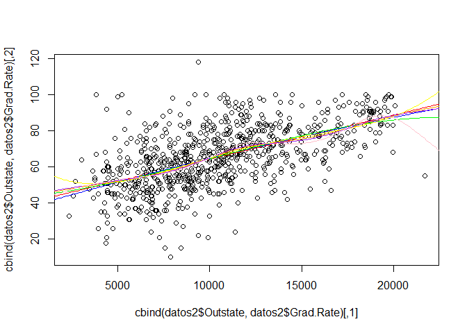

    modc9=gam(Grad.Rate~ Private+Apps+s(Accept)+s(Enroll)+s(Top10perc) + bs(Top25perc ,knots =c(30) )+s(F.Undergrad) + poly(P.Undergrad,2) +Outstate, data = datos2)
    modc9.2=gam(Grad.Rate~ Private+Apps+s(Accept)+s(Enroll)+s(Top10perc) + bs(Top25perc ,knots =c(30) )+s(F.Undergrad) + poly(P.Undergrad,2) +poly(Outstate,2), data = datos2)
    modc9.3=gam(Grad.Rate~ Private+Apps+s(Accept)+s(Enroll)+s(Top10perc) + bs(Top25perc ,knots =c(30) )+s(F.Undergrad) + poly(P.Undergrad,2) +poly(Outstate,3), data = datos2)
    modc9.4=gam(Grad.Rate~ Private+Apps+s(Accept)+s(Enroll)+s(Top10perc) + bs(Top25perc ,knots =c(30) )+s(F.Undergrad) + poly(P.Undergrad,2) +poly(Outstate,4), data = datos2)
    modc9.s=gam(Grad.Rate~ Private+Apps+s(Accept)+s(Enroll)+s(Top10perc) + bs(Top25perc ,knots =c(30) )+s(F.Undergrad) + poly(P.Undergrad,2) +s(Outstate), data = datos2)
    modc9.s5=gam(Grad.Rate~ Private+Apps+s(Accept)+s(Enroll)+s(Top10perc) + bs(Top25perc ,knots =c(30) )+s(F.Undergrad) + poly(P.Undergrad,2) +s(Outstate,5), data = datos2)
    modc9.s10=gam(Grad.Rate~ Private+Apps+s(Accept)+s(Enroll)+s(Top10perc) + bs(Top25perc ,knots =c(30) )+s(F.Undergrad) + poly(P.Undergrad,2) +s(Outstate,10), data = datos2)
    anova(modc8,modc9,modc9.2,modc9.3,modc9.4)

    ## Analysis of Deviance Table
    ## 
    ## Model 1: Grad.Rate ~ Private + Apps + s(Accept) + s(Enroll) + s(Top10perc) + 
    ##     bs(Top25perc, knots = c(30)) + s(F.Undergrad) + poly(P.Undergrad, 
    ##     2)
    ## Model 2: Grad.Rate ~ Private + Apps + s(Accept) + s(Enroll) + s(Top10perc) + 
    ##     bs(Top25perc, knots = c(30)) + s(F.Undergrad) + poly(P.Undergrad, 
    ##     2) + Outstate
    ## Model 3: Grad.Rate ~ Private + Apps + s(Accept) + s(Enroll) + s(Top10perc) + 
    ##     bs(Top25perc, knots = c(30)) + s(F.Undergrad) + poly(P.Undergrad, 
    ##     2) + poly(Outstate, 2)
    ## Model 4: Grad.Rate ~ Private + Apps + s(Accept) + s(Enroll) + s(Top10perc) + 
    ##     bs(Top25perc, knots = c(30)) + s(F.Undergrad) + poly(P.Undergrad, 
    ##     2) + poly(Outstate, 3)
    ## Model 5: Grad.Rate ~ Private + Apps + s(Accept) + s(Enroll) + s(Top10perc) + 
    ##     bs(Top25perc, knots = c(30)) + s(F.Undergrad) + poly(P.Undergrad, 
    ##     2) + poly(Outstate, 4)
    ##   Resid. Df Resid. Dev Df Deviance  Pr(>Chi)    
    ## 1       752     132361                          
    ## 2       751     126046  1   6315.1 5.889e-10 ***
    ## 3       750     124541  1   1504.6  0.002502 ** 
    ## 4       749     124391  1    149.8  0.340132    
    ## 5       748     123148  1   1243.2  0.005997 ** 
    ## ---
    ## Signif. codes:  0 '***' 0.001 '**' 0.01 '*' 0.05 '.' 0.1 ' ' 1

    errores_tab(list(modc9,modc9.2,modc9.3,modc9.4,modc9.s,modc9.s5,modc9.s10))

    ##                                                                     
    ## ecm         162.2208    160.2844    160.0916    158.4916    156.7306
    ## deviance 126045.5725 124540.9909 124391.1827 123147.9958 121779.6523
    ## aic        6213.1506   6205.8199   6206.8847   6201.0802   6192.3982
    ##                                 
    ## ecm         155.9554    154.5705
    ## deviance 121177.3216 120101.2442
    ## aic        6190.5463   6193.6150

En este caso parece suficiente con añadir la regresion simple.

### Variable Room.Board.

    summary(datos2$Room.Board)

    ##    Min. 1st Qu.  Median    Mean 3rd Qu.    Max. 
    ##    1780    3597    4200    4358    5050    8124

    mod10=gam(Grad.Rate~ Room.Board, data = datos2)
    mod10.2=gam(Grad.Rate~ poly(Room.Board,2), data = datos2)
    mod10.3=gam(Grad.Rate~ poly(Room.Board,3), data = datos2)
    mod10.4=gam(Grad.Rate~ poly(Room.Board,4), data = datos2)
    mod10.s=gam(Grad.Rate~ s(Room.Board), data = datos2)
    mod10.s5=gam(Grad.Rate~ s(Room.Board,5), data = datos2)
    mod10.s10=gam(Grad.Rate~ s(Room.Board,10), data = datos2)

    summary(mod10)

    ## 
    ## Call: gam(formula = Grad.Rate ~ Room.Board, data = datos2)
    ## Deviance Residuals:
    ##       Min        1Q    Median        3Q       Max 
    ## -48.88236 -10.18812  -0.03686  10.53795  49.32537 
    ## 
    ## (Dispersion Parameter for gaussian family taken to be 242.1027)
    ## 
    ##     Null Deviance: 228977.2 on 776 degrees of freedom
    ## Residual Deviance: 187629.6 on 775 degrees of freedom
    ## AIC: 6474.262 
    ## 
    ## Number of Local Scoring Iterations: 2 
    ## 
    ## Anova for Parametric Effects
    ##             Df Sum Sq Mean Sq F value    Pr(>F)    
    ## Room.Board   1  41348   41348  170.79 < 2.2e-16 ***
    ## Residuals  775 187630     242                      
    ## ---
    ## Signif. codes:  0 '***' 0.001 '**' 0.01 '*' 0.05 '.' 0.1 ' ' 1

    summary(mod10.2)

    ## 
    ## Call: gam(formula = Grad.Rate ~ poly(Room.Board, 2), data = datos2)
    ## Deviance Residuals:
    ##       Min        1Q    Median        3Q       Max 
    ## -49.29284 -10.39728  -0.05109  10.52053  48.83464 
    ## 
    ## (Dispersion Parameter for gaussian family taken to be 242.0456)
    ## 
    ##     Null Deviance: 228977.2 on 776 degrees of freedom
    ## Residual Deviance: 187343.3 on 774 degrees of freedom
    ## AIC: 6475.076 
    ## 
    ## Number of Local Scoring Iterations: 2 
    ## 
    ## Anova for Parametric Effects
    ##                      Df Sum Sq Mean Sq F value    Pr(>F)    
    ## poly(Room.Board, 2)   2  41634   20817  86.004 < 2.2e-16 ***
    ## Residuals           774 187343     242                      
    ## ---
    ## Signif. codes:  0 '***' 0.001 '**' 0.01 '*' 0.05 '.' 0.1 ' ' 1

    summary(mod10.3)

    ## 
    ## Call: gam(formula = Grad.Rate ~ poly(Room.Board, 3), data = datos2)
    ## Deviance Residuals:
    ##      Min       1Q   Median       3Q      Max 
    ## -49.5325 -10.3325  -0.1302  10.7424  48.4890 
    ## 
    ## (Dispersion Parameter for gaussian family taken to be 241.5988)
    ## 
    ##     Null Deviance: 228977.2 on 776 degrees of freedom
    ## Residual Deviance: 186755.9 on 773 degrees of freedom
    ## AIC: 6474.636 
    ## 
    ## Number of Local Scoring Iterations: 2 
    ## 
    ## Anova for Parametric Effects
    ##                      Df Sum Sq Mean Sq F value    Pr(>F)    
    ## poly(Room.Board, 3)   3  42221 14073.8  58.253 < 2.2e-16 ***
    ## Residuals           773 186756   241.6                      
    ## ---
    ## Signif. codes:  0 '***' 0.001 '**' 0.01 '*' 0.05 '.' 0.1 ' ' 1

    summary(mod10.4)

    ## 
    ## Call: gam(formula = Grad.Rate ~ poly(Room.Board, 4), data = datos2)
    ## Deviance Residuals:
    ##      Min       1Q   Median       3Q      Max 
    ## -49.6114 -10.3289  -0.1666  10.7388  48.2238 
    ## 
    ## (Dispersion Parameter for gaussian family taken to be 241.7999)
    ## 
    ##     Null Deviance: 228977.2 on 776 degrees of freedom
    ## Residual Deviance: 186669.5 on 772 degrees of freedom
    ## AIC: 6476.276 
    ## 
    ## Number of Local Scoring Iterations: 2 
    ## 
    ## Anova for Parametric Effects
    ##                      Df Sum Sq Mean Sq F value    Pr(>F)    
    ## poly(Room.Board, 4)   4  42308 10576.9  43.742 < 2.2e-16 ***
    ## Residuals           772 186670   241.8                      
    ## ---
    ## Signif. codes:  0 '***' 0.001 '**' 0.01 '*' 0.05 '.' 0.1 ' ' 1

    summary(mod10.s)

    ## 
    ## Call: gam(formula = Grad.Rate ~ s(Room.Board), data = datos2)
    ## Deviance Residuals:
    ##      Min       1Q   Median       3Q      Max 
    ## -49.3294 -10.1335  -0.1435  10.6421  48.5192 
    ## 
    ## (Dispersion Parameter for gaussian family taken to be 240.6654)
    ## 
    ##     Null Deviance: 228977.2 on 776 degrees of freedom
    ## Residual Deviance: 185793.7 on 772 degrees of freedom
    ## AIC: 6472.622 
    ## 
    ## Number of Local Scoring Iterations: 2 
    ## 
    ## Anova for Parametric Effects
    ##                Df Sum Sq Mean Sq F value    Pr(>F)    
    ## s(Room.Board)   1  41348   41348  171.81 < 2.2e-16 ***
    ## Residuals     772 185794     241                      
    ## ---
    ## Signif. codes:  0 '***' 0.001 '**' 0.01 '*' 0.05 '.' 0.1 ' ' 1
    ## 
    ## Anova for Nonparametric Effects
    ##               Npar Df Npar F   Pr(F)  
    ## (Intercept)                           
    ## s(Room.Board)       3 2.5428 0.05515 .
    ## ---
    ## Signif. codes:  0 '***' 0.001 '**' 0.01 '*' 0.05 '.' 0.1 ' ' 1

    summary(mod10.s5)

    ## 
    ## Call: gam(formula = Grad.Rate ~ s(Room.Board, 5), data = datos2)
    ## Deviance Residuals:
    ##      Min       1Q   Median       3Q      Max 
    ## -49.5724  -9.8545  -0.2271  10.5915  48.6408 
    ## 
    ## (Dispersion Parameter for gaussian family taken to be 240.0915)
    ## 
    ##     Null Deviance: 228977.2 on 776 degrees of freedom
    ## Residual Deviance: 185110.5 on 770.9997 degrees of freedom
    ## AIC: 6471.76 
    ## 
    ## Number of Local Scoring Iterations: 2 
    ## 
    ## Anova for Parametric Effects
    ##                   Df Sum Sq Mean Sq F value    Pr(>F)    
    ## s(Room.Board, 5)   1  41348   41348  172.22 < 2.2e-16 ***
    ## Residuals        771 185110     240                      
    ## ---
    ## Signif. codes:  0 '***' 0.001 '**' 0.01 '*' 0.05 '.' 0.1 ' ' 1
    ## 
    ## Anova for Nonparametric Effects
    ##                  Npar Df Npar F   Pr(F)  
    ## (Intercept)                              
    ## s(Room.Board, 5)       4 2.6229 0.03371 *
    ## ---
    ## Signif. codes:  0 '***' 0.001 '**' 0.01 '*' 0.05 '.' 0.1 ' ' 1

    summary(mod10.s10)

    ## 
    ## Call: gam(formula = Grad.Rate ~ s(Room.Board, 10), data = datos2)
    ## Deviance Residuals:
    ##      Min       1Q   Median       3Q      Max 
    ## -50.2490 -10.0184  -0.1558  10.5722  49.5482 
    ## 
    ## (Dispersion Parameter for gaussian family taken to be 238.7661)
    ## 
    ##     Null Deviance: 228977.2 on 776 degrees of freedom
    ## Residual Deviance: 182894.9 on 766.0005 degrees of freedom
    ## AIC: 6472.403 
    ## 
    ## Number of Local Scoring Iterations: 2 
    ## 
    ## Anova for Parametric Effects
    ##                    Df Sum Sq Mean Sq F value    Pr(>F)    
    ## s(Room.Board, 10)   1  41348   41348  173.17 < 2.2e-16 ***
    ## Residuals         766 182895     239                      
    ## ---
    ## Signif. codes:  0 '***' 0.001 '**' 0.01 '*' 0.05 '.' 0.1 ' ' 1
    ## 
    ## Anova for Nonparametric Effects
    ##                   Npar Df Npar F   Pr(F)  
    ## (Intercept)                               
    ## s(Room.Board, 10)       9 2.2034 0.02008 *
    ## ---
    ## Signif. codes:  0 '***' 0.001 '**' 0.01 '*' 0.05 '.' 0.1 ' ' 1

    anova(mod10,mod10.2,mod10.3,mod10.4)

    ## Analysis of Deviance Table
    ## 
    ## Model 1: Grad.Rate ~ Room.Board
    ## Model 2: Grad.Rate ~ poly(Room.Board, 2)
    ## Model 3: Grad.Rate ~ poly(Room.Board, 3)
    ## Model 4: Grad.Rate ~ poly(Room.Board, 4)
    ##   Resid. Df Resid. Dev Df Deviance Pr(>Chi)
    ## 1       775     187630                     
    ## 2       774     187343  1   286.25   0.2766
    ## 3       773     186756  1   587.45   0.1191
    ## 4       772     186670  1    86.37   0.5501

    errores_tab(list(mod10,mod10.2,mod10.3,mod10.4,mod10.s,mod10.s5,mod10.s10))

    ##                                                                     
    ## ecm         241.4795    241.1111    240.3551    240.2439    239.1167
    ## deviance 187629.5741 187343.3246 186755.8794 186669.5082 185793.6728
    ## aic        6474.2621   6475.0758   6474.6356   6476.2761   6472.6220
    ##                                
    ## ecm         238.2374    235.386
    ## deviance 185110.4588 182894.941
    ## aic        6471.7600   6472.403

    plot(cbind(datos2$Room.Board,datos2$Grad.Rate))
    datos_falsos=data.frame(Room.Board=seq(0, 9000, 10))
    lines(cbind(datos_falsos$Room.Board,predict(mod10,newdata = datos_falsos)), col='red')
    lines(cbind(datos_falsos$Room.Board,predict(mod10.2,newdata = datos_falsos)), col='blue')
    lines(cbind(datos_falsos$Room.Board,predict(mod10.3,newdata = datos_falsos)), col='green')
    lines(cbind(datos_falsos$Room.Board,predict(mod10.4,newdata = datos_falsos)), col='yellow')
    lines(cbind(datos_falsos$Room.Board,predict(mod10.s,newdata = datos_falsos)), col='orange')
    lines(cbind(datos_falsos$Room.Board,predict(mod10.s5,newdata = datos_falsos)), col='purple')
    lines(cbind(datos_falsos$Room.Board,predict(mod10.s10,newdata = datos_falsos)), col='pink')

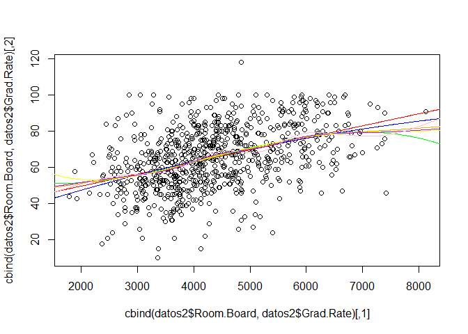

    modc10=gam(Grad.Rate~ Private+Apps+s(Accept)+s(Enroll)+s(Top10perc) + bs(Top25perc ,knots =c(30) )+s(F.Undergrad) + poly(P.Undergrad,2) +Outstate +Room.Board, data = datos2)
    modc10.2=gam(Grad.Rate~ Private+Apps+s(Accept)+s(Enroll)+s(Top10perc) + bs(Top25perc ,knots =c(30) )+s(F.Undergrad) + poly(P.Undergrad,2) +Outstate + poly(Room.Board,2), data = datos2)
    modc10.3=gam(Grad.Rate~ Private+Apps+s(Accept)+s(Enroll)+s(Top10perc) + bs(Top25perc ,knots =c(30) )+s(F.Undergrad) + poly(P.Undergrad,2) +Outstate +poly(Room.Board,3), data = datos2)
    modc10.4=gam(Grad.Rate~ Private+Apps+s(Accept)+s(Enroll)+s(Top10perc) + bs(Top25perc ,knots =c(30) )+s(F.Undergrad) + poly(P.Undergrad,2) +Outstate +poly(Room.Board,4), data = datos2)
    modc10.s=gam(Grad.Rate~ Private+Apps+s(Accept)+s(Enroll)+s(Top10perc) + bs(Top25perc ,knots =c(30) )+s(F.Undergrad) + poly(P.Undergrad,2) +Outstate +s(Room.Board), data = datos2)
    modc10.s5=gam(Grad.Rate~ Private+Apps+s(Accept)+s(Enroll)+s(Top10perc) + bs(Top25perc ,knots =c(30) )+s(F.Undergrad) + poly(P.Undergrad,2) +Outstate + s(Room.Board,5), data = datos2)
    modc10.s10=gam(Grad.Rate~ Private+Apps+s(Accept)+s(Enroll)+s(Top10perc) + bs(Top25perc ,knots =c(30) )+s(F.Undergrad) + poly(P.Undergrad,2) +Outstate +s(Room.Board,10), data = datos2)
    anova(modc9,modc10,modc10.2,modc10.3,modc10.4)

    ## Analysis of Deviance Table
    ## 
    ## Model 1: Grad.Rate ~ Private + Apps + s(Accept) + s(Enroll) + s(Top10perc) + 
    ##     bs(Top25perc, knots = c(30)) + s(F.Undergrad) + poly(P.Undergrad, 
    ##     2) + Outstate
    ## Model 2: Grad.Rate ~ Private + Apps + s(Accept) + s(Enroll) + s(Top10perc) + 
    ##     bs(Top25perc, knots = c(30)) + s(F.Undergrad) + poly(P.Undergrad, 
    ##     2) + Outstate + Room.Board
    ## Model 3: Grad.Rate ~ Private + Apps + s(Accept) + s(Enroll) + s(Top10perc) + 
    ##     bs(Top25perc, knots = c(30)) + s(F.Undergrad) + poly(P.Undergrad, 
    ##     2) + Outstate + poly(Room.Board, 2)
    ## Model 4: Grad.Rate ~ Private + Apps + s(Accept) + s(Enroll) + s(Top10perc) + 
    ##     bs(Top25perc, knots = c(30)) + s(F.Undergrad) + poly(P.Undergrad, 
    ##     2) + Outstate + poly(Room.Board, 3)
    ## Model 5: Grad.Rate ~ Private + Apps + s(Accept) + s(Enroll) + s(Top10perc) + 
    ##     bs(Top25perc, knots = c(30)) + s(F.Undergrad) + poly(P.Undergrad, 
    ##     2) + Outstate + poly(Room.Board, 4)
    ##   Resid. Df Resid. Dev Df Deviance Pr(>Chi)  
    ## 1       751     126046                       
    ## 2       750     125244  1   802.02  0.02799 *
    ## 3       749     125242  1     1.64  0.92093  
    ## 4       748     124634  1   608.10  0.05570 .
    ## 5       747     124078  1   556.03  0.06730 .
    ## ---
    ## Signif. codes:  0 '***' 0.001 '**' 0.01 '*' 0.05 '.' 0.1 ' ' 1

    errores_tab(list(modc10,modc10.2,modc10.3,modc10.4,modc10.s,modc10.s5,modc10.s10))

    ##                                                                     
    ## ecm         161.1886    161.1865    160.4039    159.6883    158.6044
    ## deviance 125243.5485 125241.9120 124633.8127 124077.7791 123235.6118
    ## aic        6210.1908   6212.1806   6210.3988   6208.9246   6203.6328
    ##                                 
    ## ecm         158.1031    156.6728
    ## deviance 122846.1379 121734.7458
    ## aic        6203.1738   6206.1107

En este caso, todos los modelos dan resultados muy similares. Solo
añadiremos la regresion lineal simple.

### Variable Books.

    summary(datos2$Books)

    ##    Min. 1st Qu.  Median    Mean 3rd Qu.    Max. 
    ##    96.0   470.0   500.0   549.4   600.0  2340.0

    mod11=gam(Grad.Rate~ Books, data = datos2)
    mod11.2=gam(Grad.Rate~ poly(Books,2), data = datos2)
    mod11.3=gam(Grad.Rate~ poly(Books,3), data = datos2)
    mod11.4=gam(Grad.Rate~ poly(Books,4), data = datos2)
    mod11.s=gam(Grad.Rate~ s(Books), data = datos2)
    mod11.s5=gam(Grad.Rate~ s(Books,5), data = datos2)
    mod11.s10=gam(Grad.Rate~ s(Books,10), data = datos2)

    summary(mod11)

    ## 
    ## Call: gam(formula = Grad.Rate ~ Books, data = datos2)
    ## Deviance Residuals:
    ##      Min       1Q   Median       3Q      Max 
    ## -55.4689 -12.4524  -0.4468  12.5366  52.5311 
    ## 
    ## (Dispersion Parameter for gaussian family taken to be 295.4541)
    ## 
    ##     Null Deviance: 228977.2 on 776 degrees of freedom
    ## Residual Deviance: 228976.9 on 775 degrees of freedom
    ## AIC: 6629.003 
    ## 
    ## Number of Local Scoring Iterations: 2 
    ## 
    ## Anova for Parametric Effects
    ##            Df Sum Sq Mean Sq F value Pr(>F)
    ## Books       1      0   0.258   9e-04 0.9764
    ## Residuals 775 228977 295.454

    summary(mod11.2)

    ## 
    ## Call: gam(formula = Grad.Rate ~ poly(Books, 2), data = datos2)
    ## Deviance Residuals:
    ##    Min     1Q Median     3Q    Max 
    ## -55.40 -12.40  -0.36  12.47  52.60 
    ## 
    ## (Dispersion Parameter for gaussian family taken to be 295.8115)
    ## 
    ##     Null Deviance: 228977.2 on 776 degrees of freedom
    ## Residual Deviance: 228958.1 on 774 degrees of freedom
    ## AIC: 6630.939 
    ## 
    ## Number of Local Scoring Iterations: 2 
    ## 
    ## Anova for Parametric Effects
    ##                 Df Sum Sq Mean Sq F value Pr(>F)
    ## poly(Books, 2)   2     19   9.542  0.0323 0.9683
    ## Residuals      774 228958 295.812

    summary(mod11.3)

    ## 
    ## Call: gam(formula = Grad.Rate ~ poly(Books, 3), data = datos2)
    ## Deviance Residuals:
    ##      Min       1Q   Median       3Q      Max 
    ## -55.0811 -12.1202  -0.1542  12.4063  52.9189 
    ## 
    ## (Dispersion Parameter for gaussian family taken to be 295.5414)
    ## 
    ##     Null Deviance: 228977.2 on 776 degrees of freedom
    ## Residual Deviance: 228453.5 on 773 degrees of freedom
    ## AIC: 6631.225 
    ## 
    ## Number of Local Scoring Iterations: 2 
    ## 
    ## Anova for Parametric Effects
    ##                 Df Sum Sq Mean Sq F value Pr(>F)
    ## poly(Books, 3)   3    524  174.57  0.5907 0.6212
    ## Residuals      773 228453  295.54

    summary(mod11.4)

    ## 
    ## Call: gam(formula = Grad.Rate ~ poly(Books, 4), data = datos2)
    ## Deviance Residuals:
    ##        Min         1Q     Median         3Q        Max 
    ## -54.993353 -11.993353   0.006647  12.385045  53.006647 
    ## 
    ## (Dispersion Parameter for gaussian family taken to be 294.998)
    ## 
    ##     Null Deviance: 228977.2 on 776 degrees of freedom
    ## Residual Deviance: 227738.5 on 772 degrees of freedom
    ## AIC: 6630.789 
    ## 
    ## Number of Local Scoring Iterations: 2 
    ## 
    ## Anova for Parametric Effects
    ##                 Df Sum Sq Mean Sq F value Pr(>F)
    ## poly(Books, 4)   4   1239  309.68  1.0498 0.3805
    ## Residuals      772 227738  295.00

    summary(mod11.s)

    ## 
    ## Call: gam(formula = Grad.Rate ~ s(Books), data = datos2)
    ## Deviance Residuals:
    ##       Min        1Q    Median        3Q       Max 
    ## -54.96540 -12.11703  -0.02866  12.07655  53.03460 
    ## 
    ## (Dispersion Parameter for gaussian family taken to be 295.1849)
    ## 
    ##     Null Deviance: 228977.2 on 776 degrees of freedom
    ## Residual Deviance: 227882.8 on 772.0003 degrees of freedom
    ## AIC: 6631.281 
    ## 
    ## Number of Local Scoring Iterations: 2 
    ## 
    ## Anova for Parametric Effects
    ##            Df Sum Sq Mean Sq F value Pr(>F)
    ## s(Books)    1      0   0.258   9e-04 0.9764
    ## Residuals 772 227883 295.185               
    ## 
    ## Anova for Nonparametric Effects
    ##             Npar Df Npar F  Pr(F)
    ## (Intercept)                      
    ## s(Books)          3 1.2357 0.2957

    summary(mod11.s5)

    ## 
    ## Call: gam(formula = Grad.Rate ~ s(Books, 5), data = datos2)
    ## Deviance Residuals:
    ##      Min       1Q   Median       3Q      Max 
    ## -54.8009 -12.0174  -0.2083  12.1991  53.1991 
    ## 
    ## (Dispersion Parameter for gaussian family taken to be 294.706)
    ## 
    ##     Null Deviance: 228977.2 on 776 degrees of freedom
    ## Residual Deviance: 227218.3 on 770.9999 degrees of freedom
    ## AIC: 6631.012 
    ## 
    ## Number of Local Scoring Iterations: 2 
    ## 
    ## Anova for Parametric Effects
    ##              Df Sum Sq Mean Sq F value Pr(>F)
    ## s(Books, 5)   1      0   0.258   9e-04 0.9764
    ## Residuals   771 227218 294.706               
    ## 
    ## Anova for Nonparametric Effects
    ##             Npar Df Npar F  Pr(F)
    ## (Intercept)                      
    ## s(Books, 5)       4 1.4919 0.2027

    summary(mod11.s10)

    ## 
    ## Call: gam(formula = Grad.Rate ~ s(Books, 10), data = datos2)
    ## Deviance Residuals:
    ##      Min       1Q   Median       3Q      Max 
    ## -53.9373 -11.9373  -0.1208  12.2360  54.0627 
    ## 
    ## (Dispersion Parameter for gaussian family taken to be 292.5081)
    ## 
    ##     Null Deviance: 228977.2 on 776 degrees of freedom
    ## Residual Deviance: 224061.1 on 765.9997 degrees of freedom
    ## AIC: 6630.141 
    ## 
    ## Number of Local Scoring Iterations: 2 
    ## 
    ## Anova for Parametric Effects
    ##               Df Sum Sq Mean Sq F value Pr(>F)
    ## s(Books, 10)   1      0   0.258   9e-04 0.9763
    ## Residuals    766 224061 292.508               
    ## 
    ## Anova for Nonparametric Effects
    ##              Npar Df Npar F   Pr(F)  
    ## (Intercept)                          
    ## s(Books, 10)       9 1.8672 0.05364 .
    ## ---
    ## Signif. codes:  0 '***' 0.001 '**' 0.01 '*' 0.05 '.' 0.1 ' ' 1

    anova(mod11,mod11.2,mod11.3,mod11.4)

    ## Analysis of Deviance Table
    ## 
    ## Model 1: Grad.Rate ~ Books
    ## Model 2: Grad.Rate ~ poly(Books, 2)
    ## Model 3: Grad.Rate ~ poly(Books, 3)
    ## Model 4: Grad.Rate ~ poly(Books, 4)
    ##   Resid. Df Resid. Dev Df Deviance Pr(>Chi)
    ## 1       775     228977                     
    ## 2       774     228958  1    18.83   0.8006
    ## 3       773     228453  1   504.63   0.1909
    ## 4       772     227738  1   715.00   0.1195

    errores_tab(list(mod11,mod11.2,mod11.3,mod11.4,mod11.s,mod11.s5,mod11.s10))

    ##                                                                     
    ## ecm         294.6936    294.6694    294.0199    293.0997    293.2855
    ## deviance 228976.9469 228958.1215 228453.4932 227738.4902 227882.8054
    ## aic        6629.0030   6630.9391   6631.2247   6630.7890   6631.2807
    ##                                
    ## ecm         292.4302    288.367
    ## deviance 227218.2664 224061.131
    ## aic        6631.0123   6630.141

Parece que esta variable no es significativa. Mediante un spline
suavizado con df=10, si que podria ser significativa, pero parece que se
debe a un sobreajuste.

    plot(cbind(datos2$Books,datos2$Grad.Rate))
    datos_falsos=data.frame(Books=seq(0, 2500, 10))
    lines(cbind(datos_falsos$Books,predict(mod11,newdata = datos_falsos)), col='red')
    lines(cbind(datos_falsos$Books,predict(mod11.2,newdata = datos_falsos)), col='blue')
    lines(cbind(datos_falsos$Books,predict(mod11.3,newdata = datos_falsos)), col='green')
    lines(cbind(datos_falsos$Books,predict(mod11.4,newdata = datos_falsos)), col='yellow')
    lines(cbind(datos_falsos$Books,predict(mod11.s,newdata = datos_falsos)), col='orange')
    lines(cbind(datos_falsos$Books,predict(mod11.s5,newdata = datos_falsos)), col='purple')
    lines(cbind(datos_falsos$Books,predict(mod11.s10,newdata = datos_falsos)), col='pink')

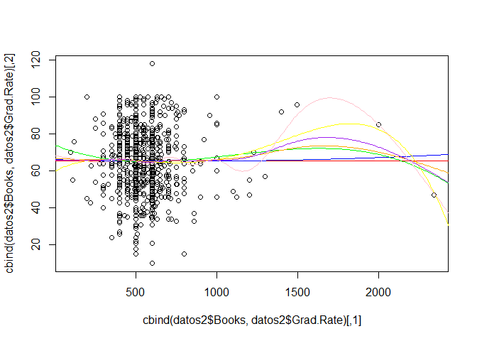

    modc11=gam(Grad.Rate~ Private+Apps+s(Accept)+s(Enroll)+s(Top10perc) + bs(Top25perc ,knots =c(30) )+s(F.Undergrad) + poly(P.Undergrad,2) +Outstate +Room.Board +Books, data = datos2)
    modc11.2=gam(Grad.Rate~ Private+Apps+s(Accept)+s(Enroll)+s(Top10perc) + bs(Top25perc ,knots =c(30) )+s(F.Undergrad) + poly(P.Undergrad,2) +Outstate +Room.Board +poly(Books,2), data = datos2)
    modc11.3=gam(Grad.Rate~ Private+Apps+s(Accept)+s(Enroll)+s(Top10perc) + bs(Top25perc ,knots =c(30) )+s(F.Undergrad) + poly(P.Undergrad,2) +Outstate +Room.Board +poly(Books,3), data = datos2)
    modc11.4=gam(Grad.Rate~ Private+Apps+s(Accept)+s(Enroll)+s(Top10perc) + bs(Top25perc ,knots =c(30) )+s(F.Undergrad) + poly(P.Undergrad,2) +Outstate +Room.Board +poly(Books,4), data = datos2)
    modc11.s=gam(Grad.Rate~ Private+Apps+s(Accept)+s(Enroll)+s(Top10perc) + bs(Top25perc ,knots =c(30) )+s(F.Undergrad) + poly(P.Undergrad,2) +Outstate +Room.Board +s(Books), data = datos2)
    modc11.s5=gam(Grad.Rate~ Private+Apps+s(Accept)+s(Enroll)+s(Top10perc) + bs(Top25perc ,knots =c(30) )+s(F.Undergrad) + poly(P.Undergrad,2) +Outstate +Room.Board +s(Books,5), data = datos2)
    modc11.s10=gam(Grad.Rate~ Private+Apps+s(Accept)+s(Enroll)+s(Top10perc) + bs(Top25perc ,knots =c(30) )+s(F.Undergrad) + poly(P.Undergrad,2) +Outstate +Room.Board +s(Books,10), data = datos2)

    anova(modc10,modc11,modc11.2,modc11.3,modc11.4)

    ## Analysis of Deviance Table
    ## 
    ## Model 1: Grad.Rate ~ Private + Apps + s(Accept) + s(Enroll) + s(Top10perc) + 
    ##     bs(Top25perc, knots = c(30)) + s(F.Undergrad) + poly(P.Undergrad, 
    ##     2) + Outstate + Room.Board
    ## Model 2: Grad.Rate ~ Private + Apps + s(Accept) + s(Enroll) + s(Top10perc) + 
    ##     bs(Top25perc, knots = c(30)) + s(F.Undergrad) + poly(P.Undergrad, 
    ##     2) + Outstate + Room.Board + Books
    ## Model 3: Grad.Rate ~ Private + Apps + s(Accept) + s(Enroll) + s(Top10perc) + 
    ##     bs(Top25perc, knots = c(30)) + s(F.Undergrad) + poly(P.Undergrad, 
    ##     2) + Outstate + Room.Board + poly(Books, 2)
    ## Model 4: Grad.Rate ~ Private + Apps + s(Accept) + s(Enroll) + s(Top10perc) + 
    ##     bs(Top25perc, knots = c(30)) + s(F.Undergrad) + poly(P.Undergrad, 
    ##     2) + Outstate + Room.Board + poly(Books, 3)
    ## Model 5: Grad.Rate ~ Private + Apps + s(Accept) + s(Enroll) + s(Top10perc) + 
    ##     bs(Top25perc, knots = c(30)) + s(F.Undergrad) + poly(P.Undergrad, 
    ##     2) + Outstate + Room.Board + poly(Books, 4)
    ##   Resid. Df Resid. Dev Df Deviance Pr(>Chi)  
    ## 1       750     125244                       
    ## 2       749     124541  1   702.85  0.03952 *
    ## 3       748     124109  1   431.82  0.10659  
    ## 4       747     123709  1   400.07  0.12036  
    ## 5       746     123703  1     6.05  0.84852  
    ## ---
    ## Signif. codes:  0 '***' 0.001 '**' 0.01 '*' 0.05 '.' 0.1 ' ' 1

    errores_tab(list(modc10,modc11,modc11.2,modc11.3,modc11.4,modc11.s,modc11.s5,modc11.s10))

    ##                                                                    
    ## ecm         161.1886    160.284    159.7283    159.2134    159.2056
    ## deviance 125243.5485 124540.701 124108.8808 123708.8142 123702.7642
    ## aic        6210.1908   6207.818   6207.1193   6206.6106   6208.5726
    ##                                             
    ## ecm         158.9556    158.6468    157.1224
    ## deviance 123508.4743 123268.5401 122084.0899
    ## aic        6207.3507   6207.8406   6210.3390

Sorprendentemente, no se descarta (tabla anova) la mejora del modelo al
añadir esta variable. La añadiremos a nuestro modelo, aunque no parezca
relevante (es posible que simplemente añadamos ruido).

### Variable Personal.

    summary(datos2$Personal)

    ##    Min. 1st Qu.  Median    Mean 3rd Qu.    Max. 
    ##     250     850    1200    1341    1700    6800

    mod12=gam(Grad.Rate~ Personal, data = datos2)
    mod12.2=gam(Grad.Rate~ poly(Personal,2), data = datos2)
    mod12.3=gam(Grad.Rate~ poly(Personal,3), data = datos2)
    mod12.4=gam(Grad.Rate~ poly(Personal,4), data = datos2)
    mod12.s=gam(Grad.Rate~ s(Personal), data = datos2)
    mod12.s5=gam(Grad.Rate~ s(Personal,5), data = datos2)
    mod12.s10=gam(Grad.Rate~ s(Personal,10), data = datos2)

    summary(mod12)

    ## 
    ## Call: gam(formula = Grad.Rate ~ Personal, data = datos2)
    ## Deviance Residuals:
    ##      Min       1Q   Median       3Q      Max 
    ## -53.0077 -11.2810  -0.1944  11.1406  54.0759 
    ## 
    ## (Dispersion Parameter for gaussian family taken to be 274.0204)
    ## 
    ##     Null Deviance: 228977.2 on 776 degrees of freedom
    ## Residual Deviance: 212365.8 on 775 degrees of freedom
    ## AIC: 6570.486 
    ## 
    ## Number of Local Scoring Iterations: 2 
    ## 
    ## Anova for Parametric Effects
    ##            Df Sum Sq Mean Sq F value    Pr(>F)    
    ## Personal    1  16611   16611  60.621 2.217e-14 ***
    ## Residuals 775 212366     274                      
    ## ---
    ## Signif. codes:  0 '***' 0.001 '**' 0.01 '*' 0.05 '.' 0.1 ' ' 1

    summary(mod12.2)

    ## 
    ## Call: gam(formula = Grad.Rate ~ poly(Personal, 2), data = datos2)
    ## Deviance Residuals:
    ##       Min        1Q    Median        3Q       Max 
    ## -51.86979 -10.86027   0.07738  11.01868  47.48494 
    ## 
    ## (Dispersion Parameter for gaussian family taken to be 271.4582)
    ## 
    ##     Null Deviance: 228977.2 on 776 degrees of freedom
    ## Residual Deviance: 210108.6 on 774 degrees of freedom
    ## AIC: 6564.184 
    ## 
    ## Number of Local Scoring Iterations: 2 
    ## 
    ## Anova for Parametric Effects
    ##                    Df Sum Sq Mean Sq F value    Pr(>F)    
    ## poly(Personal, 2)   2  18869  9434.3  34.754 3.517e-15 ***
    ## Residuals         774 210109   271.5                      
    ## ---
    ## Signif. codes:  0 '***' 0.001 '**' 0.01 '*' 0.05 '.' 0.1 ' ' 1

    summary(mod12.3)

    ## 
    ## Call: gam(formula = Grad.Rate ~ poly(Personal, 3), data = datos2)
    ## Deviance Residuals:
    ##      Min       1Q   Median       3Q      Max 
    ## -52.2849 -10.9531   0.0421  10.8999  50.8510 
    ## 
    ## (Dispersion Parameter for gaussian family taken to be 271.2206)
    ## 
    ##     Null Deviance: 228977.2 on 776 degrees of freedom
    ## Residual Deviance: 209653.5 on 773 degrees of freedom
    ## AIC: 6564.499 
    ## 
    ## Number of Local Scoring Iterations: 2 
    ## 
    ## Anova for Parametric Effects
    ##                    Df Sum Sq Mean Sq F value    Pr(>F)    
    ## poly(Personal, 3)   3  19324  6441.2  23.749 1.039e-14 ***
    ## Residuals         773 209653   271.2                      
    ## ---
    ## Signif. codes:  0 '***' 0.001 '**' 0.01 '*' 0.05 '.' 0.1 ' ' 1

    summary(mod12.4)

    ## 
    ## Call: gam(formula = Grad.Rate ~ poly(Personal, 4), data = datos2)
    ## Deviance Residuals:
    ##     Min      1Q  Median      3Q     Max 
    ## -52.010 -11.242   0.164  10.991  47.434 
    ## 
    ## (Dispersion Parameter for gaussian family taken to be 269.7271)
    ## 
    ##     Null Deviance: 228977.2 on 776 degrees of freedom
    ## Residual Deviance: 208229.3 on 772 degrees of freedom
    ## AIC: 6561.202 
    ## 
    ## Number of Local Scoring Iterations: 2 
    ## 
    ## Anova for Parametric Effects
    ##                    Df Sum Sq Mean Sq F value    Pr(>F)    
    ## poly(Personal, 4)   4  20748  5187.0   19.23 4.299e-15 ***
    ## Residuals         772 208229   269.7                      
    ## ---
    ## Signif. codes:  0 '***' 0.001 '**' 0.01 '*' 0.05 '.' 0.1 ' ' 1

    summary(mod12.s)

    ## 
    ## Call: gam(formula = Grad.Rate ~ s(Personal), data = datos2)
    ## Deviance Residuals:
    ##       Min        1Q    Median        3Q       Max 
    ## -51.68559 -11.00795   0.05088  11.03790  47.05088 
    ## 
    ## (Dispersion Parameter for gaussian family taken to be 269.1528)
    ## 
    ##     Null Deviance: 228977.2 on 776 degrees of freedom
    ## Residual Deviance: 207786 on 772 degrees of freedom
    ## AIC: 6559.546 
    ## 
    ## Number of Local Scoring Iterations: 2 
    ## 
    ## Anova for Parametric Effects
    ##              Df Sum Sq Mean Sq F value    Pr(>F)    
    ## s(Personal)   1  16611 16611.4  61.717 1.329e-14 ***
    ## Residuals   772 207786   269.2                      
    ## ---
    ## Signif. codes:  0 '***' 0.001 '**' 0.01 '*' 0.05 '.' 0.1 ' ' 1
    ## 
    ## Anova for Nonparametric Effects
    ##             Npar Df Npar F     Pr(F)    
    ## (Intercept)                             
    ## s(Personal)       3 5.6718 0.0007618 ***
    ## ---
    ## Signif. codes:  0 '***' 0.001 '**' 0.01 '*' 0.05 '.' 0.1 ' ' 1

    summary(mod12.s5)

    ## 
    ## Call: gam(formula = Grad.Rate ~ s(Personal, 5), data = datos2)
    ## Deviance Residuals:
    ##       Min        1Q    Median        3Q       Max 
    ## -51.38331 -11.10099  -0.02722  11.06192  47.52970 
    ## 
    ## (Dispersion Parameter for gaussian family taken to be 268.8843)
    ## 
    ##     Null Deviance: 228977.2 on 776 degrees of freedom
    ## Residual Deviance: 207309.8 on 771.0003 degrees of freedom
    ## AIC: 6559.763 
    ## 
    ## Number of Local Scoring Iterations: 2 
    ## 
    ## Anova for Parametric Effects
    ##                 Df Sum Sq Mean Sq F value    Pr(>F)    
    ## s(Personal, 5)   1  16611 16611.4  61.779 1.293e-14 ***
    ## Residuals      771 207310   268.9                      
    ## ---
    ## Signif. codes:  0 '***' 0.001 '**' 0.01 '*' 0.05 '.' 0.1 ' ' 1
    ## 
    ## Anova for Nonparametric Effects
    ##                Npar Df Npar F     Pr(F)    
    ## (Intercept)                                
    ## s(Personal, 5)       4 4.7012 0.0009407 ***
    ## ---
    ## Signif. codes:  0 '***' 0.001 '**' 0.01 '*' 0.05 '.' 0.1 ' ' 1

    summary(mod12.s10)

    ## 
    ## Call: gam(formula = Grad.Rate ~ s(Personal, 10), data = datos2)
    ## Deviance Residuals:
    ##     Min      1Q  Median      3Q     Max 
    ## -50.628 -11.344   0.278  11.218  48.359 
    ## 
    ## (Dispersion Parameter for gaussian family taken to be 267.9943)
    ## 
    ##     Null Deviance: 228977.2 on 776 degrees of freedom
    ## Residual Deviance: 205283.5 on 765.9996 degrees of freedom
    ## AIC: 6562.133 
    ## 
    ## Number of Local Scoring Iterations: 2 
    ## 
    ## Anova for Parametric Effects
    ##                  Df Sum Sq Mean Sq F value    Pr(>F)    
    ## s(Personal, 10)   1  16611   16611  61.984 1.183e-14 ***
    ## Residuals       766 205284     268                      
    ## ---
    ## Signif. codes:  0 '***' 0.001 '**' 0.01 '*' 0.05 '.' 0.1 ' ' 1
    ## 
    ## Anova for Nonparametric Effects
    ##                 Npar Df Npar F    Pr(F)   
    ## (Intercept)                               
    ## s(Personal, 10)       9 2.9362 0.001968 **
    ## ---
    ## Signif. codes:  0 '***' 0.001 '**' 0.01 '*' 0.05 '.' 0.1 ' ' 1

    anova(mod12,mod12.2,mod12.3,mod12.4)

    ## Analysis of Deviance Table
    ## 
    ## Model 1: Grad.Rate ~ Personal
    ## Model 2: Grad.Rate ~ poly(Personal, 2)
    ## Model 3: Grad.Rate ~ poly(Personal, 3)
    ## Model 4: Grad.Rate ~ poly(Personal, 4)
    ##   Resid. Df Resid. Dev Df Deviance Pr(>Chi)   
    ## 1       775     212366                        
    ## 2       774     210109  1  2257.14 0.003818 **
    ## 3       773     209653  1   455.16 0.193935   
    ## 4       772     208229  1  1424.18 0.021571 * 
    ## ---
    ## Signif. codes:  0 '***' 0.001 '**' 0.01 '*' 0.05 '.' 0.1 ' ' 1

    errores_tab(list(mod12,mod12.2,mod12.3,mod12.4,mod12.s,mod12.s5,mod12.s10))

    ##                                                                    
    ## ecm         273.315    270.4101    269.8243    267.9914    267.4208
    ## deviance 212365.785 210108.6429 209653.4863 208229.3039 207785.9772
    ## aic        6570.486   6564.1836   6564.4986   6561.2024   6559.5464
    ##                                
    ## ecm         266.808    264.2002
    ## deviance 207309.844 205283.5333
    ## aic        6559.763   6562.1326

    plot(cbind(datos2$Personal,datos2$Grad.Rate))
    datos_falsos=data.frame(Personal=seq(0, 7000, 10))
    lines(cbind(datos_falsos$Personal,predict(mod12,newdata = datos_falsos)), col='red')
    lines(cbind(datos_falsos$Personal,predict(mod12.2,newdata = datos_falsos)), col='blue')
    lines(cbind(datos_falsos$Personal,predict(mod12.3,newdata = datos_falsos)), col='green')
    lines(cbind(datos_falsos$Personal,predict(mod12.4,newdata = datos_falsos)), col='yellow')
    lines(cbind(datos_falsos$Personal,predict(mod12.s,newdata = datos_falsos)), col='orange')
    lines(cbind(datos_falsos$Personal,predict(mod12.s5,newdata = datos_falsos)), col='purple')
    lines(cbind(datos_falsos$Personal,predict(mod12.s10,newdata = datos_falsos)), col='pink')

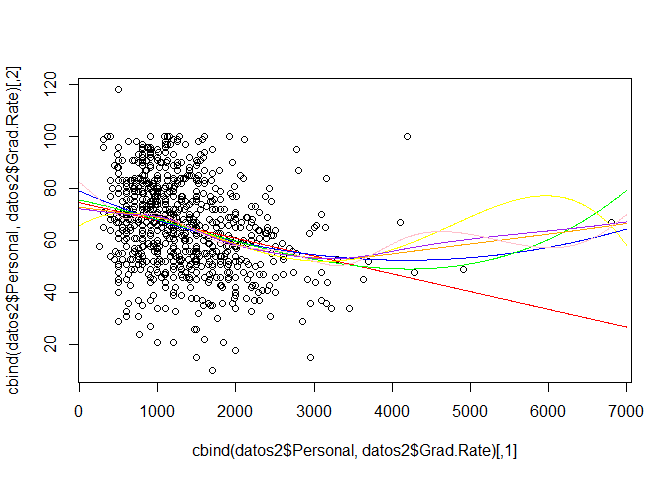

    modc12=gam(Grad.Rate~ Private+Apps+s(Accept)+s(Enroll)+s(Top10perc) + bs(Top25perc ,knots =c(30) )+s(F.Undergrad) + poly(P.Undergrad,2) +Outstate +Room.Board +Books+Personal, data = datos2)
    modc12.2=gam(Grad.Rate~ Private+Apps+s(Accept)+s(Enroll)+s(Top10perc) + bs(Top25perc ,knots =c(30) )+s(F.Undergrad) + poly(P.Undergrad,2) +Outstate +Room.Board +Books+poly(Personal,2), data = datos2)
    modc12.3=gam(Grad.Rate~ Private+Apps+s(Accept)+s(Enroll)+s(Top10perc) + bs(Top25perc ,knots =c(30) )+s(F.Undergrad) + poly(P.Undergrad,2) +Outstate +Room.Board +Books+poly(Personal,3), data = datos2)
    modc12.4=gam(Grad.Rate~ Private+Apps+s(Accept)+s(Enroll)+s(Top10perc) + bs(Top25perc ,knots =c(30) )+s(F.Undergrad) + poly(P.Undergrad,2) +Outstate +Room.Board +Books+poly(Personal,4), data = datos2)
    modc12.s=gam(Grad.Rate~ Private+Apps+s(Accept)+s(Enroll)+s(Top10perc) + bs(Top25perc ,knots =c(30) )+s(F.Undergrad) + poly(P.Undergrad,2) +Outstate +Room.Board +Books+s(Personal), data = datos2)
    modc12.s5=gam(Grad.Rate~ Private+Apps+s(Accept)+s(Enroll)+s(Top10perc) + bs(Top25perc ,knots =c(30) )+s(F.Undergrad) + poly(P.Undergrad,2) +Outstate +Room.Board +Books+s(Personal,5), data = datos2)
    modc12.s10=gam(Grad.Rate~ Private+Apps+s(Accept)+s(Enroll)+s(Top10perc) + bs(Top25perc ,knots =c(30) )+s(F.Undergrad) + poly(P.Undergrad,2) +Outstate +Room.Board +Books+s(Personal,10), data = datos2)

    anova(modc11,modc12,modc12.2,modc12.3,modc12.4)

    ## Analysis of Deviance Table
    ## 
    ## Model 1: Grad.Rate ~ Private + Apps + s(Accept) + s(Enroll) + s(Top10perc) + 
    ##     bs(Top25perc, knots = c(30)) + s(F.Undergrad) + poly(P.Undergrad, 
    ##     2) + Outstate + Room.Board + Books
    ## Model 2: Grad.Rate ~ Private + Apps + s(Accept) + s(Enroll) + s(Top10perc) + 
    ##     bs(Top25perc, knots = c(30)) + s(F.Undergrad) + poly(P.Undergrad, 
    ##     2) + Outstate + Room.Board + Books + Personal
    ## Model 3: Grad.Rate ~ Private + Apps + s(Accept) + s(Enroll) + s(Top10perc) + 
    ##     bs(Top25perc, knots = c(30)) + s(F.Undergrad) + poly(P.Undergrad, 
    ##     2) + Outstate + Room.Board + Books + poly(Personal, 2)
    ## Model 4: Grad.Rate ~ Private + Apps + s(Accept) + s(Enroll) + s(Top10perc) + 
    ##     bs(Top25perc, knots = c(30)) + s(F.Undergrad) + poly(P.Undergrad, 
    ##     2) + Outstate + Room.Board + Books + poly(Personal, 3)
    ## Model 5: Grad.Rate ~ Private + Apps + s(Accept) + s(Enroll) + s(Top10perc) + 
    ##     bs(Top25perc, knots = c(30)) + s(F.Undergrad) + poly(P.Undergrad, 
    ##     2) + Outstate + Room.Board + Books + poly(Personal, 4)
    ##   Resid. Df Resid. Dev Df Deviance Pr(>Chi)   
    ## 1       749     124541                        
    ## 2       748     123018  1  1522.64 0.002287 **
    ## 3       747     122638  1   380.34 0.127394   
    ## 4       746     122637  1     0.96 0.938901   
    ## 5       745     121928  1   708.79 0.037428 * 
    ## ---
    ## Signif. codes:  0 '***' 0.001 '**' 0.01 '*' 0.05 '.' 0.1 ' ' 1

    errores_tab(list(modc11,modc12,modc12.2,modc12.3,modc12.4,modc12.s,modc12.s5,modc12.s10))

    ##                                                                    
    ## ecm         160.284    158.3244    157.8349    157.8337    156.9214
    ## deviance 124540.701 123018.0589 122637.7141 122636.7525 121927.9583
    ## aic        6207.818   6200.2599   6199.8539   6201.8478   6199.3440
    ##                                             
    ## ecm         156.6646    156.3639    155.0811
    ## deviance 121728.3683 121494.7667 120497.9928
    ## aic        6198.0711   6198.5780   6202.1783

Vistos los aic, usaremos splines suavizados.

    modc12=modc12.s

### Variable PhD.

    summary(datos2$PhD)

    ##    Min. 1st Qu.  Median    Mean 3rd Qu.    Max. 
    ##    8.00   62.00   75.00   72.66   85.00  103.00

    mod13=gam(Grad.Rate~ PhD, data = datos2)
    mod13.2=gam(Grad.Rate~ poly(PhD,2), data = datos2)
    mod13.3=gam(Grad.Rate~ poly(PhD,3), data = datos2)
    mod13.4=gam(Grad.Rate~ poly(PhD,4), data = datos2)
    mod13.s=gam(Grad.Rate~ s(PhD), data = datos2)
    mod13.s5=gam(Grad.Rate~ s(PhD,5), data = datos2)
    mod13.s10=gam(Grad.Rate~ s(PhD,10), data = datos2)

    summary(mod13)

    ## 
    ## Call: gam(formula = Grad.Rate ~ PhD, data = datos2)
    ## Deviance Residuals:
    ##      Min       1Q   Median       3Q      Max 
    ## -53.0051 -11.2142   0.3904  11.4276  68.7940 
    ## 
    ## (Dispersion Parameter for gaussian family taken to be 267.963)
    ## 
    ##     Null Deviance: 228977.2 on 776 degrees of freedom
    ## Residual Deviance: 207671.3 on 775 degrees of freedom
    ## AIC: 6553.118 
    ## 
    ## Number of Local Scoring Iterations: 2 
    ## 
    ## Anova for Parametric Effects
    ##            Df Sum Sq Mean Sq F value    Pr(>F)    
    ## PhD         1  21306   21306  79.511 < 2.2e-16 ***
    ## Residuals 775 207671     268                      
    ## ---
    ## Signif. codes:  0 '***' 0.001 '**' 0.01 '*' 0.05 '.' 0.1 ' ' 1

    summary(mod13.2)

    ## 
    ## Call: gam(formula = Grad.Rate ~ poly(PhD, 2), data = datos2)
    ## Deviance Residuals:
    ##      Min       1Q   Median       3Q      Max 
    ## -51.3113 -10.9769  -0.1258  11.5692  59.4914 
    ## 
    ## (Dispersion Parameter for gaussian family taken to be 263.9495)
    ## 
    ##     Null Deviance: 228977.2 on 776 degrees of freedom
    ## Residual Deviance: 204296.9 on 774 degrees of freedom
    ## AIC: 6542.389 
    ## 
    ## Number of Local Scoring Iterations: 2 
    ## 
    ## Anova for Parametric Effects
    ##               Df Sum Sq Mean Sq F value    Pr(>F)    
    ## poly(PhD, 2)   2  24680 12340.1  46.752 < 2.2e-16 ***
    ## Residuals    774 204297   263.9                      
    ## ---
    ## Signif. codes:  0 '***' 0.001 '**' 0.01 '*' 0.05 '.' 0.1 ' ' 1

    summary(mod13.3)

    ## 
    ## Call: gam(formula = Grad.Rate ~ poly(PhD, 3), data = datos2)
    ## Deviance Residuals:
    ##      Min       1Q   Median       3Q      Max 
    ## -51.2246 -10.8360  -0.2028  11.5579  61.5506 
    ## 
    ## (Dispersion Parameter for gaussian family taken to be 263.132)
    ## 
    ##     Null Deviance: 228977.2 on 776 degrees of freedom
    ## Residual Deviance: 203401 on 773 degrees of freedom
    ## AIC: 6540.974 
    ## 
    ## Number of Local Scoring Iterations: 2 
    ## 
    ## Anova for Parametric Effects
    ##               Df Sum Sq Mean Sq F value    Pr(>F)    
    ## poly(PhD, 3)   3  25576  8525.4    32.4 < 2.2e-16 ***
    ## Residuals    773 203401   263.1                      
    ## ---
    ## Signif. codes:  0 '***' 0.001 '**' 0.01 '*' 0.05 '.' 0.1 ' ' 1

    summary(mod13.4)

    ## 
    ## Call: gam(formula = Grad.Rate ~ poly(PhD, 4), data = datos2)
    ## Deviance Residuals:
    ##       Min        1Q    Median        3Q       Max 
    ## -51.75278 -11.09398  -0.09443  11.60624  63.16515 
    ## 
    ## (Dispersion Parameter for gaussian family taken to be 263.0987)
    ## 
    ##     Null Deviance: 228977.2 on 776 degrees of freedom
    ## Residual Deviance: 203112.2 on 772 degrees of freedom
    ## AIC: 6541.87 
    ## 
    ## Number of Local Scoring Iterations: 2 
    ## 
    ## Anova for Parametric Effects
    ##               Df Sum Sq Mean Sq F value    Pr(>F)    
    ## poly(PhD, 4)   4  25865  6466.3  24.577 < 2.2e-16 ***
    ## Residuals    772 203112   263.1                      
    ## ---
    ## Signif. codes:  0 '***' 0.001 '**' 0.01 '*' 0.05 '.' 0.1 ' ' 1

    summary(mod13.s)

    ## 
    ## Call: gam(formula = Grad.Rate ~ s(PhD), data = datos2)
    ## Deviance Residuals:
    ##      Min       1Q   Median       3Q      Max 
    ## -51.7759 -10.9882  -0.0337  11.3922  62.5570 
    ## 
    ## (Dispersion Parameter for gaussian family taken to be 262.4404)
    ## 
    ##     Null Deviance: 228977.2 on 776 degrees of freedom
    ## Residual Deviance: 202604 on 772.0001 degrees of freedom
    ## AIC: 6539.923 
    ## 
    ## Number of Local Scoring Iterations: 2 
    ## 
    ## Anova for Parametric Effects
    ##            Df Sum Sq Mean Sq F value    Pr(>F)    
    ## s(PhD)      1  21306 21305.9  81.184 < 2.2e-16 ***
    ## Residuals 772 202604   262.4                      
    ## ---
    ## Signif. codes:  0 '***' 0.001 '**' 0.01 '*' 0.05 '.' 0.1 ' ' 1
    ## 
    ## Anova for Nonparametric Effects
    ##             Npar Df Npar F     Pr(F)    
    ## (Intercept)                             
    ## s(PhD)            3 6.4363 0.0002628 ***
    ## ---
    ## Signif. codes:  0 '***' 0.001 '**' 0.01 '*' 0.05 '.' 0.1 ' ' 1

    summary(mod13.s5)

    ## 
    ## Call: gam(formula = Grad.Rate ~ s(PhD, 5), data = datos2)
    ## Deviance Residuals:
    ##       Min        1Q    Median        3Q       Max 
    ## -51.92652 -10.91763  -0.09721  11.51676  62.37659 
    ## 
    ## (Dispersion Parameter for gaussian family taken to be 262.39)
    ## 
    ##     Null Deviance: 228977.2 on 776 degrees of freedom
    ## Residual Deviance: 202302.7 on 771 degrees of freedom
    ## AIC: 6540.767 
    ## 
    ## Number of Local Scoring Iterations: 2 
    ## 
    ## Anova for Parametric Effects
    ##            Df Sum Sq Mean Sq F value    Pr(>F)    
    ## s(PhD, 5)   1  21306 21305.9  81.199 < 2.2e-16 ***
    ## Residuals 771 202303   262.4                      
    ## ---
    ## Signif. codes:  0 '***' 0.001 '**' 0.01 '*' 0.05 '.' 0.1 ' ' 1
    ## 
    ## Anova for Nonparametric Effects
    ##             Npar Df Npar F     Pr(F)    
    ## (Intercept)                             
    ## s(PhD, 5)         4 5.1151 0.0004519 ***
    ## ---
    ## Signif. codes:  0 '***' 0.001 '**' 0.01 '*' 0.05 '.' 0.1 ' ' 1

    summary(mod13.s10)

    ## 
    ## Call: gam(formula = Grad.Rate ~ s(PhD, 10), data = datos2)
    ## Deviance Residuals:
    ##      Min       1Q   Median       3Q      Max 
    ## -52.3646 -10.9363  -0.3074  11.3619  58.3143 
    ## 
    ## (Dispersion Parameter for gaussian family taken to be 261.6874)
    ## 
    ##     Null Deviance: 228977.2 on 776 degrees of freedom
    ## Residual Deviance: 200452.4 on 765.9995 degrees of freedom
    ## AIC: 6543.628 
    ## 
    ## Number of Local Scoring Iterations: 2 
    ## 
    ## Anova for Parametric Effects
    ##             Df Sum Sq Mean Sq F value    Pr(>F)    
    ## s(PhD, 10)   1  21306 21305.9  81.417 < 2.2e-16 ***
    ## Residuals  766 200452   261.7                      
    ## ---
    ## Signif. codes:  0 '***' 0.001 '**' 0.01 '*' 0.05 '.' 0.1 ' ' 1
    ## 
    ## Anova for Nonparametric Effects
    ##             Npar Df Npar F    Pr(F)   
    ## (Intercept)                           
    ## s(PhD, 10)        9 3.0649 0.001285 **
    ## ---
    ## Signif. codes:  0 '***' 0.001 '**' 0.01 '*' 0.05 '.' 0.1 ' ' 1

    anova(mod13,mod13.2,mod13.3,mod13.4)

    ## Analysis of Deviance Table
    ## 
    ## Model 1: Grad.Rate ~ PhD
    ## Model 2: Grad.Rate ~ poly(PhD, 2)
    ## Model 3: Grad.Rate ~ poly(PhD, 3)
    ## Model 4: Grad.Rate ~ poly(PhD, 4)
    ##   Resid. Df Resid. Dev Df Deviance  Pr(>Chi)    
    ## 1       775     207671                          
    ## 2       774     204297  1   3374.4 0.0003419 ***
    ## 3       773     203401  1    895.9 0.0649941 .  
    ## 4       772     203112  1    288.8 0.2947495    
    ## ---
    ## Signif. codes:  0 '***' 0.001 '**' 0.01 '*' 0.05 '.' 0.1 ' ' 1

    errores_tab(list(mod12,mod13.2,mod13.3,mod13.4,mod13.s,mod13.s5,mod13.s10))

    ##                                                                    
    ## ecm         273.315    262.9304    261.7774    261.4057    260.7516
    ## deviance 212365.785 204296.9136 203401.0291 203112.1994 202603.9961
    ## aic        6570.486   6542.3885   6540.9737   6541.8696   6539.9229
    ##                                 
    ## ecm         260.3638    257.9825
    ## deviance 202302.6943 200452.3901
    ## aic        6540.7667   6543.6283

    plot(cbind(datos2$PhD,datos2$Grad.Rate))
    datos_falsos=data.frame(PhD=seq(0, 105, 1))
    lines(cbind(datos_falsos$PhD,predict(mod13,newdata = datos_falsos)), col='red')
    lines(cbind(datos_falsos$PhD,predict(mod13.2,newdata = datos_falsos)), col='blue')
    lines(cbind(datos_falsos$PhD,predict(mod13.3,newdata = datos_falsos)), col='green')
    lines(cbind(datos_falsos$PhD,predict(mod13.4,newdata = datos_falsos)), col='yellow')
    lines(cbind(datos_falsos$PhD,predict(mod13.s,newdata = datos_falsos)), col='orange')
    lines(cbind(datos_falsos$PhD,predict(mod13.s5,newdata = datos_falsos)), col='purple')
    lines(cbind(datos_falsos$PhD,predict(mod13.s10,newdata = datos_falsos)), col='pink')

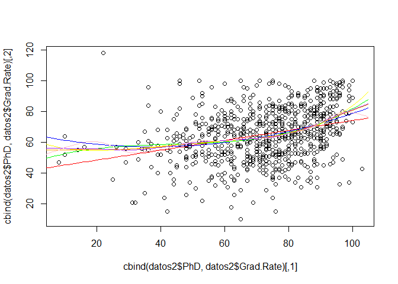

    modc13=gam(Grad.Rate~ Private+Apps+s(Accept)+s(Enroll)+s(Top10perc) + bs(Top25perc ,knots =c(30) )+s(F.Undergrad) + poly(P.Undergrad,2) +Outstate +Room.Board +Books+s(Personal)+PhD, data = datos2)
    modc13.2=gam(Grad.Rate~ Private+Apps+s(Accept)+s(Enroll)+s(Top10perc) + bs(Top25perc ,knots =c(30) )+s(F.Undergrad) + poly(P.Undergrad,2) +Outstate +Room.Board +Books+s(Personal)+poly(PhD,2), data = datos2)
    modc13.3=gam(Grad.Rate~ Private+Apps+s(Accept)+s(Enroll)+s(Top10perc) + bs(Top25perc ,knots =c(30) )+s(F.Undergrad) + poly(P.Undergrad,2) +Outstate +Room.Board +Books+s(Personal)+poly(PhD,3), data = datos2)
    modc13.4=gam(Grad.Rate~ Private+Apps+s(Accept)+s(Enroll)+s(Top10perc) + bs(Top25perc ,knots =c(30) )+s(F.Undergrad) + poly(P.Undergrad,2) +Outstate +Room.Board +Books+s(Personal)+poly(PhD,4), data = datos2)
    modc13.s=gam(Grad.Rate~ Private+Apps+s(Accept)+s(Enroll)+s(Top10perc) + bs(Top25perc ,knots =c(30) )+s(F.Undergrad) + poly(P.Undergrad,2) +Outstate +Room.Board +Books+s(Personal)+s(PhD), data = datos2)
    modc13.s5=gam(Grad.Rate~ Private+Apps+s(Accept)+s(Enroll)+s(Top10perc) + bs(Top25perc ,knots =c(30) )+s(F.Undergrad) + poly(P.Undergrad,2) +Outstate +Room.Board +Books+s(Personal)+s(PhD,5), data = datos2)
    modc13.s10=gam(Grad.Rate~ Private+Apps+s(Accept)+s(Enroll)+s(Top10perc) + bs(Top25perc ,knots =c(30) )+s(F.Undergrad) + poly(P.Undergrad,2) +Outstate +Room.Board +Books+s(Personal)+s(PhD,10), data = datos2)

    anova(modc12,modc13,modc13.2,modc13.3,modc13.4)

    ## Analysis of Deviance Table
    ## 
    ## Model 1: Grad.Rate ~ Private + Apps + s(Accept) + s(Enroll) + s(Top10perc) + 
    ##     bs(Top25perc, knots = c(30)) + s(F.Undergrad) + poly(P.Undergrad, 
    ##     2) + Outstate + Room.Board + Books + s(Personal)
    ## Model 2: Grad.Rate ~ Private + Apps + s(Accept) + s(Enroll) + s(Top10perc) + 
    ##     bs(Top25perc, knots = c(30)) + s(F.Undergrad) + poly(P.Undergrad, 
    ##     2) + Outstate + Room.Board + Books + s(Personal) + PhD
    ## Model 3: Grad.Rate ~ Private + Apps + s(Accept) + s(Enroll) + s(Top10perc) + 
    ##     bs(Top25perc, knots = c(30)) + s(F.Undergrad) + poly(P.Undergrad, 
    ##     2) + Outstate + Room.Board + Books + s(Personal) + poly(PhD, 
    ##     2)
    ## Model 4: Grad.Rate ~ Private + Apps + s(Accept) + s(Enroll) + s(Top10perc) + 
    ##     bs(Top25perc, knots = c(30)) + s(F.Undergrad) + poly(P.Undergrad, 
    ##     2) + Outstate + Room.Board + Books + s(Personal) + poly(PhD, 
    ##     3)
    ## Model 5: Grad.Rate ~ Private + Apps + s(Accept) + s(Enroll) + s(Top10perc) + 
    ##     bs(Top25perc, knots = c(30)) + s(F.Undergrad) + poly(P.Undergrad, 
    ##     2) + Outstate + Room.Board + Books + s(Personal) + poly(PhD, 
    ##     4)
    ##   Resid. Df Resid. Dev Df Deviance Pr(>Chi)
    ## 1       745     121728                     
    ## 2       744     121719  1    9.593   0.8088
    ## 3       743     121535  1  184.229   0.2891
    ## 4       742     121481  1   53.731   0.5670
    ## 5       741     121473  1    7.729   0.8281

    errores_tab(list(modc12,modc13,modc13.2,modc13.3,modc13.4,modc13.s,modc13.s5,modc13.s10))

    ##                                                                   
    ## ecm         156.6646    156.6522    156.4151    156.346    156.336
    ## deviance 121728.3683 121718.7750 121534.5460 121480.815 121473.086
    ## aic        6198.0711   6200.0099   6200.8329   6202.489   6204.440
    ##                                            
    ## ecm         156.0275    155.771    154.4374
    ## deviance 121233.3935 121034.061 119997.8296
    ## aic        6202.9051   6203.627   6206.9467

    #Parece que no mejora el modelo añadiendo esta variable, de manera que no lo haremos.
    modc13=modc12

Parece que no mejora el modelo añadiendo esta variable, de manera que
no la añadiremos.

    modc13=modc12

### Variable Terminal.

    summary(datos2$Terminal)

    ##    Min. 1st Qu.  Median    Mean 3rd Qu.    Max. 
    ##    24.0    71.0    82.0    79.7    92.0   100.0

    mod14=gam(Grad.Rate~ Terminal, data = datos2)
    mod14.2=gam(Grad.Rate~ poly(Terminal,2), data = datos2)
    mod14.3=gam(Grad.Rate~ poly(Terminal,3), data = datos2)
    mod14.4=gam(Grad.Rate~ poly(Terminal,4), data = datos2)
    mod14.s=gam(Grad.Rate~ s(Terminal), data = datos2)
    mod14.s5=gam(Grad.Rate~ s(Terminal,5), data = datos2)
    mod14.s10=gam(Grad.Rate~ s(Terminal,10), data = datos2)

    summary(mod14)

    ## 
    ## Call: gam(formula = Grad.Rate ~ Terminal, data = datos2)
    ## Deviance Residuals:
    ##      Min       1Q   Median       3Q      Max 
    ## -53.8747 -11.2394  -0.2394  11.4497  63.5841 
    ## 
    ## (Dispersion Parameter for gaussian family taken to be 270.6877)
    ## 
    ##     Null Deviance: 228977.2 on 776 degrees of freedom
    ## Residual Deviance: 209783 on 775 degrees of freedom
    ## AIC: 6560.978 
    ## 
    ## Number of Local Scoring Iterations: 2 
    ## 
    ## Anova for Parametric Effects
    ##            Df Sum Sq Mean Sq F value    Pr(>F)    
    ## Terminal    1  19194 19194.2  70.909 < 2.2e-16 ***
    ## Residuals 775 209783   270.7                      
    ## ---
    ## Signif. codes:  0 '***' 0.001 '**' 0.01 '*' 0.05 '.' 0.1 ' ' 1

    summary(mod14.2)

    ## 
    ## Call: gam(formula = Grad.Rate ~ poly(Terminal, 2), data = datos2)
    ## Deviance Residuals:
    ##      Min       1Q   Median       3Q      Max 
    ## -51.9944 -10.6181  -0.2493  11.3819  60.1280 
    ## 
    ## (Dispersion Parameter for gaussian family taken to be 266.888)
    ## 
    ##     Null Deviance: 228977.2 on 776 degrees of freedom
    ## Residual Deviance: 206571.4 on 774 degrees of freedom
    ## AIC: 6550.991 
    ## 
    ## Number of Local Scoring Iterations: 2 
    ## 
    ## Anova for Parametric Effects
    ##                    Df Sum Sq Mean Sq F value    Pr(>F)    
    ## poly(Terminal, 2)   2  22406 11202.9  41.976 < 2.2e-16 ***
    ## Residuals         774 206571   266.9                      
    ## ---
    ## Signif. codes:  0 '***' 0.001 '**' 0.01 '*' 0.05 '.' 0.1 ' ' 1

    summary(mod14.3)

    ## 
    ## Call: gam(formula = Grad.Rate ~ poly(Terminal, 3), data = datos2)
    ## Deviance Residuals:
    ##      Min       1Q   Median       3Q      Max 
    ## -51.7353 -10.7942  -0.3492  11.2645  59.5184 
    ## 
    ## (Dispersion Parameter for gaussian family taken to be 266.7935)
    ## 
    ##     Null Deviance: 228977.2 on 776 degrees of freedom
    ## Residual Deviance: 206231.4 on 773 degrees of freedom
    ## AIC: 6551.711 
    ## 
    ## Number of Local Scoring Iterations: 2 
    ## 
    ## Anova for Parametric Effects
    ##                    Df Sum Sq Mean Sq F value    Pr(>F)    
    ## poly(Terminal, 3)   3  22746  7581.9  28.419 < 2.2e-16 ***
    ## Residuals         773 206231   266.8                      
    ## ---
    ## Signif. codes:  0 '***' 0.001 '**' 0.01 '*' 0.05 '.' 0.1 ' ' 1

    summary(mod14.4)

    ## 
    ## Call: gam(formula = Grad.Rate ~ poly(Terminal, 4), data = datos2)
    ## Deviance Residuals:
    ##     Min      1Q  Median      3Q     Max 
    ## -51.854 -10.887  -0.302  11.250  59.942 
    ## 
    ## (Dispersion Parameter for gaussian family taken to be 267.1056)
    ## 
    ##     Null Deviance: 228977.2 on 776 degrees of freedom
    ## Residual Deviance: 206205.5 on 772 degrees of freedom
    ## AIC: 6553.614 
    ## 
    ## Number of Local Scoring Iterations: 2 
    ## 
    ## Anova for Parametric Effects
    ##                    Df Sum Sq Mean Sq F value    Pr(>F)    
    ## poly(Terminal, 4)   4  22772  5692.9  21.313 < 2.2e-16 ***
    ## Residuals         772 206206   267.1                      
    ## ---
    ## Signif. codes:  0 '***' 0.001 '**' 0.01 '*' 0.05 '.' 0.1 ' ' 1

    summary(mod14.s)

    ## 
    ## Call: gam(formula = Grad.Rate ~ s(Terminal), data = datos2)
    ## Deviance Residuals:
    ##      Min       1Q   Median       3Q      Max 
    ## -51.7261 -10.7261  -0.3891  11.3356  59.5112 
    ## 
    ## (Dispersion Parameter for gaussian family taken to be 266.6879)
    ## 
    ##     Null Deviance: 228977.2 on 776 degrees of freedom
    ## Residual Deviance: 205883.1 on 772.0002 degrees of freedom
    ## AIC: 6552.398 
    ## 
    ## Number of Local Scoring Iterations: 2 
    ## 
    ## Anova for Parametric Effects
    ##              Df Sum Sq Mean Sq F value    Pr(>F)    
    ## s(Terminal)   1  19194 19194.2  71.973 < 2.2e-16 ***
    ## Residuals   772 205883   266.7                      
    ## ---
    ## Signif. codes:  0 '***' 0.001 '**' 0.01 '*' 0.05 '.' 0.1 ' ' 1
    ## 
    ## Anova for Nonparametric Effects
    ##             Npar Df Npar F    Pr(F)   
    ## (Intercept)                           
    ## s(Terminal)       3 4.8747 0.002302 **
    ## ---
    ## Signif. codes:  0 '***' 0.001 '**' 0.01 '*' 0.05 '.' 0.1 ' ' 1

    summary(mod14.s5)

    ## 
    ## Call: gam(formula = Grad.Rate ~ s(Terminal, 5), data = datos2)
    ## Deviance Residuals:
    ##      Min       1Q   Median       3Q      Max 
    ## -51.7071 -10.6752  -0.3346  11.3451  59.2548 
    ## 
    ## (Dispersion Parameter for gaussian family taken to be 266.6323)
    ## 
    ##     Null Deviance: 228977.2 on 776 degrees of freedom
    ## Residual Deviance: 205573.4 on 770.9997 degrees of freedom
    ## AIC: 6553.229 
    ## 
    ## Number of Local Scoring Iterations: 2 
    ## 
    ## Anova for Parametric Effects
    ##                 Df Sum Sq Mean Sq F value    Pr(>F)    
    ## s(Terminal, 5)   1  19194 19194.2  71.988 < 2.2e-16 ***
    ## Residuals      771 205573   266.6                      
    ## ---
    ## Signif. codes:  0 '***' 0.001 '**' 0.01 '*' 0.05 '.' 0.1 ' ' 1
    ## 
    ## Anova for Nonparametric Effects
    ##                Npar Df Npar F   Pr(F)   
    ## (Intercept)                             
    ## s(Terminal, 5)       4 3.9466 0.00353 **
    ## ---
    ## Signif. codes:  0 '***' 0.001 '**' 0.01 '*' 0.05 '.' 0.1 ' ' 1

    summary(mod14.s10)

    ## 
    ## Call: gam(formula = Grad.Rate ~ s(Terminal, 10), data = datos2)
    ## Deviance Residuals:
    ##      Min       1Q   Median       3Q      Max 
    ## -51.2195 -10.5288  -0.1459  11.4424  57.9786 
    ## 
    ## (Dispersion Parameter for gaussian family taken to be 265.0869)
    ## 
    ##     Null Deviance: 228977.2 on 776 degrees of freedom
    ## Residual Deviance: 203056.6 on 766.0001 degrees of freedom
    ## AIC: 6553.657 
    ## 
    ## Number of Local Scoring Iterations: 2 
    ## 
    ## Anova for Parametric Effects
    ##                  Df Sum Sq Mean Sq F value    Pr(>F)    
    ## s(Terminal, 10)   1  19194 19194.2  72.407 < 2.2e-16 ***
    ## Residuals       766 203057   265.1                      
    ## ---
    ## Signif. codes:  0 '***' 0.001 '**' 0.01 '*' 0.05 '.' 0.1 ' ' 1
    ## 
    ## Anova for Nonparametric Effects
    ##                 Npar Df Npar F    Pr(F)   
    ## (Intercept)                               
    ## s(Terminal, 10)       9 2.8194 0.002887 **
    ## ---
    ## Signif. codes:  0 '***' 0.001 '**' 0.01 '*' 0.05 '.' 0.1 ' ' 1

    anova(mod14,mod14.2,mod14.3,mod14.4)

    ## Analysis of Deviance Table
    ## 
    ## Model 1: Grad.Rate ~ Terminal
    ## Model 2: Grad.Rate ~ poly(Terminal, 2)
    ## Model 3: Grad.Rate ~ poly(Terminal, 3)
    ## Model 4: Grad.Rate ~ poly(Terminal, 4)
    ##   Resid. Df Resid. Dev Df Deviance  Pr(>Chi)    
    ## 1       775     209783                          
    ## 2       774     206571  1   3211.6 0.0005253 ***
    ## 3       773     206231  1    340.0 0.2592449    
    ## 4       772     206206  1     25.9 0.7557161    
    ## ---
    ## Signif. codes:  0 '***' 0.001 '**' 0.01 '*' 0.05 '.' 0.1 ' ' 1

    errores_tab(list(mod14,mod14.2,mod14.3,mod14.4,mod14.s,mod14.s5,mod14.s10))

    ##                                                                     
    ## ecm         269.9909    265.8576    265.4201    265.3868    264.9719
    ## deviance 209782.9574 206571.3502 206231.3822 206205.5290 205883.1443
    ## aic        6560.9783   6550.9910   6551.7112   6553.6138   6552.3976
    ##                                 
    ## ecm         264.5733    261.3341
    ## deviance 205573.4235 203056.6005
    ## aic        6553.2289   6553.6566

    plot(cbind(datos2$Terminal,datos2$Grad.Rate))
    datos_falsos=data.frame(Terminal=seq(0, 100, 1))
    lines(cbind(datos_falsos$Terminal,predict(mod14,newdata = datos_falsos)), col='red')
    lines(cbind(datos_falsos$Terminal,predict(mod14.2,newdata = datos_falsos)), col='blue')
    lines(cbind(datos_falsos$Terminal,predict(mod14.3,newdata = datos_falsos)), col='green')
    lines(cbind(datos_falsos$Terminal,predict(mod14.4,newdata = datos_falsos)), col='yellow')
    lines(cbind(datos_falsos$Terminal,predict(mod14.s,newdata = datos_falsos)), col='orange')
    lines(cbind(datos_falsos$Terminal,predict(mod14.s5,newdata = datos_falsos)), col='purple')
    lines(cbind(datos_falsos$Terminal,predict(mod14.s10,newdata = datos_falsos)), col='pink')

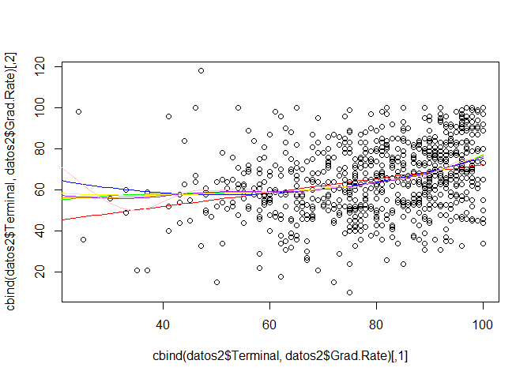

    modc14=gam(Grad.Rate~ Private+Apps+s(Accept)+s(Enroll)+s(Top10perc) + bs(Top25perc ,knots =c(30) )+s(F.Undergrad) + poly(P.Undergrad,2) +Outstate +Room.Board +Books+s(Personal)+Terminal, data = datos2)
    modc14.2=gam(Grad.Rate~ Private+Apps+s(Accept)+s(Enroll)+s(Top10perc) + bs(Top25perc ,knots =c(30) )+s(F.Undergrad) + poly(P.Undergrad,2) +Outstate +Room.Board +Books+s(Personal)+poly(Terminal,2), data = datos2)
    modc14.3=gam(Grad.Rate~ Private+Apps+s(Accept)+s(Enroll)+s(Top10perc) + bs(Top25perc ,knots =c(30) )+s(F.Undergrad) + poly(P.Undergrad,2) +Outstate +Room.Board +Books+s(Personal)+poly(Terminal,3), data = datos2)
    modc14.4=gam(Grad.Rate~ Private+Apps+s(Accept)+s(Enroll)+s(Top10perc) + bs(Top25perc ,knots =c(30) )+s(F.Undergrad) + poly(P.Undergrad,2) +Outstate +Room.Board +Books+s(Personal)+poly(Terminal,4), data = datos2)
    modc14.s=gam(Grad.Rate~ Private+Apps+s(Accept)+s(Enroll)+s(Top10perc) + bs(Top25perc ,knots =c(30) )+s(F.Undergrad) + poly(P.Undergrad,2) +Outstate +Room.Board +Books+s(Personal)+s(Terminal), data = datos2)
    modc14.s5=gam(Grad.Rate~ Private+Apps+s(Accept)+s(Enroll)+s(Top10perc) + bs(Top25perc ,knots =c(30) )+s(F.Undergrad) + poly(P.Undergrad,2) +Outstate +Room.Board +Books+s(Personal)+s(Terminal,5), data = datos2)
    modc14.s10=gam(Grad.Rate~ Private+Apps+s(Accept)+s(Enroll)+s(Top10perc) + bs(Top25perc ,knots =c(30) )+s(F.Undergrad) + poly(P.Undergrad,2) +Outstate +Room.Board +Books+s(Personal)+s(Terminal,10), data = datos2)

    anova(modc13,modc14,modc14.2,modc14.3,modc14.4)

    ## Analysis of Deviance Table
    ## 
    ## Model 1: Grad.Rate ~ Private + Apps + s(Accept) + s(Enroll) + s(Top10perc) + 
    ##     bs(Top25perc, knots = c(30)) + s(F.Undergrad) + poly(P.Undergrad, 
    ##     2) + Outstate + Room.Board + Books + s(Personal)
    ## Model 2: Grad.Rate ~ Private + Apps + s(Accept) + s(Enroll) + s(Top10perc) + 
    ##     bs(Top25perc, knots = c(30)) + s(F.Undergrad) + poly(P.Undergrad, 
    ##     2) + Outstate + Room.Board + Books + s(Personal) + Terminal
    ## Model 3: Grad.Rate ~ Private + Apps + s(Accept) + s(Enroll) + s(Top10perc) + 
    ##     bs(Top25perc, knots = c(30)) + s(F.Undergrad) + poly(P.Undergrad, 
    ##     2) + Outstate + Room.Board + Books + s(Personal) + poly(Terminal, 
    ##     2)
    ## Model 4: Grad.Rate ~ Private + Apps + s(Accept) + s(Enroll) + s(Top10perc) + 
    ##     bs(Top25perc, knots = c(30)) + s(F.Undergrad) + poly(P.Undergrad, 
    ##     2) + Outstate + Room.Board + Books + s(Personal) + poly(Terminal, 
    ##     3)
    ## Model 5: Grad.Rate ~ Private + Apps + s(Accept) + s(Enroll) + s(Top10perc) + 
    ##     bs(Top25perc, knots = c(30)) + s(F.Undergrad) + poly(P.Undergrad, 
    ##     2) + Outstate + Room.Board + Books + s(Personal) + poly(Terminal, 
    ##     4)
    ##   Resid. Df Resid. Dev Df Deviance Pr(>Chi)
    ## 1       745     121728                     
    ## 2       744     121691  1   37.143   0.6338
    ## 3       743     121637  1   53.888   0.5661
    ## 4       742     121361  1  276.216   0.1939
    ## 5       741     121252  1  109.279   0.4138

    errores_tab(list(modc13,modc14,modc14.2,modc14.3,modc14.4,modc14.s,modc14.s5,modc14.s10))

    ##                                                                     
    ## ecm         156.6646    156.6168    156.5474    156.1919    156.0513
    ## deviance 121728.3683 121691.2256 121637.3373 121361.1211 121251.8419
    ## aic        6198.0711   6199.8340   6201.4898   6201.7234   6203.0234
    ##                                             
    ## ecm         155.9534    155.7252    154.0534
    ## deviance 121175.8127 120998.5066 119699.5041
    ## aic        6202.5356   6203.3989   6205.0114

No es necesario añadir esta variable a nuestro modelo.

    modc14=modc13

### Variable S.F.Ratio.

    summary(datos2$S.F.Ratio)

    ##    Min. 1st Qu.  Median    Mean 3rd Qu.    Max. 
    ##    2.50   11.50   13.60   14.09   16.50   39.80

    mod15=gam(Grad.Rate~ S.F.Ratio, data = datos2)
    mod15.2=gam(Grad.Rate~ poly(S.F.Ratio,2), data = datos2)
    mod15.3=gam(Grad.Rate~ poly(S.F.Ratio,3), data = datos2)
    mod15.4=gam(Grad.Rate~ poly(S.F.Ratio,4), data = datos2)
    mod15.s=gam(Grad.Rate~ s(S.F.Ratio), data = datos2)
    mod15.s5=gam(Grad.Rate~ s(S.F.Ratio,5), data = datos2)
    mod15.s10=gam(Grad.Rate~ s(S.F.Ratio,10), data = datos2)

    summary(mod15)

    ## 
    ## Call: gam(formula = Grad.Rate ~ S.F.Ratio, data = datos2)
    ## Deviance Residuals:
    ##      Min       1Q   Median       3Q      Max 
    ## -54.4426 -11.0942   0.2842  11.6117  52.8166 
    ## 
    ## (Dispersion Parameter for gaussian family taken to be 267.6607)
    ## 
    ##     Null Deviance: 228977.2 on 776 degrees of freedom
    ## Residual Deviance: 207437 on 775 degrees of freedom
    ## AIC: 6552.24 
    ## 
    ## Number of Local Scoring Iterations: 2 
    ## 
    ## Anova for Parametric Effects
    ##            Df Sum Sq Mean Sq F value    Pr(>F)    
    ## S.F.Ratio   1  21540 21540.2  80.476 < 2.2e-16 ***
    ## Residuals 775 207437   267.7                      
    ## ---
    ## Signif. codes:  0 '***' 0.001 '**' 0.01 '*' 0.05 '.' 0.1 ' ' 1

    summary(mod15.2)

    ## 
    ## Call: gam(formula = Grad.Rate ~ poly(S.F.Ratio, 2), data = datos2)
    ## Deviance Residuals:
    ##      Min       1Q   Median       3Q      Max 
    ## -54.4722 -10.9393   0.5879  11.5282  53.2261 
    ## 
    ## (Dispersion Parameter for gaussian family taken to be 267.36)
    ## 
    ##     Null Deviance: 228977.2 on 776 degrees of freedom
    ## Residual Deviance: 206936.7 on 774 degrees of freedom
    ## AIC: 6552.364 
    ## 
    ## Number of Local Scoring Iterations: 2 
    ## 
    ## Anova for Parametric Effects
    ##                     Df Sum Sq Mean Sq F value    Pr(>F)    
    ## poly(S.F.Ratio, 2)   2  22041 11020.3  41.219 < 2.2e-16 ***
    ## Residuals          774 206937   267.4                      
    ## ---
    ## Signif. codes:  0 '***' 0.001 '**' 0.01 '*' 0.05 '.' 0.1 ' ' 1

    summary(mod15.3)

    ## 
    ## Call: gam(formula = Grad.Rate ~ poly(S.F.Ratio, 3), data = datos2)
    ## Deviance Residuals:
    ##      Min       1Q   Median       3Q      Max 
    ## -54.3323 -10.8650   0.6531  11.3671  53.3463 
    ## 
    ## (Dispersion Parameter for gaussian family taken to be 267.6038)
    ## 
    ##     Null Deviance: 228977.2 on 776 degrees of freedom
    ## Residual Deviance: 206857.7 on 773 degrees of freedom
    ## AIC: 6554.067 
    ## 
    ## Number of Local Scoring Iterations: 2 
    ## 
    ## Anova for Parametric Effects
    ##                     Df Sum Sq Mean Sq F value    Pr(>F)    
    ## poly(S.F.Ratio, 3)   3  22120  7373.2  27.553 < 2.2e-16 ***
    ## Residuals          773 206858   267.6                      
    ## ---
    ## Signif. codes:  0 '***' 0.001 '**' 0.01 '*' 0.05 '.' 0.1 ' ' 1

    summary(mod15.4)

    ## 
    ## Call: gam(formula = Grad.Rate ~ poly(S.F.Ratio, 4), data = datos2)
    ## Deviance Residuals:
    ##      Min       1Q   Median       3Q      Max 
    ## -54.7748 -10.8259   0.6751  11.3308  53.5948 
    ## 
    ## (Dispersion Parameter for gaussian family taken to be 267.4832)
    ## 
    ##     Null Deviance: 228977.2 on 776 degrees of freedom
    ## Residual Deviance: 206497 on 772 degrees of freedom
    ## AIC: 6554.712 
    ## 
    ## Number of Local Scoring Iterations: 2 
    ## 
    ## Anova for Parametric Effects
    ##                     Df Sum Sq Mean Sq F value    Pr(>F)    
    ## poly(S.F.Ratio, 4)   4  22480  5620.0  21.011 < 2.2e-16 ***
    ## Residuals          772 206497   267.5                      
    ## ---
    ## Signif. codes:  0 '***' 0.001 '**' 0.01 '*' 0.05 '.' 0.1 ' ' 1

    summary(mod15.s)

    ## 
    ## Call: gam(formula = Grad.Rate ~ s(S.F.Ratio), data = datos2)
    ## Deviance Residuals:
    ##      Min       1Q   Median       3Q      Max 
    ## -54.4708 -10.9047   0.5712  11.4930  53.3710 
    ## 
    ## (Dispersion Parameter for gaussian family taken to be 267.4163)
    ## 
    ##     Null Deviance: 228977.2 on 776 degrees of freedom
    ## Residual Deviance: 206445.3 on 771.9996 degrees of freedom
    ## AIC: 6554.518 
    ## 
    ## Number of Local Scoring Iterations: 2 
    ## 
    ## Anova for Parametric Effects
    ##               Df Sum Sq Mean Sq F value    Pr(>F)    
    ## s(S.F.Ratio)   1  21540 21540.2  80.549 < 2.2e-16 ***
    ## Residuals    772 206445   267.4                      
    ## ---
    ## Signif. codes:  0 '***' 0.001 '**' 0.01 '*' 0.05 '.' 0.1 ' ' 1
    ## 
    ## Anova for Nonparametric Effects
    ##              Npar Df Npar F  Pr(F)
    ## (Intercept)                       
    ## s(S.F.Ratio)       3  1.236 0.2955

    summary(mod15.s5)

    ## 
    ## Call: gam(formula = Grad.Rate ~ s(S.F.Ratio, 5), data = datos2)
    ## Deviance Residuals:
    ##      Min       1Q   Median       3Q      Max 
    ## -54.4372 -10.9139   0.6687  11.5507  53.3423 
    ## 
    ## (Dispersion Parameter for gaussian family taken to be 267.3625)
    ## 
    ##     Null Deviance: 228977.2 on 776 degrees of freedom
    ## Residual Deviance: 206136.4 on 770.9997 degrees of freedom
    ## AIC: 6555.354 
    ## 
    ## Number of Local Scoring Iterations: 2 
    ## 
    ## Anova for Parametric Effects
    ##                  Df Sum Sq Mean Sq F value    Pr(>F)    
    ## s(S.F.Ratio, 5)   1  21540 21540.2  80.566 < 2.2e-16 ***
    ## Residuals       771 206136   267.4                      
    ## ---
    ## Signif. codes:  0 '***' 0.001 '**' 0.01 '*' 0.05 '.' 0.1 ' ' 1
    ## 
    ## Anova for Nonparametric Effects
    ##                 Npar Df Npar F  Pr(F)
    ## (Intercept)                          
    ## s(S.F.Ratio, 5)       4 1.2161 0.3025

    summary(mod15.s10)

    ## 
    ## Call: gam(formula = Grad.Rate ~ s(S.F.Ratio, 10), data = datos2)
    ## Deviance Residuals:
    ##      Min       1Q   Median       3Q      Max 
    ## -54.2074 -10.9321   0.6865  11.3418  52.5146 
    ## 
    ## (Dispersion Parameter for gaussian family taken to be 265.8269)
    ## 
    ##     Null Deviance: 228977.2 on 776 degrees of freedom
    ## Residual Deviance: 203623.5 on 766 degrees of freedom
    ## AIC: 6555.823 
    ## 
    ## Number of Local Scoring Iterations: 2 
    ## 
    ## Anova for Parametric Effects
    ##                   Df Sum Sq Mean Sq F value    Pr(>F)    
    ## s(S.F.Ratio, 10)   1  21540 21540.2  81.031 < 2.2e-16 ***
    ## Residuals        766 203623   265.8                      
    ## ---
    ## Signif. codes:  0 '***' 0.001 '**' 0.01 '*' 0.05 '.' 0.1 ' ' 1
    ## 
    ## Anova for Nonparametric Effects
    ##                  Npar Df Npar F  Pr(F)
    ## (Intercept)                           
    ## s(S.F.Ratio, 10)       9  1.594 0.1128

    anova(mod15,mod15.2,mod15.3,mod15.4)

    ## Analysis of Deviance Table
    ## 
    ## Model 1: Grad.Rate ~ S.F.Ratio
    ## Model 2: Grad.Rate ~ poly(S.F.Ratio, 2)
    ## Model 3: Grad.Rate ~ poly(S.F.Ratio, 3)
    ## Model 4: Grad.Rate ~ poly(S.F.Ratio, 4)
    ##   Resid. Df Resid. Dev Df Deviance Pr(>Chi)
    ## 1       775     207437                     
    ## 2       774     206937  1   500.36   0.1714
    ## 3       773     206858  1    78.97   0.5869
    ## 4       772     206497  1   360.65   0.2456

    errores_tab(list(mod15,mod15.2,mod15.3,mod15.4,mod15.s,mod15.s5,mod15.s10))

    ##                                                                    
    ## ecm         266.9717    266.3278    266.2261    265.762    265.6954
    ## deviance 207437.0276 206936.6658 206857.6997 206497.046 206445.2975
    ## aic        6552.2404   6552.3639   6554.0674   6554.711   6554.5176
    ##                                 
    ## ecm         265.2978    262.0636
    ## deviance 206136.3666 203623.4515
    ## aic        6555.3538   6555.8228

    plot(cbind(datos2$S.F.Ratio,datos2$Grad.Rate))
    datos_falsos=data.frame(S.F.Ratio=seq(0, 40, 1))
    lines(cbind(datos_falsos$S.F.Ratio,predict(mod15,newdata = datos_falsos)), col='red')
    lines(cbind(datos_falsos$S.F.Ratio,predict(mod15.2,newdata = datos_falsos)), col='blue')
    lines(cbind(datos_falsos$S.F.Ratio,predict(mod15.3,newdata = datos_falsos)), col='green')
    lines(cbind(datos_falsos$S.F.Ratio,predict(mod15.4,newdata = datos_falsos)), col='yellow')
    lines(cbind(datos_falsos$S.F.Ratio,predict(mod15.s,newdata = datos_falsos)), col='orange')
    lines(cbind(datos_falsos$S.F.Ratio,predict(mod15.s5,newdata = datos_falsos)), col='purple')
    lines(cbind(datos_falsos$S.F.Ratio,predict(mod15.s10,newdata = datos_falsos)), col='pink')

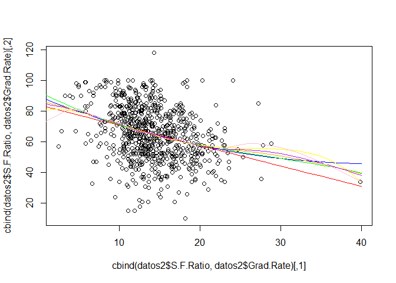

    modc15=gam(Grad.Rate~ Private+Apps+s(Accept)+s(Enroll)+s(Top10perc) + bs(Top25perc ,knots =c(30) )+s(F.Undergrad) + poly(P.Undergrad,2) +Outstate +Room.Board +Books+s(Personal)+S.F.Ratio, data = datos2)
    modc15.2=gam(Grad.Rate~ Private+Apps+s(Accept)+s(Enroll)+s(Top10perc) + bs(Top25perc ,knots =c(30) )+s(F.Undergrad) + poly(P.Undergrad,2) +Outstate +Room.Board +Books+s(Personal)+poly(S.F.Ratio,2), data = datos2)
    modc15.3=gam(Grad.Rate~ Private+Apps+s(Accept)+s(Enroll)+s(Top10perc) + bs(Top25perc ,knots =c(30) )+s(F.Undergrad) + poly(P.Undergrad,2) +Outstate +Room.Board +Books+s(Personal)+poly(S.F.Ratio,3), data = datos2)
    modc15.4=gam(Grad.Rate~ Private+Apps+s(Accept)+s(Enroll)+s(Top10perc) + bs(Top25perc ,knots =c(30) )+s(F.Undergrad) + poly(P.Undergrad,2) +Outstate +Room.Board +Books+s(Personal)+poly(S.F.Ratio,4), data = datos2)
    modc15.s=gam(Grad.Rate~ Private+Apps+s(Accept)+s(Enroll)+s(Top10perc) + bs(Top25perc ,knots =c(30) )+s(F.Undergrad) + poly(P.Undergrad,2) +Outstate +Room.Board +Books+s(Personal)+s(S.F.Ratio), data = datos2)
    modc15.s5=gam(Grad.Rate~ Private+Apps+s(Accept)+s(Enroll)+s(Top10perc) + bs(Top25perc ,knots =c(30) )+s(F.Undergrad) + poly(P.Undergrad,2) +Outstate +Room.Board +Books+s(Personal)+s(S.F.Ratio,5), data = datos2)
    modc15.s10=gam(Grad.Rate~ Private+Apps+s(Accept)+s(Enroll)+s(Top10perc) + bs(Top25perc ,knots =c(30) )+s(F.Undergrad) + poly(P.Undergrad,2) +Outstate +Room.Board +Books+s(Personal)+s(S.F.Ratio,10), data = datos2)

    anova(modc14,modc15,modc15.2,modc15.3,modc15.4)

    ## Analysis of Deviance Table
    ## 
    ## Model 1: Grad.Rate ~ Private + Apps + s(Accept) + s(Enroll) + s(Top10perc) + 
    ##     bs(Top25perc, knots = c(30)) + s(F.Undergrad) + poly(P.Undergrad, 
    ##     2) + Outstate + Room.Board + Books + s(Personal)
    ## Model 2: Grad.Rate ~ Private + Apps + s(Accept) + s(Enroll) + s(Top10perc) + 
    ##     bs(Top25perc, knots = c(30)) + s(F.Undergrad) + poly(P.Undergrad, 
    ##     2) + Outstate + Room.Board + Books + s(Personal) + S.F.Ratio
    ## Model 3: Grad.Rate ~ Private + Apps + s(Accept) + s(Enroll) + s(Top10perc) + 
    ##     bs(Top25perc, knots = c(30)) + s(F.Undergrad) + poly(P.Undergrad, 
    ##     2) + Outstate + Room.Board + Books + s(Personal) + poly(S.F.Ratio, 
    ##     2)
    ## Model 4: Grad.Rate ~ Private + Apps + s(Accept) + s(Enroll) + s(Top10perc) + 
    ##     bs(Top25perc, knots = c(30)) + s(F.Undergrad) + poly(P.Undergrad, 
    ##     2) + Outstate + Room.Board + Books + s(Personal) + poly(S.F.Ratio, 
    ##     3)
    ## Model 5: Grad.Rate ~ Private + Apps + s(Accept) + s(Enroll) + s(Top10perc) + 
    ##     bs(Top25perc, knots = c(30)) + s(F.Undergrad) + poly(P.Undergrad, 
    ##     2) + Outstate + Room.Board + Books + s(Personal) + poly(S.F.Ratio, 
    ##     4)
    ##   Resid. Df Resid. Dev Df Deviance Pr(>Chi)  
    ## 1       745     121728                       
    ## 2       744     121716  1    12.03  0.78571  
    ## 3       743     121151  1   565.22  0.06234 .
    ## 4       742     120924  1   227.21  0.23730  
    ## 5       741     120556  1   367.82  0.13269  
    ## ---
    ## Signif. codes:  0 '***' 0.001 '**' 0.01 '*' 0.05 '.' 0.1 ' ' 1

    errores_tab(list(modc14,modc15,modc15.2,modc15.3,modc15.4,modc15.s,modc15.s5,modc15.s10))

    ##                                                                     
    ## ecm         156.6646    156.6491    155.9217    155.6292    155.1559
    ## deviance 121728.3683 121716.3415 121151.1250 120923.9150 120556.0969
    ## aic        6198.0711   6199.9943   6198.3778   6198.9192   6198.5522
    ##                                             
    ## ecm         155.3426    154.9298    153.4497
    ## deviance 120701.1655 120380.4464 119230.4463
    ## aic        6199.4874   6199.4199   6201.9608

Parece una buena opcion usar polinomios de grado dos.

    modc15=modc15.2

### Variable perc.alumni.

    summary(datos2$perc.alumni)

    ##    Min. 1st Qu.  Median    Mean 3rd Qu.    Max. 
    ##    0.00   13.00   21.00   22.74   31.00   64.00

    mod16=gam(Grad.Rate~ perc.alumni, data = datos2)
    mod16.2=gam(Grad.Rate~ poly(perc.alumni,2), data = datos2)
    mod16.3=gam(Grad.Rate~ poly(perc.alumni,3), data = datos2)
    mod16.4=gam(Grad.Rate~ poly(perc.alumni,4), data = datos2)
    mod16.s=gam(Grad.Rate~ s(perc.alumni), data = datos2)
    mod16.s5=gam(Grad.Rate~ s(perc.alumni,5), data = datos2)
    mod16.s10=gam(Grad.Rate~ s(perc.alumni,10), data = datos2)

    summary(mod16)

    ## 
    ## Call: gam(formula = Grad.Rate ~ perc.alumni, data = datos2)
    ## Deviance Residuals:
    ##       Min        1Q    Median        3Q       Max 
    ## -58.24740  -9.51319   0.04289   9.36240  54.40387 
    ## 
    ## (Dispersion Parameter for gaussian family taken to be 224.2557)
    ## 
    ##     Null Deviance: 228977.2 on 776 degrees of freedom
    ## Residual Deviance: 173798.2 on 775 degrees of freedom
    ## AIC: 6414.763 
    ## 
    ## Number of Local Scoring Iterations: 2 
    ## 
    ## Anova for Parametric Effects
    ##              Df Sum Sq Mean Sq F value    Pr(>F)    
    ## perc.alumni   1  55179   55179  246.05 < 2.2e-16 ***
    ## Residuals   775 173798     224                      
    ## ---
    ## Signif. codes:  0 '***' 0.001 '**' 0.01 '*' 0.05 '.' 0.1 ' ' 1

    summary(mod16.2)

    ## 
    ## Call: gam(formula = Grad.Rate ~ poly(perc.alumni, 2), data = datos2)
    ## Deviance Residuals:
    ##      Min       1Q   Median       3Q      Max 
    ## -57.4439  -9.1460   0.0417   9.4484  53.4455 
    ## 
    ## (Dispersion Parameter for gaussian family taken to be 222.4315)
    ## 
    ##     Null Deviance: 228977.2 on 776 degrees of freedom
    ## Residual Deviance: 172162 on 774 degrees of freedom
    ## AIC: 6409.414 
    ## 
    ## Number of Local Scoring Iterations: 2 
    ## 
    ## Anova for Parametric Effects
    ##                       Df Sum Sq Mean Sq F value    Pr(>F)    
    ## poly(perc.alumni, 2)   2  56815 28407.6  127.71 < 2.2e-16 ***
    ## Residuals            774 172162   222.4                      
    ## ---
    ## Signif. codes:  0 '***' 0.001 '**' 0.01 '*' 0.05 '.' 0.1 ' ' 1

    summary(mod16.3)

    ## 
    ## Call: gam(formula = Grad.Rate ~ poly(perc.alumni, 3), data = datos2)
    ## Deviance Residuals:
    ##        Min         1Q     Median         3Q        Max 
    ## -56.570851  -9.122610   0.004504   9.345593  52.896088 
    ## 
    ## (Dispersion Parameter for gaussian family taken to be 222.1986)
    ## 
    ##     Null Deviance: 228977.2 on 776 degrees of freedom
    ## Residual Deviance: 171759.5 on 773 degrees of freedom
    ## AIC: 6409.595 
    ## 
    ## Number of Local Scoring Iterations: 2 
    ## 
    ## Anova for Parametric Effects
    ##                       Df Sum Sq Mean Sq F value    Pr(>F)    
    ## poly(perc.alumni, 3)   3  57218 19072.6  85.836 < 2.2e-16 ***
    ## Residuals            773 171759   222.2                      
    ## ---
    ## Signif. codes:  0 '***' 0.001 '**' 0.01 '*' 0.05 '.' 0.1 ' ' 1

    summary(mod16.4)

    ## 
    ## Call: gam(formula = Grad.Rate ~ poly(perc.alumni, 4), data = datos2)
    ## Deviance Residuals:
    ##      Min       1Q   Median       3Q      Max 
    ## -55.9468  -8.7419  -0.1404   9.4528  52.8596 
    ## 
    ## (Dispersion Parameter for gaussian family taken to be 222.2048)
    ## 
    ##     Null Deviance: 228977.2 on 776 degrees of freedom
    ## Residual Deviance: 171542.1 on 772 degrees of freedom
    ## AIC: 6410.611 
    ## 
    ## Number of Local Scoring Iterations: 2 
    ## 
    ## Anova for Parametric Effects
    ##                       Df Sum Sq Mean Sq F value    Pr(>F)    
    ## poly(perc.alumni, 4)   4  57435 14358.8   64.62 < 2.2e-16 ***
    ## Residuals            772 171542   222.2                      
    ## ---
    ## Signif. codes:  0 '***' 0.001 '**' 0.01 '*' 0.05 '.' 0.1 ' ' 1

    summary(mod16.s)

    ## 
    ## Call: gam(formula = Grad.Rate ~ s(perc.alumni), data = datos2)
    ## Deviance Residuals:
    ##       Min        1Q    Median        3Q       Max 
    ## -55.99184  -8.93363   0.04194   9.53603  53.09684 
    ## 
    ## (Dispersion Parameter for gaussian family taken to be 222.0496)
    ## 
    ##     Null Deviance: 228977.2 on 776 degrees of freedom
    ## Residual Deviance: 171422.3 on 772 degrees of freedom
    ## AIC: 6410.068 
    ## 
    ## Number of Local Scoring Iterations: 2 
    ## 
    ## Anova for Parametric Effects
    ##                 Df Sum Sq Mean Sq F value    Pr(>F)    
    ## s(perc.alumni)   1  55179   55179   248.5 < 2.2e-16 ***
    ## Residuals      772 171422     222                      
    ## ---
    ## Signif. codes:  0 '***' 0.001 '**' 0.01 '*' 0.05 '.' 0.1 ' ' 1
    ## 
    ## Anova for Nonparametric Effects
    ##                Npar Df Npar F   Pr(F)  
    ## (Intercept)                            
    ## s(perc.alumni)       3 3.5666 0.01388 *
    ## ---
    ## Signif. codes:  0 '***' 0.001 '**' 0.01 '*' 0.05 '.' 0.1 ' ' 1

    summary(mod16.s5)

    ## 
    ## Call: gam(formula = Grad.Rate ~ s(perc.alumni, 5), data = datos2)
    ## Deviance Residuals:
    ##       Min        1Q    Median        3Q       Max 
    ## -55.73417  -8.98911   0.03619   9.49233  53.04740 
    ## 
    ## (Dispersion Parameter for gaussian family taken to be 222.0425)
    ## 
    ##     Null Deviance: 228977.2 on 776 degrees of freedom
    ## Residual Deviance: 171194.7 on 770.9997 degrees of freedom
    ## AIC: 6411.036 
    ## 
    ## Number of Local Scoring Iterations: 2 
    ## 
    ## Anova for Parametric Effects
    ##                    Df Sum Sq Mean Sq F value    Pr(>F)    
    ## s(perc.alumni, 5)   1  55179   55179  248.51 < 2.2e-16 ***
    ## Residuals         771 171195     222                      
    ## ---
    ## Signif. codes:  0 '***' 0.001 '**' 0.01 '*' 0.05 '.' 0.1 ' ' 1
    ## 
    ## Anova for Nonparametric Effects
    ##                   Npar Df Npar F   Pr(F)  
    ## (Intercept)                               
    ## s(perc.alumni, 5)       4 2.9311 0.02014 *
    ## ---
    ## Signif. codes:  0 '***' 0.001 '**' 0.01 '*' 0.05 '.' 0.1 ' ' 1

    summary(mod16.s10)

    ## 
    ## Call: gam(formula = Grad.Rate ~ s(perc.alumni, 10), data = datos2)
    ## Deviance Residuals:
    ##      Min       1Q   Median       3Q      Max 
    ## -56.2794  -9.1113   0.1785   9.3344  52.2314 
    ## 
    ## (Dispersion Parameter for gaussian family taken to be 221.8129)
    ## 
    ##     Null Deviance: 228977.2 on 776 degrees of freedom
    ## Residual Deviance: 169908.6 on 765.9999 degrees of freedom
    ## AIC: 6415.177 
    ## 
    ## Number of Local Scoring Iterations: 2 
    ## 
    ## Anova for Parametric Effects
    ##                     Df Sum Sq Mean Sq F value    Pr(>F)    
    ## s(perc.alumni, 10)   1  55179   55179  248.76 < 2.2e-16 ***
    ## Residuals          766 169909     222                      
    ## ---
    ## Signif. codes:  0 '***' 0.001 '**' 0.01 '*' 0.05 '.' 0.1 ' ' 1
    ## 
    ## Anova for Nonparametric Effects
    ##                    Npar Df Npar F   Pr(F)  
    ## (Intercept)                                
    ## s(perc.alumni, 10)       9 1.9483 0.04258 *
    ## ---
    ## Signif. codes:  0 '***' 0.001 '**' 0.01 '*' 0.05 '.' 0.1 ' ' 1

    anova(mod16,mod16.2,mod16.3,mod16.4)

    ## Analysis of Deviance Table
    ## 
    ## Model 1: Grad.Rate ~ perc.alumni
    ## Model 2: Grad.Rate ~ poly(perc.alumni, 2)
    ## Model 3: Grad.Rate ~ poly(perc.alumni, 3)
    ## Model 4: Grad.Rate ~ poly(perc.alumni, 4)
    ##   Resid. Df Resid. Dev Df Deviance Pr(>Chi)   
    ## 1       775     173798                        
    ## 2       774     172162  1  1636.17 0.006657 **
    ## 3       773     171759  1   402.52 0.178332   
    ## 4       772     171542  1   217.40 0.322595   
    ## ---
    ## Signif. codes:  0 '***' 0.001 '**' 0.01 '*' 0.05 '.' 0.1 ' ' 1

    errores_tab(list(mod16,mod16.2,mod16.3,mod16.4,mod16.s,mod16.s5,mod16.s10))

    ##                                                                     
    ## ecm         223.6785    221.5727    221.0547    220.7749    220.6207
    ## deviance 173798.1825 172162.0116 171759.4949 171542.0909 171422.2889
    ## aic        6414.7634   6409.4139   6409.5952   6410.6111   6410.0682
    ##                                 
    ## ecm         220.3278    218.6726
    ## deviance 171194.6782 169908.6290
    ## aic        6411.0364   6415.1771

    plot(cbind(datos2$perc.alumni,datos2$Grad.Rate))
    datos_falsos=data.frame(perc.alumni=seq(-10, 100, 1))
    lines(cbind(datos_falsos$perc.alumni,predict(mod16,newdata = datos_falsos)), col='red')
    lines(cbind(datos_falsos$perc.alumni,predict(mod16.2,newdata = datos_falsos)), col='blue')
    lines(cbind(datos_falsos$perc.alumni,predict(mod16.3,newdata = datos_falsos)), col='green')
    lines(cbind(datos_falsos$perc.alumni,predict(mod16.4,newdata = datos_falsos)), col='yellow')
    lines(cbind(datos_falsos$perc.alumni,predict(mod16.s,newdata = datos_falsos)), col='orange')
    lines(cbind(datos_falsos$perc.alumni,predict(mod16.s5,newdata = datos_falsos)), col='purple')
    lines(cbind(datos_falsos$perc.alumni,predict(mod16.s10,newdata = datos_falsos)), col='pink')

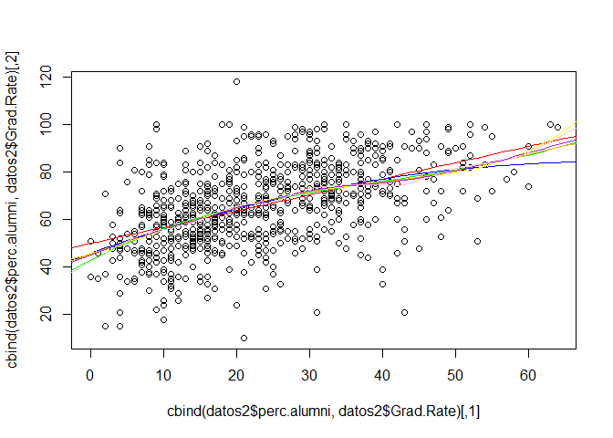

    modc16=gam(Grad.Rate~ Private+Apps+s(Accept)+s(Enroll)+s(Top10perc) + bs(Top25perc ,knots =c(30) )+s(F.Undergrad) + poly(P.Undergrad,2) +Outstate +Room.Board +Books+s(Personal)+poly(S.F.Ratio,2)+perc.alumni, data = datos2)
    modc16.2=gam(Grad.Rate~ Private+Apps+s(Accept)+s(Enroll)+s(Top10perc) + bs(Top25perc ,knots =c(30) )+s(F.Undergrad) + poly(P.Undergrad,2) +Outstate +Room.Board +Books+s(Personal)+poly(S.F.Ratio,2)+poly(perc.alumni,2), data = datos2)
    modc16.3=gam(Grad.Rate~ Private+Apps+s(Accept)+s(Enroll)+s(Top10perc) + bs(Top25perc ,knots =c(30) )+s(F.Undergrad) + poly(P.Undergrad,2) +Outstate +Room.Board +Books+s(Personal)+poly(S.F.Ratio,2)+poly(perc.alumni,3), data = datos2)
    modc16.4=gam(Grad.Rate~ Private+Apps+s(Accept)+s(Enroll)+s(Top10perc) + bs(Top25perc ,knots =c(30) )+s(F.Undergrad) + poly(P.Undergrad,2) +Outstate +Room.Board +Books+s(Personal)+poly(S.F.Ratio,2)+poly(perc.alumni,4), data = datos2)
    modc16.s=gam(Grad.Rate~ Private+Apps+s(Accept)+s(Enroll)+s(Top10perc) + bs(Top25perc ,knots =c(30) )+s(F.Undergrad) + poly(P.Undergrad,2) +Outstate +Room.Board +Books+s(Personal)+poly(S.F.Ratio,2)+s(perc.alumni), data = datos2)
    modc16.s5=gam(Grad.Rate~ Private+Apps+s(Accept)+s(Enroll)+s(Top10perc) + bs(Top25perc ,knots =c(30) )+s(F.Undergrad) + poly(P.Undergrad,2) +Outstate +Room.Board +Books+s(Personal)+poly(S.F.Ratio,2)+s(perc.alumni,5), data = datos2)
    modc16.s10=gam(Grad.Rate~ Private+Apps+s(Accept)+s(Enroll)+s(Top10perc) + bs(Top25perc ,knots =c(30) )+s(F.Undergrad) + poly(P.Undergrad,2) +Outstate +Room.Board +Books+s(Personal)+poly(S.F.Ratio,2)+s(perc.alumni,10), data = datos2)

    anova(modc15,modc16,modc16.2,modc16.3,modc16.4)

    ## Analysis of Deviance Table
    ## 
    ## Model 1: Grad.Rate ~ Private + Apps + s(Accept) + s(Enroll) + s(Top10perc) + 
    ##     bs(Top25perc, knots = c(30)) + s(F.Undergrad) + poly(P.Undergrad, 
    ##     2) + Outstate + Room.Board + Books + s(Personal) + poly(S.F.Ratio, 
    ##     2)
    ## Model 2: Grad.Rate ~ Private + Apps + s(Accept) + s(Enroll) + s(Top10perc) + 
    ##     bs(Top25perc, knots = c(30)) + s(F.Undergrad) + poly(P.Undergrad, 
    ##     2) + Outstate + Room.Board + Books + s(Personal) + poly(S.F.Ratio, 
    ##     2) + perc.alumni
    ## Model 3: Grad.Rate ~ Private + Apps + s(Accept) + s(Enroll) + s(Top10perc) + 
    ##     bs(Top25perc, knots = c(30)) + s(F.Undergrad) + poly(P.Undergrad, 
    ##     2) + Outstate + Room.Board + Books + s(Personal) + poly(S.F.Ratio, 
    ##     2) + poly(perc.alumni, 2)
    ## Model 4: Grad.Rate ~ Private + Apps + s(Accept) + s(Enroll) + s(Top10perc) + 
    ##     bs(Top25perc, knots = c(30)) + s(F.Undergrad) + poly(P.Undergrad, 
    ##     2) + Outstate + Room.Board + Books + s(Personal) + poly(S.F.Ratio, 
    ##     2) + poly(perc.alumni, 3)
    ## Model 5: Grad.Rate ~ Private + Apps + s(Accept) + s(Enroll) + s(Top10perc) + 
    ##     bs(Top25perc, knots = c(30)) + s(F.Undergrad) + poly(P.Undergrad, 
    ##     2) + Outstate + Room.Board + Books + s(Personal) + poly(S.F.Ratio, 
    ##     2) + poly(perc.alumni, 4)
    ##   Resid. Df Resid. Dev Df Deviance  Pr(>Chi)    
    ## 1       743     121151                          
    ## 2       742     116108  1   5043.6 1.241e-08 ***
    ## 3       741     115323  1    784.4   0.02473 *  
    ## 4       740     115291  1     32.0   0.64992    
    ## 5       739     114960  1    331.0   0.14463    
    ## ---
    ## Signif. codes:  0 '***' 0.001 '**' 0.01 '*' 0.05 '.' 0.1 ' ' 1

    errores_tab(list(modc15,modc16,modc16.2,modc16.3,modc16.4,modc16.s,modc16.s5,modc16.s10))

    ##                                                                    
    ## ecm         155.9217    149.4306    148.421    148.3798    147.9537
    ## deviance 121151.1250 116107.5470 115323.137 115291.0921 114960.0601
    ## aic        6198.3778   6167.3383   6164.071   6165.8552   6165.6210
    ##                                             
    ## ecm         147.5994    147.3147    145.9679
    ## deviance 114684.7018 114463.4901 113417.0673
    ## aic        6163.7577   6164.2581   6167.1218

    modc16=modc16.s

En este caso usaremos splines suavizados.

    modc16=modc16.s

### Variable Expend.

    summary(datos2$Expend)

    ##    Min. 1st Qu.  Median    Mean 3rd Qu.    Max. 
    ##    3186    6751    8377    9660   10830   56230

    mod17=gam(Grad.Rate~ Expend, data = datos2)
    mod17.2=gam(Grad.Rate~ poly(Expend,2), data = datos2)
    mod17.3=gam(Grad.Rate~ poly(Expend,3), data = datos2)
    mod17.4=gam(Grad.Rate~ poly(Expend,4), data = datos2)
    mod17.s=gam(Grad.Rate~ s(Expend), data = datos2)
    mod17.s5=gam(Grad.Rate~ s(Expend,5), data = datos2)
    mod17.s10=gam(Grad.Rate~ s(Expend,10), data = datos2)
    mod17.bs=gam(Grad.Rate~ bs(Expend,knots = 20000, degree = 1), data = datos2)

    summary(mod17)

    ## 
    ## Call: gam(formula = Grad.Rate ~ Expend, data = datos2)
    ## Deviance Residuals:
    ##     Min      1Q  Median      3Q     Max 
    ## -60.179 -10.275   0.238  10.377  55.058 
    ## 
    ## (Dispersion Parameter for gaussian family taken to be 250.4368)
    ## 
    ##     Null Deviance: 228977.2 on 776 degrees of freedom
    ## Residual Deviance: 194088.5 on 775 degrees of freedom
    ## AIC: 6500.56 
    ## 
    ## Number of Local Scoring Iterations: 2 
    ## 
    ## Anova for Parametric Effects
    ##            Df Sum Sq Mean Sq F value    Pr(>F)    
    ## Expend      1  34889   34889  139.31 < 2.2e-16 ***
    ## Residuals 775 194089     250                      
    ## ---
    ## Signif. codes:  0 '***' 0.001 '**' 0.01 '*' 0.05 '.' 0.1 ' ' 1

    summary(mod17.2)

    ## 
    ## Call: gam(formula = Grad.Rate ~ poly(Expend, 2), data = datos2)
    ## Deviance Residuals:
    ##      Min       1Q   Median       3Q      Max 
    ## -55.8282  -9.4090   0.3864   9.6954  55.5041 
    ## 
    ## (Dispersion Parameter for gaussian family taken to be 241.7571)
    ## 
    ##     Null Deviance: 228977.2 on 776 degrees of freedom
    ## Residual Deviance: 187120 on 774 degrees of freedom
    ## AIC: 6474.149 
    ## 
    ## Number of Local Scoring Iterations: 2 
    ## 
    ## Anova for Parametric Effects
    ##                  Df Sum Sq Mean Sq F value    Pr(>F)    
    ## poly(Expend, 2)   2  41857 20928.6  86.569 < 2.2e-16 ***
    ## Residuals       774 187120   241.8                      
    ## ---
    ## Signif. codes:  0 '***' 0.001 '**' 0.01 '*' 0.05 '.' 0.1 ' ' 1

    summary(mod17.3)

    ## 
    ## Call: gam(formula = Grad.Rate ~ poly(Expend, 3), data = datos2)
    ## Deviance Residuals:
    ##      Min       1Q   Median       3Q      Max 
    ## -56.1319  -9.4736   0.1674   9.6607  55.4405 
    ## 
    ## (Dispersion Parameter for gaussian family taken to be 241.8748)
    ## 
    ##     Null Deviance: 228977.2 on 776 degrees of freedom
    ## Residual Deviance: 186969.2 on 773 degrees of freedom
    ## AIC: 6475.523 
    ## 
    ## Number of Local Scoring Iterations: 2 
    ## 
    ## Anova for Parametric Effects
    ##                  Df Sum Sq Mean Sq F value    Pr(>F)    
    ## poly(Expend, 3)   3  42008 14002.7  57.892 < 2.2e-16 ***
    ## Residuals       773 186969   241.9                      
    ## ---
    ## Signif. codes:  0 '***' 0.001 '**' 0.01 '*' 0.05 '.' 0.1 ' ' 1

    summary(mod17.4)

    ## 
    ## Call: gam(formula = Grad.Rate ~ poly(Expend, 4), data = datos2)
    ## Deviance Residuals:
    ##      Min       1Q   Median       3Q      Max 
    ## -56.1078  -9.4594   0.3158   9.7742  55.4788 
    ## 
    ## (Dispersion Parameter for gaussian family taken to be 242.1788)
    ## 
    ##     Null Deviance: 228977.2 on 776 degrees of freedom
    ## Residual Deviance: 186962.1 on 772 degrees of freedom
    ## AIC: 6477.493 
    ## 
    ## Number of Local Scoring Iterations: 2 
    ## 
    ## Anova for Parametric Effects
    ##                  Df Sum Sq Mean Sq F value    Pr(>F)    
    ## poly(Expend, 4)   4  42015 10503.8  43.372 < 2.2e-16 ***
    ## Residuals       772 186962   242.2                      
    ## ---
    ## Signif. codes:  0 '***' 0.001 '**' 0.01 '*' 0.05 '.' 0.1 ' ' 1

    summary(mod17.s)

    ## 
    ## Call: gam(formula = Grad.Rate ~ s(Expend), data = datos2)
    ## Deviance Residuals:
    ##      Min       1Q   Median       3Q      Max 
    ## -55.8530  -9.5115   0.2676   9.6780  55.2559 
    ## 
    ## (Dispersion Parameter for gaussian family taken to be 241.1982)
    ## 
    ##     Null Deviance: 228977.2 on 776 degrees of freedom
    ## Residual Deviance: 186205 on 772 degrees of freedom
    ## AIC: 6474.34 
    ## 
    ## Number of Local Scoring Iterations: 2 
    ## 
    ## Anova for Parametric Effects
    ##            Df Sum Sq Mean Sq F value    Pr(>F)    
    ## s(Expend)   1  34889   34889  144.65 < 2.2e-16 ***
    ## Residuals 772 186205     241                      
    ## ---
    ## Signif. codes:  0 '***' 0.001 '**' 0.01 '*' 0.05 '.' 0.1 ' ' 1
    ## 
    ## Anova for Nonparametric Effects
    ##             Npar Df Npar F     Pr(F)    
    ## (Intercept)                             
    ## s(Expend)         3 10.895 5.151e-07 ***
    ## ---
    ## Signif. codes:  0 '***' 0.001 '**' 0.01 '*' 0.05 '.' 0.1 ' ' 1

    summary(mod17.s5)

    ## 
    ## Call: gam(formula = Grad.Rate ~ s(Expend, 5), data = datos2)
    ## Deviance Residuals:
    ##      Min       1Q   Median       3Q      Max 
    ## -55.8004  -9.7072   0.3044   9.6493  55.1075 
    ## 
    ## (Dispersion Parameter for gaussian family taken to be 240.9049)
    ## 
    ##     Null Deviance: 228977.2 on 776 degrees of freedom
    ## Residual Deviance: 185737.6 on 770.9997 degrees of freedom
    ## AIC: 6474.388 
    ## 
    ## Number of Local Scoring Iterations: 2 
    ## 
    ## Anova for Parametric Effects
    ##               Df Sum Sq Mean Sq F value    Pr(>F)    
    ## s(Expend, 5)   1  34889   34889  144.82 < 2.2e-16 ***
    ## Residuals    771 185738     241                      
    ## ---
    ## Signif. codes:  0 '***' 0.001 '**' 0.01 '*' 0.05 '.' 0.1 ' ' 1
    ## 
    ## Anova for Nonparametric Effects
    ##              Npar Df Npar F     Pr(F)    
    ## (Intercept)                              
    ## s(Expend, 5)       4 8.6656 7.626e-07 ***
    ## ---
    ## Signif. codes:  0 '***' 0.001 '**' 0.01 '*' 0.05 '.' 0.1 ' ' 1

    summary(mod17.s10)

    ## 
    ## Call: gam(formula = Grad.Rate ~ s(Expend, 10), data = datos2)
    ## Deviance Residuals:
    ##      Min       1Q   Median       3Q      Max 
    ## -55.4381  -9.8684   0.3951   9.5851  54.4053 
    ## 
    ## (Dispersion Parameter for gaussian family taken to be 239.7043)
    ## 
    ##     Null Deviance: 228977.2 on 776 degrees of freedom
    ## Residual Deviance: 183613.5 on 766.0002 degrees of freedom
    ## AIC: 6475.45 
    ## 
    ## Number of Local Scoring Iterations: 2 
    ## 
    ## Anova for Parametric Effects
    ##                Df Sum Sq Mean Sq F value    Pr(>F)    
    ## s(Expend, 10)   1  34889   34889  145.55 < 2.2e-16 ***
    ## Residuals     766 183614     240                      
    ## ---
    ## Signif. codes:  0 '***' 0.001 '**' 0.01 '*' 0.05 '.' 0.1 ' ' 1
    ## 
    ## Anova for Nonparametric Effects
    ##               Npar Df Npar F     Pr(F)    
    ## (Intercept)                               
    ## s(Expend, 10)       9 4.8556 2.455e-06 ***
    ## ---
    ## Signif. codes:  0 '***' 0.001 '**' 0.01 '*' 0.05 '.' 0.1 ' ' 1

    anova(mod17,mod17.2,mod17.3,mod17.4)

    ## Analysis of Deviance Table
    ## 
    ## Model 1: Grad.Rate ~ Expend
    ## Model 2: Grad.Rate ~ poly(Expend, 2)
    ## Model 3: Grad.Rate ~ poly(Expend, 3)
    ## Model 4: Grad.Rate ~ poly(Expend, 4)
    ##   Resid. Df Resid. Dev Df Deviance  Pr(>Chi)    
    ## 1       775     194089                          
    ## 2       774     187120  1   6968.6 8.131e-08 ***
    ## 3       773     186969  1    150.7    0.4302    
    ## 4       772     186962  1      7.2    0.8633    
    ## ---
    ## Signif. codes:  0 '***' 0.001 '**' 0.01 '*' 0.05 '.' 0.1 ' ' 1

    errores_tab(list(mod17,mod17.2,mod17.3,mod17.4,mod17.s,mod17.s5,mod17.s10, mod17.bs))

    ##                                                                     
    ## ecm         249.7922    240.8236    240.6297    240.6204    239.6461
    ## deviance 194088.5387 187119.9589 186969.2383 186962.0542 186205.0161
    ## aic        6500.5595   6474.1489   6475.5227   6477.4929   6474.3402
    ##                                             
    ## ecm         239.0446    236.3109    241.9585
    ## deviance 185737.6420 183613.5476 188001.7353
    ## aic        6474.3881   6475.4502   6477.8018

    plot(cbind(datos2$Expend,datos2$Grad.Rate))
    datos_falsos=data.frame(Expend=seq(0, 60000,100))
    lines(cbind(datos_falsos$Expend,predict(mod17,newdata = datos_falsos)), col='red')
    lines(cbind(datos_falsos$Expend,predict(mod17.2,newdata = datos_falsos)), col='blue')
    lines(cbind(datos_falsos$Expend,predict(mod17.3,newdata = datos_falsos)), col='green')
    lines(cbind(datos_falsos$Expend,predict(mod17.4,newdata = datos_falsos)), col='yellow')
    lines(cbind(datos_falsos$Expend,predict(mod17.s,newdata = datos_falsos)), col='orange')
    lines(cbind(datos_falsos$Expend,predict(mod17.s5,newdata = datos_falsos)), col='purple')
    lines(cbind(datos_falsos$Expend,predict(mod17.s10,newdata = datos_falsos)), col='pink')
    lines(cbind(datos_falsos$Expend,predict(mod17.bs,newdata = datos_falsos)), col='cyan')

    ## Warning in bs(Expend, degree = 1L, knots = 20000, Boundary.knots =
    ## c(3186, : some 'x' values beyond boundary knots may cause ill-conditioned
    ## bases

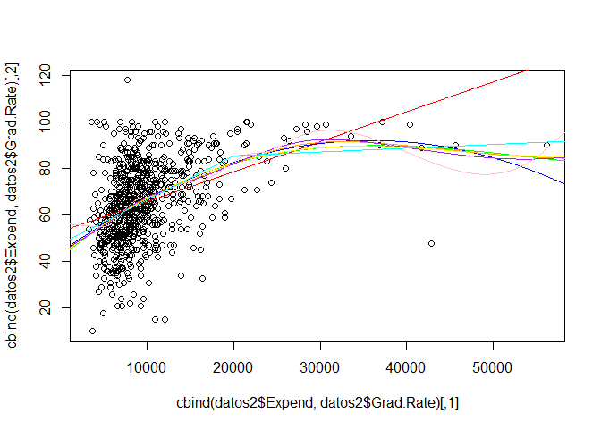

    modc17=gam(Grad.Rate~ Private+Apps+s(Accept)+s(Enroll)+s(Top10perc) + bs(Top25perc ,knots =c(30) )+s(F.Undergrad) + poly(P.Undergrad,2) +Outstate +Room.Board +Books+s(Personal)+poly(S.F.Ratio,2)+s(perc.alumni)+Expend, data = datos2)
    modc17.2=gam(Grad.Rate~ Private+Apps+s(Accept)+s(Enroll)+s(Top10perc) + bs(Top25perc ,knots =c(30) )+s(F.Undergrad) + poly(P.Undergrad,2) +Outstate +Room.Board +Books+s(Personal)+poly(S.F.Ratio,2)+s(perc.alumni)+poly(Expend,2), data = datos2)
    modc17.3=gam(Grad.Rate~ Private+Apps+s(Accept)+s(Enroll)+s(Top10perc) + bs(Top25perc ,knots =c(30) )+s(F.Undergrad) + poly(P.Undergrad,2) +Outstate +Room.Board +Books+s(Personal)+poly(S.F.Ratio,2)+s(perc.alumni)+poly(Expend,3), data = datos2)
    modc17.4=gam(Grad.Rate~ Private+Apps+s(Accept)+s(Enroll)+s(Top10perc) + bs(Top25perc ,knots =c(30) )+s(F.Undergrad) + poly(P.Undergrad,2) +Outstate +Room.Board +Books+s(Personal)+poly(S.F.Ratio,2)+s(perc.alumni)+poly(Expend,4), data = datos2)
    modc17.s=gam(Grad.Rate~ Private+Apps+s(Accept)+s(Enroll)+s(Top10perc) + bs(Top25perc ,knots =c(30) )+s(F.Undergrad) + poly(P.Undergrad,2) +Outstate +Room.Board +Books+s(Personal)+poly(S.F.Ratio,2)+s(perc.alumni)+s(Expend), data = datos2)
    modc17.s5=gam(Grad.Rate~ Private+Apps+s(Accept)+s(Enroll)+s(Top10perc) + bs(Top25perc ,knots =c(30) )+s(F.Undergrad) + poly(P.Undergrad,2) +Outstate +Room.Board +Books+s(Personal)+poly(S.F.Ratio,2)+s(perc.alumni)+s(Expend,5), data = datos2)
    modc17.s10=gam(Grad.Rate~ Private+Apps+s(Accept)+s(Enroll)+s(Top10perc) + bs(Top25perc ,knots =c(30) )+s(F.Undergrad) + poly(P.Undergrad,2) +Outstate +Room.Board +Books+s(Personal)+poly(S.F.Ratio,2)+s(perc.alumni)+s(Expend,10), data = datos2)
    modc17.bs=gam(Grad.Rate~ Private+Apps+s(Accept)+s(Enroll)+s(Top10perc) + bs(Top25perc ,knots =c(30) )+s(F.Undergrad) + poly(P.Undergrad,2) +Outstate +Room.Board +Books+s(Personal)+poly(S.F.Ratio,2)+s(perc.alumni)+bs(Expend,knots = 20000, degree = 1), data = datos2)

    anova(modc16,modc17,modc17.2,modc17.3,modc17.4)

    ## Analysis of Deviance Table
    ## 
    ## Model 1: Grad.Rate ~ Private + Apps + s(Accept) + s(Enroll) + s(Top10perc) + 
    ##     bs(Top25perc, knots = c(30)) + s(F.Undergrad) + poly(P.Undergrad, 
    ##     2) + Outstate + Room.Board + Books + s(Personal) + poly(S.F.Ratio, 
    ##     2) + s(perc.alumni)
    ## Model 2: Grad.Rate ~ Private + Apps + s(Accept) + s(Enroll) + s(Top10perc) + 
    ##     bs(Top25perc, knots = c(30)) + s(F.Undergrad) + poly(P.Undergrad, 
    ##     2) + Outstate + Room.Board + Books + s(Personal) + poly(S.F.Ratio, 
    ##     2) + s(perc.alumni) + Expend
    ## Model 3: Grad.Rate ~ Private + Apps + s(Accept) + s(Enroll) + s(Top10perc) + 
    ##     bs(Top25perc, knots = c(30)) + s(F.Undergrad) + poly(P.Undergrad, 
    ##     2) + Outstate + Room.Board + Books + s(Personal) + poly(S.F.Ratio, 
    ##     2) + s(perc.alumni) + poly(Expend, 2)
    ## Model 4: Grad.Rate ~ Private + Apps + s(Accept) + s(Enroll) + s(Top10perc) + 
    ##     bs(Top25perc, knots = c(30)) + s(F.Undergrad) + poly(P.Undergrad, 
    ##     2) + Outstate + Room.Board + Books + s(Personal) + poly(S.F.Ratio, 
    ##     2) + s(perc.alumni) + poly(Expend, 3)
    ## Model 5: Grad.Rate ~ Private + Apps + s(Accept) + s(Enroll) + s(Top10perc) + 
    ##     bs(Top25perc, knots = c(30)) + s(F.Undergrad) + poly(P.Undergrad, 
    ##     2) + Outstate + Room.Board + Books + s(Personal) + poly(S.F.Ratio, 
    ##     2) + s(perc.alumni) + poly(Expend, 4)
    ##   Resid. Df Resid. Dev Df Deviance Pr(>Chi)   
    ## 1       739     114685                        
    ## 2       738     113242  1  1443.02 0.002074 **
    ## 3       737     112045  1  1196.51 0.005046 **
    ## 4       736     111983  1    61.75 0.524106   
    ## 5       735     111847  1   136.27 0.343995   
    ## ---
    ## Signif. codes:  0 '***' 0.001 '**' 0.01 '*' 0.05 '.' 0.1 ' ' 1

    errores_tab(list(modc16,modc17,modc17.2,modc17.3,modc17.4,modc17.s,modc17.s5,modc17.s10,modc17.bs))

    ##                                                                     
    ## ecm         147.5994    145.7422    144.2023    144.1228    143.9474
    ## deviance 114684.7018 113241.6859 112045.1711 111983.4184 111847.1499
    ## aic        6163.7577   6155.9191   6149.6656   6151.2372   6152.2911
    ##                                                       
    ## ecm         143.804    143.7041    143.2012    143.952
    ## deviance 111735.690 111658.0481 111267.3113 111850.689
    ## aic        6151.516   6152.9769   6160.2521   6148.316

Parece interesante el modelo con splines lineales usando un nodo.

    modc17=modc17.bs
    modc=modc17
    summary(modc)

    ## 
    ## Call: gam(formula = Grad.Rate ~ Private + Apps + s(Accept) + s(Enroll) + 
    ##     s(Top10perc) + bs(Top25perc, knots = c(30)) + s(F.Undergrad) + 
    ##     poly(P.Undergrad, 2) + Outstate + Room.Board + Books + s(Personal) + 
    ##     poly(S.F.Ratio, 2) + s(perc.alumni) + bs(Expend, knots = 20000, 
    ##     degree = 1), data = datos2)
    ## Deviance Residuals:
    ##      Min       1Q   Median       3Q      Max 
    ## -44.1211  -7.4725  -0.4134   6.5312  48.6451 
    ## 
    ## (Dispersion Parameter for gaussian family taken to be 151.7648)
    ## 
    ##     Null Deviance: 228977.2 on 776 degrees of freedom
    ## Residual Deviance: 111850.7 on 737.0003 degrees of freedom
    ## AIC: 6148.316 
    ## 
    ## Number of Local Scoring Iterations: 3 
    ## 
    ## Anova for Parametric Effects
    ##                                        Df Sum Sq Mean Sq  F value
    ## Private                                 1  28798 28798.4 189.7568
    ## Apps                                    1  25509 25508.5 168.0794
    ## s(Accept)                               1   2427  2426.8  15.9908
    ## s(Enroll)                               1    344   344.5   2.2697
    ## s(Top10perc)                            1  20471 20470.6 134.8837
    ## bs(Top25perc, knots = c(30))            4   3247   811.8   5.3493
    ## s(F.Undergrad)                          1   1125  1125.0   7.4127
    ## poly(P.Undergrad, 2)                    2   4084  2042.2  13.4566
    ## Outstate                                1   7609  7608.5  50.1338
    ## Room.Board                              1    719   718.7   4.7358
    ## Books                                   1    795   795.1   5.2393
    ## s(Personal)                             1   1834  1834.1  12.0850
    ## poly(S.F.Ratio, 2)                      2    716   357.9   2.3585
    ## s(perc.alumni)                          1   5386  5386.1  35.4897
    ## bs(Expend, knots = 20000, degree = 1)   2   3041  1520.3  10.0176
    ## Residuals                             737 111851   151.8         
    ##                                          Pr(>F)    
    ## Private                               < 2.2e-16 ***
    ## Apps                                  < 2.2e-16 ***
    ## s(Accept)                             7.007e-05 ***
    ## s(Enroll)                             0.1323579    
    ## s(Top10perc)                          < 2.2e-16 ***
    ## bs(Top25perc, knots = c(30))          0.0002996 ***
    ## s(F.Undergrad)                        0.0066296 ** 
    ## poly(P.Undergrad, 2)                  1.820e-06 ***
    ## Outstate                              3.355e-12 ***
    ## Room.Board                            0.0298579 *  
    ## Books                                 0.0223647 *  
    ## s(Personal)                           0.0005381 ***
    ## poly(S.F.Ratio, 2)                    0.0952762 .  
    ## s(perc.alumni)                        3.970e-09 ***
    ## bs(Expend, knots = 20000, degree = 1) 5.099e-05 ***
    ## Residuals                                          
    ## ---
    ## Signif. codes:  0 '***' 0.001 '**' 0.01 '*' 0.05 '.' 0.1 ' ' 1
    ## 
    ## Anova for Nonparametric Effects
    ##                                       Npar Df Npar F     Pr(F)    
    ## (Intercept)                                                       
    ## Private                                                           
    ## Apps                                                              
    ## s(Accept)                                   3 2.1368   0.09422 .  
    ## s(Enroll)                                   3 7.6680 4.738e-05 ***
    ## s(Top10perc)                                3 0.8640   0.45940    
    ## bs(Top25perc, knots = c(30))                                      
    ## s(F.Undergrad)                              3 3.5521   0.01418 *  
    ## poly(P.Undergrad, 2)                                              
    ## Outstate                                                          
    ## Room.Board                                                        
    ## Books                                                             
    ## s(Personal)                                 3 2.0129   0.11073    
    ## poly(S.F.Ratio, 2)                                                
    ## s(perc.alumni)                              3 1.9430   0.12122    
    ## bs(Expend, knots = 20000, degree = 1)                             
    ## ---
    ## Signif. codes:  0 '***' 0.001 '**' 0.01 '*' 0.05 '.' 0.1 ' ' 1
