Resumen.
--------

En este documento esta descrito todo el proceso de construcción de
modelos con los datos propuestos.

Para el problema de clasificación ha sido necesaria la selección de
variables, pues los resultados obtendios con todas las variables eran
muy malos (9 variables *k* = 9, nucleo="optimal").

Para el problema de regresión se han buscado distintos caminos para
tratar de construir un buen modelo. En primer lugar se han construido
dos modelos knn y knn aleatorio, en segundo lugar se han seleccionado
variables y se han vuelto a construir otros dos modelos. En vista de que
los errores obtenidos eran muy altos, se han tratado de localizar
valores atipicos de la variable objetivo (los cuales tenian unos valores
muy altos). Hemos aplicado los modelos construidos hasta el momento
eliminando dichos datos atipicos del conjunto test, y como era de
esperar, se ha reducido mucho el error.

En vista de los errores atipicos de nuestros datos, se han vuelto a
construir todos los modelos anteriores (volviendo a seleccionar
variables), pero eliminando los datos atipicos del conjunto de
entrenamiento.

Al comparar todos los resultados, parece que el mejor modelo es el knn
aleatorio con todas las variables construido sobre todos los datos de
entrenamiento y con *k* = 4.

Preprocesado
------------

En primer lugar, cargamos los datos y los separamos en un conjunto test
y uno de entrenamiento

    datos=read.csv("C:/Users/AlvaroSanchez91/Desktop/Master Big Data Sevilla/AEM Aprendizage Estadistico y Modelizacion/6. Regresión y clasificación mediante KNN/ejercicio/datawork.csv", header=TRUE, sep=";")
    head(datos)

    ##   clasobj varobj  x01  x02   x03   x04    x05  x06    x07    x08   x09
    ## 1      CC  12.63 0.64 0.68 25.06 33.42 103.18 1.08  80.27  14.83 18.09
    ## 2      AA  25.08 0.70 0.72 16.08 10.98  38.31 1.62  57.32  30.72 17.13
    ## 3      DD  28.84 0.45 0.71 57.78 48.77 148.21 0.34 174.54  50.72  2.72
    ## 4      AA  26.58 0.15 0.56 17.79 10.04  30.33 0.86  57.44 167.47 23.09
    ## 5      BB  18.53 0.70 0.54 17.48 25.51  82.42 1.04  57.55  40.13  1.70
    ## 6      CC  14.20 0.37 0.75 50.01 32.25  99.49 0.92 153.46   1.90  1.76
    ##    x10  x11   x12   x13   x14   x15   x16   x17   x18   x19   x20   x21
    ## 1 0.20 2.78 17.63 18.91 21.03 18.67 18.47 18.02 19.28 18.55 18.54 18.51
    ## 2 0.10 1.73 11.99 15.53 13.01 12.57 12.17 12.69 13.77 12.07 14.33 10.40
    ## 3 0.46 4.81 21.59 21.26 23.70 20.53 23.24 21.10 20.57 21.93 22.07 24.91
    ## 4 0.36 2.94 12.74 12.92 12.01 12.76 12.22 12.95 15.14 12.60 12.44 12.60
    ## 5 0.19 2.22 15.76 17.39 15.61 14.56 15.75 17.42 13.69 16.67 18.05 15.55
    ## 6 0.15 3.45 19.10 18.75 20.30 17.79 18.12 20.73 20.65 20.51 20.34 18.69
    ##     x22   x23   x24   x25   x26   x27   x28  x29 x30    x31    x32    x33
    ## 1 17.88 18.34 19.55 18.72 19.06 20.70 19.76 0.61  21 145.50 133.89 147.01
    ## 2 14.14 11.48 11.58 12.26 14.34 16.94 13.07 0.54  14  83.26  99.58  94.14
    ## 3 22.48 22.07 23.78 22.00 21.16 20.70 21.28 0.32  20 189.06 172.93 171.65
    ## 4 13.83 14.23 11.63 13.27 13.77 15.50 15.00 0.46  11  91.26  96.73 108.31
    ## 5 16.24 15.20 14.79 15.70 14.81 14.48 18.50 0.30  17 119.27 122.19 112.85
    ## 6 19.48 18.71 19.77 18.17 21.09 21.65 20.19 0.25  17 147.96 139.67 154.47
    ##      x34    x35    x36   x37    x38    x39    x40
    ## 1 170.02 141.98 82.730 50.07 397.37 393.34 415.37
    ## 2 112.65  92.13 60.168 37.20 225.98 276.34 312.86
    ## 3 192.73 168.08 86.408  9.47 515.22 450.76 505.43
    ## 4 110.19 103.93 56.068 24.95 245.02 261.97 313.97
    ## 5 124.90 124.92 62.486 12.78 345.26 295.83 357.74
    ## 6 175.79 148.41 88.878 33.73 400.78 407.80 473.13

    set.seed(564)
    n=dim(datos)[1]
    id_test=sample(1:n,floor(n/3))
    id_train=c(1:n)[-id_test]
    test=datos[id_test,]
    train=datos[id_train,]

Para el algoritmo knn, es interesante tipificar los datos. Algunos de
los algoritmos con los que vamos a trabajar tienen la opción de hacerlo,
pero parece mejor tipificarlos nosotros mismos, y usar esos datos para
todos los algoritmos. Trabajaremos como si no conociesemos los datos de
entrenamiento, de modo que para la transformación solo usaremos las
medias y varianzas de estos.

    varianzas=apply(train[-c(1,2)],2, var)
    medias=apply(train[-c(1,2)],2, mean)

    train_trans=train
    train_trans[-c(1,2)]=train_trans[-c(1,2)]-medias
    train_trans[-c(1,2)]=train_trans[-c(1,2)]/sqrt(varianzas)

    test_trans=test
    test_trans[-c(1,2)]=test_trans[-c(1,2)]-medias
    test_trans[-c(1,2)]=test_trans[-c(1,2)]/sqrt(varianzas)

Problema de clasificación.
--------------------------

    library(kknn)
    set.seed(1234)
    (fit.train1 <- train.kknn(clasobj ~ . -varobj, train_trans, kmax = 20, scale="FALSE",
                              kernel = c("triangular", "rectangular", "epanechnikov", "optimal"), 
                              distance = 1))

    ## 
    ## Call:
    ## train.kknn(formula = clasobj ~ . - varobj, data = train_trans,     kmax = 20, distance = 1, kernel = c("triangular", "rectangular",         "epanechnikov", "optimal"), scale = "FALSE")
    ## 
    ## Type of response variable: nominal
    ## Minimal misclassification: 0.06111736
    ## Best kernel: optimal
    ## Best k: 10

    fit.train1$best.parameters

    ## $kernel
    ## [1] "optimal"
    ## 
    ## $k
    ## [1] 10

    plot(fit.train1)

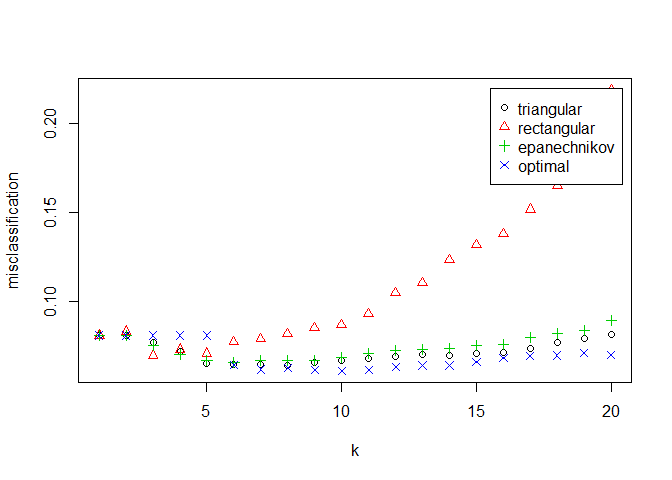

Mediante validación cruzada, los errores minimos se obtienen al aplicar
el algoritmos con el nucleo "optimal", y con *k* = 10. Veamos los
errores que comete este modelo al predecir sobre el conjunto test.

    predicciones_test=predict(fit.train1, newdata = test_trans)
    print (table(predicciones_test,test_trans$clasobj))

    ##                  
    ## predicciones_test  AA  BB  CC  DD
    ##                AA 186 210  43   7
    ##                BB  15 208 280  28
    ##                CC   1  26 140 143
    ##                DD   2   0   4  40

Numero de fallos:

    print( sum(predicciones_test!=test_trans$clasobj))

    ## [1] 759

Numero de aciertos:

    print( sum(predicciones_test==test_trans$clasobj))

    ## [1] 574

Las predicciones son muy malas, esto se puede deber a que estemos usando
demasiadas variables predictoras y que este metodo no diferencie en
funcion de las realmente importantes. Intentemos mejorar el resultado
seleccionando variables mediante el uso de knn aleatorios.

Lo primero que tenemos que hacer es decidir el numero de variables que
queremos en cada predictor del knn aleatorio asi como el numero de
estos. Para ello, tomaremos una cantidad de predictores tal que tengamos
una probabilidad del 0.99 de que cada variable aparece al menos una vez
en el modelo (el numero de variables por predictor lo tomaremos
*m* = 20).

    library(rknn)

    ## Loading required package: gmp

    ## Warning: package 'gmp' was built under R version 3.3.3

    ## 
    ## Attaching package: 'gmp'

    ## The following objects are masked from 'package:base':
    ## 
    ##     %*%, apply, crossprod, matrix, tcrossprod

    set.seed(1234)
    p=ncol(datos)-2#quitamos las dos variables objetivo
    m=20
    (rnc=r(p,m,eta=0.99,method="binomial"))

    ## [1] 12

Basta con que tomemos 12 predictores, tomaremos 30. Comencemos
seleccionando variables por un metodo geometrico, en el que en cada paso
nos quedamos con el 80% de las mejores variables.

    datosrknn.selG = rknnBeg(data=train_trans[-c(1,2)], y=train_trans$clasobj, k = 10,
                             r=30, mtry = m , seed=987654321,
                             fixed.partition = FALSE, pk = 0.8 , stopat=10)

Numero de variables seleccionadas en cada paso:

    datosrknn.selG$p

    ## [1] 40 32 26 21 17 14 11

Graficas de acuracidad y soporte medio para cada paso:

    plot(datosrknn.selG$mean_accuracy,type="l", xlab="Paso", ylab="Acuracidad media",
         main="medida de acuracidad en cada paso. Etapa Geométrica")

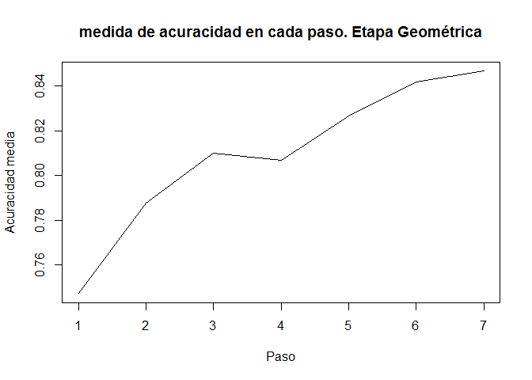

    plot(datosrknn.selG$mean_support,type="l", xlab="Paso", ylab="Soporte medio",
         main="Soporte medio en cada paso. Etapa Geométrica")

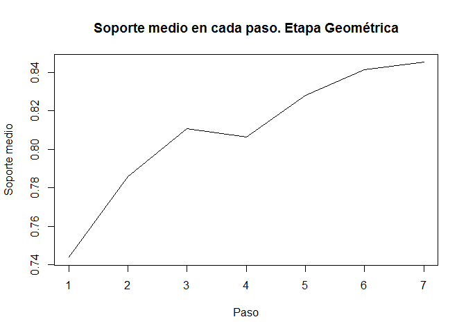 Variables
del paso anterior a la mejor seleccion:

    (mejorselgeo <- prebestset(datosrknn.selG, criterion="mean_support"))

    ##  [1] "x32" "x35" "x31" "x18" "x33" "x25" "x12" "x20" "x39" "x24" "x21"
    ## [12] "x34" "x22" "x38"

Apliquemosle a dichas variables una selección lineal.

    set.seed(1234)
    datosrknn.selLIN = rknnBel(data=train_trans[mejorselgeo], y=train_trans$varobj, k = 4, r=50, 
                               mtry = m , seed=987654321, fixed.partition = FALSE, d=1, 
                               stopat=4)

    plot(datosrknn.selLIN$mean_accuracy,type="l", xlab="Paso", ylab="Acuracidad media",
         main="medida de acuracidad en cada paso. Etapa Lineal")

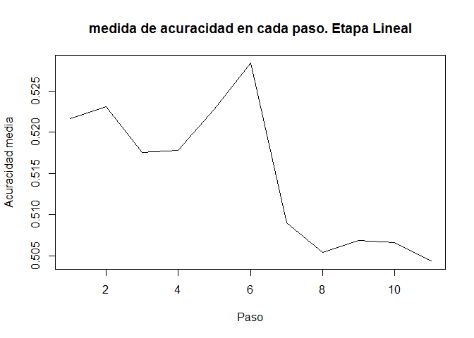

    plot(datosrknn.selLIN$mean_support,type="l", xlab="Paso", ylab="Soporte medio",
         main="Soporte medio en cada paso. Etapa Lineal")

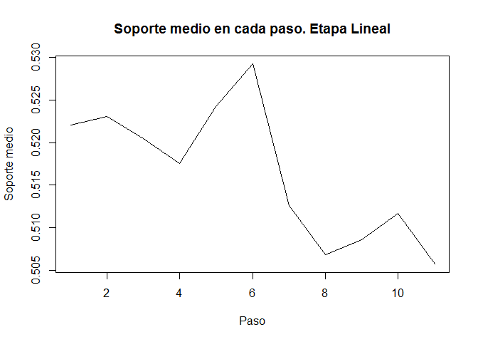

    plot(datosrknn.selLIN$mean_support,datosrknn.selLIN$mean_accuracy)

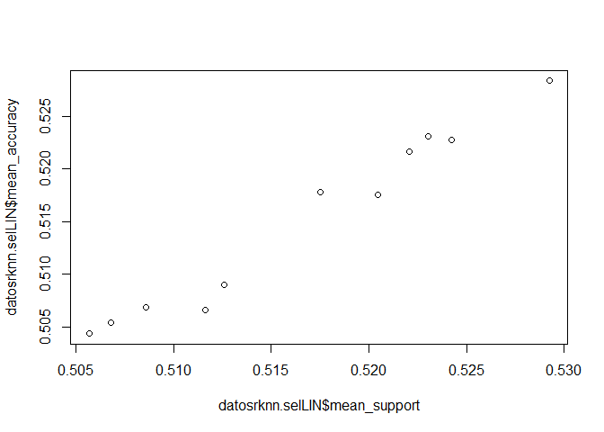

Elijamos entonces el paso con mejor soporte medio (coincide con el de
mejor acuracidad).

    bestset(datosrknn.selLIN, criterion="mean_support")

    ## [1] "x34" "x12" "x33" "x20" "x39" "x18" "x24" "x22" "x35"

    bestset(datosrknn.selLIN, criterion="mean_accuracy")

    ## [1] "x34" "x12" "x33" "x20" "x39" "x18" "x24" "x22" "x35"

    variables_sel=bestset(datosrknn.selLIN, criterion="mean_accuracy")

Construyamos nuestro modelo con dichas variables.

    set.seed(1234)
    (fit.train_sel <- train.kknn(clasobj ~., train_trans[c(variables_sel,'clasobj')], 
                                 kmax = 20,scale="FALSE",kernel = c("triangular", "rectangular",
                                 "epanechnikov", "optimal"), distance = 1))

    ## 
    ## Call:
    ## train.kknn(formula = clasobj ~ ., data = train_trans[c(variables_sel,     "clasobj")], kmax = 20, distance = 1, kernel = c("triangular",     "rectangular", "epanechnikov", "optimal"), scale = "FALSE")
    ## 
    ## Type of response variable: nominal
    ## Minimal misclassification: 0.03337083
    ## Best kernel: optimal
    ## Best k: 9

Veamos cuales son el mejor nucleo y el mejor k.

    fit.train_sel$best.parameters

    ## $kernel
    ## [1] "optimal"
    ## 
    ## $k
    ## [1] 9

    plot(fit.train_sel)

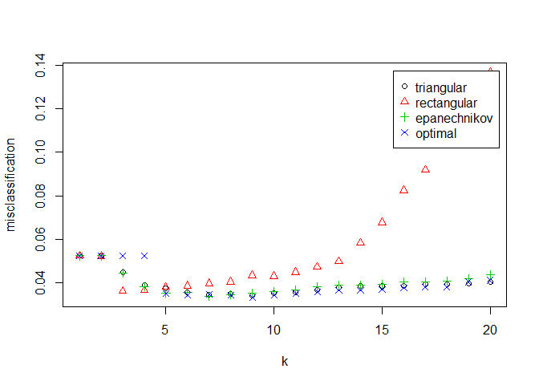

Matriz de confusión:

    predicciones_test=predict(fit.train_sel, newdata = test_trans)
    table(predicciones_test,test_trans$clasobj)

    ##                  
    ## predicciones_test  AA  BB  CC  DD
    ##                AA 168  62  27   5
    ##                BB  31 322  80  19
    ##                CC   4  57 311  48
    ##                DD   1   3  49 146

Fallos:

    sum(predicciones_test!=test_trans$clasobj)

    ## [1] 386

Aciertos:

    sum(predicciones_test==test_trans$clasobj)

    ## [1] 947

Hemos mejorado considerablemente los resultados. Otra opción para tratar
de mejorar el resultado seria calcular las componentes principales.

Problema de regresión.
----------------------

### Algoritmo knn con todas las variables.

    set.seed(357)
    (train.con <- train.kknn(varobj ~ .-clasobj, data = train_trans,
                             kmax = 20, kernel = c("rectangular", "triangular", "epanechnikov",
                                                   "gaussian", "rank", "optimal")))

    ## 
    ## Call:
    ## train.kknn(formula = varobj ~ . - clasobj, data = train_trans,     kmax = 20, kernel = c("rectangular", "triangular", "epanechnikov",         "gaussian", "rank", "optimal"))
    ## 
    ## Type of response variable: continuous
    ## minimal mean absolute error: 2.671159
    ## Minimal mean squared error: 49.8288
    ## Best kernel: triangular
    ## Best k: 4

    plot(train.con,main="Error cuadrático medio para los posibles nucleos y k. " ) 

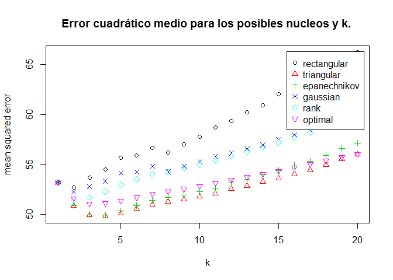 Tomamos
*k* = 4 y el nucleo triangular, mejor opcion segun el metodo de
validación cruzada. Veamos que resultados obtenemos al predecir sobre el
conjunto test.

    predicciones_test=predict(train.con, newdata = test_trans)
    plot(test_trans$varobj,predicciones_test,ylim=c(-10,200),xlim=c(-10,200),
         main='Valor real vs prediccion')
    abline(a=0,b=1)

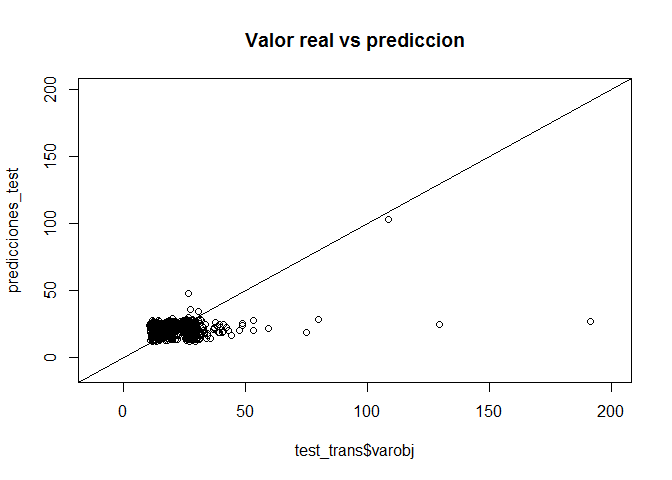

ECM para el conjunto test:

    (ecm_knn=sum((predicciones_test-test_trans$varobj)^2)/length(test_trans$varobj))

    ## [1] 444.161

ECM para el conjunto de entrenamiento:

    train.con$MEAN.SQU[train.con$best.parameters$k,train.con$best.parameters$kernel]

    ## [1] 49.8288

### Algoritmo knn aleatorio con todas las variables.

    set.seed(1234)
    p=ncol(datos)-2
    m=10
    (rnc=r(p,m,eta=0.99,method="binomial"))#Necesitamos almenos 29 predicctores.

    ## [1] 29

    datosrknn = rknnReg(data=train_trans[-c(1,2)],test_trans[-c(1,2)], 
                        y=train_trans$varobj, k = 4, r=40, mtry = m , seed=987654321 )

Observemos la grafica para medir la bondad de este modelo.

    plot(test_trans$varobj,datosrknn$pred,xlim=c(0,200),ylim=c(0,200),
         main='Valor real vs prediccion')
    abline(a=0,b=1)

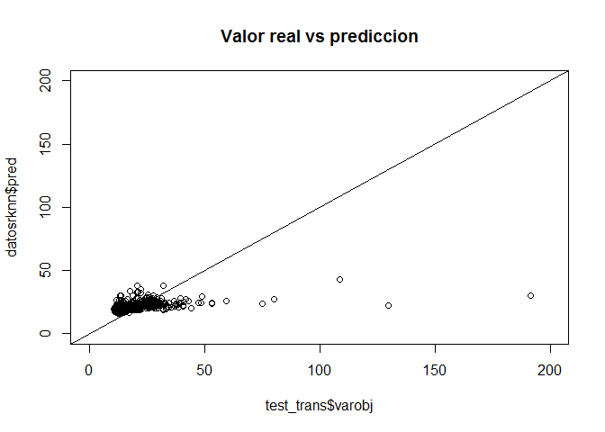

ECM sobre los datos test:

    (ecm_rknn=sum((datosrknn$pred-test_trans$varobj)^2)/length(test_trans$varobj))

    ## [1] 413.5552

Parece que tenemos un mejor resultado con este modelo. Podemos intentar
seleccionar variables para ver si mejoramos aun mas los resultados.

Selección de variables para regresión.
--------------------------------------

Comencemos con una selección geometrica, tomando en cada paso el 80% de
las mejores variables.

    set.seed(1234)
    datosrknn.selG = rknnBeg(data=train_trans[-c(1,2)], y=train_trans$varobj,
                             k = 4, r=50, mtry = m , seed=987654321,
                             fixed.partition = FALSE, pk = 0.8 , stopat=10)

Numero de variables seleccionadas en cada paso.

    datosrknn.selG$p

    ## [1] 40 32 26 21 17 14 11

Numero de variables de la mejor selección.

    length(bestset(datosrknn.selG, criterion="mean_accuracy"))

    ## [1] 17

    length(bestset(datosrknn.selG, criterion="mean_support"))

    ## [1] 17

    plot(datosrknn.selG$mean_accuracy,type="l", xlab="Paso", ylab="Acuracidad media",
         main="medida de acuracidad en cada paso. Etapa Geométrica")

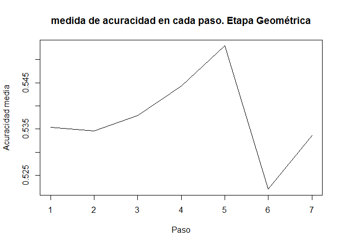

    plot(datosrknn.selG$mean_support,type="l", xlab="Paso", ylab="Soporte medio",
         main="Soporte medio en cada paso. Etapa Geométrica")

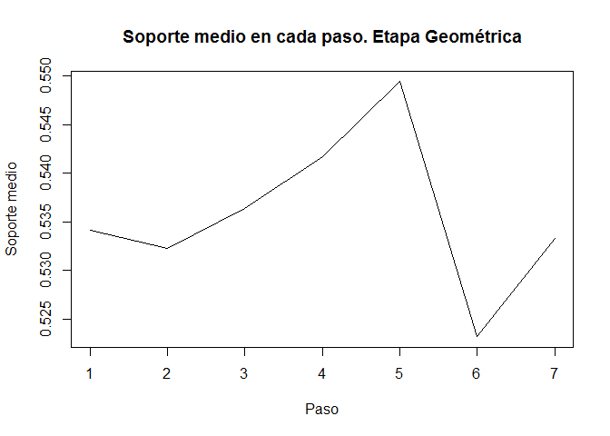

    (mejorselgeo <- prebestset(datosrknn.selG, criterion="mean_support"))

    ##  [1] "x12" "x11" "x16" "x09" "x32" "x13" "x35" "x21" "x36" "x27" "x17"
    ## [12] "x08" "x38" "x23" "x40" "x29" "x14" "x20" "x39" "x28" "x31"

Nos quedaremos con las variables del paso anterior al mejor.
Seleccionamos linealmente partiendo de la anterior selección geometrica.

    ncol(train_trans[,mejorselgeo])

    ## [1] 21

    set.seed(1234)
    datosrknn.selLIN = rknnBel(data=train_trans[mejorselgeo], y=train_trans$varobj, 
                               k = 4, r=50, 
                               mtry = m , seed=987654321, fixed.partition = FALSE, d=1, 
                               stopat=4)

    plot(datosrknn.selLIN$mean_accuracy,type="l", xlab="Paso", ylab="Acuracidad media",
         main="medida de acuracidad en cada paso. Etapa Lineal")

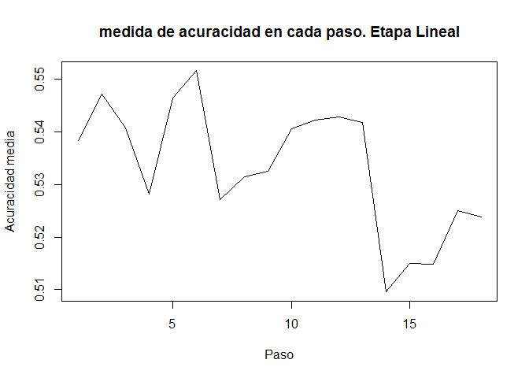

    plot(datosrknn.selLIN$mean_support,type="l", xlab="Paso", ylab="Soporte medio",
         main="Soporte medio en cada paso. Etapa Lineal")

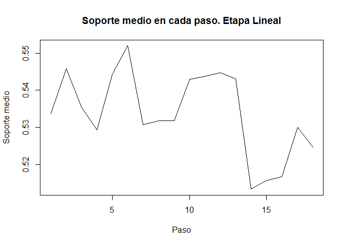

    plot(datosrknn.selLIN$mean_support,datosrknn.selLIN$mean_accuracy)

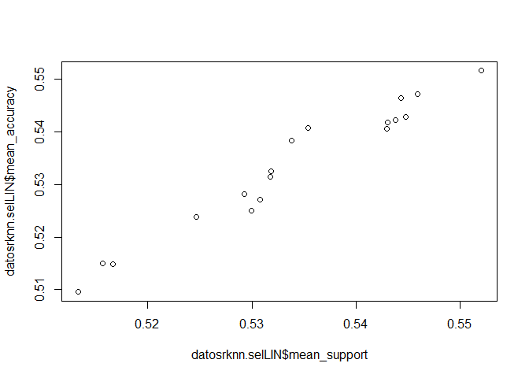

    bestset(datosrknn.selLIN, criterion="mean_support")

    ##  [1] "x27" "x11" "x23" "x36" "x13" "x08" "x14" "x32" "x09" "x40" "x17"
    ## [12] "x31" "x29" "x38" "x12" "x21"

    bestset(datosrknn.selLIN, criterion="mean_accuracy")

    ##  [1] "x27" "x11" "x23" "x36" "x13" "x08" "x14" "x32" "x09" "x40" "x17"
    ## [12] "x31" "x29" "x38" "x12" "x21"

    variables_sel=bestset(datosrknn.selLIN, criterion="mean_accuracy")

Ahora predizcamos basandonos unicamente es las variables seleccionadas.

### Knn con variables seleccionadas.

    set.seed(357)
    (train.knn.sel <- train.kknn(
      varobj ~ x27+x11+x23+x36+x13+x08+x14+x32+x09+x40+x17+x31+x29+x38+x12+x21,
      data = train_trans,kmax = 20, kernel = c("rectangular", "triangular", "epanechnikov",
                                                   "gaussian", "rank", "optimal")))

    ## 
    ## Call:
    ## train.kknn(formula = varobj ~ x27 + x11 + x23 + x36 + x13 + x08 +     x14 + x32 + x09 + x40 + x17 + x31 + x29 + x38 + x12 + x21,     data = train_trans, kmax = 20, kernel = c("rectangular",         "triangular", "epanechnikov", "gaussian", "rank", "optimal"))
    ## 
    ## Type of response variable: continuous
    ## minimal mean absolute error: 2.324071
    ## Minimal mean squared error: 43.51683
    ## Best kernel: epanechnikov
    ## Best k: 2

    plot(train.knn.sel,main="Error cuadrático medio para los posibles nucleos y k. " ) 

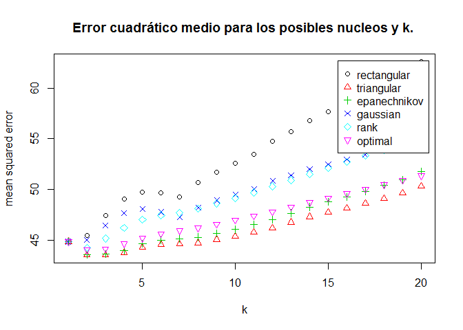

Veamos que tal predice este modelo sobre el conjunto test.

    predicciones_test=predict(train.knn.sel, newdata = test_trans)

    plot(test_trans$varobj,predicciones_test,xlim=c(0,200),ylim=c(0,200),
         main='Valor real vs prediccion')
    abline(a=0,b=1)

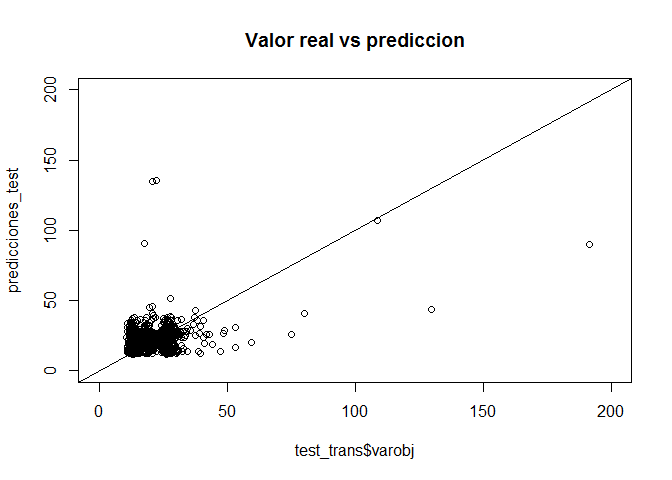

ECM en datos test:

    (ecm_knn_sel=sum((predicciones_test-test_trans$varobj)^2)/length(test_trans$varobj))

    ## [1] 453.4585

Estas predicciones son peores que las obtenidas sin seleccionar
variables mediante knn. Costruyamos a continuación un metodo knn
aleatorio usando las variables seleccionadas.

### Knn aleatorio con variables seleccionadas.

    set.seed(1234)
    datosrknn.sel = rknnReg(data=train_trans[variables_sel],test_trans[variables_sel], 
                            y=train_trans$varobj, k = 4, r=30, mtry = 2 , seed=987654321 )

Veamos que tal predice este modelo:

    plot(test_trans$varobj,datosrknn.sel$pred,xlim=c(0,200),ylim=c(0,200),
         main='Valor real vs prediccion')
    abline(a=0,b=1)

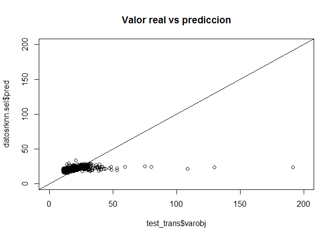 ECM en
datos test:

    (ecm_rknn_sel=sum((datosrknn.sel$pred-test_trans$varobj)^2)/length(test_trans$varobj))

    ## [1] 422.0138

Veamos con que modelo hemos obtenido el menor error cuadrático medio.

    errores=t.data.frame( data.frame(c(ecm_knn,ecm_rknn,ecm_knn_sel,ecm_rknn_sel)))
    colnames(errores)=c('ecm_knn','ecm_rknn','ecm_knn_sel','ecm_rknn_sel')
    rownames(errores)='ecm'
    print(errores)

    ##     ecm_knn ecm_rknn ecm_knn_sel ecm_rknn_sel
    ## ecm 444.161 413.5552    453.4585     422.0138

El modelo con menor error sobre el conjunto test es el de knn aleatorio
con todas las variables, aun así parece que tenemos errores muy altos,
parece que se debe a los datos atípicos que se observan en las graficas
que enfrentan valores reales y predicciones (hay muchos que no aparecen
en dichas graficas).

Podriamos ver que error cometemos sin tener en cuenta los datos atípicos
del conjunto test ,tal vez seria buena idea eliminarlos también del
entrenamiento.

    lim=min( boxplot(test_trans$varobj)$out)

    test_trans2=test_trans[test_trans$varobj<lim,]

    predicciones_test=predict(train.con, newdata = test_trans2)
    (ecm_knn=sum((predicciones_test-test_trans2$varobj)^2)/length(test_trans2$varobj))

    ## [1] 51.89133

    set.seed(1234)
    datosrknn = rknnReg(data=train_trans[-c(1,2)],test_trans2[-c(1,2)], y=train_trans$varobj,
                        k = 4, r=40, mtry = m , seed=987654321 )
    (ecm_rknn=sum((datosrknn$pred-test_trans2$varobj)^2)/length(test_trans2$varobj))

    ## [1] 24.23535

    predicciones_test=predict(train.knn.sel, newdata = test_trans2)
    (ecm_knn_sel=sum((predicciones_test-test_trans2$varobj)^2)/length(test_trans2$varobj))

    ## [1] 81.82959

    set.seed(1234)
    datosrknn.sel = rknnReg(data=train_trans[variables_sel],test_trans2[variables_sel], 
                            y=train_trans$varobj, k = 4, r=30, mtry = 2 , seed=987654321 )

    (ecm_rknn_sel=sum((datosrknn.sel$pred-test_trans2$varobj)^2)/length(test_trans2$varobj))

    ## [1] 22.5231

    errores=t.data.frame( data.frame(c(ecm_knn,ecm_rknn,ecm_knn_sel,ecm_rknn_sel)))
    colnames(errores)=c('ecm_knn','ecm_rknn','ecm_knn_sel','ecm_rknn_sel')
    rownames(errores)='ecm'
    print(errores)

    ##      ecm_knn ecm_rknn ecm_knn_sel ecm_rknn_sel
    ## ecm 51.89133 24.23535    81.82959      22.5231

Una vez eliminados los datos atipicos, queda claro que el mejor modelo
es el knn aleatorio, y parece que mejora al seleccionar variables.

Por ultimo, construiremos estos modelos eliminando los valores atipicos
del conjunto de entrenamiento. Volveremos a tipificar los datos una vez
eliminados estos datos atipicos.

    lim=min( boxplot(train$varobj)$out)

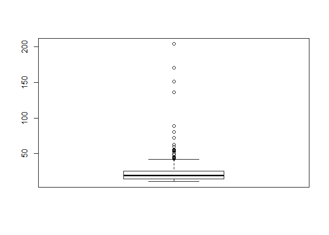

    train=train[train$varobj<lim,]
    varianzas=apply(train[-c(1,2)],2, var)
    medias=apply(train[-c(1,2)],2, mean)

    train_trans=train
    train_trans[-c(1,2)]=train_trans[-c(1,2)]-medias
    train_trans[-c(1,2)]=train_trans[-c(1,2)]/sqrt(varianzas)#Train sin outliers.

    test_trans=test
    test_trans[-c(1,2)]=test_trans[-c(1,2)]-medias
    test_trans[-c(1,2)]=test_trans[-c(1,2)]/sqrt(varianzas)#Test con outliers.

    lim=min( boxplot(test_trans$varobj)$out)

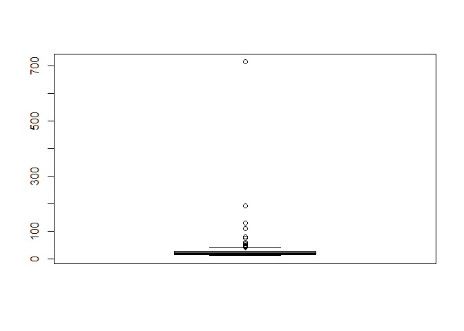

    test_trans2=test_trans[test_trans$varobj<lim,]#Test sin outliers.

### Algoritmo knn con todas las variables sin datos atipicos.

    set.seed(357)
    (train.con.out <- train.kknn(varobj ~ .-clasobj, data = train_trans,
                             kmax = 20, kernel = c("rectangular", "triangular", "epanechnikov",
                                                   "gaussian", "rank", "optimal")))

    ## 
    ## Call:
    ## train.kknn(formula = varobj ~ . - clasobj, data = train_trans,     kmax = 20, kernel = c("rectangular", "triangular", "epanechnikov",         "gaussian", "rank", "optimal"))
    ## 
    ## Type of response variable: continuous
    ## minimal mean absolute error: 1.242644
    ## Minimal mean squared error: 5.744276
    ## Best kernel: triangular
    ## Best k: 4

    plot(train.con.out,main="Error cuadrático medio para los posibles nucleos y k. " ) 

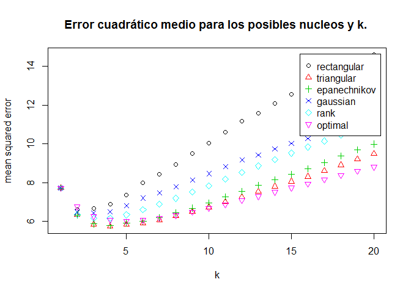

    predicciones_test=predict(train.con.out, newdata = test_trans)
    predicciones_test2=predict(train.con.out, newdata = test_trans2)

ECM para el conjunto test:

    (ecm_knn.out=sum((predicciones_test-test_trans$varobj)^2)/length(test_trans$varobj))

    ## [1] 484.4863

ECM para el conjunto test sin datos atipicos:

    (ecm_knn.out2=sum((predicciones_test2-test_trans2$varobj)^2)/length(test_trans2$varobj))

    ## [1] 98.1375

ECM para el conjunto de entrenamiento:

    train.con.out$MEAN.SQU[train.con$best.parameters$k,train.con$best.parameters$kernel]

    ## [1] 5.744276

### Algoritmo knn aleatorio con todas las variables sin datos atipicos.

    set.seed(1234)
    p=ncol(datos)-2
    m=10
    rnc=r(p,m,eta=0.99,method="binomial")

    datosrknn = rknnReg(data=train_trans[-c(1,2)],test_trans[-c(1,2)], y=train_trans$varobj,
                        k = 4, r=40, mtry = m , seed=987654321 )

    datosrknn2 = rknnReg(data=train_trans[-c(1,2)],test_trans2[-c(1,2)], y=train_trans$varobj,
                         k = 4, r=40, mtry = m , seed=987654321 )

ECM sobre los datos test:

    (ecm_rknn.out=sum((datosrknn$pred-test_trans$varobj)^2)/length(test_trans$varobj))

    ## [1] 439.0336

ECM sobre los datos test sin datos atipicos:

    (ecm_rknn.out2=sum((datosrknn2$pred-test_trans2$varobj)^2)/length(test_trans2$varobj))

    ## [1] 39.30142

Volvemos a seleccionar variables, tratando de mejorar la anterior
selección.

### Selección de variables para regresión sin datos atipicos.

Comencemos con una selección geometrica, tomando en cada paso el 80% de
las mejores variables.

    set.seed(1234)
    datosrknn.selG = rknnBeg(data=train_trans[-c(1,2)], y=train_trans$varobj,
                             k = 4, r=50, mtry = m , seed=987654321,
                             fixed.partition = FALSE, pk = 0.8 , stopat=10)

    plot(datosrknn.selG$mean_accuracy,type="l", xlab="Paso", ylab="Acuracidad media",
         main="medida de acuracidad en cada paso. Etapa Geométrica")

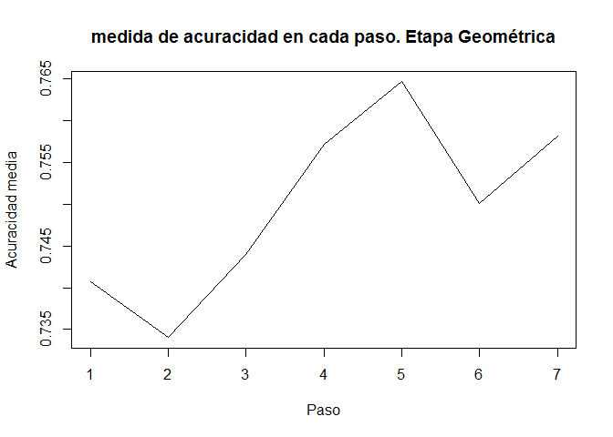

    plot(datosrknn.selG$mean_support,type="l", xlab="Paso", ylab="Soporte medio",
         main="Soporte medio en cada paso. Etapa Geométrica")

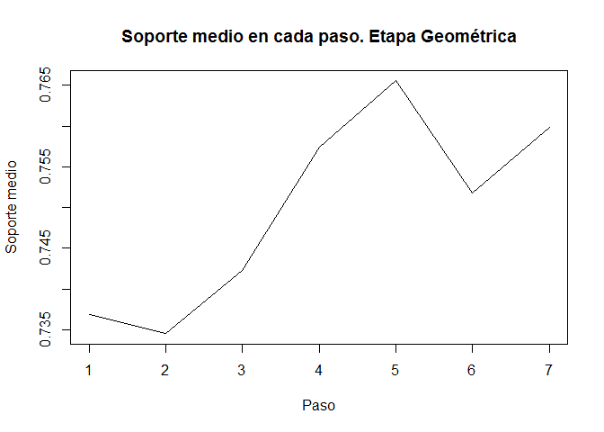

    (mejorselgeo <- prebestset(datosrknn.selG, criterion="mean_support"))

    ##  [1] "x11" "x22" "x15" "x24" "x02" "x33" "x13" "x29" "x09" "x19" "x31"
    ## [12] "x12" "x32" "x04" "x34" "x25" "x28" "x35" "x39" "x40" "x05"

Nos quedaremos con las variables del paso anterior al mejor.
Seleccionamos linealmente partiendo de la anterior selección geometrica.

    set.seed(1234)
    datosrknn.selLIN = rknnBel(data=train_trans[mejorselgeo], y=train_trans$varobj, 
                               k = 4, r=50, 
                               mtry = m , seed=987654321, fixed.partition = FALSE, d=1, 
                               stopat=4)

    plot(datosrknn.selLIN$mean_accuracy,type="l", xlab="Paso", ylab="Acuracidad media",
         main="medida de acuracidad en cada paso. Etapa Lineal")

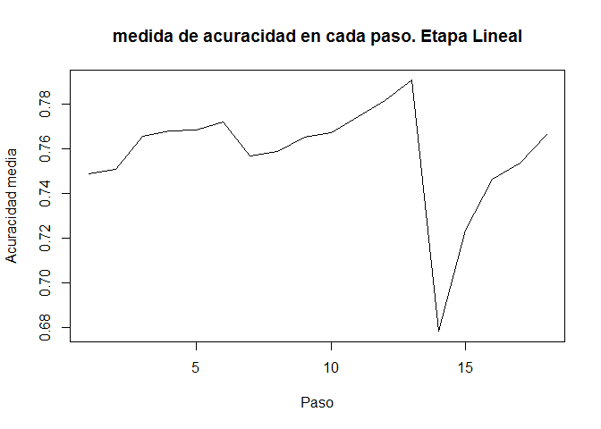

    plot(datosrknn.selLIN$mean_support,type="l", xlab="Paso", ylab="Soporte medio",
         main="Soporte medio en cada paso. Etapa Lineal")

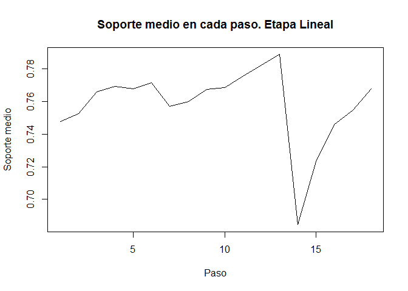

    plot(datosrknn.selLIN$mean_support,datosrknn.selLIN$mean_accuracy)

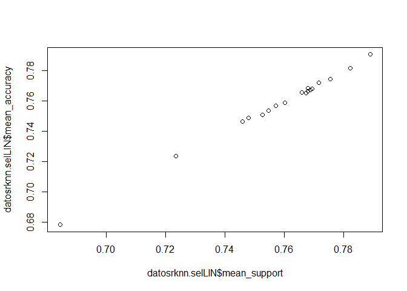

    bestset(datosrknn.selLIN, criterion="mean_support")

    ## [1] "x11" "x32" "x12" "x13" "x19" "x24" "x02" "x29" "x22"

    bestset(datosrknn.selLIN, criterion="mean_accuracy")

    ## [1] "x11" "x32" "x12" "x13" "x19" "x24" "x02" "x29" "x22"

    variables_sel=bestset(datosrknn.selLIN, criterion="mean_accuracy")

### Knn con variables seleccionadas sin valores atipicos.

    cadena='varobj ~ x11'
    for ( i in 2:length(variables_sel)){
      cadena=paste(cadena,'+',variables_sel[i])
    }
    set.seed(357)
    (train.knn.sel <- train.kknn(cadena,
              data = train_trans,kmax = 20, kernel = c("rectangular", 
                                                       "triangular","epanechnikov","gaussian", 
                                                       "rank", "optimal")))

    ## 
    ## Call:
    ## train.kknn(formula = cadena, data = train_trans, kmax = 20, kernel = c("rectangular",     "triangular", "epanechnikov", "gaussian", "rank", "optimal"))
    ## 
    ## Type of response variable: continuous
    ## minimal mean absolute error: 1.004439
    ## Minimal mean squared error: 4.010714
    ## Best kernel: triangular
    ## Best k: 4

    plot(train.knn.sel,main="Error cuadrático medio para los posibles nucleos y k. " ) 

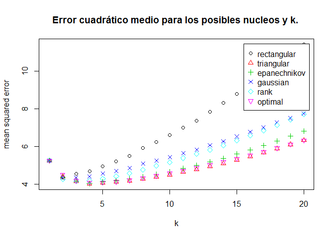

    predicciones_test=predict(train.knn.sel, newdata = test_trans)
    predicciones_test2=predict(train.knn.sel, newdata = test_trans2)

ECM en datos test:

    (ecm_knn_sel.out=sum((predicciones_test-test_trans$varobj)^2)/length(test_trans$varobj))

    ## [1] 488.7385

ECM en datos test sin datos atipicos:

    (ecm_knn_sel.out2=sum((predicciones_test2-test_trans2$varobj)^2)/length(test_trans2$varobj))

    ## [1] 99.43823

### Knn aleatorio con variables seleccionadas sin datos atipicos.

    set.seed(1234)
    datosrknn.sel = rknnReg(data=train_trans[variables_sel],test_trans[variables_sel],
                            y=train_trans$varobj, k = 4, r=30, mtry = 2 , seed=987654321 )

    datosrknn.sel2 = rknnReg(data=train_trans[variables_sel],test_trans2[variables_sel],
                             y=train_trans$varobj, k = 4, r=30, mtry = 2 , seed=987654321 )

ECM en datos test:

    (ecm_rknn_sel.out=sum((datosrknn.sel$pred-test_trans$varobj)^2)/length(test_trans$varobj))

    ## [1] 433.0354

ECM en datos test sin datos atipicos:

    (ecm_rknn_sel.out2=sum((datosrknn.sel2$pred-test_trans2$varobj)^2)/length(test_trans2$varobj))

    ## [1] 31.95165

Veamos los errores obtenidos con los modelos en los que se ha usado el
conjunto de entrenamiento sin datos atipicos (pero aplicandolos sobre
todo el conjunto test).

    errores=t.data.frame( data.frame(c(ecm_knn.out,ecm_rknn.out,
                                       ecm_knn_sel.out,ecm_rknn_sel.out)))
    colnames(errores)=c('ecm_knn.out','ecm_rknn.out','ecm_knn_sel.out','ecm_rknn_sel.out')
    rownames(errores)='ecm'
    print(errores)

    ##     ecm_knn.out ecm_rknn.out ecm_knn_sel.out ecm_rknn_sel.out
    ## ecm    484.4863     439.0336        488.7385         433.0354

Ahora veamos los errores de los mismos modelos, pero sobre el conjunto
test sin valores atipicos.

    errores=t.data.frame( data.frame(c(ecm_knn.out2,ecm_rknn.out2,
                                       ecm_knn_sel.out2,ecm_rknn_sel.out2)))
    colnames(errores)=c('ecm_knn.out2','ecm_rknn.out2','ecm_knn_sel.out2','ecm_rknn_sel.out2')
    rownames(errores)='ecm'
    print(errores)

    ##     ecm_knn.out2 ecm_rknn.out2 ecm_knn_sel.out2 ecm_rknn_sel.out2
    ## ecm      98.1375      39.30142         99.43823          31.95165

El mejor modelo es el knn aleatorio con variables seleccionadas, aunque
en el construido sobre todo el conjunto de entrenamiento obteniamos un
error menor, de modo que nos quedariamos con dicho modelo (en dicho
modelo, tomabamos k=4) .
