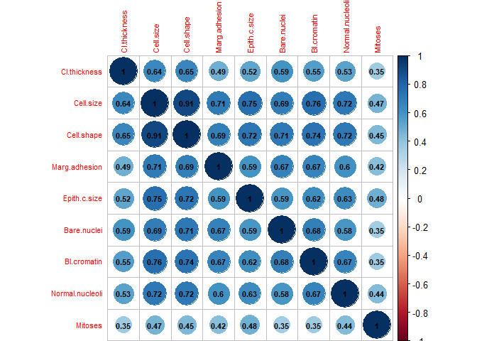
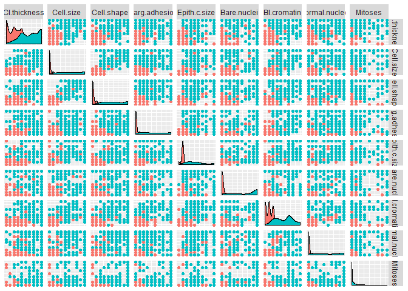
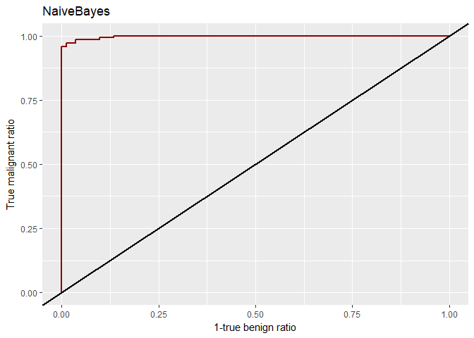
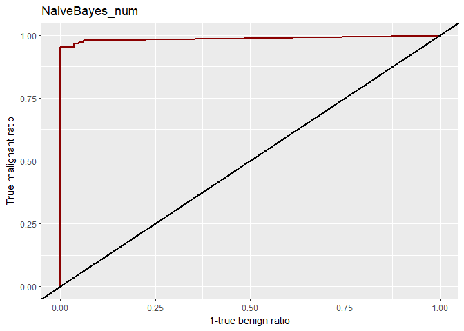
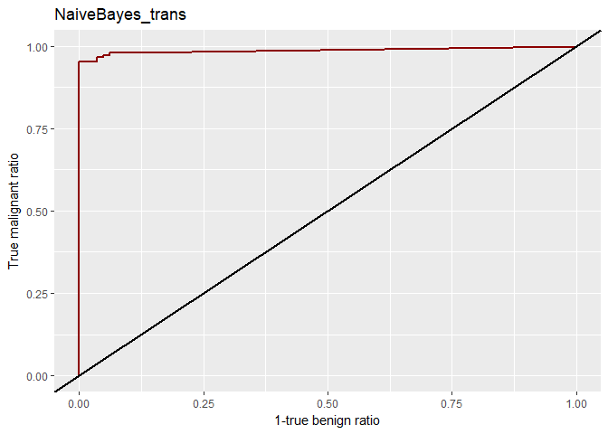
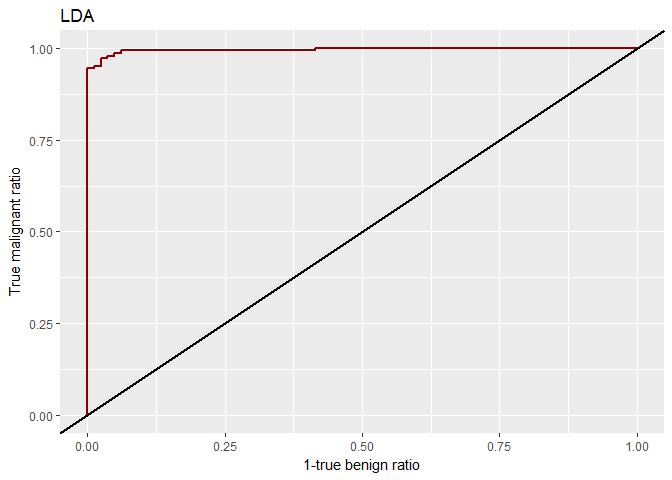
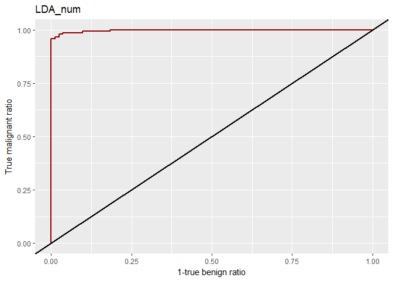
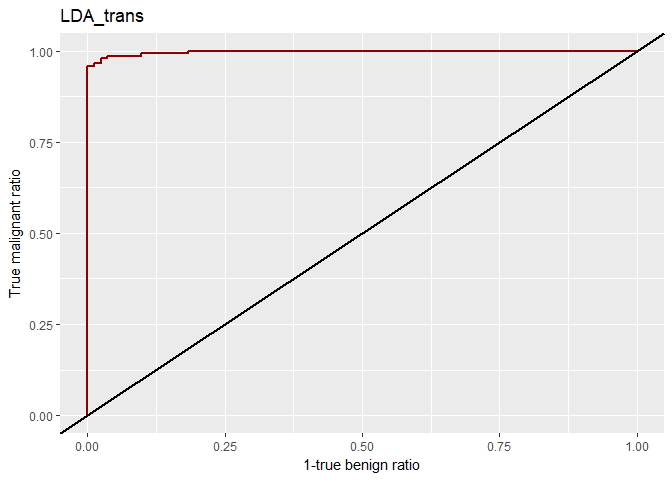

EJERCICIO 1:
============

### Sobre la base de datos BreastCancer de la librería mlbench, realice las siguientes actividades:

### 1. Construya un clasificador Naive-Bayes usando una muestra aleatoria constituida por 2/3 de la totalidad del fichero de datos.

### 2. Obtenga la matriz de confusión y el porcentaje de clasificación incorrecta a partir de las instancias no usadas en la construcción del clasificador.

### 3. Determine el número de predicciones correspondientes a la clase malignant.

### 4. De las predicciones consideradas en el apartado anterior, determine cuántas de ellas se han obtenido con una probabilidad mayor que 0.75.

Ya que hemos estudiado conjuntamente Naive Bayes como Análisis
Discriminante como clasificadores probabilísticos, parece interesante
completar el ejercicio usando tambien Análisis Discriminante.

Los dos primeros puntos del ejercicio se realizarán en las secciones:
Lectura de datos Y librerias, Preprocesamiento y Modelado. Las dos
ultimos puntos se encuentran al final del documento, una vez construidos
y evaluados los modelos.

Lectura de datos y librerias.
-----------------------------

### Librerias.

    library(ggplot2)#graficas
    library(GGally)#graficas
    library(corrplot)#correlaciones
    library(mlbench)#datos
    library(MASS)#LDA
    library(e1071)#Naive Bayes
    library(ROCR)#ROC y AUC

### Datos.

    data("BreastCancer")
    datos<-BreastCancer[,-1]#Eliminamos identidad

A priori, las variables de esta base de datos son de tipo factor con
etiquetas correspondientes a numeros enteros, ademas, se indica que las
etiquetas preservan un orden. No suele ser lo habitual, pero dado que
mantienene el orden podría ser razonable tomar dichas variables como
numericas usando los numeros enteros de sus etiquetas.

Transformemos las variables a numéricas.

    datos_num <- data.frame(sapply(datos[, c(1:9)], as.numeric))
    datos_num$Class=datos$Class

Preprocesamiento.
-----------------

### Variable objetivo.

Ya que nuestra variable objetivo es binaria, la transformaremos a una
variable lógica que indique si el tumor es, o no, maligno.

    datos$Class= datos$Class=='malignant'
    datos_num$Class=datos$Class

### Valores perdidos.

Busquemos los valores perdidos de nuestros datos.

    apply(is.na(datos),2,sum)

    ##    Cl.thickness       Cell.size      Cell.shape   Marg.adhesion 
    ##               0               0               0               0 
    ##    Epith.c.size     Bare.nuclei     Bl.cromatin Normal.nucleoli 
    ##               0              16               0               0 
    ##         Mitoses           Class 
    ##               0               0

    which(apply(is.na(datos),1,sum)>0)

    ##  24  41 140 146 159 165 236 250 276 293 295 298 316 322 412 618 
    ##  24  41 140 146 159 165 236 250 276 293 295 298 316 322 412 618

    datos=datos[-which(apply(is.na(datos),1,sum)>0),]
    datos_num=datos_num[-which(apply(is.na(datos_num),1,sum)>0),]

Vemos que son pocos, de modo que simplemente han sido eliminados.

### Partición train test.

Dividiremos el conjunto en dos partes, tal como se especifica en el
ejercicio.

    set.seed(123)
    n<- nrow(datos)
    nent<- ceiling((2/3)*n)
    indient=sample(n,nent)
    train=datos[indient,]
    test=datos[-indient,]
    train_num=datos_num[indient,]
    test_num=datos_num[-indient,]

### Tipificación.

Reescalemos los datos transformados a numéricos basandonos unicamente el
el conjunto de entrenamiento.

    train_trans=data.frame(scale(train_num[1:9]))
    test_trans=data.frame(scale(test_num[1:9], center =apply(train_num[1:9],2,mean),
                scale = apply(train_num[1:9],2,sd)))
    train_trans$Class=train_num$Class
    test_trans$Class=test_num$Class

Breve análisis exploratorio.
----------------------------

### Hipótesis.

En el desarrollo del método Naive Bayes, asumimos que nuestras variables
son independientes, veamos la matriz de correlaciones de nuestros datos
(transformados a numéricos) para ver si esto parece razonable.

    corrplot(cor(datos_num[1:9]), addCoef.col = "black",tl.cex=0.7,number.cex=0.7)

Algunas correlaciones son muy altas, no podemos asumír independencia,
pero el modelo podría funcionar bien apesar de esto. Veamos las nuves de
puntos para cada par de variables de nuestros datos transformados a
numéricos.

    ggpairs(datos_num, aes(color=Class), columns=1:9,
            upper=list(continuous='points'),axisLabels='none')

A simple vista parece que los dos grupos están bien diferenciados, pero
no parece que cada subclase sigua una distribución normal (hipotesis
necesaria para Análisis Discriminante).

Si los dos grupos sigguiesen normales, entonces sus marginales también.
Contrastemos esto mediante test de Shapiro Wilk.

    for (i in 1:9){
      print(shapiro.test(datos_num[datos_num$Class==T,i])$p.value)
    }

    ## [1] 1.871482e-11
    ## [1] 2.05763e-11
    ## [1] 2.866504e-10
    ## [1] 9.121547e-12
    ## [1] 8.042127e-11
    ## [1] 7.777129e-19
    ## [1] 2.380864e-08
    ## [1] 5.905089e-13
    ## [1] 5.066137e-21

    for (i in 1:9){
      print(shapiro.test(datos_num[datos_num$Class==F,i])$p.value)
    }

    ## [1] 2.181367e-17
    ## [1] 1.103991e-35
    ## [1] 1.667224e-33
    ## [1] 4.7604e-35
    ## [1] 1.960711e-34
    ## [1] 3.398034e-37
    ## [1] 1.206282e-23
    ## [1] 8.395848e-38
    ## [1] 4.023876e-41

No se haceptan las hipótesis de normalidad, pero los modelos podrían dar
buenos resultados independientemente de esto.

Modelado.
---------

### Funcion de evaluación.

Antes de ajustar los modelos, definamos una función que nos devuelva
difrerentes medidas de ajuste de dichos modelos sobre el conjunto test.

    evaluacion=function(reales=test$Class,probabilidades_pred,titulo='modelo',plot_roc_mc=T){
      pred=probabilidades_pred>0.5
      mc=table(pred,reales)
      precision=sum(diag(mc))/sum(mc)
      sensibilidad=prop.table(mc,2)[2,2]
      especificidad=prop.table(mc,2)[1,1]
      
      #resto uno, la siguiente función esta tomando TRUE como FALSE y viceversa
      prediobj<-prediction(1-probabilidades_pred,as.numeric(reales))
      if (plot_roc_mc){
        
        curva_aux=performance(prediobj, "tpr","fpr")
        curva=cbind.data.frame(curva_aux@x.values[[1]],curva_aux@y.values[[1]])
        colnames(curva)=c('x','y')
        #invierto x e y, pues la anterior función tomaba TRUE como FALSE y viceversa
        print(ggplot(curva,aes(y,x))+geom_line(col='red4',size=1)+geom_abline(intercept = 0,size=0.8)+xlab('1-true benign ratio')+
        ylab('True malignant ratio')+ggtitle(titulo)
    )
        
        print(mc)
      }

    auc<- 1- as.numeric(performance(prediobj,"auc")@y.values)
    medidas=t(data.frame(c(precision,sensibilidad,especificidad,auc)))
    row.names(medidas)=titulo
    colnames(medidas)=c('precision','sensibilidad','especificidad','auc')
    return(list(medidas,mc))
      
    }

### Naive Bayes variables originales.

    NaiveBayes = naiveBayes(formula = Class ~ .,data=train)#Ajustamos modelo.
    prob=predict(NaiveBayes,test,type = 'raw')[,2]#Estimamos probabilidades de test.

Podemos guardar las distintas medidas de ajuste (sobre test) de los
modelos que ajustemos, para poder compararlos.

    (evaluaciones=evaluacion(test$Class,prob,'NaiveBayes')[[1]])

    ##        reales
    ## pred    FALSE TRUE
    ##   FALSE   140    1
    ##   TRUE      5   81

    ##            precision sensibilidad especificidad       auc
    ## NaiveBayes 0.9735683    0.9878049     0.9655172 0.9977292

Observando la matriz de confusión, la curva roc y las distintas medidas,
deducimos que tenemos un buen ajuste.

### Naive Bayes variables numéricas.

    NaiveBayes_num = naiveBayes(formula = Class ~ .,data=train_num)#Ajustamos modelo.
    prob=predict(NaiveBayes_num,test_num,type = 'raw')[,2]#Estimamos probabilidades de test.
    (evaluaciones=rbind(evaluaciones,evaluacion(test_num$Class,prob,'NaiveBayes_num')[[1]]))

    ##        reales
    ## pred    FALSE TRUE
    ##   FALSE   138    0
    ##   TRUE      7   82

    ##                precision sensibilidad especificidad       auc
    ## NaiveBayes     0.9735683    0.9878049     0.9655172 0.9977292
    ## NaiveBayes_num 0.9691630    1.0000000     0.9517241 0.9873844

Usando las variables transformadas a numeros enteros, obtenemos una
mayor precisión sobre la clase malignant (acertamos el 100%), pero en
total, tenemos una menor precisión.

### Naive Bayes variables tipificadas

    NaiveBayes_trans = naiveBayes(formula = Class ~ .,data=train_trans)#Ajustamos modelo.
    prob=predict(NaiveBayes_trans,test_trans,type = 'raw')[,2]#Estimamos probabilidades de test.
    (evaluaciones=rbind(evaluaciones,evaluacion(test_trans$Class,prob,'NaiveBayes_trans')[[1]]))

    ##        reales
    ## pred    FALSE TRUE
    ##   FALSE   138    0
    ##   TRUE      7   82

    ##                  precision sensibilidad especificidad       auc
    ## NaiveBayes       0.9735683    0.9878049     0.9655172 0.9977292
    ## NaiveBayes_num   0.9691630    1.0000000     0.9517241 0.9873844
    ## NaiveBayes_trans 0.9691630    1.0000000     0.9517241 0.9873844

Obtenemos exactamente los mismos resultados que con el anterior modelo,
esto parece que se debe a que la tipificación no afecta al calculo de
las probabilidades condicionadas.

### Análisis discriminante variables originales.

Teoricamente se pide normalidad, de modo que usár factores no parece muy
apropiado, pero podría funcionar.

    LDA=lda(Class~.,data=train)#Ajustamos modelo.
    predicciones=predict(LDA,test)
    prob=predicciones$posterior[,2]#Estimación probabilidades de test.
    (evaluaciones=rbind(evaluaciones,evaluacion(test$Class,prob,'LDA')[[1]]))

    ##        reales
    ## pred    FALSE TRUE
    ##   FALSE   142    4
    ##   TRUE      3   78

    ##                  precision sensibilidad especificidad       auc
    ## NaiveBayes       0.9735683    0.9878049     0.9655172 0.9977292
    ## NaiveBayes_num   0.9691630    1.0000000     0.9517241 0.9873844
    ## NaiveBayes_trans 0.9691630    1.0000000     0.9517241 0.9873844
    ## LDA              0.9691630    0.9512195     0.9793103 0.9955425

Obtenemos unos resultados similares a los anteriores.

### Análisis discriminante variables numéricas

    LDA_num=lda(Class~.,data=train_num)#Ajustamos modelo.
    predicciones=predict(LDA_num,test_num)
    prob=predicciones$posterior[,2]#Estimación probabilidades de test.
    (evaluaciones=rbind(evaluaciones,evaluacion(test_num$Class,prob,'LDA_num')[[1]]))

    ##        reales
    ## pred    FALSE TRUE
    ##   FALSE   143    6
    ##   TRUE      2   76

    ##                  precision sensibilidad especificidad       auc
    ## NaiveBayes       0.9735683    0.9878049     0.9655172 0.9977292
    ## NaiveBayes_num   0.9691630    1.0000000     0.9517241 0.9873844
    ## NaiveBayes_trans 0.9691630    1.0000000     0.9517241 0.9873844
    ## LDA              0.9691630    0.9512195     0.9793103 0.9955425
    ## LDA_num          0.9647577    0.9268293     0.9862069 0.9973928

Empeoran ligeramente los resultados respecto al anterior modelo.

### Análisis discriminante variables tipificadas.

    LDA_trans=lda(Class~.,data=train_trans)#Ajustamos modelo.
    predicciones=predict(LDA_trans,test_trans)
    prob=predicciones$posterior[,2]#Estimación probabilidades de test.
    (evaluaciones=rbind(evaluaciones,evaluacion(test_trans$Class,prob,'LDA_trans')[[1]]))

    ##        reales
    ## pred    FALSE TRUE
    ##   FALSE   143    6
    ##   TRUE      2   76

    ##                  precision sensibilidad especificidad       auc
    ## NaiveBayes       0.9735683    0.9878049     0.9655172 0.9977292
    ## NaiveBayes_num   0.9691630    1.0000000     0.9517241 0.9873844
    ## NaiveBayes_trans 0.9691630    1.0000000     0.9517241 0.9873844
    ## LDA              0.9691630    0.9512195     0.9793103 0.9955425
    ## LDA_num          0.9647577    0.9268293     0.9862069 0.9973928
    ## LDA_trans        0.9647577    0.9268293     0.9862069 0.9973928

Parece que los dos ultimos modelos son iguales. Si miramos la
construcción del modelo, comparabamos dos distancias (de Mahalanobis)
entre el punto a clasificar y las medias de las dos clases. La
desigualdad que indica cual de las distancias es mayor (que indica como
clasificaremos) queda invariante al cambiar la escala.

Ultimos apartados
-----------------

### 3. Determine el número de predicciones correspondientes a la clase malignant.

### 4. De las predicciones consideradas en el apartado anterior, determine cuántas de ellas se han obtenido con una probabilidad mayor que 0.75.

Usaremos el modelo Naive Bayes construido con las variables originales.
Veamos cuantas instancias del conjunto test predice como "malignant".

    prob=predict(NaiveBayes,test,type = 'raw')[,2]#Estimamos probabilidades de test.
    sum(prob>0.5)

    ## [1] 86

    sum(prob>=0.5)#Comprobamos si hay algun elemento en la frontera.

    ## [1] 86

Clasificamos 86 instancias como "malignant". Veamos cuantas de ellas se
han obtenido con una probabilidad mayor que 0.75.

    sum(prob>0.75)

    ## [1] 85

Del total de instancias clasificadas como "malignant", 85 se clasifican
con una probabilidad mayor que 0.75. Recordemos la matriz de confusión
de este modelo.

    evaluacion(test$Class,prob,'NaiveBayes',F)[[2]]

    ##        reales
    ## pred    FALSE TRUE
    ##   FALSE   140    1
    ##   TRUE      5   81

Se observa que de las clasificadas como "malignant", 5 son incorrectas.
