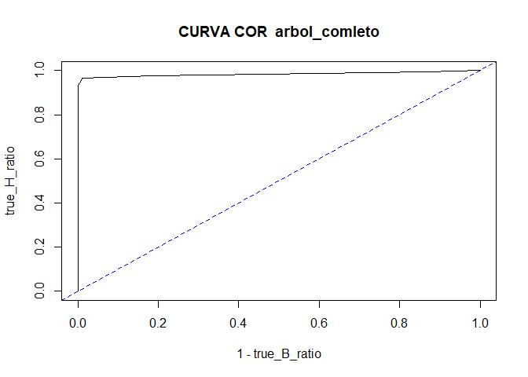
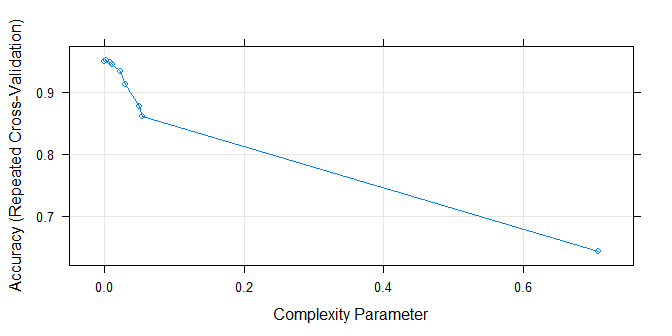
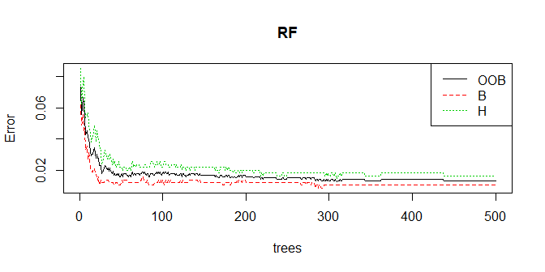
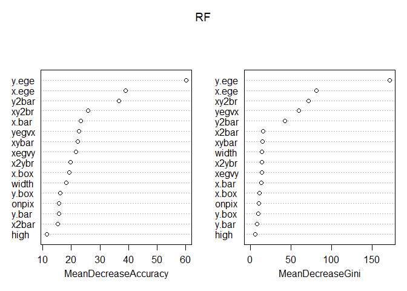
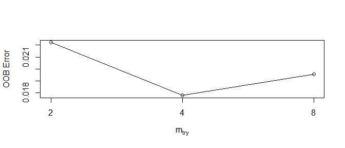
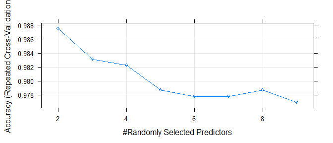

Ejercicio 1:
============

### Cargar el data frame “LetterRecognition” de la libería mlbench, que contiene datos apropiado para construir un sistema de reconocimiento de caracteres. La variable lettr es de tipo factor, presentando 26 niveles, cada uno es una letra mayúscula. Establecer la semilla del generador de números pseudo-aleatorios de R mediante set.seed(m), siendo m el número obtenido con las tres últimas cifras del DNI, y elegir aleatoriamente dos letras. Utilizando los casos que correspondan a alguna de ambas letras, construir de forma razonada y comparar modelos de clasificación binaria basados en Random Forests y el Perceptrón Multicapas (nnet).

Lectura de datos y librerias.
-----------------------------

Carguemos las librerias que se han usado para este ejercicio.

    library(mlbench)#datos
    library(rpart)#arboles
    library(rpart.plot)
    library(randomForest)#random forest
    library(caret)#optimizacion parametros
    library(ROCR)#AUC y ROC
    library(nnet)#redes neuronales
    library(h2o)#deep learning

Lectura de datos.

    data("LetterRecognition")
    datos=LetterRecognition
    rm(LetterRecognition)
    head(datos)

    ##   lettr x.box y.box width high onpix x.bar y.bar x2bar y2bar xybar x2ybr
    ## 1     T     2     8     3    5     1     8    13     0     6     6    10
    ## 2     I     5    12     3    7     2    10     5     5     4    13     3
    ## 3     D     4    11     6    8     6    10     6     2     6    10     3
    ## 4     N     7    11     6    6     3     5     9     4     6     4     4
    ## 5     G     2     1     3    1     1     8     6     6     6     6     5
    ## 6     S     4    11     5    8     3     8     8     6     9     5     6
    ##   xy2br x.ege xegvy y.ege yegvx
    ## 1     8     0     8     0     8
    ## 2     9     2     8     4    10
    ## 3     7     3     7     3     9
    ## 4    10     6    10     2     8
    ## 5     9     1     7     5    10
    ## 6     6     0     8     9     7

Escojamos aleatoriamente dos caracteres.

    m=176
    set.seed(m)
    sub_lettr=sample(levels(datos$lettr),2)
    sub_lettr

    ## [1] "B" "H"

Procedamos a seleccionar los datos correspondientes a B y H.

    sub_datos=datos[datos$lettr %in% sub_lettr,]
    table(sub_datos$lettr)

    ## 
    ##   A   B   C   D   E   F   G   H   I   J   K   L   M   N   O   P   Q   R 
    ##   0 766   0   0   0   0   0 734   0   0   0   0   0   0   0   0   0   0 
    ##   S   T   U   V   W   X   Y   Z 
    ##   0   0   0   0   0   0   0   0

    sub_datos=droplevels(sub_datos)#eliminamos las letras que no nos interesan
    table(sub_datos$lettr)

    ## 
    ##   B   H 
    ## 766 734

Partición train test.
---------------------

    set.seed(123)
    ind=1:nrow(sub_datos)
    ind_test=sample(ind,floor(nrow(sub_datos)*0.25))
    train=sub_datos[-ind_test,]
    test=sub_datos[ind_test,]

Función para evaluar modelos.
-----------------------------

Podemos definir una función que evalue con distintas medidas de ajuste
los modelos sobre el conjunto test. Tenemos solo dos caracteres a
clasificar, de modo que si interpretamos estos valores como positivo y
negativo, podemos calcular la curva ROC y la medida AUC.

    evaluacion=function(modelo,test=test,title='modelo', plot_cor=T , nnet_model=F){
      predicciones=predict(modelo,test,type = 'class')
      matriz_confusion=table(test$lettr,predicciones)
      accuracy=100*sum(diag(prop.table(matriz_confusion)))
      true_B_ratio=100*diag(prop.table(matriz_confusion, 1))[1]
      true_H_ratio=100*diag(prop.table(matriz_confusion, 1))[2]
      if (nnet_model){
      probabi=predict(modelo,test)  
      }
      else{
      probabi=predict(modelo,test,type = 'prob')[,2]#interpretamos H como yes
      }
      prediobj<-prediction(probabi,test$lettr)
      if(plot_cor){
      plot(performance(prediobj, "tpr","fpr"),
           main=paste("CURVA COR ",title),ylab='true_H_ratio',xlab='1 - true_B_ratio')
        abline(a=0,b=1,col="blue",lty=2)
      print(prop.table(matriz_confusion))
      }
      
      auc<- as.numeric(performance(prediobj,"auc")@y.values)
      medidas=cbind(accuracy,true_B_ratio,true_H_ratio,auc)
      row.names(medidas)=title
      return(medidas)
    }

Arbloes de clasificación.
-------------------------

Antes de construir bosques aleatoriós, podemos construir arboles de
clasificación y comparara los modelos.

### Arbol completo.

    arbol_comleto=rpart(lettr~., data = train,cp=0.00)
    evaluaciones=evaluacion(arbol_comleto,test,'arbol_comleto')

    ##    predicciones
    ##               B           H
    ##   B 0.504000000 0.005333333
    ##   H 0.018666667 0.472000000

    evaluaciones

    ##               accuracy true_B_ratio true_H_ratio       auc
    ## arbol_comleto     97.6     98.95288     96.19565 0.9850615

### Arbol recortado.

Escojamos el parametro de complejidad cp mediante la regla 1-ES, y
comparemos los resultados con el arbol recortado.

    plotcp(arbol_comleto)

    cptabla<- arbol_comleto$cptable
    CP1ES<- min(cptabla[,4])+cptabla[which.min(cptabla[,4]),5] 
    cprecorte<- cptabla[cptabla[,4]<CP1ES,][1]
    arbol_recortado=prune(arbol_comleto,cprecorte)
    evaluaciones=rbind(evaluaciones,evaluacion(arbol_recortado,test,'arbol_recortado',F))
    evaluaciones

    ##                 accuracy true_B_ratio true_H_ratio       auc
    ## arbol_comleto       97.6     98.95288     96.19565 0.9850615
    ## arbol_recortado     96.0     97.90576     94.02174 0.9782324

Los resultados son peores (esto se debe a que en la regla 1-ES
consideramos las varianzas de los errores de validación cruzada).
Construyamos un arbol con la libreria caret.

### Arbol con caret.

    grid <- expand.grid(cp=as.vector( arbol_comleto$cptable[,1]))#usamos la rejilla de rpart
    trctrl <- trainControl(method = "repeatedcv", number = 5, repeats = 2, allowParallel = T)
    set.seed(3333)
    arbol_caret <- train(lettr ~., data = train, method = "rpart",
                       trControl = trctrl,tuneGrid=grid)
    plot(arbol_caret)

    arbol_caret$bestTune

    ##            cp
    ## 2 0.003636364

    evaluaciones=rbind(evaluaciones,evaluacion(arbol_caret$finalModel,test,'arbol_caret',F))
    evaluaciones

    ##                 accuracy true_B_ratio true_H_ratio       auc
    ## arbol_comleto   97.60000     98.95288     96.19565 0.9850615
    ## arbol_recortado 96.00000     97.90576     94.02174 0.9782324
    ## arbol_caret     97.06667     99.47644     94.56522 0.9837099

Mediante dos repeticiones de una validación cruzada, parece que el mejor
parametro de complejidad es ligeramente mayor que cero. En cambio, al
evaluar sobre el conjunto test parece que es mejor tomar cp igual a
cero. Tenemos unos resultados excepcionalmente buenos, pero veamos si es
posible mejorarlos algo mediante bosques aleatorios.

Bosques aleatórios.
-------------------

### Bosque aleatorio con parametros por defecto.

Comencemos construyendo un modelo con los parametros por defecto que
proporciona el paquete randomForest.

    RF<- randomForest(lettr ~ ., data=train,
                      importance=TRUE,do.trace=F)
    plot(RF)
    legend("topright",col=1:3,lty=1:3,
           legend=c("OOB",levels(train$lettr)))

    evaluaciones=rbind(evaluaciones, evaluacion(RF,test,'RF',F))
    evaluaciones

    ##                 accuracy true_B_ratio true_H_ratio       auc
    ## arbol_comleto   97.60000     98.95288     96.19565 0.9850615
    ## arbol_recortado 96.00000     97.90576     94.02174 0.9782324
    ## arbol_caret     97.06667     99.47644     94.56522 0.9837099
    ## RF              98.40000     99.47644     97.28261 0.9998008

Mejoramos los resultados (curiosamente, el ratio de B verdaderos es
igual al anterior). Parece que con menos arboles obtendríamos resultados
similares.

### Medidas de importancia.

Los bosques aleatorios dan diversas medidas de importancia para las
variables, veamoslas.

    varImpPlot(RF)

    tabla_impor=importance(RF)
    tabla_impor[order(-tabla_impor[,1]),]

    ##               B         H MeanDecreaseAccuracy MeanDecreaseGini
    ## y.ege 51.570293 44.385838             60.13834       171.276268
    ## x.ege 34.055852 29.160502             38.99772        81.205231
    ## y2bar 30.922318 28.420173             36.70491        42.871633
    ## xy2br 23.399282 18.549734             25.94491        71.397746
    ## x.bar 20.479598 14.487751             23.25741        13.620003
    ## xybar 19.949949 16.080223             22.30940        14.994372
    ## yegvx 19.494555 18.605240             22.70866        59.998425
    ## xegvy 18.434963 15.928948             21.69297        14.136821
    ## x2ybr 17.357730 12.360432             19.79083        14.220843
    ## onpix 14.341541  7.967365             15.65198        10.872814
    ## x.box 13.984787 15.769373             19.23725        11.399551
    ## y.box 13.603237  8.726518             16.13319         9.716579
    ## x2bar 13.594125 10.211642             15.36517        16.122003
    ## width 12.389057 18.851834             18.20122        14.294112
    ## y.bar 12.217367 10.659979             15.61820         8.787170
    ## high   6.999024  9.509961             11.36204         6.553429

### Bosque aleatorio con selección de variables.

Basandonos en las importancias anteriores, podemos tratar de seleccionar
variables para ver si obtenemos mejores resultados.

    set.seed(123)
    eliminacion=row.names(tabla_impor[order(tabla_impor[,1]),])[1:7]#eliminamos variables
    RF_2<- randomForest(lettr ~ ., data=train[,! names(train)  %in% eliminacion],
                      importance=TRUE,do.trace=F)
    evaluaciones=rbind(evaluaciones, evaluacion(RF_2,test,'RF_2',F))
    evaluaciones

    ##                 accuracy true_B_ratio true_H_ratio       auc
    ## arbol_comleto   97.60000     98.95288     96.19565 0.9850615
    ## arbol_recortado 96.00000     97.90576     94.02174 0.9782324
    ## arbol_caret     97.06667     99.47644     94.56522 0.9837099
    ## RF              98.40000     99.47644     97.28261 0.9998008
    ## RF_2            98.93333    100.00000     97.82609 0.9998862

### Optimización de parametros con tuneRF.

Parece que la selección de variables da buenos resultados y acertamos
todos los elementos de la clase B. Otra opción para tratar de mejorar el
modelo, es escoger el parámetro mtry (controla el número de variables
que aleatoriamente se toman para construir los arboles).

    tune=tuneRF(train[,-1],train[,1],trace = F,doBest=FALSE)#separamos la variable respuesta

    ## -0.25 0.05 
    ## -0.1 0.05

    mtry_tune=tune[which(tune[,2]==min(tune[,2])),1]#tomamos el parametro que da menor error OOB

    RF_3<- randomForest(lettr ~ ., data=train[,! names(train)  %in% eliminacion],
                        importance=TRUE,do.trace=F,mtry=mtry_tune)
    evaluaciones=rbind(evaluaciones, evaluacion(RF_3,test,'RF_3',F))
    print(evaluaciones)

    ##                 accuracy true_B_ratio true_H_ratio       auc
    ## arbol_comleto   97.60000     98.95288     96.19565 0.9850615
    ## arbol_recortado 96.00000     97.90576     94.02174 0.9782324
    ## arbol_caret     97.06667     99.47644     94.56522 0.9837099
    ## RF              98.40000     99.47644     97.28261 0.9998008
    ## RF_2            98.93333    100.00000     97.82609 0.9998862
    ## RF_3            98.93333    100.00000     97.82609 0.9999715

Apenas hay diferencia entre los dos últimos modelos. Podemos tratar de
usar caret para optimizar mtry.

### Optimización de parametros con caret.

    trctrl <- trainControl(method = "repeatedcv", number = 5, repeats = 1, allowParallel = T)
    set.seed(3333)
    RF_caret <- train(lettr ~., data = train[,! names(train)  %in% eliminacion], 
                      method = "rf",trControl = trctrl,tuneLength = 8,ntree=300)
    plot(RF_caret)

    evaluaciones=rbind(evaluaciones, evaluacion(RF_caret$finalModel,test,'RF_caret',F))
    evaluaciones

    ##                 accuracy true_B_ratio true_H_ratio       auc
    ## arbol_comleto   97.60000     98.95288     96.19565 0.9850615
    ## arbol_recortado 96.00000     97.90576     94.02174 0.9782324
    ## arbol_caret     97.06667     99.47644     94.56522 0.9837099
    ## RF              98.40000     99.47644     97.28261 0.9998008
    ## RF_2            98.93333    100.00000     97.82609 0.9998862
    ## RF_3            98.93333    100.00000     97.82609 0.9999715
    ## RF_caret        98.66667    100.00000     97.28261 0.9998577

No mejoramos los resultados (son practicamente iguales). Pasemos a usar
otro tipo de modelos, rededes de neuronas artificiales, y veamos si
conseguimos unos resultados tan buenos como los anteriores.

Redes neuronales.
-----------------

Los anteriores modelos se basaban en arboles, por lo que tipificar los
datos no afectaba demasiado a los resultados. En cambio, si que es
recomendable para el uso de redes neuronales.

### Tipificación.

    preProcValues <- preProcess(train, method = c("center","scale"))#usamos caret
    train_processed <- predict(preProcValues, train)
    test_processed <- predict(preProcValues, test)

### Optimización de parametros.

Trabajando con redes pequeñas, se pueden optimizar valores de
regularización así como el numero de nodos. Usaremos los conjuntos con y
sin tipificar para comparar.

    ctrl <- trainControl(method="cv",classProbs=TRUE,
                         summaryFunction = twoClassSummary) 
    modeloPM <- train(lettr ~ ., data = train, #Usa por defecto entropia para clasificacion
                      trace=F,
                      method = "nnet", 
                      trControl = ctrl, 
                      preProcess = c("center","scale"), 
                      tuneGrid = expand.grid(size=seq(1, 11, 2),decay=c(0,0.1)))
    modeloPM$bestTune

    ##    size decay
    ## 12   11   0.1

    evaluaciones=rbind(evaluaciones, evaluacion(modeloPM$finalModel,test,'nnet',F,nnet_model=T))

    modeloPM_processed <- train(lettr ~ ., data = train_processed, 
                                trace=F,
                                method = "nnet", 
                                trControl = ctrl,  
                                tuneGrid = expand.grid(size=seq(1, 11, 2),decay=c(0,0.1)))
    modeloPM_processed$bestTune

    ##   size decay
    ## 8    7   0.1

Parece que lo mejor es escoger 7 nodos con datos tipificados y 11 para
datos sin tipificar, comparemos los modelos obtenidos sobre el conjunto
test.

    evaluaciones=rbind(evaluaciones,evaluacion(modeloPM_processed$finalModel,
                                               test_processed,'nnet_scaled',F,nnet_model=T))
    evaluaciones

    ##                 accuracy true_B_ratio true_H_ratio       auc
    ## arbol_comleto   97.60000     98.95288     96.19565 0.9850615
    ## arbol_recortado 96.00000     97.90576     94.02174 0.9782324
    ## arbol_caret     97.06667     99.47644     94.56522 0.9837099
    ## RF              98.40000     99.47644     97.28261 0.9998008
    ## RF_2            98.93333    100.00000     97.82609 0.9998862
    ## RF_3            98.93333    100.00000     97.82609 0.9999715
    ## RF_caret        98.66667    100.00000     97.28261 0.9998577
    ## nnet            76.80000    100.00000     52.71739 0.9338152
    ## nnet_scaled     98.13333     97.90576     98.36957 0.9992317

Tal como esperabamos, el modelo construido sobre datos sin tipificar es
bastante peor. Veamos a continuación que ocurre si aumentamos
considerablemente el numero de nodos.

    red<-  nnet(lettr~., data=train_processed,size=50,trace=F)
    evaluaciones=rbind(evaluaciones,evaluacion(red,test_processed,'nnet_50',F,nnet_model=T))
    evaluaciones

    ##                 accuracy true_B_ratio true_H_ratio       auc
    ## arbol_comleto   97.60000     98.95288     96.19565 0.9850615
    ## arbol_recortado 96.00000     97.90576     94.02174 0.9782324
    ## arbol_caret     97.06667     99.47644     94.56522 0.9837099
    ## RF              98.40000     99.47644     97.28261 0.9998008
    ## RF_2            98.93333    100.00000     97.82609 0.9998862
    ## RF_3            98.93333    100.00000     97.82609 0.9999715
    ## RF_caret        98.66667    100.00000     97.28261 0.9998577
    ## nnet            76.80000    100.00000     52.71739 0.9338152
    ## nnet_scaled     98.13333     97.90576     98.36957 0.9992317
    ## nnet_50         98.93333    100.00000     97.82609 0.9969269

Esto incita a tratar de construir redes aun mayores, del tipo "deep
learning".

Modelos deep learning.
----------------------

La libreria h2o proporciona herramientas para construir este tipo de
modelos.

### Funcion evaluación.

La función definida anteriormente no será compatible con los objetos
proporcionados por la libreria h2o. Definnamos una nueva función que
devuelva los datos con la misma estructura para poder comparar con los
resultados anteriores. No usaremos los datos test en esta función, ya
que los modelos de h2o perpiten calcular estas medidas sobre el conjunto
test (solo ordenaremos dichas medidas).

    evaluacion_h2o=function(modelo,title='modelo'){
      cm=h2o.confusionMatrix(modelo,valid = T)
      accuracy=100*(1-cm$Error[3])
      true_B_ratio=100*(1-cm$Error[1])
      true_H_ratio=100*(1-cm$Error[2])
      auc<- h2o.auc(modelo,valid = T)
      medidas=cbind(accuracy,true_B_ratio,true_H_ratio,auc)
      row.names(medidas)=title
      return(medidas)
    }

### Inicialización del servicio h2o.

    localH2O = h2o.init(nthreads = 5)

### Conversión de los datos al formato h2o.

    train.hex <- as.h2o(train_processed)
    test.hex<- as.h2o(test_processed)

### Modelo deep learning.

Red con dos capas ocultas de doscientos nodos cada una.

    modelo_h2o <- h2o.deeplearning(
      x = 2:17, y = 1, 
      training_frame = train.hex,
      validation_frame=test.hex,
      distribution="multinomial",
      activation = 'RectifierWithDropout',
      hidden = c(200, 200),
      l1 = 1e-5,
      l2 = 1e-5,
      hidden_dropout_ratio = c(0.5, 0.5),
      input_dropout_ratio = 0.2,
      epochs = 50,
      rho = 0.99,
      epsilon = 1e-8,
      train_samples_per_iteration = 500)

Comparemos este modelo con los construidos anteriormente

    evaluaciones=rbind(evaluaciones,evaluacion_h2o(modelo_h2o,'modelo_h2o'))
    evaluaciones

    ##                 accuracy true_B_ratio true_H_ratio       auc
    ## arbol_comleto   97.60000     98.95288     96.19565 0.9850615
    ## arbol_recortado 96.00000     97.90576     94.02174 0.9782324
    ## arbol_caret     97.06667     99.47644     94.56522 0.9837099
    ## RF              98.40000     99.47644     97.28261 0.9998008
    ## RF_2            98.93333    100.00000     97.82609 0.9998862
    ## RF_3            98.93333    100.00000     97.82609 0.9999715
    ## RF_caret        98.66667    100.00000     97.28261 0.9998577
    ## nnet            76.80000    100.00000     52.71739 0.9338152
    ## nnet_scaled     98.13333     97.90576     98.36957 0.9992317
    ## nnet_50         98.93333    100.00000     97.82609 0.9969269
    ## modelo_h2o      97.86667     98.42932     97.28261 0.9967277

### Grid Search.

Podemos buscar el mejor modelo atraves distintas combinaciones de
coeficientes de regularización (L1) y configuraciones de capas ocultas
(usando validación cruzada). Tomaremos redes de tamaño considerable, por
lo que esto puede tardar bastante.

    hidden_search = list(c(100,100),c(500,500), c(500,500,500),c(200,200,200),c(100,100,100))
    l1_search <- c(1e-4,1e-3)
    hyper_params= list(hidden = hidden_search, l1 = l1_search)

    modelo_h2o_grid = h2o.grid("deeplearning",
                               x = 2:17, y = 1, 
                               training_frame = train.hex,
                               validation_frame=test.hex,
                               distribution="multinomial",
                               activation = 'RectifierWithDropout',
                               hyper_params = hyper_params,
                               nfolds=5, #Par?metro de Validaci?n cruzada
                               score_interval = 2,
                               epochs = 50,
                               stopping_rounds = 3,
                               stopping_tolerance = 0.05,
                               stopping_metric = "misclassification")

Tomemos el mejor modelo.

    nmodelos=length(modelo_h2o_grid@model_ids)
    ErrorVC=numeric(nmodelos)
    for (i in 1:nmodelos)
    {
      model_id= modelo_h2o_grid@model_ids[[i]]
      Entrop <- h2o.logloss(h2o.getModel(model_id), xval = TRUE)
      ErrorVC[i]=Entrop
    }
    nombre_modelo=modelo_h2o_grid@model_ids[[which.min(ErrorVC)]]
    modelo_h2o_2=h2o.getModel(nombre_modelo)

Veamos que configuración tiene.

    modelo_h2o_2@parameters$hidden

    ## [1] 500 500

    modelo_h2o_2@parameters$l1

    ## [1] 1e-04

Por ultimo, comparemoslo con el resto de modelos por medio del conjunto
test.

    evaluaciones=rbind(evaluaciones,evaluacion_h2o(modelo_h2o_2,'modelo_h2o_2'))
    evaluaciones

    ##                 accuracy true_B_ratio true_H_ratio       auc
    ## arbol_comleto   97.60000     98.95288     96.19565 0.9850615
    ## arbol_recortado 96.00000     97.90576     94.02174 0.9782324
    ## arbol_caret     97.06667     99.47644     94.56522 0.9837099
    ## RF              98.40000     99.47644     97.28261 0.9998008
    ## RF_2            98.93333    100.00000     97.82609 0.9998862
    ## RF_3            98.93333    100.00000     97.82609 0.9999715
    ## RF_caret        98.66667    100.00000     97.28261 0.9998577
    ## nnet            76.80000    100.00000     52.71739 0.9338152
    ## nnet_scaled     98.13333     97.90576     98.36957 0.9992317
    ## nnet_50         98.93333    100.00000     97.82609 0.9969269
    ## modelo_h2o      97.86667     98.42932     97.28261 0.9967277
    ## modelo_h2o_2    98.66667     98.42932     98.91304 0.9988049

En general vemos que tenemos buenos resultados, pero parece que la mejor
opción es un random forest con las variables seleccionadas. Tal vez
podríamos usar dichas variables para una red neuronal.

### Deep Learning con seleccion de variables.

    #Seleccionamos variables
    train_processed_select=train_processed[,! names(train_processed)  %in% eliminacion]
    test_processed_select=test_processed[,! names(test_processed)  %in% eliminacion]

    #Cambiamos el formato
    train.hex_select <- as.h2o(train_processed_select)
    test.hex_select<- as.h2o(test_processed_select)

    #Entrenamos el modelo
    modelo_h2o_sel <- h2o.deeplearning(
      x = 2:10, y = 1, 
      training_frame = train.hex_select,
      validation_frame=test.hex_select,
      distribution="multinomial",
      activation = 'RectifierWithDropout',
      hidden = c(200, 200,200),
      l1 = 1e-5,
      l2 = 1e-5,
      hidden_dropout_ratio = c(0.5, 0.5, 0.5),
      input_dropout_ratio = 0.2,
      epochs = 50,
      rho = 0.99,
      epsilon = 1e-8,
      train_samples_per_iteration = 500)

Comparemos los resltados.

    evaluaciones=rbind(evaluaciones,evaluacion_h2o(modelo_h2o_sel,'modelo_h2o_sel'))
    evaluaciones

    ##                 accuracy true_B_ratio true_H_ratio       auc
    ## arbol_comleto   97.60000     98.95288     96.19565 0.9850615
    ## arbol_recortado 96.00000     97.90576     94.02174 0.9782324
    ## arbol_caret     97.06667     99.47644     94.56522 0.9837099
    ## RF              98.40000     99.47644     97.28261 0.9998008
    ## RF_2            98.93333    100.00000     97.82609 0.9998862
    ## RF_3            98.93333    100.00000     97.82609 0.9999715
    ## RF_caret        98.66667    100.00000     97.28261 0.9998577
    ## nnet            76.80000    100.00000     52.71739 0.9338152
    ## nnet_scaled     98.13333     97.90576     98.36957 0.9992317
    ## nnet_50         98.93333    100.00000     97.82609 0.9969269
    ## modelo_h2o      97.86667     98.42932     97.28261 0.9967277
    ## modelo_h2o_2    98.66667     98.42932     98.91304 0.9988049
    ## modelo_h2o_sel  97.06667     95.28796     98.91304 0.9904962

No parece que merezca la pena usar esta selección.
