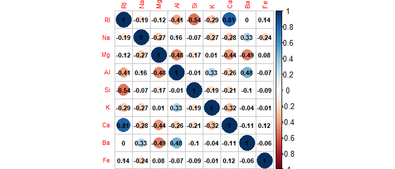
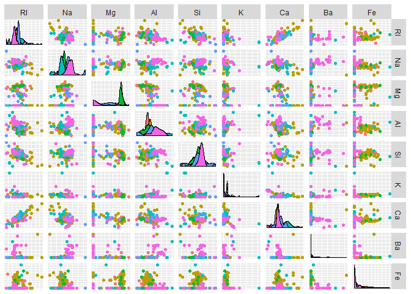
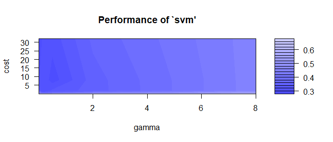

EJERCICIO 2:
============

### 1. Construya un clasificador SVM con kernel radial para la base de datos Glass del paquete mlbench, usando validación cruzada con 10 pliegues y parametros *C* = 0.8 y *γ* = 0.25.

### 2. Determine la tasa de clasificación correcta (accuracy) global y en cada pliegue.

### 3. Realice el ajuste de parámetros para obtener los valores más adecuados de *C* y *γ* dentro de los siguientes conjuntos de valores:

\begin{center} $C\in$ \{ $2^{-5}$,$2^{-3}$,...,$2^5$ \}   $\gamma \in$ \{ $2^{-7}$,$2^{-5}$,...,$2^1$,$2^3$ \} \end{center}
### 4. Utilice el mejor modelo obtenido del ajuste de parámetros para clasificar las siguientes instancias:

\begin{table}[htb]
\centering
\caption{Instancias}
\label{my-label}
\begin{tabular}{lllllllll}
RI   & Na    & Mg   & Al   & Si    & K    & Ca   & Ba  & Fe   \\
1.49 & 13.45 & 4.05 & 1.21 & 73.18 & 0.37 & 7.98 & 0.2 & 0    \\
1.52 & 13.74 & 3.87 & 1.29 & 71.97 & 0.25 & 8.02 & 0   & 0.13
\end{tabular}
\end{table}
### 5. Repita el apartado 3 utilizando validación cruzada con 15 pliegues dentro del procedimiento de ajuste de parámetros (Indicación: utilice la función tune.control).

Los dos primeros puntos se han completado en las secciones **Lectura de
datos y librerias.** y **Modelado** (Primer SVM), los puntos tres y
cuatro en **Modelado** (Primer ajuste de parámetros) y el ultimo punto
se completa en **Modelado** (Segundo ajuste de parámetros).

Lectura de datos y librerias.
-----------------------------

### Librerias.

    library(ggplot2)#graficas
    library(GGally)#graficas
    library(corrplot)#correlaciones
    library(mlbench)#datos
    library(e1071)#SVM

### Datos.

    data("Glass")
    datos<-Glass

Breve análisis exploratorio.
----------------------------

### Variable objetivo.

    levels(datos$Type)

    ## [1] "1" "2" "3" "5" "6" "7"

    table(datos$Type)

    ## 
    ##  1  2  3  5  6  7 
    ## 70 76 17 13  9 29

Vemos que tenemos siete clases, de las cuales hay algunas con pocos
valores.

### Valores perdidos.

    apply(is.na(datos),2,sum)

    ##   RI   Na   Mg   Al   Si    K   Ca   Ba   Fe Type 
    ##    0    0    0    0    0    0    0    0    0    0

No tenemos valores perdidos.

### Correlaciones.

    corrplot(cor(datos[1:9]), addCoef.col = "black",tl.cex=0.7,number.cex=0.7)

### Nuves de puntos

    ggpairs(datos, aes(color=Type), columns=1:9,
            upper=list(continuous='points'),axisLabels='none')

Hay variables a las que se les podría aplicar alguna transformación,
como la logaritmica a *k* y a *F**e*.

Modelado.
---------

### Primer SVM.

Construyamos nuestro primer modelo escalando los datos (svm lo hace por
defecto) y tomando *C* = 0.8 y *γ* = 0.25. Usando estos mismos
parámetros podemos hacer una estimacion de la precisión mediante una
validación cruzada de diez hojas.

    SVM_1 <- svm(Type ~ . ,data=datos,scale=T,cross=10,gamma=0.25,cost=0.8,kernel='radial')

Veamos las precisiones de cada hoja, y la media de estas.

    SVM_1$accuracies

    ##  [1] 85.71429 61.90476 63.63636 80.95238 72.72727 66.66667 57.14286
    ##  [8] 68.18182 66.66667 68.18182

    SVM_1$tot.accuracy

    ## [1] 69.15888

Parece que no tenemos una precisión media muy alta, podemos buscar
combinaciones de parámetros que nos den mejores resultados.

### Primer ajuste de parámetros.

Haremos una busqueda sobre las combinaciones de los siguientes conjuntos
de parámetros:

\begin{center} $C\in$ \{ $2^{-5}$,$2^{-3}$,...,$2^5$ \}   $\gamma \in$ \{ $2^{-7}$,$2^{-5}$,...,$2^1$,$2^3$ \} \end{center}
    cost_grid=2^seq(-5,5,2)
    gamma_grid=2^seq(-7,3,2)
    Grid_1<- tune.svm(Type ~ .,data=datos,scale=T,
                      gamma=gamma_grid,cost=cost_grid,
                      kernel='radial',cross=10)

Podemos comprobar cual ha sido el menor error medio, los parametros
correspondientes a dicho error, y guardar el modelo construido con
dichos parámetros.

    SVM_2=Grid_1$best.model#Tomamos el modelo construido con los mejores parámetros
    Grid_1$best.parameters#Mejores parámetros.

    ##      gamma cost
    ## 32 0.03125   32

    Grid_1$best.performance#Menor error medio.

    ## [1] 0.280303

Veamos una grafica con la que podemos ver el error en función de los dos
parámetros.

    plot(Grid_1)

    SVM_2$tot.accuracy

    ## [1] 68.2243

Hemos aumentado ligeramente la precision de nuestro modelo, usemoslo
para predecir las siguientes instancias.

\begin{table}[htb]
\centering
\caption{Instancias}
\label{my-label}
\begin{tabular}{lllllllll}
RI   & Na    & Mg   & Al   & Si    & K    & Ca   & Ba  & Fe   \\
1.49 & 13.45 & 4.05 & 1.21 & 73.18 & 0.37 & 7.98 & 0.2 & 0    \\
1.52 & 13.74 & 3.87 & 1.29 & 71.97 & 0.25 & 8.02 & 0   & 0.13
\end{tabular}
\end{table}
    instancias=data.frame(matrix(c(1.49,13.45,4.05,1.21, 73.18,0.37,7.98,
                                   0.2,0,1.52,13.74,3.87,1.29, 71.97,0.25,8.02,0, 0.13),nrow = 2))
    colnames(instancias)=colnames(datos)[1:9]
    rownames(instancias)=c('v1','v2')
    predict(SVM_2,instancias)

    ## v1 v2 
    ##  7  7 
    ## Levels: 1 2 3 5 6 7

Clasificamos ambos valores en la septima clase.

### Segundo ajuste de parámetros.

Realizemos una busqueda sobre los mismos parámetros, pero aumentando a
15 el numero de pliegues de la validación cruzada.

    tunecontrol_grid=tune.control(cross=15)#Indicamos 15 hojas
    Grid_2<- tune.svm(Type ~ .,data=datos,scale=T,
                      gamma=gamma_grid,cost=cost_grid,
                      kernel='radial',tunecontrol=tunecontrol_grid)

Podemos comprobar cual ha sido el menor error medio, los parametros
correspondientes a dicho error, y guardar el modelo construido con
dichos parámetros.

    SVM_3=Grid_2$best.model#Tomamos el modelo construido con los mejores parámetros
    Grid_2$best.parameters#Mejores parámetros.

    ##    gamma cost
    ## 28   0.5    8

    Grid_2$best.performance#Menor error medio.

    ## [1] 0.3031746

Vemos como el error apenas varia, pero si que ha cambiado mucho el
parametro *C*.

### Tercer ajuste de parámetros.

Hagamos una busqueda mas amplia, en la que probemos los cuatro kernels
que proporciona la libreria e1071. Hay un parametro mas para los kernels
sigmoide y polinomial, mientras que hay uno menos para el lineal, los
parametros se cambian en funcion de esto para ahorrar calculos.

    Grid_3=list()
    for (kernel_grid in c('linear','radial','sigmoid','polynomial')){
      coef0_grid=ifelse (kernel_grid %in% c('sigmoid','polynomial'),-3:3,0)
      degree_grid=ifelse (kernel_grid %in% c('polynomial'),3:5,3)
      Grid<- tune.svm(Type ~ .,data=datos,scale=T,
                      gamma=gamma_grid,cost=cost_grid,
                      kernel=kernel_grid,coef0=coef0_grid,degree=degree_grid,
                      cross=10)
      Grid_3=list(Grid_3, list(Grid))
      print(paste(kernel_grid,Grid$best.performance))#mostramos los errores medios
    }

    ## [1] "linear 0.354978354978355"
    ## [1] "radial 0.288311688311688"
    ## [1] "sigmoid 0.415584415584416"
    ## [1] "polynomial 0.425974025974026"

Vemos que el mejor kernel para nuestros datos es el radial, que es con
el que hemos estado trabajando hasta ahora.
