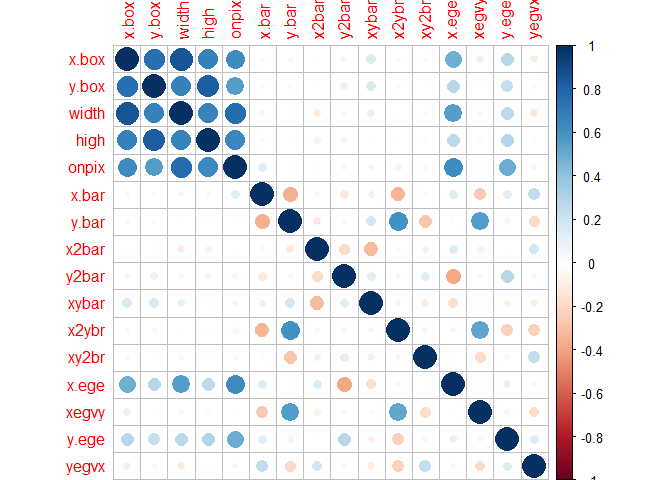
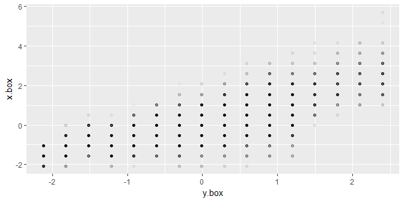
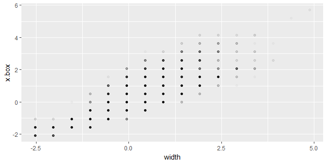
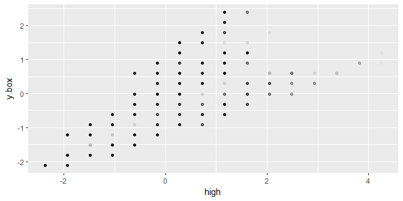
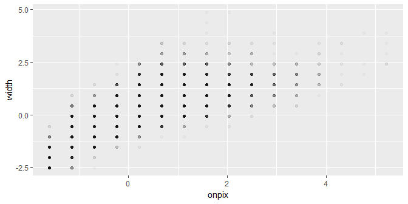
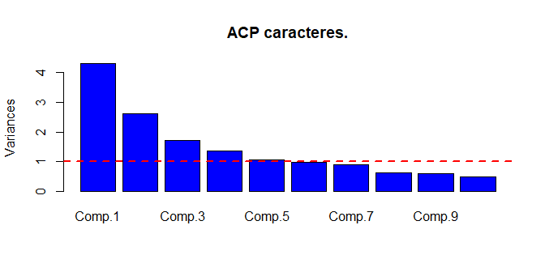
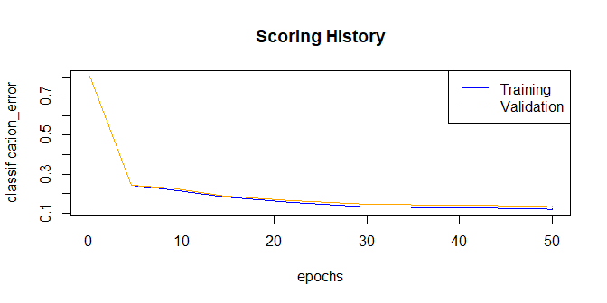
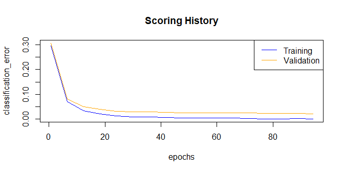
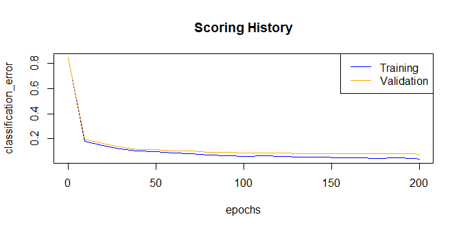
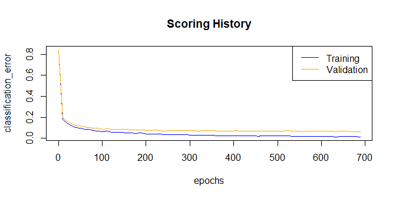

Ejercicio 2:
============

### Trabajando ahora con todas las letras, es decir, con los 20000 casos del data frame “LetterRecognition”, construir y evaluar un perceptrón multicapas basado en aprendizaje profundo para predecir la variable lettr.

Lectura de datos y librerias.
-----------------------------

Carguemos las librerias necesarias para este ejercicio.

    library(mlbench)#datos
    library(h2o)#deep learning
    library(caret)
    library(corrplot)#correlaciones
    library(PCAmixdata)#componentes principales

Lectura de los datos.

    data("LetterRecognition")
    datos=LetterRecognition
    rm(LetterRecognition)
    head(datos)

    ##   lettr x.box y.box width high onpix x.bar y.bar x2bar y2bar xybar x2ybr
    ## 1     T     2     8     3    5     1     8    13     0     6     6    10
    ## 2     I     5    12     3    7     2    10     5     5     4    13     3
    ## 3     D     4    11     6    8     6    10     6     2     6    10     3
    ## 4     N     7    11     6    6     3     5     9     4     6     4     4
    ## 5     G     2     1     3    1     1     8     6     6     6     6     5
    ## 6     S     4    11     5    8     3     8     8     6     9     5     6
    ##   xy2br x.ege xegvy y.ege yegvx
    ## 1     8     0     8     0     8
    ## 2     9     2     8     4    10
    ## 3     7     3     7     3     9
    ## 4    10     6    10     2     8
    ## 5     9     1     7     5    10
    ## 6     6     0     8     9     7

Preprocesado y particion train test.
------------------------------------

Tomaremos un conjunto test para evaluar el comportamieto de nuestros
modelos. A su vez, dado que vamos a trabajar con redes neuronales,
tipificaremos los datos (basandonos en los datos train).

    #PARTICION TRAIN TEST (CON CARET).
    set.seed(1)
    index <- createDataPartition(datos$lettr, p=0.75, list=FALSE)
    train <- datos[ index,]
    test <- datos[-index,]

    #TIPIFICAMOS (CON CARET).
    preProcValues <- preProcess(train, method = c("center","scale"))
    train_processed <- predict(preProcValues, train)
    test_processed <- predict(preProcValues, test)

Breve análisis exploratiorio.
-----------------------------

### Correlaciones.

    R=cor(train_processed[,-1])
    corrplot(R)

Veamos algunos graficos mostrando las variables mas correlacionadas.

    for (i in 1:length(colnames(R))){ 
      for (j in 1:length(colnames(R))){
       if (R[i,j]>0.7 & i>j){
         grafica=ggplot(data = train_processed,aes_string(colnames(R)[i],colnames(R)[j]))+
           geom_point(alpha=0.025)
         print(grafica)
       } 
        
      }
        }

### Análisis de componentes principales

Se ha echo un análisis de componentes principales. Se construiran
modelos tanto con las variables originales, como con las
transformaciones

    #calculamos componentes principales
    cp<- princomp(train_processed[,-1], cor = TRUE)
    #transformacion de datos de entrenamiento
    train_acp=data.frame(cbind.data.frame(train_processed[,1]
                               ,predict(cp,train_processed[,-1])))
    colnames(train_acp)[1]='lettr'
    #transformacion de datos test
    test_acp=data.frame(cbind.data.frame(test_processed[,1],
                              predict(cp,test_processed[,-1])))
    colnames(test_acp)[1]='lettr'

Viendo la proporción de varianza explicada, podemos decidir cuantas
variables explicativas tomar para nuestro modelo.

    summary(cp)

    ## Importance of components:
    ##                           Comp.1    Comp.2    Comp.3     Comp.4     Comp.5
    ## Standard deviation     2.0747552 1.6169411 1.3095061 1.17042089 1.02796348
    ## Proportion of Variance 0.2690381 0.1634062 0.1071754 0.08561782 0.06604431
    ## Cumulative Proportion  0.2690381 0.4324442 0.5396196 0.62523744 0.69128174
    ##                            Comp.6     Comp.7    Comp.8     Comp.9
    ## Standard deviation     0.99411610 0.94327648 0.7938131 0.77284115
    ## Proportion of Variance 0.06176668 0.05561066 0.0393837 0.03733022
    ## Cumulative Proportion  0.75304842 0.80865908 0.8480428 0.88537299
    ##                           Comp.10    Comp.11    Comp.12    Comp.13
    ## Standard deviation     0.70031224 0.65392323 0.51367992 0.49817877
    ## Proportion of Variance 0.03065233 0.02672597 0.01649169 0.01551138
    ## Cumulative Proportion  0.91602532 0.94275129 0.95924298 0.97475436
    ##                           Comp.14     Comp.15     Comp.16
    ## Standard deviation     0.46117541 0.341453040 0.273234791
    ## Proportion of Variance 0.01329267 0.007286886 0.004666078
    ## Cumulative Proportion  0.98804704 0.995333922 1.000000000

    plot(cp,col="blue",main="ACP caracteres.") 
    abline(h=1,lwd=2,lty=2,col="red")

Funcion de evaluación.
----------------------

Construiremos una función que nos devuelva la precisión de un modelo del
paquete h2o, evaluando sobre el conjunto test.

    evaluacion_h2o=function(modelo,title='modelo'){
      cm=h2o.confusionMatrix(modelo,valid = T)
      medidas=t(data.frame(cm$Error))
      colnames(medidas)=rownames(cm)
      medidas=100*(1-medidas)
      row.names(medidas)=title
      return(data.frame(medidas))
    }

Inicialización del servicio h2o.
--------------------------------

    localH2O = h2o.init(nthreads = 5)

Modelos con variables originales.
---------------------------------

En primer lugar, pasamos las variables al formato h2o.

    train.hex <- as.h2o(train_processed)
    test.hex<- as.h2o(test_processed)

Se han realizado diversas busquedas en rejilla para elegír los
parámetros de nuestro modelo. Dado el alto coste computacional de estas
operaciónes, se han guardado los resultados para evitar tener que
ejecutar estas busquedas cada vez que se quiera ejecutar el código.
Veamos algunos de los pasos seguidos para la selección de nuestro
modelo.

### Configuración de capas y regularización.

En primer lugar, se han realizado diversas busquedas en rejilla para
determinar la configuración de las capas ocultas a usar y el parametro
de regularización Lasso (se han realizado mas bsuquedas de las que aquí
se muestran).

    hidden_search = list(c(200,200),c(500,500), c(500,500,500),c(1000),c(1000,1000))
    l1_search <- c(1e-1,1e-3)
    hyper_params= list(hidden = hidden_search, l1 = l1_search)

    modelo_h2o_grid_2 = h2o.grid("deeplearning",
                               x = 2:17, y = 1, 
                               training_frame = train.hex,
                               validation_frame=test.hex,
                               distribution="multinomial",
                               activation = 'RectifierWithDropout',
                               hyper_params = hyper_params,
                               nfolds=5, 
                               score_interval = 2,
                               epochs = 50,
                               stopping_rounds = 3,
                               stopping_tolerance = 0.05,
                               stopping_metric = "misclassification")

    save(train_processed,test_processed,modelo_h2o_grid_2,
         file="modelo_ho_grid_2.RData")

    load(file="modelo_ho_grid_2.RData")
    modelo_h2o_grid_2@summary_table

    ## Hyper-Parameter Search Summary: ordered by increasing logloss
    ##             hidden    l1
    ## 1     [1000, 1000] 0.001
    ## 2       [500, 500] 0.001
    ## 3  [500, 500, 500] 0.001
    ## 4       [200, 200] 0.001
    ## 5           [1000] 0.001
    ## 6           [1000]   0.1
    ## 7  [500, 500, 500]   0.1
    ## 8       [500, 500]   0.1
    ## 9       [200, 200]   0.1
    ## 10    [1000, 1000]   0.1
    ##                                                            model_ids
    ## 1  Grid_DeepLearning_train_processed_model_R_1495706986702_3_model_9
    ## 2  Grid_DeepLearning_train_processed_model_R_1495706986702_3_model_6
    ## 3  Grid_DeepLearning_train_processed_model_R_1495706986702_3_model_7
    ## 4  Grid_DeepLearning_train_processed_model_R_1495706986702_3_model_5
    ## 5  Grid_DeepLearning_train_processed_model_R_1495706986702_3_model_8
    ## 6  Grid_DeepLearning_train_processed_model_R_1495706986702_3_model_3
    ## 7  Grid_DeepLearning_train_processed_model_R_1495706986702_3_model_2
    ## 8  Grid_DeepLearning_train_processed_model_R_1495706986702_3_model_1
    ## 9  Grid_DeepLearning_train_processed_model_R_1495706986702_3_model_0
    ## 10 Grid_DeepLearning_train_processed_model_R_1495706986702_3_model_4
    ##               logloss
    ## 1  0.3561670026638781
    ## 2  0.3637244272364842
    ## 3  0.3783239551840162
    ## 4  0.3981335365204886
    ## 5  0.4515294127719083
    ## 6   3.257984544790913
    ## 7  3.2954620013605562
    ## 8   3.307495893029953
    ## 9   3.312546765509395
    ## 10 3.3358843474464086

El mejor modelo es el que tiene dos capas ocultas de mil nodos y
*L*1 = 0.001. El resumen que proporciona h2o ordena los modelos en
función de la puntuación que tengan, siendo el primero el mejor.

    modelo_h2o_1 <- h2o.loadModel(
      "C:/Users/AlvaroSanchez91/Desktop/Master Big Data Sevilla/ML2 Machine Learning II/trabajo_MLII_AlvaroSanchezCastanneda/modelo_2-1000/DeepLearning_model_R_1495751705306_1")
    plot(modelo_h2o_1)

    evaluaciones=data.frame(evaluacion_h2o(modelo_h2o_1,'modelo_h2o_1'))#Accuracy.
    evaluaciones['Totals']

    ##                Totals
    ## modelo_h2o_1 86.55311

Viendo lo anterior, parece buena idea tomar un mayor numero de epocas, y
hacer busquedas sobre modelos con muchos nodos con coeficientes de *L*1
mas bajos, también se han buscado otros coeficientes *L*2 (esto no se
muestra, pues es analogo a la busqueda anterior).

### Dropout ratio.

Lo siguiente que se ha echo, ha sido optimizar el coeficiente dropout en
capas ocultas.

    hidden_search = list(c(1000,1000))
    l1_search <- c(1e-5)
    l2_search <- c(1e-5)
    hidden_dropout_ratio_search = list(c(0.25, 0.25),c(0.5, 0.5))
    hyper_params= list(hidden = hidden_search,
                       l2=l2_search, l1 = l1_search, 
                       hidden_dropout_ratios=hidden_dropout_ratio_search)

    modelo_h2o_grid_8 = h2o.grid("deeplearning",
                                 x = 2:17, y = 1, 
                                 training_frame = train.hex,
                                 validation_frame=test.hex,
                                 distribution="multinomial",
                                 activation = 'RectifierWithDropout',
                                 hyper_params = hyper_params,
                                 nfolds=5,
                                 score_interval = 2,
                                 stopping_rounds = 3,
                                 stopping_tolerance = 0.025,
                                 stopping_metric = "misclassification",
                                 epochs=200)

    modelo_h2o_2 <- h2o.loadModel("C:\\Users\\AlvaroSanchez91\\Desktop\\Master Big Data Sevilla\\ML2 Machine Learning II\\trabajo_MLII_AlvaroSanchezCastanneda\\modelo_grid_8\\Grid_DeepLearning_train_processed_model_R_1495969925891_2_model_0")
    load(file="modelo_h2o_grid_8.RData")
    modelo_h2o_grid_8@summary_table

    ## Hyper-Parameter Search Summary: ordered by increasing logloss
    ##         hidden hidden_dropout_ratios     l1     l2
    ## 1 [1000, 1000]          [0.25, 0.25] 1.0E-5 1.0E-5
    ## 2 [1000, 1000]            [0.5, 0.5] 1.0E-5 1.0E-5
    ##                                                           model_ids
    ## 1 Grid_DeepLearning_train_processed_model_R_1495969925891_2_model_0
    ## 2 Grid_DeepLearning_train_processed_model_R_1495969925891_2_model_1
    ##               logloss
    ## 1 0.08434192834788556
    ## 2 0.08936476941761363

Parece que es mejor reducir la probabilidad dropout, se han buscado
otras opciones, pero 0.25 ha sido la mejor. Veamos como se comporta el
modelo obtenido.

    plot(modelo_h2o_2)

    evaluaciones=rbind.data.frame( evaluaciones,evaluacion_h2o(modelo_h2o_2,'modelo_h2o_2'))#Accuracy.
    evaluaciones['Totals']

    ##                Totals
    ## modelo_h2o_1 86.55311
    ## modelo_h2o_2 97.93587

En esta ocasión tenemos una precisión mucho mejor, si usasemos los
mismos parámetros pero con dos capas 200 nodos en las capas ocultas, o
con tres de 1000, obtendríamos resultados similares, quizá seria
conveniente quedarse con el modelo mas simple. Otra observación, es que
no llegamos a sobreajustar (tal como se muestra en la grafica anterior).

Modelos con componentes principales.
------------------------------------

### Cambio de formato de los datos.

En el analisis que se hizo antes de comenzar a ajustar modelos, se vio
un resumen en el que se indicaba que bastaban diez componentes
principales para explicar el noventa por ciento de la varianza, hagamos
una primera prueba con los parametros del modelo anterior usando solo
estas diez componentes principales. No se entrenaran los modelos, si no
que se cargarán y se mostrara el codigo necesario para ajustarlos.

    modelo_acp1 <- h2o.deeplearning(
      x = 2:10, y = 1, 
      standardize = FALSE,
      training_frame = train.hex_acp,
      validation_frame=test.hex_acp,
      distribution="multinomial",
      activation = 'RectifierWithDropout',
      hidden = c(1000, 1000),
      l1 = 1e-5,
      l2 = 1e-5,
      hidden_dropout_ratio = c(0.25, 0.25),
      input_dropout_ratio = 0.2,
      epochs = 200,
      rho = 0.99,
      epsilon = 1e-8,
      train_samples_per_iteration = 500)

    modelo_acp1 <- h2o.loadModel(
      "C:\\Users\\AlvaroSanchez91\\Desktop\\Master Big Data Sevilla\\ML2 Machine Learning II\\trabajo_MLII_AlvaroSanchezCastanneda\\modelo_acp1\\DeepLearning_model_R_1495969925891_7")
    plot(modelo_acp1)

    evaluaciones=rbind.data.frame(evaluaciones,evaluacion_h2o(modelo_acp1,'modelo_acp1'))
    evaluaciones['Totals']

    ##                Totals
    ## modelo_h2o_1 86.55311
    ## modelo_h2o_2 97.93587
    ## modelo_acp1  92.66533

Observamos como este modelo no ha dejado de mejorar los resultados a lo
largo de las doscientas epocas (iteraciones de entrenamiento). Podríamos
aumentar el numero de estas, pero parece ineficiente empezar desde cero,
y no aprovechar el ajuste realizado. Hay una manera de hacer esto,
indicando en checkpoint la identidad del modelo h2o que queremos seguír
entrenando.

    modelo_acp1_train2 <- h2o.deeplearning(
      checkpoint= modelo_acp1@model_id,#indicamos la identidad del modelo
      x = 2:10, y = 1, 
      standardize = FALSE,
      training_frame = train.hex_acp,
      validation_frame=test.hex_acp,
      distribution="multinomial",
      activation = 'RectifierWithDropout',
      hidden = c(1000, 1000),
      l1 = 1e-5,
      l2 = 1e-5,
      hidden_dropout_ratio = c(0.25, 0.25),
      input_dropout_ratio = 0.2,
      epochs = 1000,
      rho = 0.99,
      epsilon = 1e-8,
      train_samples_per_iteration = 500)

    modelo_acp1_train2 <- h2o.loadModel("C:\\Users\\AlvaroSanchez91\\Desktop\\Master Big Data Sevilla\\ML2 Machine Learning II\\trabajo_MLII_AlvaroSanchezCastanneda\\modelo_acp1_train2\\DeepLearning_model_R_1495969925891_11")
    plot(modelo_acp1_train2)

    evaluaciones=rbind.data.frame(evaluaciones,evaluacion_h2o(modelo_acp1_train2,'modelo_acp1_train2'))
    evaluaciones['Totals']

    ##                      Totals
    ## modelo_h2o_1       86.55311
    ## modelo_h2o_2       97.93587
    ## modelo_acp1        92.66533
    ## modelo_acp1_train2 93.76754

No hemos llegado a las 1000 epocas que hemos fijado como límite, así que
parece que es complicado mejorar mas este modelo. Aúnque hallamos
mejorado el anterior resultado, estamos lejos de la precision obtenida
con las variables originales, habría que optimizar los parametros de
nuevo, o elegir otro numero de componentes principales (puede que
hallamos perdido demasiada información).

Se ha intentado hacer una busqueda muy completa (procurando no
execederse) usando estas diez componentes principales. En esta busqueda,
se ha usado unicamente la función de activación maxout pues hay quien
afirma que converge mas rapido que la sigmoide o la tangencial, pero
apesar de este cambio, tras muchas horas de calculos se decidió parar el
proceso (hubiese sido conveniente usar un conjunto de validación en
lugar de validación cruzada).
