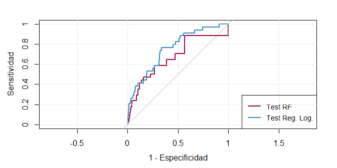

Ejercicio 3:
============

### Completar el tratamiento de los datos de Insolvencia mediante técnicas apropiadas para Clasificación No Balanceada (datos en el material de dicho tema).

Lectura de datos y librerias.
-----------------------------

    load("Insolvencia.RData")
    library(caret)#ajuste de modelos, medidas, etc
    library(pROC)#curva roc y diversas medidas
    library(randomForest)#Random Forest
    library(DMwR)#SMOTE

Nuestro objetivo será predicir la variable *failed\_insolvent* en
función del resto de variables.

Breve analisis exploratório.
----------------------------

    dim(datos)

    ## [1] 2877   16

    head(datos)

    ##                CETL      STLTA       TLCA       NWTA      QACA      NCNW
    ## 803149   0.64516129 0.80000000 31.0000000 -0.4761905 1.0000000  0.000000
    ## 4101552  0.75757576 0.23404255  0.7674419  0.2978723 0.9767442  1.571429
    ## 4041760  0.00000000 0.00000000  1.0000000  0.0000000 1.0000000  0.000000
    ## 1444565  0.28125000 0.00000000  0.7804878  0.2195122 0.2926829  1.333333
    ## 2042573  0.00000000 0.00000000  1.3333333  0.0000000 0.5833333 12.000000
    ## 931990  -0.03030303 0.06666667  1.3561644 -0.1000000 0.6712329 12.000000
    ##            CRATIO     CASHTA       PRTA       TCTD       TCTL      TDTA
    ## 803149  1.0000000 0.04761905 -0.4761905 57.0000000 0.03225806 0.0000000
    ## 4101552 1.9545455 0.46808511  0.2978723  0.6666667 0.66666667 0.4255319
    ## 4041760 1.0000000 0.55555556  0.0000000  1.0000000 1.00000000 0.4444444
    ## 1444565 1.2812500 0.29268293  0.2195122 16.0000000 0.06250000 0.0000000
    ## 2042573 0.7500000 0.00000000  0.0000000  1.0000000 1.00000000 0.4375000
    ## 931990  0.7849462 0.02222222 -0.1000000  0.9393939 0.93939394 0.5222222
    ##         ln_assets   CHNW_new   CHNWTA_new failed_insolvent
    ## 803149   9.952278  0.0000000   0.04761905               No
    ## 4101552 10.757903  1.3333333   0.39007092              Yes
    ## 4041760  9.104980 -7.3000000 -10.60000000               No
    ## 1444565 11.314475  0.6363636   0.67627494               No
    ## 2042573 10.373491 -1.0000000  -1.00000000               No
    ## 931990  11.407565 -7.3000000  -1.30000000              Yes

Usaremos tant conjunto de validaciónr como validación cruzada para
elegir los parametros de los modelos.

    table(datos$failed_insolvent) 

    ## 
    ##   No  Yes 
    ## 2740  137

    prop.table(table(datos$failed_insolvent))

    ## 
    ##         No        Yes 
    ## 0.95238095 0.04761905

    barplot(table(datos$failed_insolvent))

Vemos que las clases a predicír estan desbalanceadas, llevarémos a cabo
tecnicas propias de este tipo de situiaciones.

Preprocesado y particion de los datos.
--------------------------------------

Al tener datos desbalanceados, en vez de tratar de mejorar la precisión,
nos fijaremos en la sensitividad y especificidad. Lo mas usual es
aumentar la sensitividad para la clase minoritaría y para esto,
necesitamos que dicha clase sea la primera.

    datos$failed_insolvent = factor(as.character(datos$failed_insolvent),
               levels = rev(levels(datos$failed_insolvent)))
    table(datos$failed_insolvent)

    ## 
    ##  Yes   No 
    ##  137 2740

Dividamos los datos en los conjuntos train, test y validación.

    set.seed(156)
    n=nrow(datos)
    indices=1:n
    ient=sample(indices,floor(n*0.6))#60% train
    ival=sample(setdiff(indices,ient),floor(n*0.15))#15% validacion
    itest=setdiff(indices,union(ient,ival))#25% test

    training  = datos[ient,]
    validation  = datos[ival,]
    testing     = datos[itest,]
    training_valid=rbind(training,validation)#Validacion y train para optimizar parametros 
    Index= 1:nrow(training)#indice de train en training_valid

Funciones evaluación.
---------------------

Definiremos unas funciones que evaluen los modelos usando diferentes
métricas.

    fiveStats = function(...) 
      c(twoClassSummary(...), defaultSummary(...))

    fourStats = function (data, lev = levels(data$obs),#no devuelve auc
                          model = NULL)
    {
      
      accKapp = postResample(data[, "pred"], data[, "obs"])
      out = c(accKapp,
              sensitivity(data[, "pred"], data[, "obs"], lev[1]),
              specificity(data[, "pred"], data[, "obs"], lev[2]))
      names(out)[3:4] = c("Sens", "Spec")
      out
    }

En la siguiente tabla podemos guardar los resultados de los modelos.

    testResults = data.frame(failed_insolvent = testing$failed_insolvent)
    validResults = data.frame(failed_insolvent = validation$failed_insolvent)

Modelos sobre datos originales.
===============================

Utilizaremos tanto Random Forest como Regresión Logística para nuestros
datos.

Random Forest.
--------------

Usando la libreria caret, trataremos de ajustar el parametro mtry. Esto
podemos hacerlo de dos maneras, usando el conjunto de validación, o
usando validación cruzada. Dado que nuestros datos están desvalanceados,
trataremos de mejorar la sensitividad.

    #Control para validacion cruzada
    ctrlcv = trainControl(method = "cv",number=5, 
                          classProbs = TRUE,
                          summaryFunction = fiveStats,
                          verboseIter=F)

    #Control para conjunto de validacion
    ctrlval = trainControl(method = "cv",number=1,#una hoja (conjunto validacion)
                           index=list(Index), #indicamos conjunto train
                           indexFinal=Index,
                           classProbs = TRUE,
                           summaryFunction = fiveStats,
                           verboseIter=F)

    set.seed(1410)
    rfFit = train(failed_insolvent ~ ., data = training,
                  method = "rf",
                  trControl = ctrlcv,
                  ntree = 100,
                  do.trace=F,
                  tuneLength=5,
                  metric = "Sens") #Sensitividad

Ya que no tenemos muchos datos, parece que merece la pena hacer
validación cruzada, el conjunto de validación lo usaremos
posteriormente.

    rfFit$results [c('mtry','ROC','Sens','Spec','Accuracy','Kappa')]

    ##   mtry       ROC Sens      Spec  Accuracy        Kappa
    ## 1    2 0.7362666    0 1.0000000 0.9548125  0.000000000
    ## 2    5 0.7258616    0 1.0000000 0.9548125  0.000000000
    ## 3    8 0.7297201    0 0.9981800 0.9530750 -0.003284125
    ## 4   11 0.7365142    0 0.9993921 0.9542311 -0.001096091
    ## 5   15 0.7402440    0 0.9981800 0.9530750 -0.003284125

Observamos que la sensibilidad de los modelos es muy mala para todos los
parametros, aunque para algunos no vale cero. Guardemos las estimaciones
de probabilidades sobre los datos test para calcular distintas medidas
de bondad de ajuste.

    validResults$RF = predict(rfFit, validation, #lo usaremos posteriormente
                              type = "prob")[,1]
    testResults$RF = predict(rfFit, testing, 
                             type = "prob")[,1]
    rfTestROC = roc(testResults$failed_insolvent, testResults$RF,
                    levels = rev(levels(testResults$failed_insolvent)))
    rfvalidROC = roc(validResults$failed_insolvent, validResults$RF,
                    levels = rev(levels(validResults$failed_insolvent)))
    rfTestCM = confusionMatrix(predict(rfFit, testing), 
                               testResults$failed_insolvent)
    rfvalidCM = confusionMatrix(predict(rfFit, validation), 
                               validResults$failed_insolvent)
    plot(rfTestROC,main='Random Forest')

    rfTestROC$auc

    ## Area under the curve: 0.7023

    rfTestCM$byClass

    ##          Sensitivity          Specificity       Pos Pred Value 
    ##           0.00000000           1.00000000                  NaN 
    ##       Neg Pred Value            Precision               Recall 
    ##           0.95277778                   NA           0.00000000 
    ##                   F1           Prevalence       Detection Rate 
    ##                   NA           0.04722222           0.00000000 
    ## Detection Prevalence    Balanced Accuracy 
    ##           0.00000000           0.50000000

Tanto la curva ROC, como la sensitividad o el area AUC nos indican que
tenemos un modelo malo. Guardemos la especificidad y la sensibilidad
sobre el conjunto test del modelo.

    evaluaciones=data.frame(t(rfTestCM$byClass[c('Sensitivity','Specificity')]))
    rownames(evaluaciones)='rf'

Regresión Logística.
--------------------

No hay parámetros que ajustar, por lo que no será necesário urar
validación cruzada o conjunto de validación.

    ctrlrlog = trainControl(method = "none", 
                            classProbs = TRUE,
                            summaryFunction = fiveStats)
    lrFit = train(failed_insolvent ~ .,
                  data = training,
                  method = "glm",
                  trControl = ctrlrlog)

Veamos que tal se comporta este modelo sobre el conjunto test.

    validResults$LogReg = predict(lrFit, #lo usaremos posteriormente
                                  validation, 
                                  type = "prob")[,1]
    testResults$LogReg = predict(lrFit, 
                                 testing, 
                                 type = "prob")[,1]
    lrTestROC = roc(testResults$failed_insolvent, testResults$LogReg,
                    levels = rev(levels(testResults$failed_insolvent)))
    lrTestCM = confusionMatrix(predict(lrFit, testing), 
                               testResults$failed_insolvent)
    lrvalidROC = roc(validResults$failed_insolvent, validResults$LogReg,
                    levels = rev(levels(validResults$failed_insolvent)))
    lrvalidCM = confusionMatrix(predict(lrFit, validation), 
                               validResults$failed_insolvent)
    plot(lrTestROC,main="Regresion Logistica")

    lrTestROC$auc

    ## Area under the curve: 0.7502

    lrTestCM$byClass[c('Sensitivity','Specificity')]

    ## Sensitivity Specificity 
    ##   0.0000000   0.9985423

Con este modelo volvemos a obtener una sensibilidad nula, salvo el
porcentaje de acierto, las medidas dan a entender que este modelo
tampoco es util. Comparémoslo con el anterior.

Comparación de Random Forest y Regresión Logística.
---------------------------------------------------

    evaluacion=data.frame(t(lrTestCM$byClass[c('Sensitivity','Specificity')]))
    rownames(evaluacion)='lr'
    (evaluaciones=rbind(evaluaciones,evaluacion))

    ##    Sensitivity Specificity
    ## rf           0   1.0000000
    ## lr           0   0.9985423

### Curvas ROC.

    labs = c(RF = "Random Forest", LogReg = "Reg.Log.")
    plotTheme = caretTheme()  #CONFIGURACION DE COLORES
    plot(rfTestROC, type = "S", col = plotTheme$superpose.line$col[1], 
         legacy.axes = TRUE, xlab="1 - Especificidad",ylab="Sensitividad")
    plot(lrTestROC, type = "S", col = plotTheme$superpose.line$col[2],
         add = TRUE, legacy.axes = TRUE)
    legend("bottomright",
           c("Test RF", "Test Reg. Log."), cex = .85,
           col = plotTheme$superpose.line$col[1:2],lwd = rep(2, 2),lty = rep(1, 2))
    grid()

### Curvas Lift.

El paquete caret es el que proporciona la siguiente función. Su
interpretación es similar a la de las curvas ROC.

    lift1 = lift(failed_insolvent ~ RF + LogReg , data = testResults,
                 labels = labs)
    xyplot(lift1,
           ylab = "% Eventos Encontrados",
           xlab =  "% Clientes",
           lwd = 2,
           type = "l", auto.key = list(columns = 2))

Tanto observando las curvas Lift, como observando las curvas ROC, parece
que la regresión logística es ligeramente mejor. En cualquier caso, los
resultados son malos.

Estrategias para datos desbalanceados.
======================================

Usaremos distintas estrategias para ver si conseguimos mejorar los
modelos obtenidos.

Puntos de corte alternativos.
-----------------------------

Si usamos un modelo probabilistico, lo habitual es clasificar en función
de si la probabilidad estimada es mayor o menor de 0.5. Una forma de
aumentar la sensibilidad es cambiar este punto de corte, hay metodos
para calcular puntos de corte optimos (podemos optimizar sensibilidad
mas especificidad).

Hagamos esto con los dos modelos ajustados previamente.

### Puntos de corte alternativos para Random Forest.

    rfThresh = coords(rfvalidROC, x = "best", ret="threshold",
                       best.method="closest.topleft")

    rfThreshY = coords(rfvalidROC, x = "best", ret="threshold",
                        best.method="youden")
    rfThresh

    ## [1] 0.065

    rfThreshY 

    ## [1] 0.065

Se han calculado puntos de corte alternativos mediante dos estrategias
diferentes, pero ambos coinciden. Clasifiquemos con este punto de corte
y veamos que tal funcionan.

    validResults$rfAlt = factor(ifelse(validResults$RF > rfThresh,
                                       "Yes", "No"))
    testResults$rfAlt = factor(ifelse(testResults$RF > rfThresh,
                                       "Yes", "No"))
    rfAltvalidCM = confusionMatrix(validResults$rfAlt, validResults$failed_insolvent)
    rfAltTestCM = confusionMatrix(testResults$rfAlt, testResults$failed_insolvent)

    plot(rfTestROC, print.thres = c(.5, .10, rfThresh), type = "S",
         print.thres.pattern = "%.3f (Spec = %.2f, Sens = %.2f)",
         print.thres.cex = .8, legacy.axes = TRUE, ylim=c(-0.1,1))

En la curva se muestran los rendimientos de distintos puntos de corte,
veamos como mejoramos la sensibilidad en el conjunto test de cero a un
medio.

    evaluacion=data.frame(t(rfAltTestCM$byClass[c('Sensitivity','Specificity')]))
    rownames(evaluacion)='rfAlt'
    (evaluaciones=rbind(evaluaciones,evaluacion))

    ##       Sensitivity Specificity
    ## rf            0.0   1.0000000
    ## lr            0.0   0.9985423
    ## rfAlt         0.5   0.7725948

### Puntos de corte alternativos para Regresión Logística.

    lrThresh = coords(lrvalidROC, x = "best", ret="threshold",
                       best.method="closest.topleft")
    lrThreshY = coords(lrvalidROC, x = "best", ret="threshold",
                        best.method="youden")
    lrThresh

    ## [1] 0.04109974

    lrThreshY 

    ## [1] 0.04109974

Se han calculado puntos de corte alternativos mediante dos estrategias
diferentes, pero ambos coinciden. Clasifiquemos con este punto de corte
y veamos que tal funcionan.

    validResults$lrAlt = factor(ifelse(validResults$LogReg > lrThresh, "Yes", "No"))
    testResults$lrAlt = factor(ifelse(testResults$LogReg > lrThresh,"Yes", "No"))
    lrAltvalidCM = confusionMatrix(validResults$lrAlt, validResults$failed_insolvent)
    lrAltTestCM = confusionMatrix(testResults$lrAlt, testResults$failed_insolvent)
    plot(lrTestROC, print.thres = c(.5, .10, lrThresh), type = "S",
         print.thres.pattern = "%.3f (Spec = %.2f, Sens = %.2f)",
         print.thres.cex = .8, legacy.axes = TRUE, ylim=c(-0.1,1))

En la curva se muestran los rendimientos de distintos puntos de corte,
veamos como mejoramos la sensibilidad en el conjunto test de 0 a 0.7.

    evaluacion=data.frame(t(lrAltTestCM$byClass[c('Sensitivity','Specificity')]))
    rownames(evaluacion)='lrAlt'
    (evaluaciones=rbind(evaluaciones,evaluacion))

    ##       Sensitivity Specificity
    ## rf      0.0000000   1.0000000
    ## lr      0.0000000   0.9985423
    ## rfAlt   0.5000000   0.7725948
    ## lrAlt   0.7058824   0.6793003

Para aumentar la sensibilidad, la especificidad ha bajado algo mas del
0.7. No es que sea un buen modelo, pero ya parece aceptable.

Métodos de muestreo.
====================

Trataremos de construir un conjunto de entrenamiento en el que los datos
no estén desbalanceados.

Downsampling.
-------------

Tomamos una muestra aleatoria de la clase mayoritaria con un tamaño
igual al tamaño de la clase minoritaria. Uniendo dicha muestra a los
datos de la clase minoritaria conseguimos unos datos balanceados.

    set.seed(1237)
    downSampled = downSample(training[, -ncol(training)], 
                             training$failed_insolvent)
    downSampled_valid = downSample(validation[, -ncol(validation)], 
                             validation$failed_insolvent)
    downSampled_train_valid=rbind(downSampled,downSampled_valid )
    table(downSampled$Class)#ahora se llama class la variable objetivo

    ## 
    ## Yes  No 
    ##  78  78

Hemos aplicado esta tecnica para validación y para entrenamiento.

Upsampling.
-----------

Tomamos muestras aelatorias con remplazamiento de la clase minoritaria
para conseguir datos balanceados.

    set.seed(1237)
    upSampled = upSample(training[, -ncol(training)], 
                         training$failed_insolvent)
    upSampled_valid = upSample(validation[, -ncol(validation)], 
                         validation$failed_insolvent)
    upSampled_train_valid=rbind(upSampled,upSampled_valid )
    table(upSampled$Class)

    ## 
    ##  Yes   No 
    ## 1648 1648

SMOTE: Synthetic Minority Over-sampling TEchnique:
--------------------------------------------------

Hace downsampling y upsampling, dependiendo de unas proporciones que
podemos elegir (pueden quedar los datos sin balancear del todo). Al
hacer upsampling no toma directamente copias de los elementos, si no que
mirando k vecinos toma valores similares para las caracteristicas del
nuevo individuo. De este modo, los datos generados no son exactamente
iguales.

    set.seed(1237)
    smoted = SMOTE(failed_insolvent ~ ., data = training)
    smoted_valid = SMOTE(failed_insolvent ~ ., data = validation)
    smoted_train_valid=rbind(smoted,smoted_valid)
    table(smoted$failed_insolvent)

    ## 
    ## Yes  No 
    ## 234 312

Funcion evaluacion para modelos.
--------------------------------

Hemos generado varios conjuntos de datos con los que ajustar modelos.
Dado que quedan muchas combinaciones por hacer, definiremos una funcion
que reciba un modelo y devuelva la especificidad y sensibilidad sobre el
conjunto test del modelo, y de predicciones echas cambiando el punto de
corte del modelo por uno mejor. Necesitaremos usar el conjunto de
validación para calcular dicho punto de corte.

    evaluacion=function(modelo,title='modelo',test=testing, validacion=validation,plot_ROC=T){
      validResult = predict(modelo, validacion, type = "prob")[,1]
      testResult = predict(modelo, test, type = "prob")[,1]
      #Medidas sobre validacion y test:
      validROC = roc(validacion$failed_insolvent, validResult,
                     levels = rev(levels(validacion$failed_insolvent)))
      TestROC = roc(test$failed_insolvent, testResult,
                     levels = rev(levels(test$failed_insolvent)))
      TestCM = confusionMatrix(predict(modelo, test), 
                               test$failed_insolvent)
      validCM = confusionMatrix(predict(modelo, validacion), 
                               validacion$failed_insolvent)
      
      #Devolveremos la sensibilidad y especificidad sobre datos test
      resultado=data.frame(t(TestCM$byClass[c('Sensitivity','Specificity')]))
      rownames(resultado)=title
      
      #Calculamos nuevo punto de corte
      Thresh = coords(validROC, x = "best", ret="threshold",
                       best.method="closest.topleft")
      
      validResultAlt = factor(ifelse(validResult > Thresh,
                                       "Yes", "No"))
      testResultAlt = factor(ifelse(testResult > Thresh,
                                       "Yes", "No"))
      AltvalidCM = confusionMatrix(validResultAlt, validacion$failed_insolvent)
      AltTestCM = confusionMatrix(testResultAlt, test$failed_insolvent)

      if (plot_ROC){#si lo deseamos, pintamos curva ROC
        plot(TestROC, print.thres = c(.5, .10, Thresh), type = "S",
           print.thres.pattern = "%.3f (Spec = %.2f, Sens = %.2f)",
           print.thres.cex = .8, legacy.axes = TRUE, ylim=c(-0.1,1),main=title)
      }
      #A la sensibilidad y especificidad anteriores, les unimos las nuevas
      resultadoAlt=data.frame(t(AltTestCM$byClass[c('Sensitivity','Specificity')]))
      rownames(resultadoAlt)=paste(title,'Alt',sep='')
      return(rbind.data.frame(resultado,resultadoAlt))

    }

Random Forest con datos balanceados.
------------------------------------

### Random Forest con downsampling.

    set.seed(1410)
    rfDown = train(Class ~ ., data = downSampled,
                  method = "rf",
                  trControl = ctrlcv,
                  ntree = 100,
                  tuneLength=5,
                  metric = "Sens") #Sensitividad

    (evaluaciones=rbind(evaluaciones,evaluacion(rfDown,title='rfDown')))

    ##           Sensitivity Specificity
    ## rf          0.0000000   1.0000000
    ## lr          0.0000000   0.9985423
    ## rfAlt       0.5000000   0.7725948
    ## lrAlt       0.7058824   0.6793003
    ## rfDown      0.5294118   0.7230321
    ## rfDownAlt   0.5588235   0.6953353

### Random Forest con upsampling.

    set.seed(1410)
    rfUp = train(Class ~ ., data = upSampled,
                  method = "rf",
                  trControl = ctrlcv,
                  ntree = 100,
                  do.trace=F,
                  tuneLength=5,
                  metric = "Sens") #Sensitividad

    (evaluaciones=rbind(evaluaciones,evaluacion(rfUp,title='rfUp')))

    ##           Sensitivity Specificity
    ## rf         0.00000000   1.0000000
    ## lr         0.00000000   0.9985423
    ## rfAlt      0.50000000   0.7725948
    ## lrAlt      0.70588235   0.6793003
    ## rfDown     0.52941176   0.7230321
    ## rfDownAlt  0.55882353   0.6953353
    ## rfUp       0.02941176   0.9956268
    ## rfUpAlt    0.52941176   0.7507289

### Random Forest con Smot.

    set.seed(1410)
    rfSm = train(failed_insolvent ~ ., data = smoted,
                  method = "rf",
                  trControl = ctrlcv,
                  ntree = 100,
                  do.trace=F,
                  tuneLength=5,
                  metric = "Sens") #Sensitividad

    (evaluaciones=rbind(evaluaciones,evaluacion(rfSm,title='rfSm')))

    ##           Sensitivity Specificity
    ## rf         0.00000000   1.0000000
    ## lr         0.00000000   0.9985423
    ## rfAlt      0.50000000   0.7725948
    ## lrAlt      0.70588235   0.6793003
    ## rfDown     0.52941176   0.7230321
    ## rfDownAlt  0.55882353   0.6953353
    ## rfUp       0.02941176   0.9956268
    ## rfUpAlt    0.52941176   0.7507289
    ## rfSm       0.35294118   0.8688047
    ## rfSmAlt    0.67647059   0.7215743

Regresión logística con datos balanceados.
------------------------------------------

### Regresión logística con downsampling.

    lrDown = train(Class ~ .,
                  data = downSampled,
                  method = "glm",
                  trControl = ctrlrlog)#indicado previamente

    (evaluaciones=rbind(evaluaciones,evaluacion(lrDown,title='lrDown')))

    ##           Sensitivity Specificity
    ## rf         0.00000000   1.0000000
    ## lr         0.00000000   0.9985423
    ## rfAlt      0.50000000   0.7725948
    ## lrAlt      0.70588235   0.6793003
    ## rfDown     0.52941176   0.7230321
    ## rfDownAlt  0.55882353   0.6953353
    ## rfUp       0.02941176   0.9956268
    ## rfUpAlt    0.52941176   0.7507289
    ## rfSm       0.35294118   0.8688047
    ## rfSmAlt    0.67647059   0.7215743
    ## lrDown     0.67647059   0.7011662
    ## lrDownAlt  0.64705882   0.7448980

### Regresión logística con upsampling.

    lrUp = train(Class ~ .,
                  data = upSampled,
                  method = "glm",
                  trControl = ctrlrlog)#indicado previamente

    (evaluaciones=rbind(evaluaciones,evaluacion(lrUp,title='lrUp')))

    ##           Sensitivity Specificity
    ## rf         0.00000000   1.0000000
    ## lr         0.00000000   0.9985423
    ## rfAlt      0.50000000   0.7725948
    ## lrAlt      0.70588235   0.6793003
    ## rfDown     0.52941176   0.7230321
    ## rfDownAlt  0.55882353   0.6953353
    ## rfUp       0.02941176   0.9956268
    ## rfUpAlt    0.52941176   0.7507289
    ## rfSm       0.35294118   0.8688047
    ## rfSmAlt    0.67647059   0.7215743
    ## lrDown     0.67647059   0.7011662
    ## lrDownAlt  0.64705882   0.7448980
    ## lrUp       0.58823529   0.7230321
    ## lrUpAlt    0.55882353   0.7478134

### Regresión logística con smot.

    lrSm = train(failed_insolvent ~ .,
                  data = smoted,
                  method = "glm",
                  trControl = ctrlrlog)#indicado previamente

    (evaluaciones=rbind(evaluaciones,evaluacion(lrSm,title='lrSm')))

    ##           Sensitivity Specificity
    ## rf         0.00000000   1.0000000
    ## lr         0.00000000   0.9985423
    ## rfAlt      0.50000000   0.7725948
    ## lrAlt      0.70588235   0.6793003
    ## rfDown     0.52941176   0.7230321
    ## rfDownAlt  0.55882353   0.6953353
    ## rfUp       0.02941176   0.9956268
    ## rfUpAlt    0.52941176   0.7507289
    ## rfSm       0.35294118   0.8688047
    ## rfSmAlt    0.67647059   0.7215743
    ## lrDown     0.67647059   0.7011662
    ## lrDownAlt  0.64705882   0.7448980
    ## lrUp       0.58823529   0.7230321
    ## lrUpAlt    0.55882353   0.7478134
    ## lrSm       0.55882353   0.7711370
    ## lrSmAlt    0.55882353   0.7259475

Vemos que ninguno de los modelos consigue mejorar los resultados de
forma destacable. Parece que la mejor opción sería elegir uno en el que
tanto la sensibilidad como la especificidad se aproximen a 0.7. Además,
la regresión logistica da "buenos" resultados, lo cual sumado a su
interpretabilidad hace que sea uno de los modelos más interesantes.
